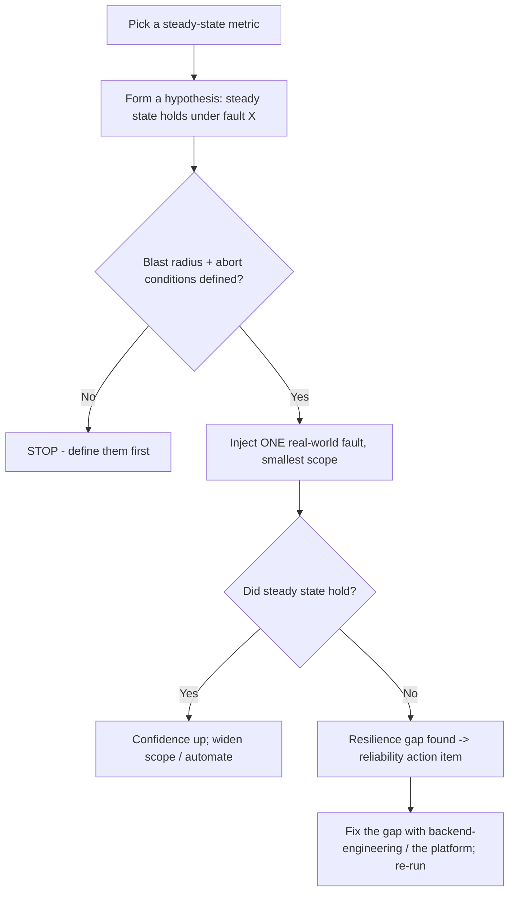

# Chaos Engineering — Reference

_The principles, the experiment loop, the fault catalog, and the maturity ramp for resilience verification. Principle-stable (the Principles of Chaos are long-established); tool rows are `[verify-at-use]`. Last reviewed: 2026-06-19._

## Where this sits vs. the rest of observability-sre
- **Incident response** is *reactive* — restore service when something broke.
- **SLO / error budgets** *define* the reliability target.
- **Chaos engineering** is *proactive* — spend a slice of the error budget on purpose, in a controlled experiment, to find the resilience gap before a customer does.

It belongs in this plugin because it shares the same currency (SLIs/SLOs, error budgets) and the same feedback sink (the reliability action-item backlog) as the SRE practices already here.

## The Principles of Chaos (the discipline's core)
1. Build a hypothesis around **steady-state behavior** (a measurable output, not an internal metric).
2. Vary **real-world events** (faults that actually happen: instance loss, latency, dependency failure, traffic spikes).
3. Run experiments in **production** — because staging never matches production exactly — *but earn it* by proving the experiment in staging first.
4. **Automate** experiments to run continuously, so resilience doesn't regress silently.
5. **Minimize blast radius** — the smallest experiment that tests the hypothesis, with defined abort conditions. This is the principle that separates chaos *engineering* from recklessness.

## The experiment loop

## Fault catalog (what to inject)
| Layer | Fault | Tests |
|---|---|---|
| Compute | instance / pod kill | redundancy, self-healing, rebalancing |
| Network | latency injection, packet loss | timeouts, retries with backoff |
| Dependency | error / timeout from a downstream | circuit breakers, fallbacks, graceful degradation |
| Resource | CPU / memory / disk exhaustion | limits, back-pressure, autoscaling |
| Zonal | availability-zone loss | multi-AZ failover, quorum |
| Clock / state | time skew, cache flush | time assumptions, cold-start behavior |

## Maturity ramp (don't start in prod)
1. **Staging, manual** — one fault, watched live, abort ready.
2. **Staging, automated** — in CI/CD as a resilience gate (route automation to `devops-cicd`).
3. **Production, scoped game day** — scheduled, cross-team, narrow blast radius.
4. **Production, continuous** — automated, low-blast experiments running on a schedule.

## Game days
A scheduled rehearsal of a failure scenario that exercises **both** the system's resilience and the team's incident-response muscle. Pair the fault injection with the [`incident-response`](../skills/incident-response/SKILL.md) and `postmortem-facilitation` practices: the game day surfaces resilience gaps *and* response gaps in one exercise.

## Tooling (verify-at-use)
| Need | Representative tooling `[verify-at-use]` | Note |
|---|---|---|
| Fault injection (general) | Chaos Mesh, LitmusChaos, Gremlin, AWS FIS, Azure Chaos Studio | Cluster-level → `cloud-native-kubernetes`; cloud-native → the cloud plugin. |
| Experiment orchestration | Chaos Toolkit, Steadybit | Codify hypothesis + steady-state + abort as the experiment artifact. |
| Load + failure together | k6, Locust + a fault tool | Resilience often only fails under load. |

> Tool names, capabilities, and managed-service availability are volatile — re-confirm against the vendor/project before quoting or adopting; route security-sensitive choices through `ravenclaude-core/security-reviewer`.
