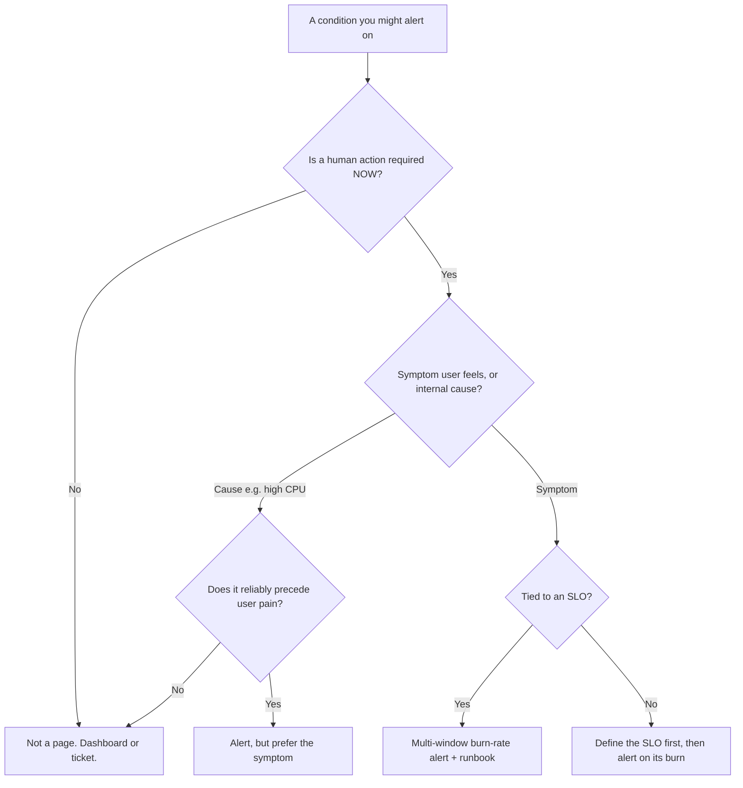
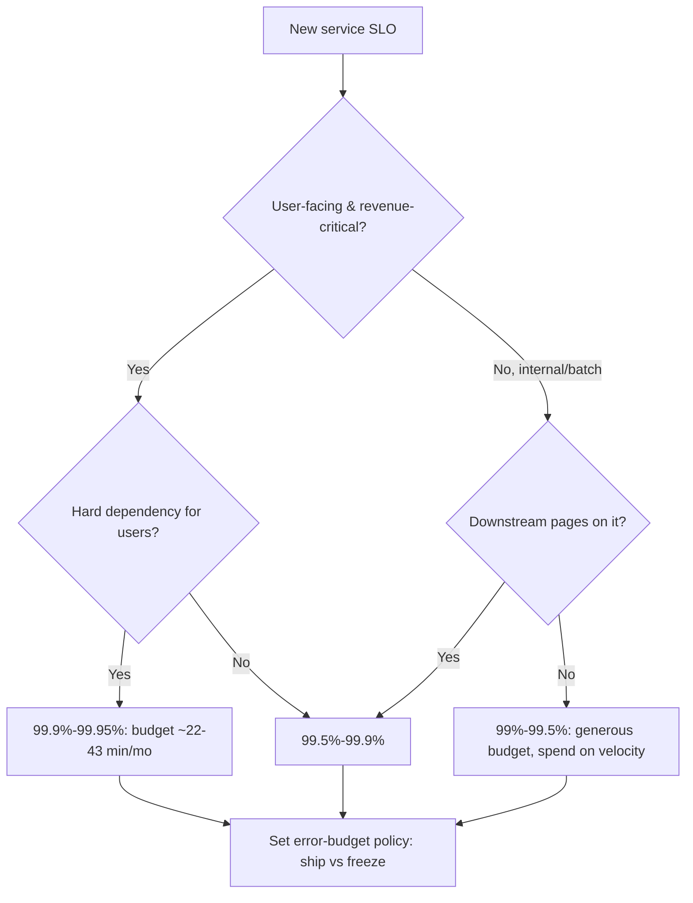
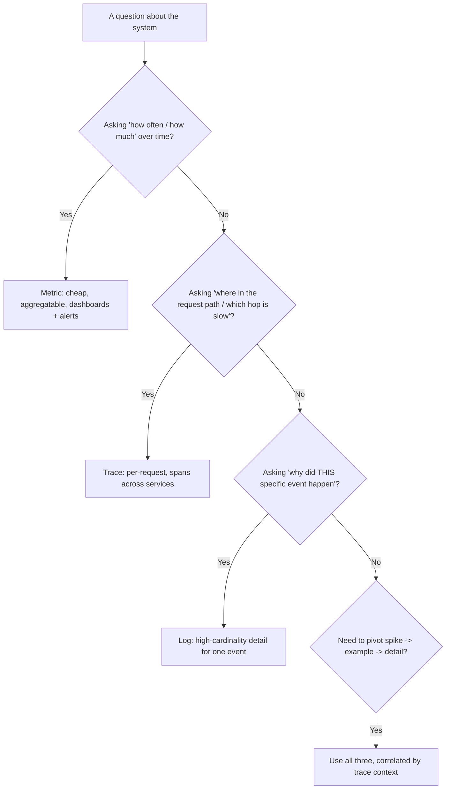
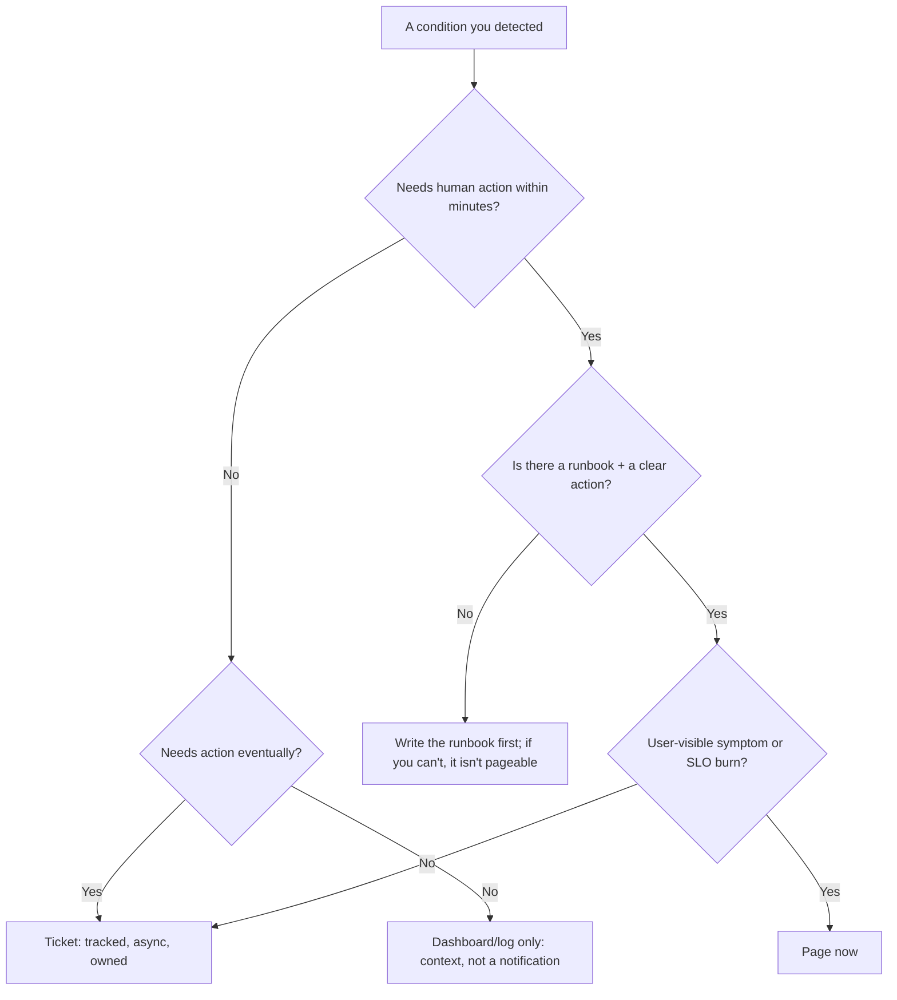
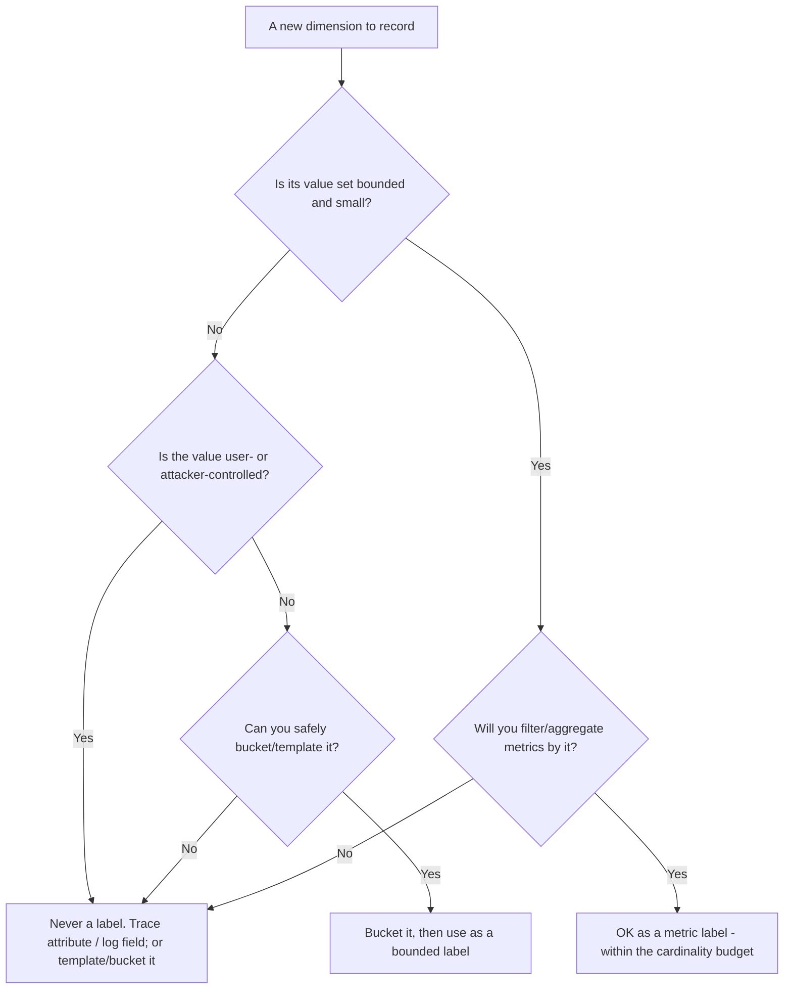

# Observability & SRE — Decision Trees

_Decision trees + a dated capability map. Capability rows are `[verify-at-build]` — re-check against the vendor before quoting. Last reviewed: 2026-06-04._

Traverse before designing an alert or setting an SLO target.

## Decision Tree: Should this be an alert (and how)?

Most metrics should not page. Gate ruthlessly on actionability and symptom-vs-cause.

_Every page links to a runbook and a human action, or it gets deleted._

## Decision Tree: Setting an SLO target

Choose the target by user need and the cost of nines — then derive the budget.

## Decision Tree: Logs, metrics, or traces — which pillar for this question?

Each pillar answers a different shape of question; reach for the one built for yours instead of forcing the wrong tool.

_If you're tempted to put a per-request id on a metric label, you actually wanted a trace or a log._

## Decision Tree: On-call — page, ticket, or dashboard?

Route a condition to the response it deserves; paging on the non-urgent is how real pages get ignored.

_Page = act now; ticket = act soon; dashboard = look when investigating. Most conditions are not pages._

## Decision Tree: Cardinality — label or attribute?

A new dimension is either a bounded metric label or unbounded telemetry detail; choosing wrong is how the TSDB falls over.

_Series count = product of every label's distinct values. If you can't name the upper bound, it isn't a label._

## Capability map (dated — verify at build)

| Capability | 2026 state `[verify-at-build]` | Notes |
|---|---|---|
| OpenTelemetry traces+metrics | GA | Logs maturing; OTLP is the portable wire format |
| OTel semantic conventions | stabilizing per-domain | HTTP/DB stable; check your domain |
| Tail sampling (collector) | GA | Keep errored/slow traces; cost control |
| Multi-window burn-rate alerts | standard practice (Google SRE) | Fast + slow window AND-ed |
| Exemplars (metric->trace links) | supported in Prometheus/OTel | Jump from a spike to a trace |
| Managed backends | CloudWatch / Azure Monitor / Cloud Monitoring | OTel keeps app code portable across them |
