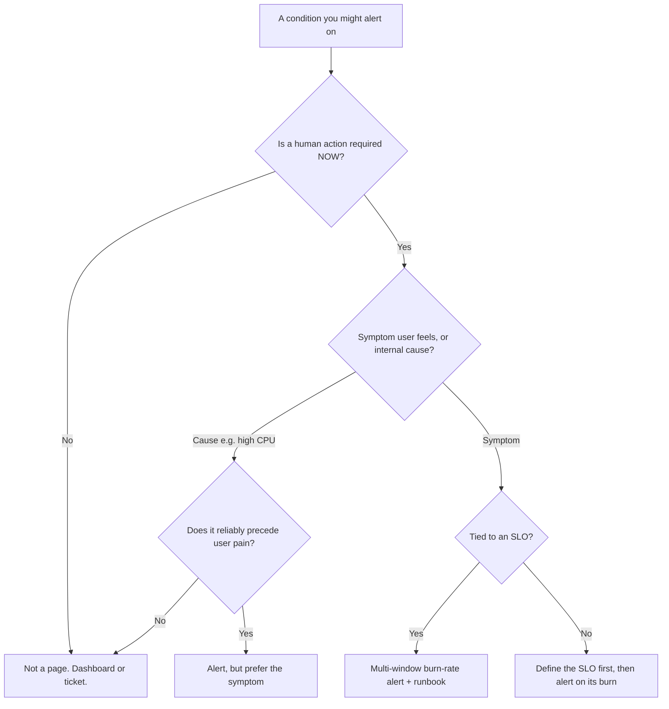
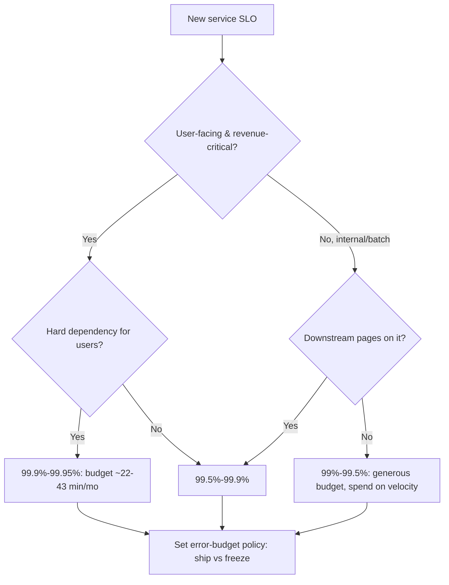
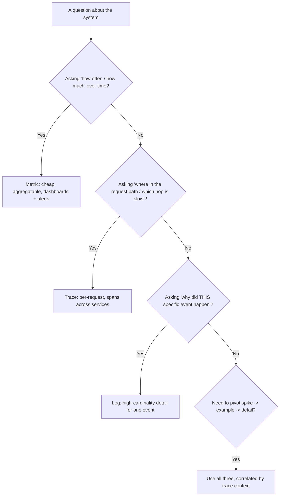
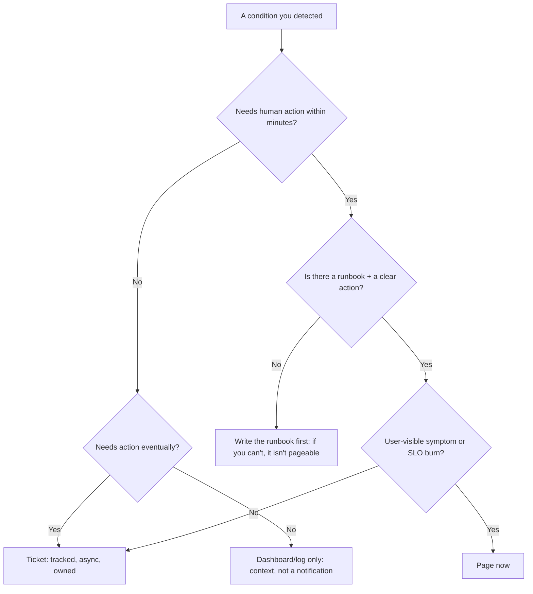
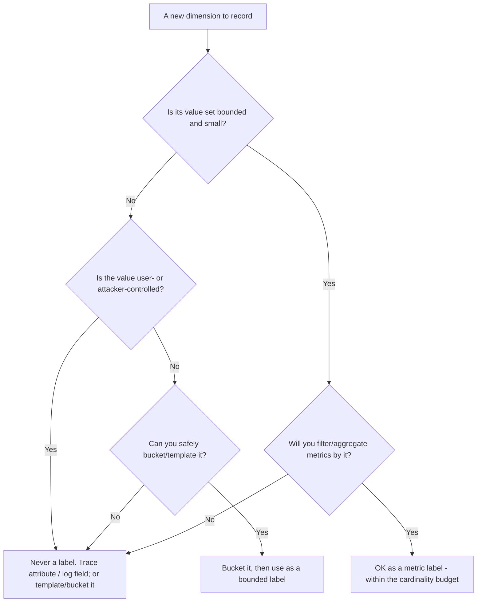
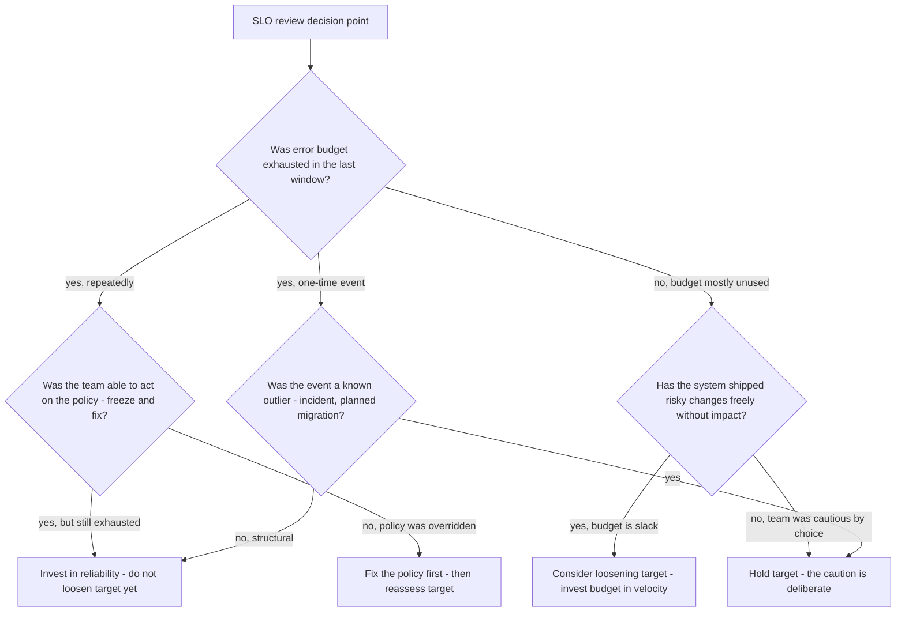
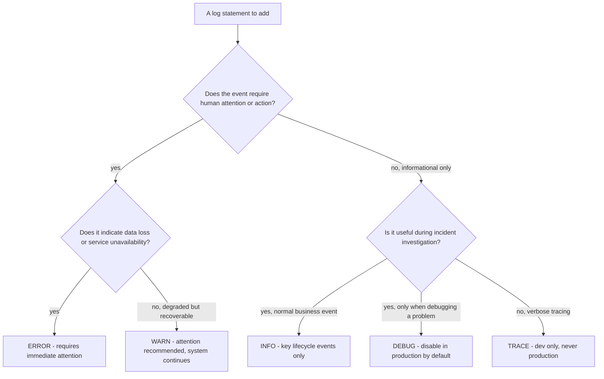
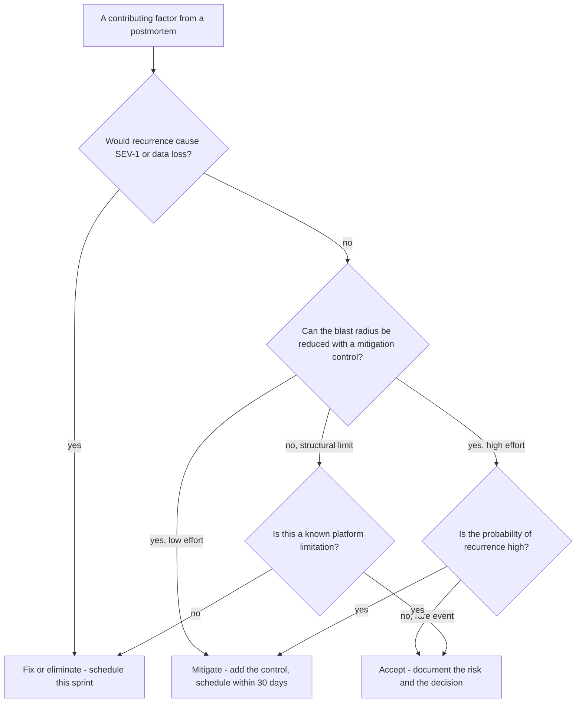

# Observability & SRE — Decision Trees

_Decision trees + a dated capability map. Capability rows are `[verify-at-build]` — re-check against the vendor before quoting. Last reviewed: 2026-06-04._

Traverse before designing an alert or setting an SLO target.

## Decision Tree: Should this be an alert (and how)?

Most metrics should not page. Gate ruthlessly on actionability and symptom-vs-cause.

_Every page links to a runbook and a human action, or it gets deleted._

## Decision Tree: Setting an SLO target

Choose the target by user need and the cost of nines — then derive the budget.

## Decision Tree: Logs, metrics, or traces — which pillar for this question?

Each pillar answers a different shape of question; reach for the one built for yours instead of forcing the wrong tool.

_If you're tempted to put a per-request id on a metric label, you actually wanted a trace or a log._

## Decision Tree: On-call — page, ticket, or dashboard?

Route a condition to the response it deserves; paging on the non-urgent is how real pages get ignored.

_Page = act now; ticket = act soon; dashboard = look when investigating. Most conditions are not pages._

## Decision Tree: Cardinality — label or attribute?

A new dimension is either a bounded metric label or unbounded telemetry detail; choosing wrong is how the TSDB falls over.

_Series count = product of every label's distinct values. If you can't name the upper bound, it isn't a label._

## Capability map (dated — verify at build)

| Capability | 2026 state `[verify-at-build]` | Notes |
|---|---|---|
| OpenTelemetry traces+metrics+logs | GA — all 3 core signals Stable | Logs Data Model + Logs API are **Stable** (no longer "maturing") — [OTel spec status](https://opentelemetry.io/docs/specs/status/) `[verify-at-build — per-language SDK logs maturity still varies]`. **Profiles** is the 4th signal, public **Alpha** (announced ~2026-03) `[verify-at-build — date per OTel spec changelog]`. OTLP is the portable wire format |
| OTel semantic conventions | stabilizing per-domain | HTTP/DB stable; check your domain |
| Tail sampling (collector) | GA | Keep errored/slow traces; cost control |
| Multi-window burn-rate alerts | standard practice (Google SRE) | Fast + slow window AND-ed |
| Exemplars (metric->trace links) | supported in Prometheus/OTel | Jump from a spike to a trace |
| Managed backends | CloudWatch / Azure Monitor / Cloud Monitoring | OTel keeps app code portable across them |

## Decision Tree: SLO target — tighten, loosen, or hold?

**When this applies:** quarterly SLO review or after an incident. The team has budget consumption data and wants to decide whether to adjust the SLO target.

**Last verified:** 2026-06-05 against Google SRE Workbook Chapter 2 and standard SLO review practice.

**Rationale per leaf:**
- *Invest in reliability* — repeated exhaustion means the system can't meet its target; fix the reliability gap before raising the bar.
- *Fix the policy first* — a policy that gets overridden isn't a policy; the target adjustment is premature until the policy works.
- *Consider loosening* — consistently unspent budget is over-engineering; loosen to spend more on features.
- *Hold target* — the team deliberately chose caution; the target reflects capability, not over-engineering.

**Tradeoffs summary:**

| Method | Cost / time | Blast radius | Approval gate? | Use when |
|---|---|---|---|---|
| Tighten target | High reliability investment | Low | EM sign-off | Structural repeated exhaustion |
| Loosen target | Frees velocity budget | Low | Team + SRE | Chronic surplus with healthy system |
| Fix the policy | Behavioral change | Low | EM sign-off | Policy is consistently overridden |
| Hold | No change | None | Team review | One-off event or deliberate caution |

## Decision Tree: Which logging level for this event?

**When this applies:** an engineer is adding a log statement and needs to choose the severity level. Wrong level choices pollute query results, inflate costs, and suppress real signal.

**Last verified:** 2026-06-05 against OTel log severity spec and syslog RFC 5424 level semantics.

**Rationale per leaf:**
- *ERROR* — the system cannot complete an operation; a human or automated alert response is expected.
- *WARN* — the system completed but with a degraded path or a recoverable error; worth investigating before it escalates.
- *INFO* — major lifecycle transitions (service start, connection established, job completed) that paint the activity timeline in an investigation.
- *DEBUG* — detailed diagnostic information useful only when actively debugging; too verbose for normal production volume.
- *TRACE* — raw execution path; production cost is prohibitive; development use only.

**Tradeoffs summary:**

| Method | Cost / time | Blast radius | Approval gate? | Use when |
|---|---|---|---|---|
| ERROR | High cost if frequent | Triggers alerts | Alert routing | Unrecoverable failures |
| WARN | Medium cost | No alert, visible | None | Recoverable degradations |
| INFO | Low cost at cadence | None | None | Key lifecycle events |
| DEBUG | Disable in prod | None (when off) | None | Debugging a specific problem |

## Decision Tree: Postmortem action item — fix, mitigate, or accept?

**When this applies:** the blameless postmortem has produced a list of contributing factors and the team must decide how to respond to each one.

**Last verified:** 2026-06-05 against Google SRE Workbook Chapter 10 and PagerDuty incident management practice.

**Rationale per leaf:**
- *Fix or eliminate* — high-severity, high-probability contributing factors get a real fix with an owner and sprint commitment.
- *Mitigate* — reducing the blast radius of a factor that can't be eliminated is the next-best outcome; assign an owner.
- *Accept* — documented risk acceptance with a named decision-maker is valid; undocumented inaction is not.

**Tradeoffs summary:**

| Method | Cost / time | Blast radius | Approval gate? | Use when |
|---|---|---|---|---|
| Fix / eliminate | High effort | Reduces future severity | Sprint planning | SEV-1 risk or recurring factor |
| Mitigate | Medium effort | Reduces blast radius | 30-day ticket | High-probability, controllable |
| Accept | Low effort | Unchanged risk | Named decision-maker | Rare, low-blast, or structural limit |
