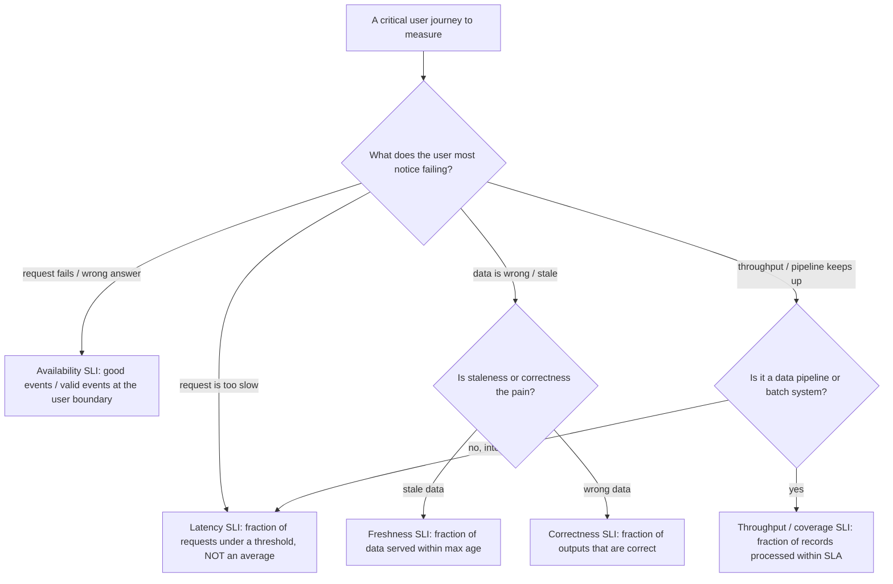
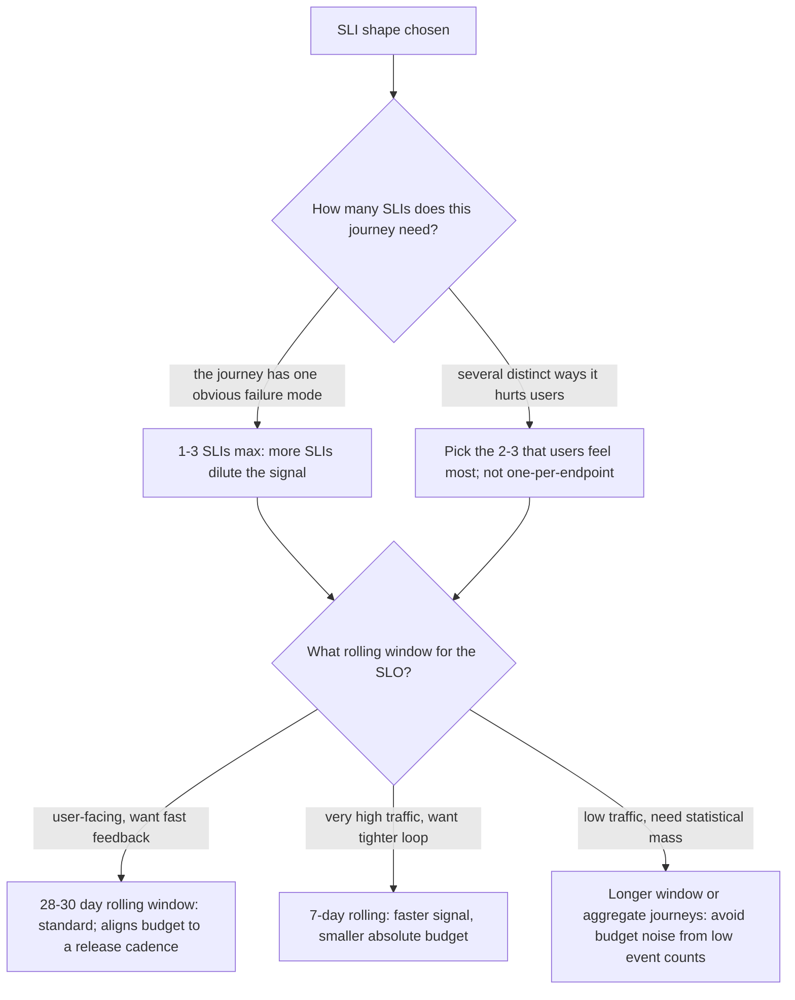

# SLI/SLO Design — Decision Trees

_Topic-specific decision trees for **designing** an SLI/SLO from scratch — the complement to the `## Decision Tree: Setting an SLO target` and `## Decision Tree: SLO target — tighten, loosen, or hold?` trees in [`observability-sre-decision-trees.md`](observability-sre-decision-trees.md), which cover the *target number* and the *quarterly review*. This file covers the prior steps: **what to measure**, **which SLI shape**, and **which measurement window**. Grounded in the Google SRE Workbook (SLO chapters). Last reviewed: 2026-06-05 `[verify-at-use]`._

Traverse these before writing the SLO target; the target is meaningless if the SLI doesn't measure user pain.

## Decision Tree: Which SLI shape for this user journey?

**When this applies:** you're defining an SLI for a service or critical user journey and need to choose *what kind* of indicator measures the user's experience. The wrong SLI shape produces a number nobody feels.

**Rationale per leaf:**
- *Availability* — the canonical request/response SLI: `good ÷ valid` events measured where the user is (the load balancer or client), not deep in a backend that can be healthy while the edge 502s.
- *Latency* — **never an average.** Use the fraction of requests faster than a threshold (e.g. "99% of requests < 300ms"), because an average hides the tail the user actually feels.
- *Freshness / Correctness* — for read-heavy and data-serving systems, "up and fast but serving stale/wrong data" is a failure the availability SLI misses.
- *Throughput / coverage* — pipelines fail by falling behind or dropping records, not by returning 500s; measure the fraction processed within the SLA.

**Tradeoffs summary:**

| SLI shape | Measures | Common trap | Use when |
|---|---|---|---|
| Availability | success ratio | measuring server-side, missing edge failures | request/response services |
| Latency | tail under threshold | using an average (hides the tail) | interactive latency-sensitive paths |
| Freshness | data age | conflating with availability | caches, replicas, read replicas |
| Correctness | output correctness | hard to measure cheaply | data-serving, ranking, billing |
| Throughput/coverage | records on time | measuring volume not timeliness | batch + streaming pipelines |

## Decision Tree: Which measurement window and how many SLIs?

**When this applies:** you've chosen the SLI shape(s) and need to set the rolling window and decide how many SLIs a journey needs.

**Rationale per leaf:**
- *1–3 SLIs max* — every extra SLI dilutes attention and creates competing freezes; pick the few that track real user happiness, not one per endpoint.
- *28–30 day rolling window* — the SRE-Workbook default; long enough for statistical mass, short enough to act on, and it maps cleanly to an error-budget policy.
- *7-day rolling* — only when traffic is high enough that a week carries statistical mass; gives a faster feedback loop but a smaller absolute budget.
- *Low-traffic caution* — with few events per window the budget is noisy (one bad request is a big fraction); aggregate journeys or lengthen the window so the SLO isn't whiplashed by tiny counts.

**The load-bearing sequence (don't skip it):**
1. Pick the SLI **shape** (tree 1) — what the user feels.
2. Measure at the **user boundary**, not a healthy-looking internal component.
3. Choose **1–3 SLIs** per journey; resist one-per-endpoint sprawl.
4. Set the **window** (default 28–30d) with enough event mass to be non-noisy.
5. *Then* set the **target** and derive the **budget** — that's the [`observability-sre-decision-trees.md`](observability-sre-decision-trees.md) `## Decision Tree: Setting an SLO target` tree.
6. Write the **error-budget policy before the target binds** (see best-practices `error-budget-policy-is-written-before-the-slo.md`).

**Sources:** Google SRE Workbook — "Implementing SLOs" (SLI specification, the SLI menu, windows) https://sre.google/workbook/implementing-slos/ ; Google SRE Book — "Service Level Objectives" https://sre.google/sre-book/service-level-objectives/ (retrieved 2026-06-05). Re-verify window/target conventions at use — practice evolves.
