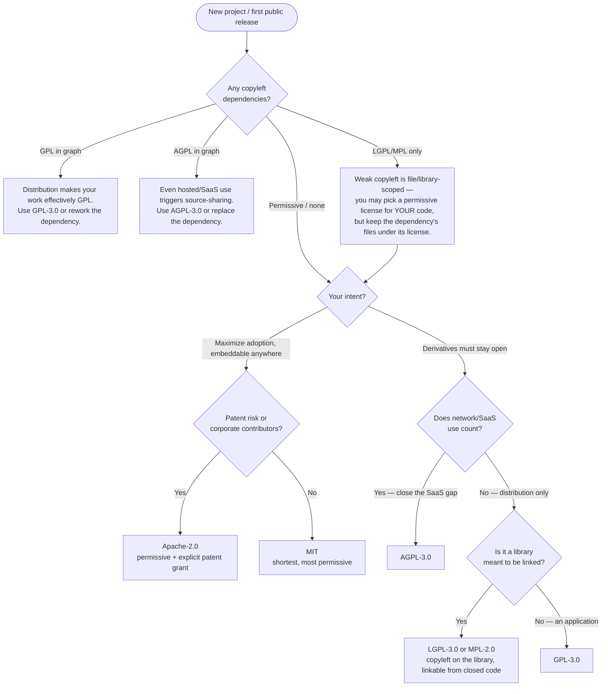
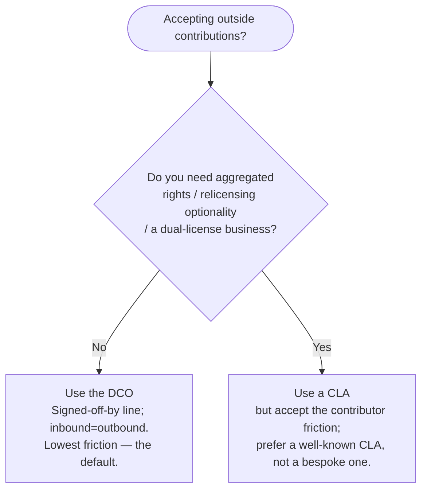

# Knowledge — Open-source license selection

> **Last reviewed:** 2026-06-23 · **Confidence:** High (SPDX + choosealicense.com consensus; copyleft reach is settled law/practice). **Not legal advice** — flag commercial/patent stakes for a lawyer.
> The `oss-maintainer-strategist` traverses this tree **before** naming a license. The governing constraint is upstream, not downstream: the strongest copyleft in your dependency graph constrains the whole work.

The discipline: **name the license from this tree, then verify dependency compatibility, then emit the LICENSE/NOTICE files** — never the reverse.

---

## Decision Tree: choosing an open-source license

## Contribution agreement (orthogonal to the license)

## Reference table

| License | Type | Use it when | Watch out for |
|---|---|---|---|
| MIT | permissive | maximum adoption, simplest terms | no explicit patent grant |
| Apache-2.0 | permissive | adoption + patent protection | NOTICE file obligations |
| BSD-2/3-Clause | permissive | MIT-like, BSD ecosystem norms | 3-Clause's no-endorsement term |
| MPL-2.0 | weak copyleft | file-scope reciprocity, linkable | per-file boundary |
| LGPL-3.0 | weak copyleft | library copyleft, closed-code linking | relinking obligation |
| GPL-3.0 | strong copyleft | applications, derivatives stay open | constrains the whole distributed work |
| AGPL-3.0 | strong copyleft (network) | close the hosted-SaaS loophole | scares some corporate adopters |

## Provenance
- SPDX License List (canonical identifiers + verbatim text), choosealicense.com (GitHub/OSI guidance), OSI approved-licenses list. Copyleft reach (GPL "distribution", AGPL "network use") per the respective license texts. Last reviewed 2026-06-23.
- See also [`community-health-and-governance.md`](community-health-and-governance.md) for CLA/DCO operational mechanics and [`../best-practices/license-before-first-public-commit.md`](../best-practices/license-before-first-public-commit.md).
