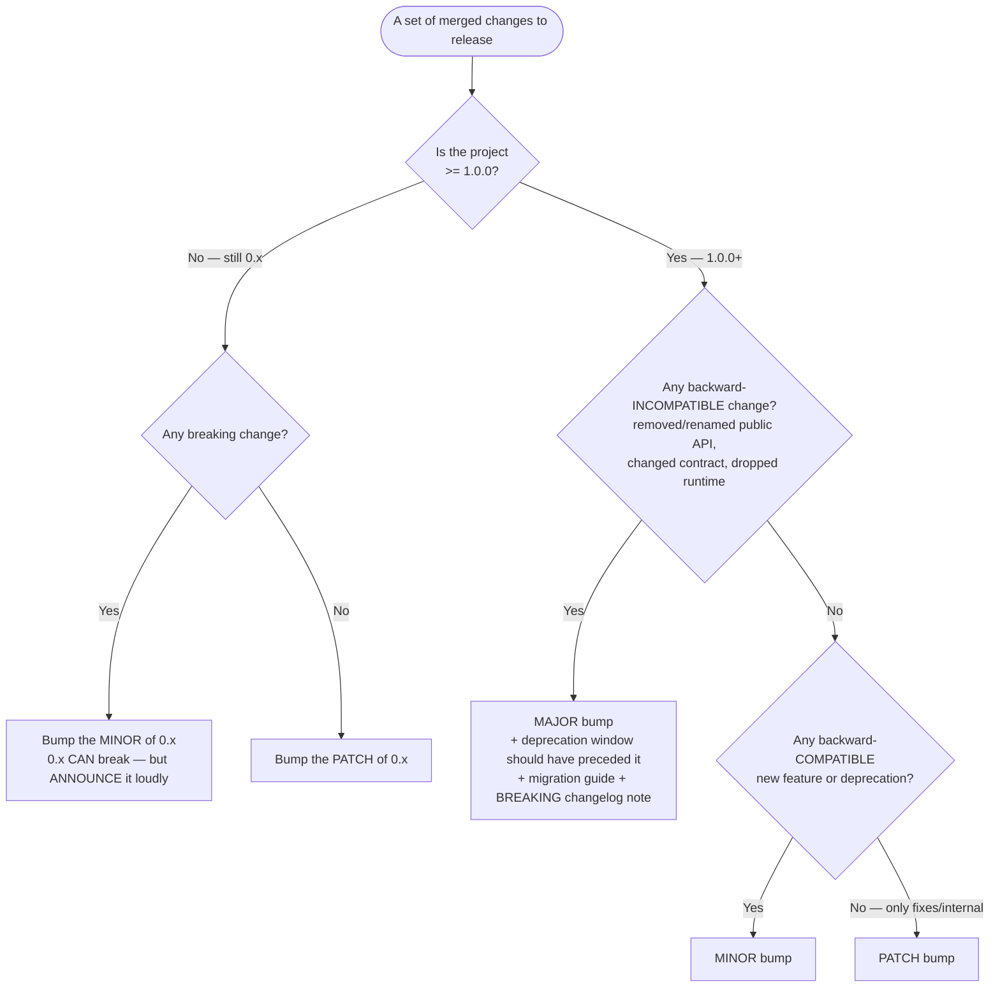

# Knowledge — Semantic versioning & release decisions

> **Last reviewed:** 2026-06-23 · **Confidence:** High (SemVer 2.0.0 + Keep a Changelog are stable specs). The `release-and-versioning-engineer` traverses this **before** naming a version bump.

The discipline: **bump by the change, not by the feeling.** A removed public symbol is a major even if it feels small; a giant internal refactor with no API change is a patch.

---

## Decision Tree: which version bump?

## What counts as "breaking" (the gray zone)

| Change | Breaking? |
|---|---|
| Remove or rename a public function/flag/field | **Yes — major** |
| Change a function's required arguments or return shape | **Yes — major** |
| Change documented default behavior | **Yes — major** |
| Drop support for a runtime/OS/language version | **Yes — major** |
| Tighten input validation that previously passed | **Usually yes** (it breaks callers relying on the laxity) |
| Add an optional parameter / new function | No — minor |
| Fix a bug so behavior now matches the documented contract | Patch (but call it out if anyone depended on the bug) |
| Internal refactor, perf, dependency bump with no API change | Patch |

## Pre-release & build metadata

- Pre-releases: `1.2.0-rc.1`, `2.0.0-beta.3` — lower precedence than the final; use for RC cycles.
- Build metadata: `1.2.0+20260623` — ignored for precedence.
- `0ver` (`0.x`): a published promise that minors may break. Reaching `1.0.0` is a *stability commitment*, not a maturity badge — ship it when you can keep the contract.

## Changelog grouping (Keep a Changelog)

`Added` · `Changed` · `Deprecated` · `Removed` · `Fixed` · `Security`. Keep an `[Unreleased]` section at the top; move it under a dated version header at release. Entries are for **users upgrading**, not a commit dump.

## Provenance
- Semantic Versioning 2.0.0 (semver.org); Keep a Changelog 1.1.0 (keepachangelog.com); Conventional Commits 1.0.0 (conventionalcommits.org). Stable specs, last reviewed 2026-06-23.
- Release-automation tooling that consumes these conventions: [`oss-tooling-2026.md`](oss-tooling-2026.md).
