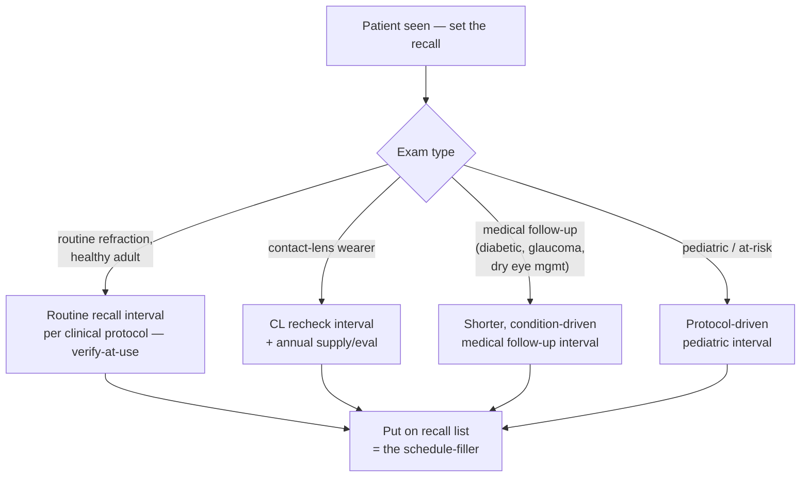
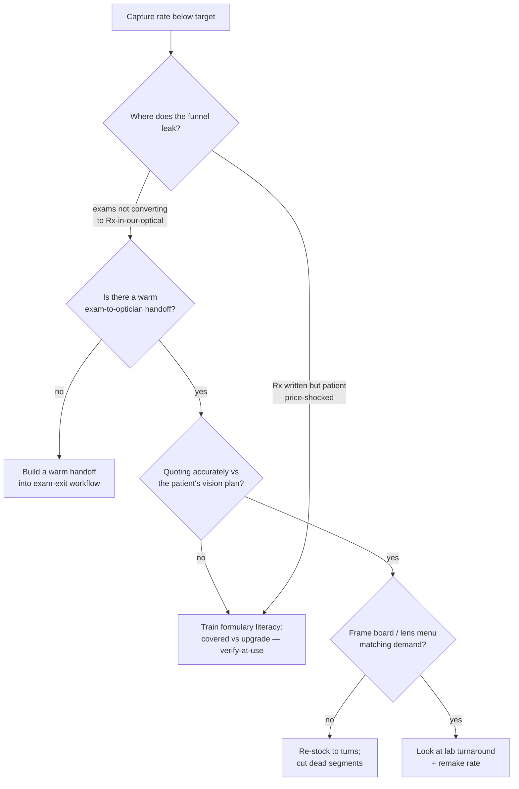
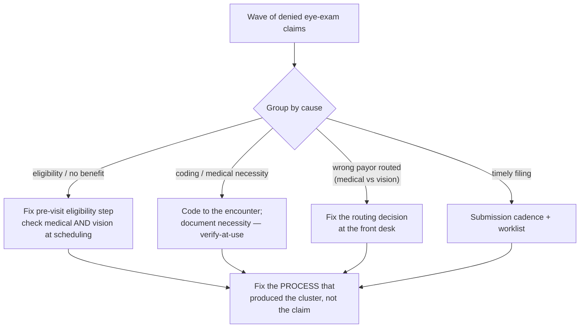

# Optometry / Eye-Care Practice — Decision Trees

> Reference decision trees for the `optometry-eyecare-practice` team. Agents **traverse the relevant tree top-to-bottom before deciding** (the proactive complement to the Capability Grounding Protocol). Each `## Decision Tree` section is a Mermaid graph plus the rule it encodes.
>
> **Advisory operations knowledge, not medical, legal, coding, or billing advice.** Anything touching a payor rule, CPT code, benefit structure, or clinical protocol is `[verify-at-use]` — confirm against the payor/clearinghouse/clinical protocol before acting. No PII/PHI.
>
> _Last reviewed: 2026-06-22 by `claude`. Principles are durable; dated benchmarks and concepts live in [`eyecare-practice-reference-2026.md`](eyecare-practice-reference-2026.md)._

---

## Decision Tree: route this visit to medical or vision-plan billing?

```mermaid
flowchart TD
    A[Eye-care visit to bill] --> B{Chief complaint /<br/>reason for visit}
    B -- "routine refraction, well-vision,<br/>'new glasses'" --> C[Vision plan<br/>routine exam + materials allowance]
    B -- "medical complaint or dx<br/>(dry eye, diabetic, glaucoma,<br/>foreign body, sudden change)" --> D{Documented medical<br/>findings + plan?}
    D -- no --> E[Document medical necessity FIRST<br/>then bill medical]
    D -- yes --> F[Medical insurance<br/>E/M or eye-exam code to the dx]
    B -- "both components present" --> G{Payor rules allow split?<br/>[verify-at-use]}
    G -- yes --> H[Split: medical for the condition,<br/>vision for refraction/materials]
    G -- no --> I[Route to the dominant<br/>reason for the visit]
```

**Rule:** route on the **chief complaint and what the visit addressed**, never on which payor is convenient. A medical claim requires documented medical necessity. Split only where the specific payor's rules allow it — `[verify-at-use]`.

---

## Decision Tree: recall / recare cadence by exam type



**Rule:** the recall interval is set by **exam type and clinical protocol** (treat all interval values as `[verify-at-use]`), and the recall list — not walk-ins — is the primary schedule-filler. Recall drives the schedule.

---

## Decision Tree: optical capture-rate improvement



**Rule:** capture is won at the **handoff**, not the register. Diagnose the funnel in order — handoff, then quote accuracy against the plan, then board/menu fit, then lab. Capture rate is the optical profit lever, not frame markup.

---

## Decision Tree: claim denial triage



**Rule:** triage denials by **cause cluster**, then fix the process that produced the group — not one claim at a time. The biggest preventable causes (eligibility, wrong-payor routing) are front-desk process defects. Specific payor denial codes are `[verify-at-use]`.

---

## See also

- [`eyecare-practice-reference-2026.md`](eyecare-practice-reference-2026.md) — dated concepts + benchmarks (verify-at-use).
- Skills: [`../skills/medical-vs-vision-billing/SKILL.md`](../skills/medical-vs-vision-billing/SKILL.md), [`../skills/eligibility-and-claims/SKILL.md`](../skills/eligibility-and-claims/SKILL.md), [`../skills/optical-capture-and-dispensary/SKILL.md`](../skills/optical-capture-and-dispensary/SKILL.md), [`../skills/schedule-and-recall-management/SKILL.md`](../skills/schedule-and-recall-management/SKILL.md).
