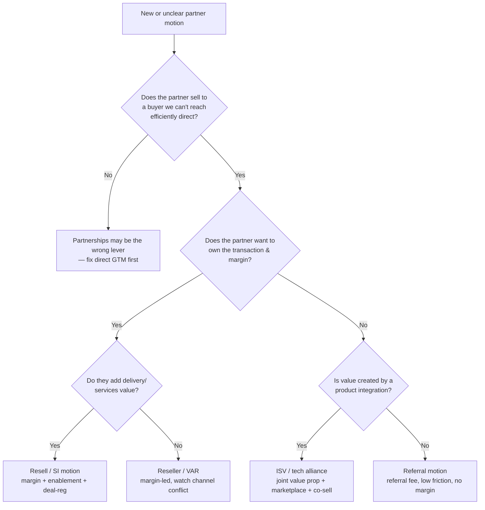
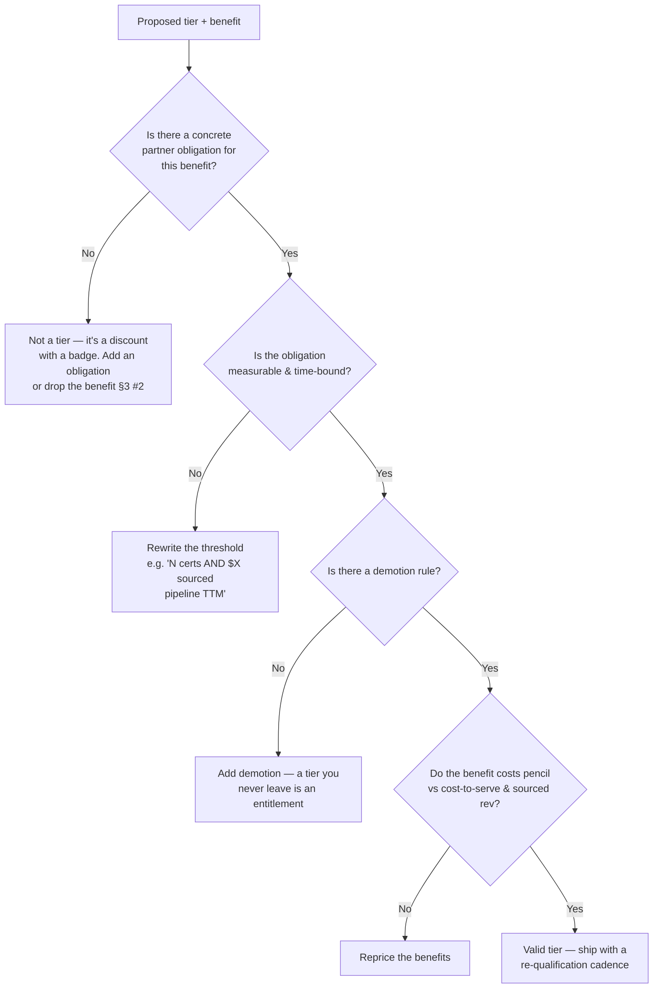
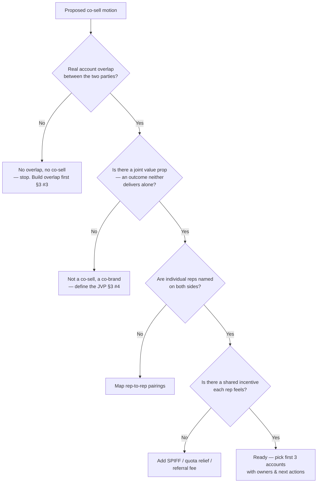

# Partnerships & Alliances — decision trees

Router + three Mermaid decision trees the agents traverse. Read the matching tree in
full when the situation fits. These encode the §3 house opinions as branch logic.

---

## Skill / agent router

| If the ask is… | Route to | Skill |
|---|---|---|
| "Should we invest in partnerships / which motion?" | `partnerships-lead` | (scoping) |
| "Design our partner tiers" | `channel-program-manager` | `build-a-partner-tiering-model` |
| "How should MDF work?" | `channel-program-manager` | `design-an-mdf-program` |
| "Build a co-sell motion" | `alliance-gtm-strategist` | `structure-a-co-sell-motion` |
| "How much pipeline is the partner driving?" | `alliance-gtm-strategist` | `size-partner-sourced-pipeline` |
| Direct-sales forecast/comp/territory | → `sales-revops` (seam) | — |
| Contract / antitrust / tax terms | → counsel (seam) | — |

---

## Tree 1 — Which partner motion?

Rule: choose the motion from the **economics** ([`partnership-economics.md`](partnership-economics.md)) before designing a program (§3). Don't grant resale margin to a partner who only refers.

---

## Tree 2 — Tier design (obligation-for-benefit)

---

## Tree 3 — Co-sell readiness

