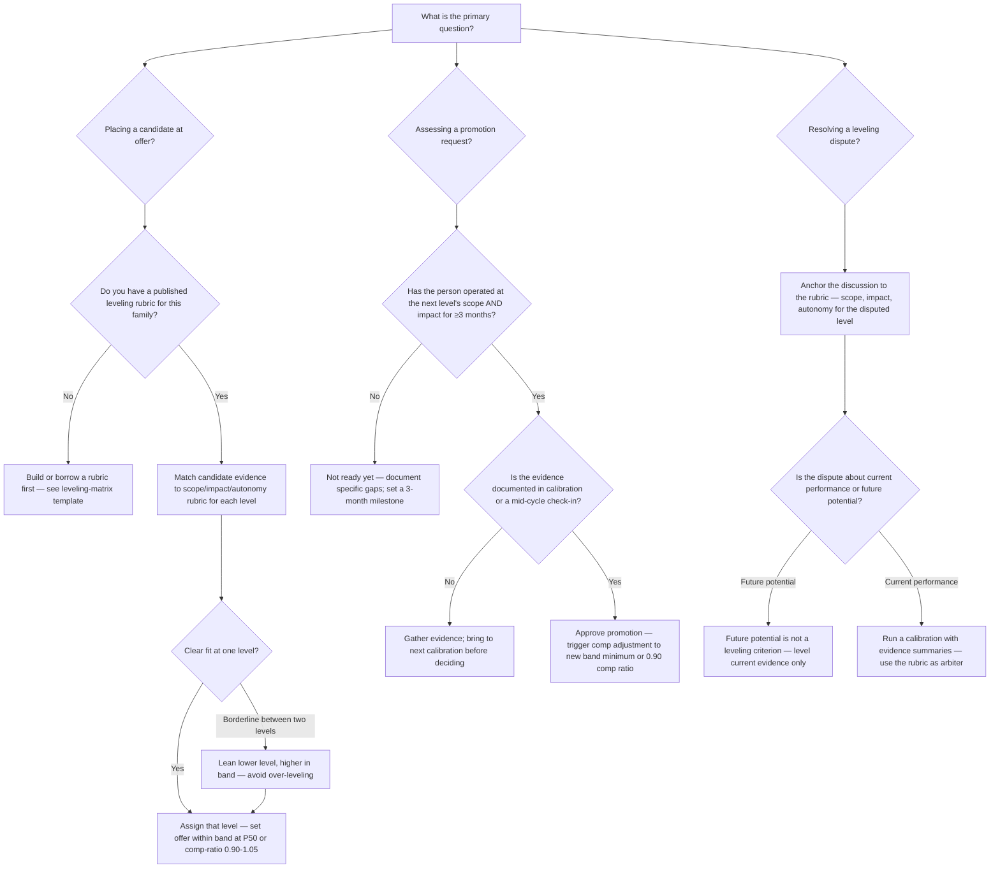
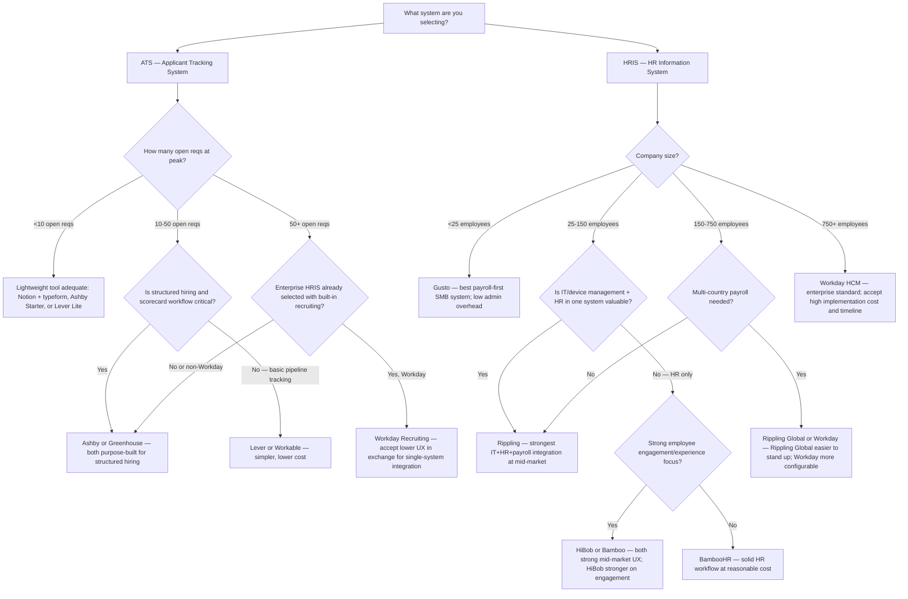
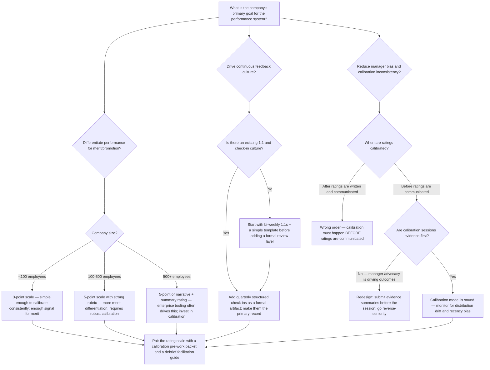

# People Operations & HR — Decision Trees + 2026 Capability Map

> Canonical knowledge bank for `people-operations-hr`. **Traverse the relevant Mermaid tree
> top-to-bottom before choosing** a system, a level, a performance model, or a comp architecture.
> Volatile product/version/pricing facts in the capability map carry a retrieval date and a
> re-verify-at-use rider.

---

## Decision Tree 1: Level and Comp-Band Placement

Use when: placing a candidate at offer stage, assessing a promotion request, or resolving a
leveling dispute.

**Leaf rule:** level decisions must be anchored to observable, documented scope and impact —
not tenure, credentials, title at a prior company, or manager advocacy. A promotion requires
sustained evidence at the next level, not a single strong project. Over-leveling at hire creates
a comp and expectations problem that is expensive to unwind.

---

## Decision Tree 2: Build-vs-Buy ATS / HRIS

Use when: choosing a new ATS or HRIS, or assessing whether the current system fits the company's
stage.

**Leaf rule:** buy before you build; adopt before you customize. The right HRIS is the one
the People team will actually use and maintain, not the most feature-rich one available.
HRIS migration is expensive — think one stage ahead. ATS and HRIS are often separate purchase
decisions; don't conflate them unless an enterprise suite (Workday) genuinely covers both well
for your stage.

---

## Decision Tree 3: Performance Model Selection

Use when: designing or redesigning a performance review cycle, or selecting a rating approach.

**Leaf rule:** no rating scale prevents bias by itself — the discipline is in the calibration
process. Pre-calibrate (before communication), use evidence summaries, go reverse-seniority in
the session, and document recalibrations. A 5-point scale without calibration is noisier than a
3-point scale with it.

---

## 2026 Capability Map — HR Tech Platforms

_Retrieved 2026-06-08. Product positioning, pricing tiers, and feature coverage are volatile —
re-confirm at time of use. This is orientation, not a procurement recommendation._
_[verify-at-use]_

### ATS — Applicant Tracking Systems

| Platform | Best fit | Notes |
|----------|----------|-------|
| **Greenhouse** | Mid-market to enterprise, structured hiring focus | Strong scorecard workflows, strong integrations, market leader for 100–2000 person companies. Higher cost than lighter tools. |
| **Ashby** | Growth-stage startups, analytics-first TA teams | Modern UX, built-in analytics, strong structured-interview support. Growing market share in Series A–C companies. |
| **Lever** | Mid-market, CRM-first recruiting | Good candidate relationship management, reasonable structured hiring. Less analytics depth than Ashby. |
| **Workday Recruiting** | Enterprise (1000+ employees already on Workday HCM) | Accept UX trade-offs for single-system integration. Not recommended as a standalone ATS. |
| **Workable** | SMB, <50 open reqs | Easy to use, reasonable cost, limited structured-hiring depth. |

### HRIS — Human Resources Information Systems

| Platform | Best fit | Notes |
|----------|----------|-------|
| **Gusto** | <150 employees, payroll-first | Best-in-class payroll UX for SMB. Benefits administration strong for US companies. Limited HR workflow depth. |
| **Rippling** | 50–750 employees, IT + HR integration | Strongest IT/device management + HRIS + payroll combo. Mid-market sweet spot. Global payroll available. |
| **BambooHR** | 50–500 employees, HR workflow focus | Clean UX, solid performance and onboarding modules, no native payroll. Requires payroll integration. |
| **HiBob** | 50–500 employees, engagement + modern UX | Strong employee experience / engagement features. Popular in Europe and with remote-first companies. |
| **Workday HCM** | 750+ employees, enterprise | The enterprise standard. High implementation cost (typically $200K–$1M+ for mid-enterprise). Highly configurable; requires dedicated admin. |
| **Personio** | European companies, SMB–mid-market | Strong for EU compliance and multi-country European payroll. Less relevant for US-primary companies. |
| **Carta Total Comp** | Startup equity + cash benchmarking | Not a full HRIS; useful for comp benchmarking for venture-backed companies, especially for equity data. |

### Performance & Engagement Platforms

| Platform | Best fit | Notes |
|----------|----------|-------|
| **Lattice** | 100–1000 employees, performance + engagement | Strong performance review, OKR, and engagement survey workflows. Widely adopted in Series B–D companies. |
| **CultureAmp** | 200+ employees, engagement-first | Best-in-class engagement survey and analytics. Benchmarks are strong. Performance module exists but engagement is the primary strength. |
| **Leapsome** | 100–500 employees, learning + performance | Strong for companies wanting performance + learning in one tool. European origin; strong EU customer base. |
| **15Five** | 50–500 employees, continuous feedback focus | Focus on manager effectiveness and continuous feedback. Good for building 1:1 culture. |
| **Workday Peakon Employee Voice** | Enterprise (already on Workday) | Integrated engagement signal within Workday. Accept a less best-of-breed survey product for single-system convenience. |

> Provenance: vendor positioning derived from public documentation, G2/Capterra review landscapes,
> and TA/HR community benchmarks as of 2026-06-08. Market shares, pricing tiers, and feature
> coverage are volatile — re-verify at use. No invented products.

---

## See also

- [`../CLAUDE.md`](../CLAUDE.md) — team constitution and seams.
- [`../best-practices/README.md`](../best-practices/README.md) — the named, citable rules.
- [`../skills/comp-bands-and-leveling/SKILL.md`](../skills/comp-bands-and-leveling/SKILL.md) —
  deep comp and leveling playbook.
- [`../skills/structured-hiring/SKILL.md`](../skills/structured-hiring/SKILL.md) — deep
  structured hiring playbook.
- Neighbor decision trees: `finance` (merit budget), `data-platform` (people data pipeline),
  `applied-statistics` (significance on attrition/pay-equity data).

_Last reviewed: 2026-06-08 by `claude`._
