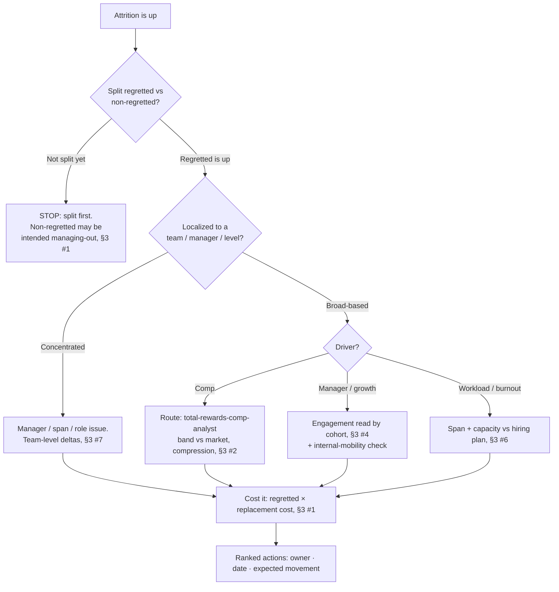
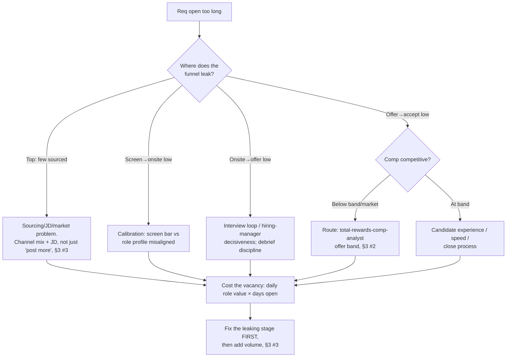
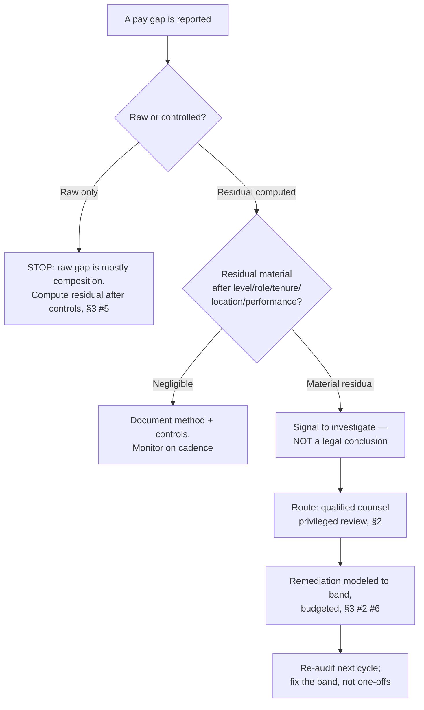

# People-Ops Decision Trees

> Mermaid decision trees for the three most common People-Ops triage paths. Traverse top-to-bottom and pick the smaller-blast-radius leaf — don't keyword-match the symptom to a method. Each tree encodes the team's house opinions (CLAUDE.md §3).

## Tree 1 — Rising attrition

## Tree 2 — Open req won't close

## Tree 3 — Pay-equity gap surfaced

## How to read these

- **Always split / control before diagnosing** — the first decision node in Trees 1 and 3 is a STOP that prevents the most common error (acting on an uncosted or uncontrolled number).
- **Fix the leak before adding volume** (Tree 2) — more sourcing into a leaking funnel wastes recruiter capacity (§3 #3).
- **Legal is counsel's** — Tree 3 hard-routes a material residual gap to counsel; the team frames it, counsel determines it (§2).
- Every leaf ends in the §6 Output Contract: owner · date · expected metric movement.
