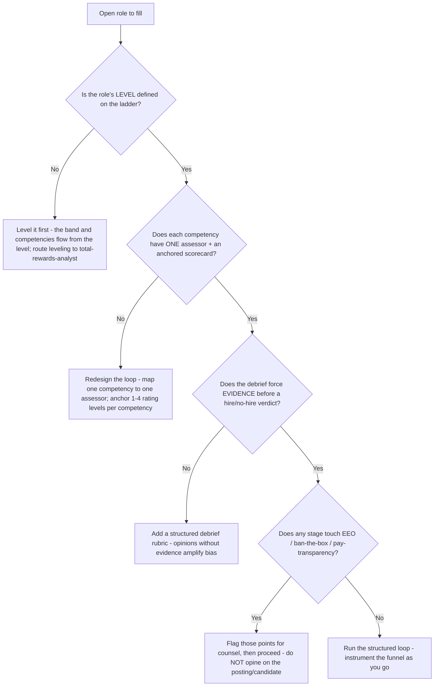
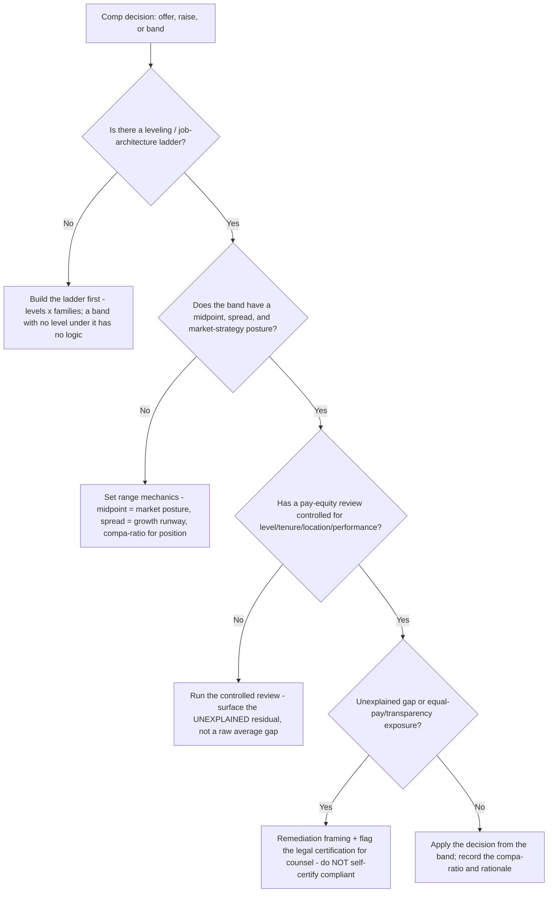

# People Ops / HR — Decision Trees

_Decision trees + a dated reference map. Practice and tooling rows are `[verify-at-build]` — re-check against the current vendor/framework, and **never** treat any row as employment-law advice. Last reviewed: 2026-06-08._

Traverse before designing a hiring loop, setting a comp band, authoring a policy, or running a review cycle. **Cardinal rule for every tree below: where a branch reaches employment law (FLSA classification, EEO, leave entitlement, equal-pay, pay-transparency, termination), the output is "flag for counsel" — this knowledge bank does not give legal advice.**

## Decision Tree: Is this hire structured enough to be fair and predictive?

Structure — a defined rubric assessed the same way for every candidate — predicts performance and reduces bias better than freeform interviews.

_One competency, one assessor, one anchored scorecard, evidence-forced debrief. Applicant volume is a vanity count; conversion and time-in-stage are the diagnostic._

## Decision Tree: Is this compensation decision defensible (band + equity)?

Structure before generosity: a leveling framework, a band that maps to the level, and a pay-equity review that controls for legitimate factors.

_No band without a level under it. A pay-equity check that doesn't control for legitimate factors proves nothing. Legal certification is counsel's, not yours._

---

## Reference map (2026, `[verify-at-build]` — not legal advice)

| Area | Common practice / tooling | Notes |
|---|---|---|
| HRIS / core HR | BambooHR, Rippling, Gusto, HiBob, Workday (up-market) | The system of record for status/level/comp/dates — prefer one canonical source over spreadsheets `[verify-at-build]` |
| Applicant tracking (ATS) | Greenhouse, Ashby, Lever, Workable | Structured-hiring and funnel-metric support varies — verify scorecard/kit features `[verify-at-build]` |
| Structured hiring | Competency-anchored scorecards, interviewer-to-competency mapping, structured debrief | Research favors structured over unstructured interviews for validity + fairness `[verify-at-build]` |
| Comp / market data | Radford, Mercer, Payscale, Pave, Carta (equity) | Quote the market posture (lead/match/lag, which percentile/market), not a bare number `[verify-at-build]` |
| Leveling / job architecture | Levels x job families, competency definitions per level | The ladder under the band and the hiring rubric `[verify-at-build]` |
| Pay equity | Controlled regression / cohort analysis (level, tenure, location, performance) | Surface the *unexplained* residual; legal certification → counsel `[verify-at-build]` |
| Performance / review cycles | Merit matrix (performance x position-in-range), calibration, promotion tied to the ladder | Split merit vs. promotion vs. equity budgets; calibrate before communicating `[verify-at-build]` |
| Handbook / policy | Plain-language statement -> scope -> rule -> process -> edge cases; consistent across the handbook | Entitlement/accrual mechanics are jurisdiction-specific → flag for counsel `[verify-at-build]` |
| Employment-compliance basics | FLSA exempt/non-exempt, at-will, EEO, ADA/leave, pay-transparency, ban-the-box | **Flag for qualified counsel — this plugin does not give legal advice** `[verify-at-build]` |

_Framework references: structured-interview validity research; Team-of-one to mid-market People Ops practice. Every compensation, hiring, and policy item that touches employment law is **flagged for counsel** — re-verify any tool, market source, or practice before quoting it, and never present a row here as a legal determination._
