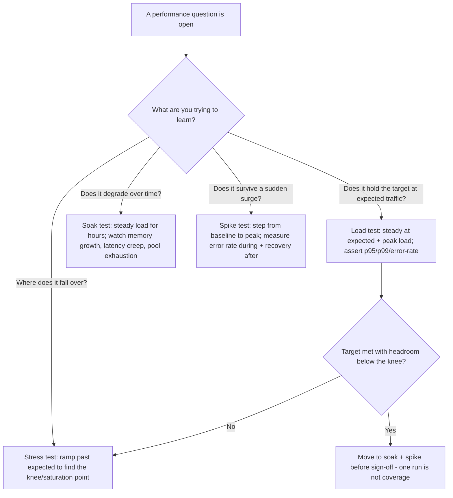
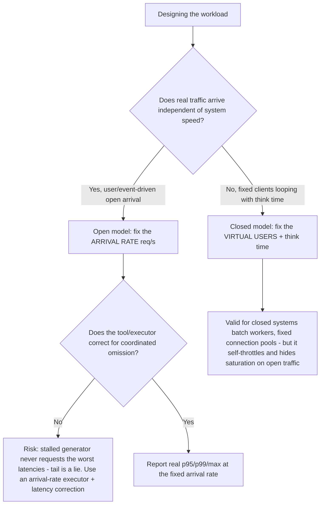
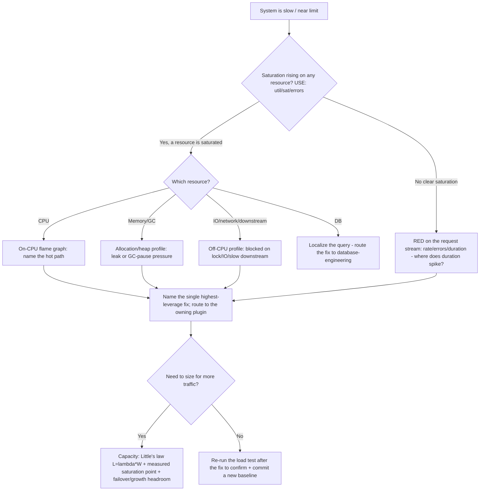
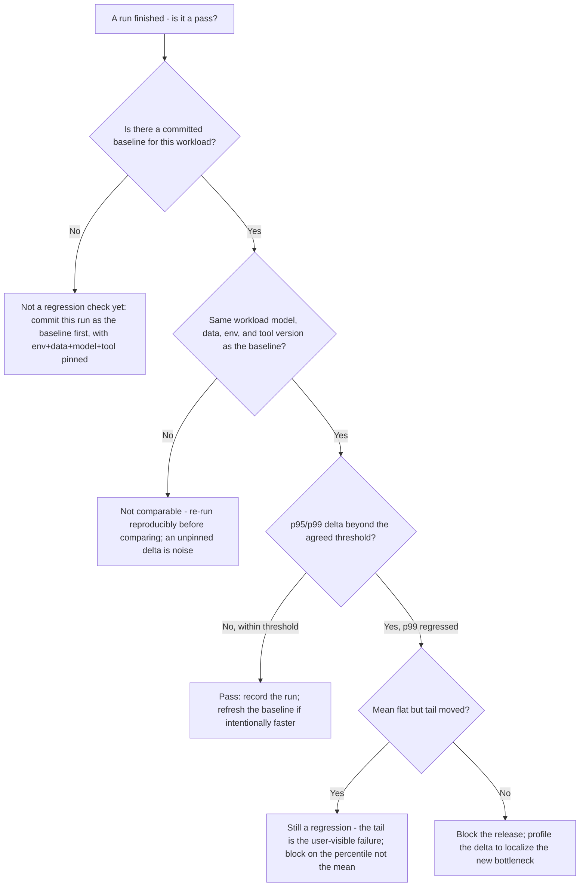
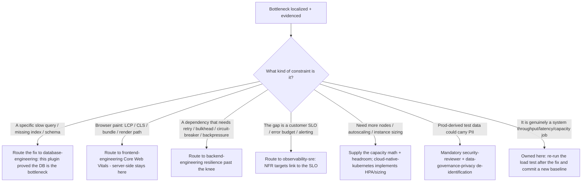

# Performance Engineering — Decision Trees

_Decision trees + a dated capability map. Capability rows are `[verify-at-build]` — re-check against the tool/project before quoting. Last reviewed: 2026-06-08._

Traverse before designing a performance test, choosing a workload model, or chasing a bottleneck.

## Decision Tree: Which performance test type answers the question?

The test type is chosen by the open question, not by habit. One run is not a performance test.

_Load proves the target, stress finds the knee, soak finds the leak, spike proves elasticity. Cover all four before a performance sign-off._

## Decision Tree: Open or closed workload model?

The model is a first-class choice; the two diverge sharply under saturation and answer different questions.

_Prefer an open arrival-rate model for user-facing traffic — a closed model throttles itself and hides the failure. Always name whether coordinated omission is corrected._

## Decision Tree: Triaging a bottleneck (USE/RED → profile → capacity)

Measure before you optimize. USE walks resources, RED watches requests; the flame graph names the hot path.

_Profile first — the first bottleneck is almost never where you guessed. Saturation (a growing queue), not utilization, is the danger signal._

## Decision Tree: Is this result a real regression — and does it gate the release?

A latency number means nothing without a committed baseline and a threshold. "Feels slower" is not a finding; a p99 delta past the gate is.

_A regression needs a committed baseline plus a percentile threshold; compare like-for-like or not at all. A p99 delta is real even when the mean is flat — gate on the tail._

## Decision Tree: The bottleneck is localized — who owns the fix?

This layer proves and localizes the constraint; it does not fix it in place. Name the constraint, then route the fix to the plugin that owns that craft.

_Prove the number; let the owner move it. Tuning the query, rewriting the front-end, or designing the retry policy here drifts the domain boundary and skips the owning team's review._

---

## Capability map (2026, `[verify-at-build]`)

| Layer | Options | Notes |
|---|---|---|
| Load testing (scripted) | k6 (JS, open + closed executors), Gatling (Scala/Java DSL), Locust (Python) | k6 has first-class arrival-rate executors that correct coordinated omission `[verify-at-build]` |
| Load testing (GUI/protocol-heavy) | Apache JMeter, Gatling | JMeter is closed-model by default; mind coordinated omission on open traffic `[verify-at-build]` |
| CPU profiling (JVM) | async-profiler, JFR (Java Flight Recorder) | async-profiler does on- and off-CPU + allocation flame graphs `[verify-at-build]` |
| CPU profiling (Go) | `pprof` (built-in) | CPU, heap, block, mutex profiles → flame graphs `[verify-at-build]` |
| CPU profiling (native/Linux-wide) | `perf`, eBPF (bcc/bpftrace), `flamegraph` (Brendan Gregg) | System-wide + off-CPU; eBPF for low-overhead production profiling `[verify-at-build]` |
| Continuous/production profiling | Parca, Pyroscope (Grafana), Datadog/other APM profilers | Always-on flame graphs in prod; lower overhead than dev profilers `[verify-at-build]` |
| Memory/leak detection | heap profilers (lang-specific), valgrind/massif (native) | Soak-test pairing: watch RSS/heap growth over hours `[verify-at-build]` |
| Tracing / RED metrics | OpenTelemetry, APM (request rate/errors/duration) | RED method source; localizes duration spikes per service `[verify-at-build]` |

_Method references: **USE** (Brendan Gregg) — for every resource, check Utilization / Saturation / Errors. **RED** (Tom Wilkie) — for every request stream, track Rate / Errors / Duration. **Little's law** — `L = λ·W` (concurrency = arrival rate × mean service time), the basis for capacity from a measured saturation point. **Coordinated omission** (Gil Tene) — a load generator that stalls waiting on a slow response never requests the worst-case latencies, so they go unrecorded and the reported tail is optimistic. Re-verify any tool/version specific before quoting it to a consumer._
