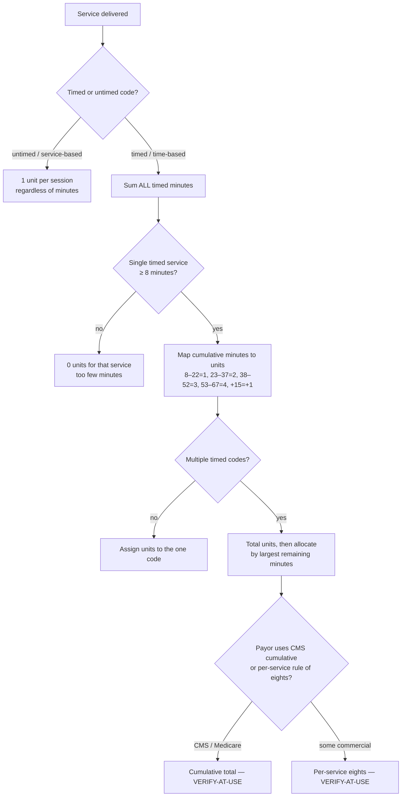
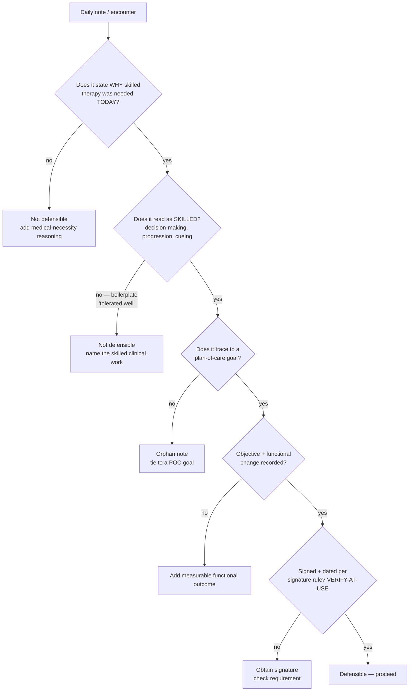
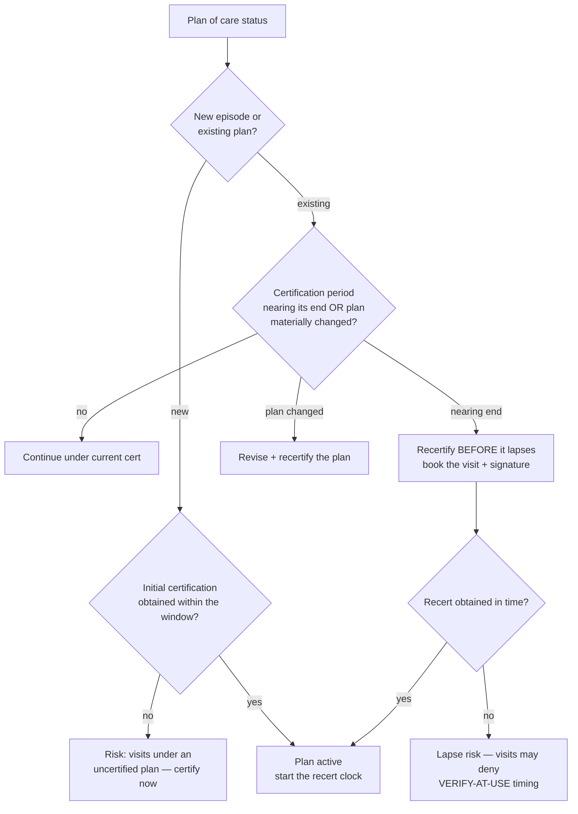
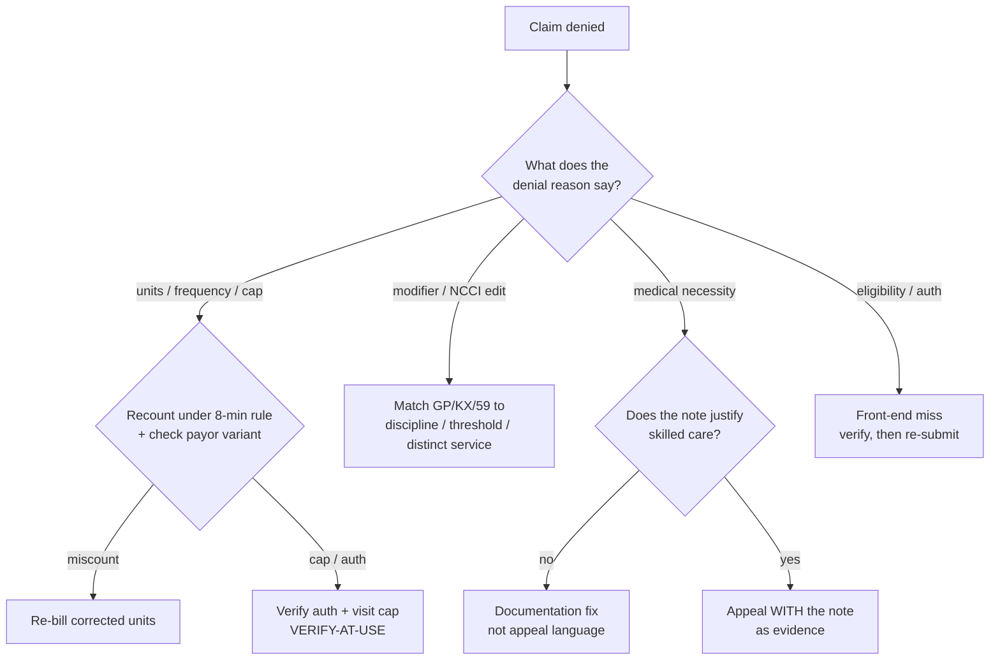

# Outpatient PT / Rehab Clinic — Decision Trees

> Reference decision trees for the `physical-therapy-rehab-clinic` team. Agents **traverse the relevant tree top-to-bottom before deciding** (the proactive complement to the Capability Grounding Protocol). Each `## Decision Tree` section is a Mermaid graph plus the rule it encodes.
>
> **Advisory only — not medical, legal, or billing advice.** Every regulatory / payor specific (the 8-minute-rule variant, the therapy threshold, certification windows, denial codes) is **`[verify-at-use]`** against the current payor/CMS source. Dated figures live in [`pt-clinic-reference-2026.md`](pt-clinic-reference-2026.md). No patient PII.
>
> _Last reviewed: 2026-06-22 by `claude`. Principles are durable; specific dollar figures and payor rules are volatile — re-verify before quoting._

---

## Decision Tree: 8-minute-rule unit calculation

**Rule:** untimed = 1 unit/session; timed = 15-minute units under the 8-minute rule (≥8 min for the first unit, cumulative-minute brackets thereafter). Mixed timed codes are totaled then allocated. **The payor's variant (CMS cumulative vs per-service) decides edge cases — `[verify-at-use]`.** Brackets are the standard CMS pattern; confirm the current bracket and variant against the payor.

---

## Decision Tree: documentation defensibility / medical necessity

**Rule:** a defensible note establishes medical necessity *this visit*, reads as skilled (not boilerplate), traces to a POC goal, records objective functional change, and is signed per the applicable rule. **Signature/content rules are `[verify-at-use]`.** Defensible notes beat appeals.

---

## Decision Tree: plan certification vs recertification timing

**Rule:** certify the new plan within its required window; track the recertification clock and recertify *before* it lapses or when the plan changes materially. **Certification windows and recert timing are `[verify-at-use]`** (payor / CMS, change annually). Operations owns the re-book; compliance owns the deadline.

---

## Decision Tree: denial triage

**Rule:** map the denial reason to its root cause — units (8-minute-rule variant / cap), modifier/NCCI, medical necessity (a documentation fix, not appeal prose), or eligibility/auth (a front-end miss). **Denial codes and appeal windows are `[verify-at-use]` per payor.** Prevent at the front end; appeal with the documentation that already exists.

---

## See also

- [`pt-clinic-reference-2026.md`](pt-clinic-reference-2026.md) — dated reference (timed-vs-untimed CPT, KX/threshold concept, common payor rules); every figure carries a source placeholder + retrieval date + verify-at-use.
- Skills: [`../skills/therapy-billing-and-units/SKILL.md`](../skills/therapy-billing-and-units/SKILL.md), [`../skills/defensible-documentation/SKILL.md`](../skills/defensible-documentation/SKILL.md), [`../skills/plan-of-care-management/SKILL.md`](../skills/plan-of-care-management/SKILL.md), [`../skills/denial-prevention-and-appeals/SKILL.md`](../skills/denial-prevention-and-appeals/SKILL.md), [`../skills/schedule-and-capacity-planning/SKILL.md`](../skills/schedule-and-capacity-planning/SKILL.md).
