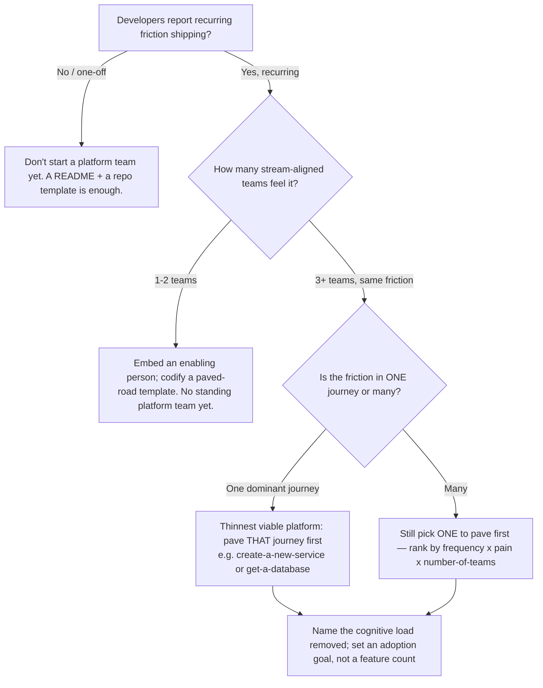
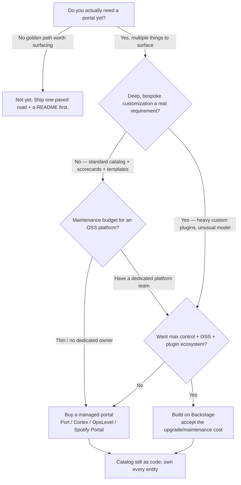
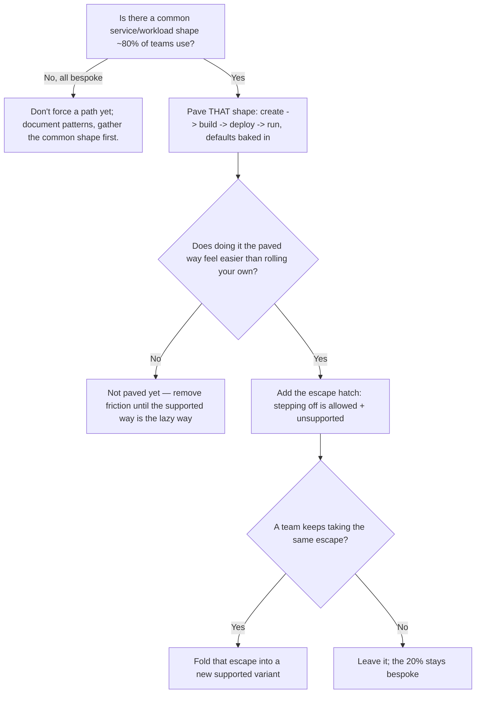
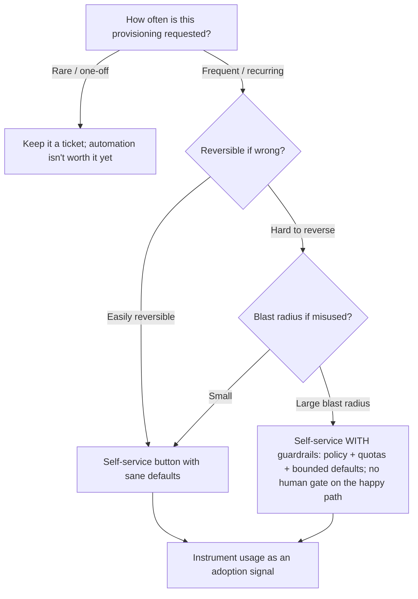
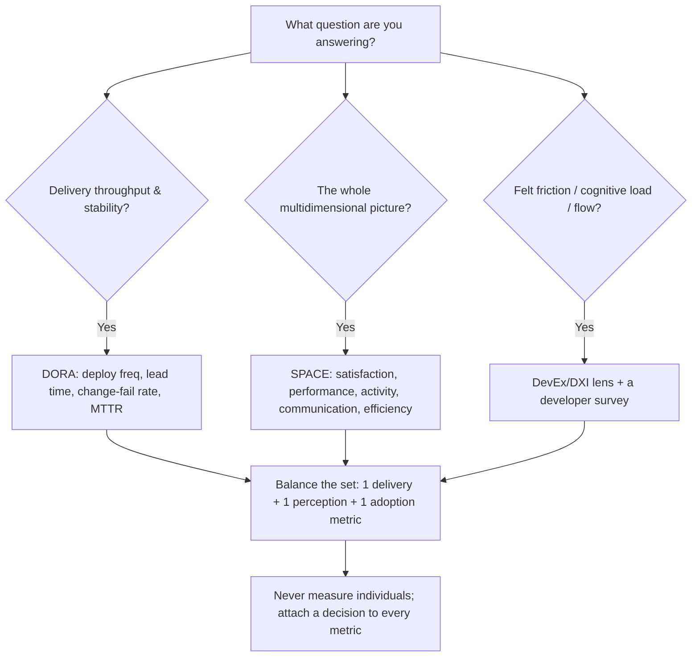

# Platform Engineering & IDP — Decision Trees + 2026 Capability Map

> Canonical knowledge bank for `platform-engineering-idp`. **Traverse the relevant Mermaid tree
> top-to-bottom before choosing** — the proactive complement to the Capability Grounding Protocol.
> Volatile product/version facts in the capability map carry a retrieval date and a re-verify-at-use
> rider.

---

## Decision Tree: Should you start a platform team / what should it own first

**Leaf rule:** below ~3 teams sharing the same friction, a paved-road repo template beats a standing
platform team. The first thing a real platform team owns is the single highest-frequency × highest-
pain developer journey — not a portal.

---

## Decision Tree: Buy-vs-build the IDP / portal

**Leaf rule:** buy/adopt before you build; build before you framework. Backstage's power is real and
so is its maintenance cost — choose it for genuine customization + a team to maintain it, not for
prestige. Either way the catalog lives **as code in the repo it describes**.

---

## Decision Tree: Golden-path scoping (what to pave, and the escape hatch)

**Leaf rule:** pave the 80% path, make the supported way the easiest way, and keep an escape hatch.
A path with no exit becomes a shadow platform. A recurring escape is a signal to pave a new variant.

---

## Decision Tree: The self-service boundary (button vs ticket)

**Leaf rule:** make it self-service when it's frequent; guardrail (policy/quotas/defaults) rather than
human-gate when blast radius is large. A "self-service" form that opens a ticket for the common case
is a service desk in disguise. Choose the mechanism — Crossplane composition vs Score spec vs portal-
fronted Terraform module — by who owns the control plane and how k8s-native the estate is.

---

## Decision Tree: Which DevEx metric framework

**Leaf rule:** use DORA for delivery, SPACE for breadth, DevEx/DXI for felt friction — and always
ship a *balanced* set (a delivery metric + a perception metric + an adoption metric) so no single
proxy gets gamed. Measure the system, never the individual; every metric must inform a decision.

---

## Platform maturity staging (the ladder)

| Stage | What it looks like | Move to the next stage by… |
|---|---|---|
| **1. Ad-hoc** | Every team builds + deploys its own way; tribal knowledge; tickets for infra. | Documenting the common shape; shipping one paved-road template. |
| **2. Paved road** | A supported template exists; some teams use it; still manual infra. | Making the supported way the *easiest* way; adding the escape hatch. |
| **3. Self-service** | Common infra is a button with guardrails; no ticket for the common case. | Surfacing it in a portal/catalog; instrumenting adoption. |
| **4. Platform-as-product** | Portal + catalog + golden paths; adoption measured; platform has a roadmap & users. | Continuous DevEx measurement; retiring features nobody adopts. |

---

## 2026 capability map — IDP / portal landscape (dated, re-verify at use)

_Retrieved 2026-06-08. Product positioning and pricing are volatile — re-confirm at use; this is
orientation, not a procurement recommendation._

| Category | Options (2026) | Notes |
|---|---|---|
| **OSS portal framework** | **Backstage** (CNCF, Spotify-origin) — dominant (~89% IDP-portal share, 270+ public adopters). | Maximum control + plugin ecosystem; real upgrade/maintenance cost. Needs a team to own it. |
| **Managed portals** | **Port**, **Cortex**, **OpsLevel**, **Spotify Portal** (managed Backstage), **Roadie** (managed Backstage). | Faster time-to-value, less bespoke; good when customization is standard and maintenance budget is thin. |
| **Self-service infra control plane** | **Crossplane** (k8s-native control plane, compositions), **Score** (workload spec decoupled from platform), **Terraform/OpenTofu modules** fronted by a portal/template, **Kratix** (promises). | Choose by how k8s-native the estate is and who owns the control plane. |
| **Policy / guardrails** | **OPA/Gatekeeper**, **Kyverno**, **Conftest**. | Make self-service buttons safe without a human gate on the happy path. |
| **DevEx measurement** | **DORA** (Google/DORA), **SPACE** framework, **DevEx/DXI** (DX, GetDX), homegrown survey + telemetry. | Pair system metrics with a survey; never measure individuals. |
| **Team model** | **Team Topologies** (platform group, enabling teams, stream-aligned teams). | The platform team's job is reducing others' cognitive load. |

> Provenance: CNCF/Backstage adoption + Gartner platform-team forecast and the DORA/SPACE/DevEx
> literature, retrieved 2026-06-08; see `docs/research/2026-06-08-twenty-candidate-plugins/sources.md`.
> Shares, adopter counts, and product names are volatile — re-verify at use. No invented products.

---

## See also

- [`../CLAUDE.md`](../CLAUDE.md) — team constitution & seams.
- [`../best-practices/README.md`](../best-practices/README.md) — the named, citable rules.
- Neighbour decision trees: `devops-cicd`, `cloud-native-kubernetes`, `terraform-iac`,
  `observability-sre`.

_Last reviewed: 2026-06-08 by `claude`._
