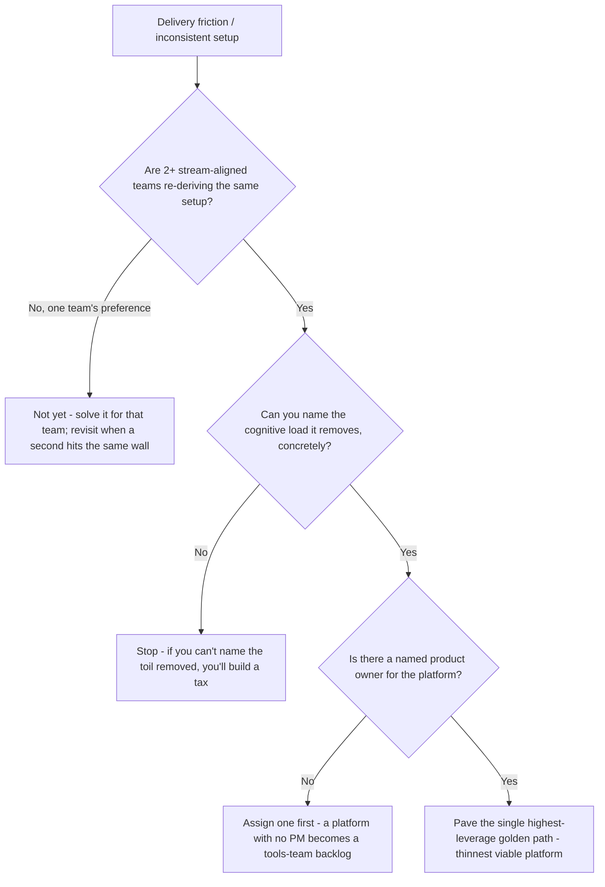
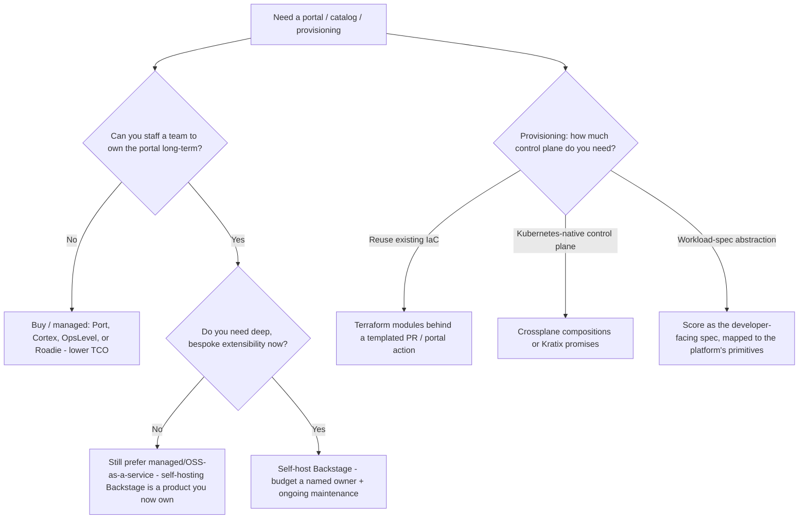
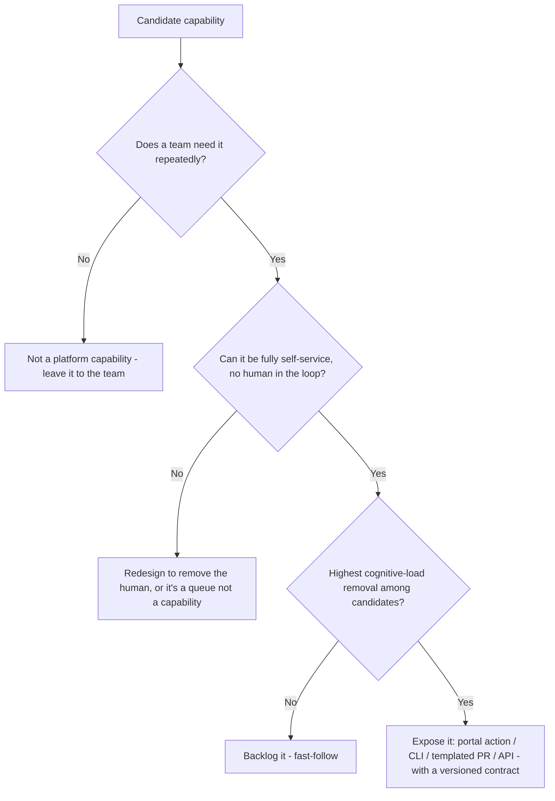

# Platform Engineering — Decision Trees

_Decision trees + a dated capability map. Capability rows are `[verify-at-build]` — re-check against the vendor/project before quoting. Last reviewed: 2026-06-08._

Traverse before standing up a platform, choosing a portal, or paving a path.

## Decision Tree: Should we build an internal platform at all (yet)?

A platform is justified by repeated, shared cognitive load — not by ambition.



_The platform exists to reduce cognitive load on consuming teams (Team Topologies). If you can't name the load removed, don't build it._

## Decision Tree: Build or buy the developer portal + provisioning?

Buy the undifferentiated; build only the thin glue that encodes your opinions.



_Name the total cost of ownership of every "we'll just self-host it" before recommending it._

## Decision Tree: Paved road, guardrail, or gate?

Make the right thing the easy thing; reserve hard gates for the genuinely irreversible.

```mermaid
graph TD
  A[A requirement the platform wants enforced] --> B{Can the compliant choice be the DEFAULT on the paved road?}
  B -- Yes --> C[Guardrail-as-default: bake it into the template/module; opting out is the deliberate hard path]
  B -- No, but detectable --> D[Policy-as-code check: OPA/Conftest/Kyverno flags off-road usage; advisory first]
  D --> E{Is the risk irreversible / high-blast (prod data, security, spend)?}
  E -- No --> F[Keep advisory - warn, don't block; preserve the path of least resistance]
  E -- Yes --> G[Promote to a blocking gate - the rare case where leaving the road is forbidden]
  B -- No, undetectable --> H[Reconsider: an unenforceable requirement is a wish; redesign the path or the requirement]
```

_Guardrails-as-defaults beat guardrails-as-gates. A gate everywhere is a mandate, which breeds shadow infrastructure._

## Decision Tree: What should the platform's API expose first?

The platform API is the set of self-service capabilities; expose the highest-leverage, fully-self-service ones first.



---

## Capability map (2026, `[verify-at-build]`)

| Layer | Options | Notes |
|---|---|---|
| Developer portal (build) | Backstage (CNCF) | Framework, not a product — self-hosting is a team you staff `[verify-at-build]` |
| Developer portal (buy/managed) | Port, Cortex, OpsLevel, Roadie (managed Backstage) | Lower TCO for orgs that can't own a portal `[verify-at-build]` |
| Software catalog | Backstage catalog (`catalog-info.yaml`), portal-native catalogs | Prefer auto-discovery/ingestion over hand-maintained entities `[verify-at-build]` |
| Scaffolder / templates | Backstage Software Templates, portal-native scaffolders, `cookiecutter`/`copier` behind a PR | The template registers the service in the catalog + wires CI/docs `[verify-at-build]` |
| Provisioning / control plane | Terraform modules, Crossplane, Kratix | Crossplane/Kratix for a K8s-native control plane; Terraform modules for reuse `[verify-at-build]` |
| Workload spec | Score | Developer-facing workload spec mapped to platform primitives `[verify-at-build]` |
| Policy-as-code | OPA/Conftest, Kyverno, Gatekeeper | The off-road check behind guardrails-as-defaults `[verify-at-build]` |
| Outcome metrics | DORA (the four keys), DevEx / SPACE frameworks | Pair throughput (DORA) with an experience signal (DevEx/SPACE) `[verify-at-build]` |

_Operating-model reference: Team Topologies (stream-aligned / platform / enabling / complicated-subsystem teams; X-as-a-Service / facilitating / collaboration interaction modes). The DORA four keys: deployment frequency, lead time for changes, change-failure rate, time-to-restore. Re-verify any product/framework specific before quoting it to a consumer._
