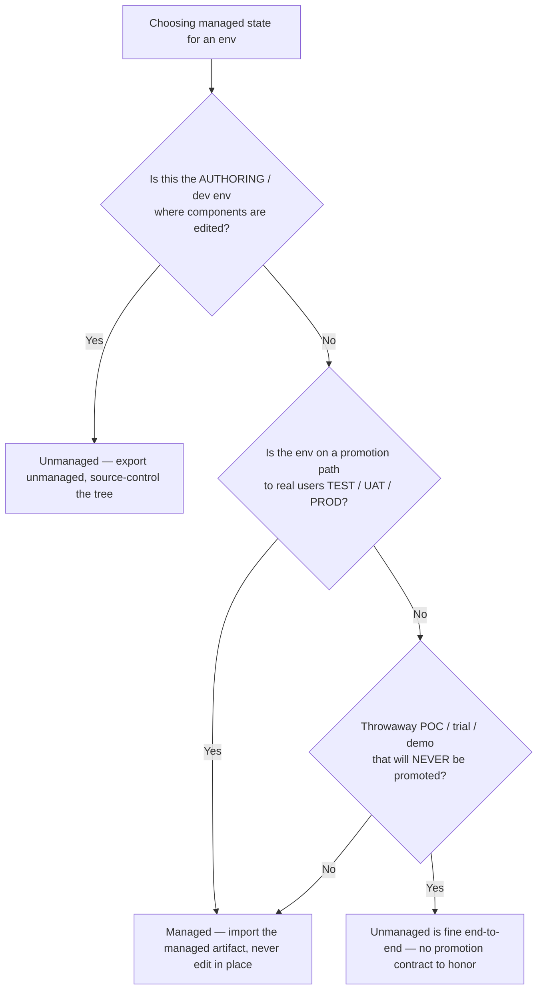
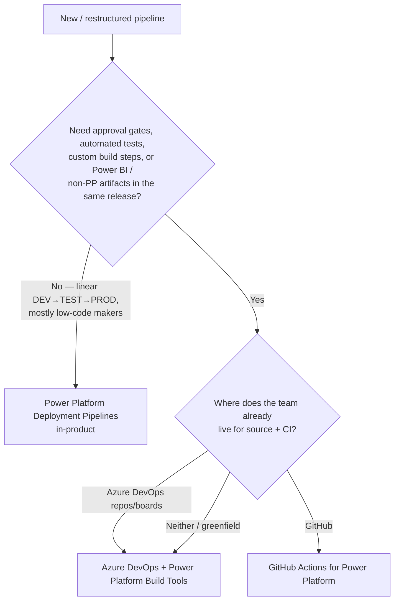
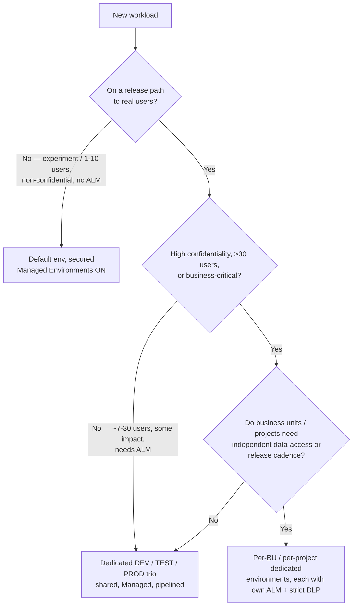
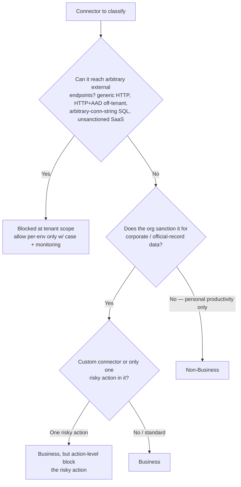
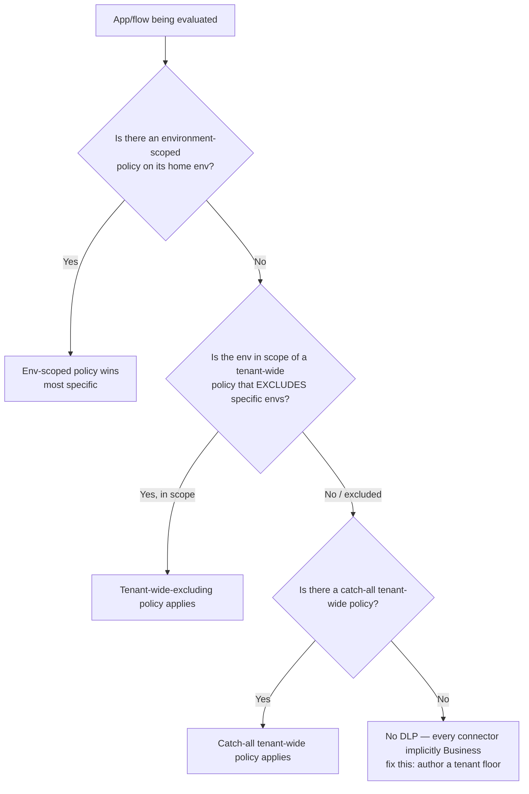
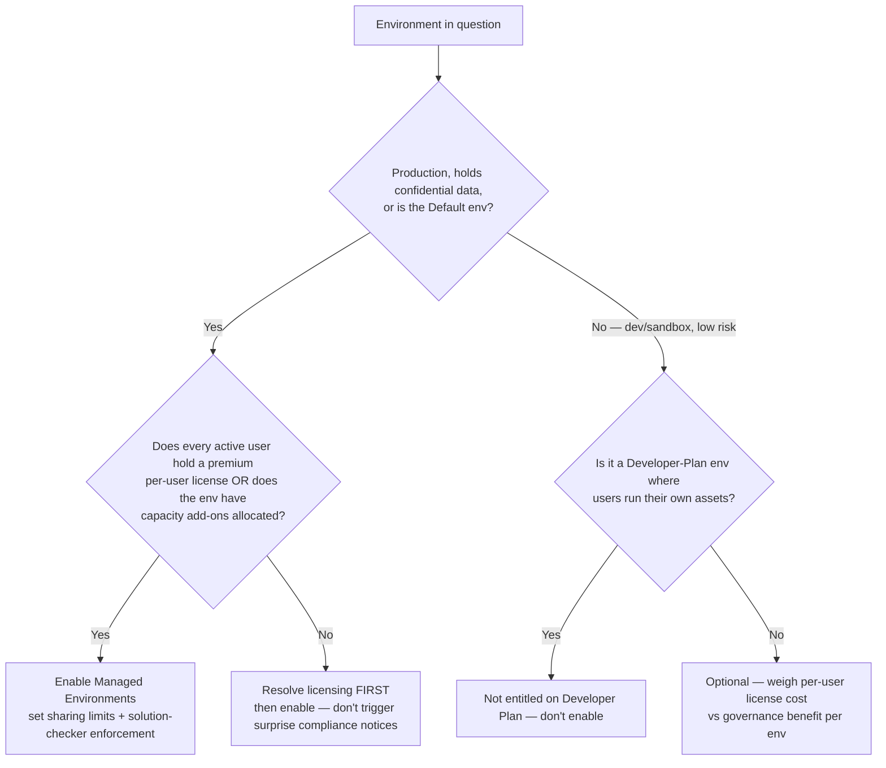

# ALM & Governance decision trees — Power Platform

**Last reviewed:** 2026-05-30 · **Confidence:** high (grounded in first-party Microsoft Learn — `pac` reference, Managed Environments licensing FAQ, pipelines FAQ, environment-strategy guidance — plus the plugin's own skills/knowledge). Power Platform governance and licensing ship continuously — re-verify any leaf older than 90 days on the Researcher sweep.
**Owners:** `solution-alm-engineer` (ALM trees) and `power-platform-admin` (governance trees).

This file collects the canonical **ALM + governance** decision trees for the `power-platform` plugin. Each follows the marketplace decision-tree convention ([`../../../docs/best-practices/decision-trees-in-knowledge-files.md`](../../../docs/best-practices/decision-trees-in-knowledge-files.md)): an observable entry condition, a `Last verified:` date, a Mermaid graph, per-leaf rationale, and a tradeoffs table for any tree with ≥3 leaves.

**Decision-tree traversal (priors).** When the user's situation matches a tree's "When this applies," traverse that tree top-to-bottom **before** selecting a method. Do not pattern-match on keywords. The first branch where the condition resolves cleanly is the leaf to apply. These trees encode *priors*, not licensing guarantees — confirm any license/capacity-gated leaf against the current entitlement before acting (the `Licensing impact:` discipline in [`../CLAUDE.md`](../CLAUDE.md) §6).

---

## Decision Tree: Solution mechanics — managed or unmanaged for THIS environment?

**When this applies:** You are about to export or import a solution and must choose its managed state for a specific target environment — DEV, TEST/UAT, PROD, a throwaway sandbox, or a downstream env you're trying to "fix in place."

**Last verified:** 2026-05-30 against `pac solution export --managed` (Microsoft Learn `pac solution` reference) + the plugin's `managed-vs-unmanaged-solution-discipline` best-practice.

**Rationale per leaf:**
- *Unmanaged (dev)* — the authoring env is the single home for editable (unmanaged) components; this is what you `pac solution unpack` and commit.
- *Managed (test/uat/prod)* — managed state keeps downstream editable-free; editing a managed component there creates an invisible **active unmanaged layer** that shadows future fixes ("why didn't my fix flow through").
- *Either (throwaway)* — a POC/trial/demo with no promotion path has no managed-import contract to protect; unmanaged end-to-end is simplest.

**Tradeoffs summary:**

| Leaf | Future edits flow through? | Active-layer trap risk | Reversible? | Use when |
|---|---|---|---|---|
| Unmanaged (dev) | n/a — this *is* the source | n/a | yes — it's the editable home | authoring environment only |
| Managed (downstream) | yes, via the next import | high if anyone edits in place | upgrade replaces cleanly | anything on a promotion path |
| Either (throwaway) | doesn't matter | n/a | dispose the env | POC/trial/demo, never promoted |

Full rule: [`../best-practices/managed-vs-unmanaged-solution-discipline.md`](../best-practices/managed-vs-unmanaged-solution-discipline.md).

---

## Decision Tree: ALM tooling — Power Platform Pipelines vs Azure DevOps vs GitHub Actions

**When this applies:** You're standing up (or restructuring) the promotion pipeline for a solution and must choose the orchestration tool — before anyone exports a `.zip`.

**Last verified:** 2026-05-30 against the `alm-pipeline-design` skill's pipeline-architecture tree + Microsoft Learn pipelines FAQ.

**Rationale per leaf:**
- *Power Platform Deployment Pipelines* — lowest-config, GUI-driven, structurally enforces same-artifact + sequential stages; ideal for low-code shops with a linear path and no custom gates.
- *Azure DevOps + Build Tools* — full pipeline-as-code with custom approval gates, gated tests, multi-solution and Power BI coordination; the default when you outgrow the linear shape.
- *GitHub Actions for Power Platform* — same capability as ADO Build Tools, GitHub-native; pick it when the team already lives in GitHub.

**Tradeoffs summary:**

| Tool | Setup cost | Custom gates / tests | Power BI + non-PP artifacts | Best for |
|---|---|---|---|---|
| Deployment Pipelines | lowest | no (linear only) | no | low-code shops, 2–3 envs, no custom gates |
| Azure DevOps + Build Tools | higher | yes | yes | dev-culture shops, approvals, multi-solution releases |
| GitHub Actions | higher | yes | yes | teams already on GitHub |

Rule of thumb: **Deployment Pipelines if you can; custom ADO/GitHub when you can't.** Full playbook + ADO YAML skeleton: [`../skills/alm-pipeline-design/SKILL.md`](../skills/alm-pipeline-design/SKILL.md).

---

## Decision Tree: Environment topology — single, multi-stage, or per-project?

**When this applies:** You're designing how many environments a workload (or a tenant) needs, and how to carve them — observable drivers are number of users, data confidentiality, monetary/reputational impact, and ALM need.

**Last verified:** 2026-05-30 against [`managed-environments-and-governance-2026.md`](managed-environments-and-governance-2026.md) (Microsoft Learn environment-strategy guidance).

**Rationale per leaf:**
- *Default (secured)* — experimentation only; no promotion contract, so one secured Default env suffices (never for real production work).
- *Dedicated DEV/TEST/PROD trio* — the environment is the promotion boundary; any release-path workload needs the three-stage separation.
- *Per-BU / per-project dedicated* — when data-access boundaries or release cadences differ across units, isolate them into their own environment + ALM so a change to one can't break or expose another.

**Tradeoffs summary:**

| Topology | Isolation | Admin overhead | ALM story | Use when |
|---|---|---|---|---|
| Default (secured) | none | lowest | none | experimentation, ≤10 users, non-confidential |
| DEV/TEST/PROD trio | per stage | moderate | full pipeline | release-path workload, moderate impact |
| Per-BU / per-project | per unit + per stage | highest | per-unit pipelines | divergent data-access or cadence, critical/confidential |

Full tier model: [`../best-practices/gov-environment-strategy-and-isolation.md`](../best-practices/gov-environment-strategy-and-isolation.md) and the tier tree in [`managed-environments-and-governance-2026.md`](managed-environments-and-governance-2026.md).

---

## Decision Tree: DLP — classifying a connector (Business / Non-Business / Blocked)

**When this applies:** A connector needs a DLP classification — a maker requested it, a custom connector was added, or you're authoring the tenant policy and must place a connector in exactly one bucket.

**Last verified:** 2026-05-30 against the `dlp-policy-design` skill (grounded in Microsoft Learn DLP docs).

**Rationale per leaf:**
- *Blocked* — generic HTTP and arbitrary-endpoint connectors are the highest blast radius (they can call anything); default-deny them at tenant scope, open per-env only with justification + monitoring.
- *Business (action-level block)* — when only one action is dangerous, keep the connector Business and block that single action rather than losing the whole connector.
- *Business* — sanctioned corporate-data connectors (Dataverse, sanctioned SharePoint, Outlook 365, Teams, approved LOB custom connectors).
- *Non-Business* — personal-productivity connectors that must never carry corporate data (Twitter/X, RSS, weather, personal OneDrive). **requires:** remember Business and Non-Business connectors cannot coexist in one app/flow — that isolation is the data boundary.

**Tradeoffs summary:**

| Bucket | Data can flow with Business? | Blast radius | Reversible? | Use when |
|---|---|---|---|---|
| Business | yes (with other Business) | scoped to sanctioned data | yes (re-classify) | sanctioned corporate-data connectors |
| Business + action block | yes, minus the blocked action | reduced | yes | connector needed but one action is risky |
| Non-Business | only with other Non-Business | personal-data only | yes | personal productivity, never corporate data |
| Blocked | no — cannot be used | none (can't run) | yes (exempt per-env) | arbitrary-endpoint / unsanctioned connectors |

Custom connectors are each their own DLP object; classify deliberately. Full playbook (precedence, exemptions, comms/rollback): [`../skills/dlp-policy-design/SKILL.md`](../skills/dlp-policy-design/SKILL.md); the rule: [`../best-practices/gov-dlp-policy-default-deny.md`](../best-practices/gov-dlp-policy-default-deny.md).

---

## Decision Tree: DLP precedence — which policy governs THIS app/flow?

**When this applies:** A flow/app is being evaluated against DLP and you need to predict which policy actually governs it — typically while diagnosing "why did my flow get suspended" or "why is this connector allowed here but not there."

**Last verified:** 2026-05-30 against the `dlp-policy-design` skill's policy-evaluation order.

**Rationale per leaf:**
- *Env-scoped wins* — the most specific policy beats broader ones; use env-scoped policies to *loosen* sanctioned dev envs or *tighten* sensitive prod envs over the tenant floor.
- *Tenant-wide-excluding / catch-all* — the broader policies apply only when no more-specific policy claims the env.
- *No DLP* — the dangerous default: nothing classified means every connector is implicitly Business and any maker can connect anything. Author a strict tenant floor first.

**Tradeoffs summary:**

| Governing policy | Specificity | Typical use | Risk if misused |
|---|---|---|---|
| Env-scoped | highest | loosen dev / tighten sensitive prod | a per-env hole more permissive than intended |
| Tenant-wide (excluding) | middle | tenant floor minus carved-out envs | forgetting an env is excluded |
| Catch-all tenant-wide | lowest | the floor everyone hits | too loose if it's the only policy |
| No DLP | none | never acceptable for real data | open exfiltration surface |

Design tenant = strict floor, env-scoped = additive override (tighten more often than loosen). Full playbook: [`../skills/dlp-policy-design/SKILL.md`](../skills/dlp-policy-design/SKILL.md) §3.

---

## Decision Tree: Does THIS environment need Managed Environments turned on?

**When this applies:** Deciding whether to enable Managed Environments (Environment management) on a specific environment — weighing the proactive governance benefit against the premium-per-user licensing it obliges.

**Last verified:** 2026-05-30 against Microsoft Learn Managed Environments **licensing** FAQ (premium per-user requirement; March/June 2026 enforcement notifications; Developer-Plan exclusion) + [`managed-environments-and-governance-2026.md`](managed-environments-and-governance-2026.md).

**Rationale per leaf:**
- *Enable* — production, confidential, and the Default env get the proactive guardrails (sharing limits enforced *before* the over-share, weekly digest, solution-checker enforcement). **requires:** every active user holds a premium per-user license (Power Apps Premium / Power Automate Premium / Dynamics 365 Enterprise) **or** the env has capacity add-ons.
- *Resolve licensing first* — enabling without the entitlement triggers admin compliance notifications (March 2026) and end-user in-app notices (June 2026); fix entitlement before flipping it on.
- *Not entitled (Developer Plan)* — Managed Environments is **not** an entitlement on the Developer Plan when users run their assets; don't promise the feature there.
- *Optional (weigh)* — for lower-risk dev/sandbox envs, the proactive controls may not justify the per-user license cost; decide per env.

**Tradeoffs summary:**

| Leaf | Governance gain | Licensing obligation | When |
|---|---|---|---|
| Enable | sharing limits, digest, checker enforcement, IP firewall | premium per-user for all active users (or capacity add-ons) | prod / confidential / Default, entitlement in place |
| Resolve licensing first | same, deferred | must secure entitlement before enabling | prod-worthy env without licenses yet |
| Not entitled (Dev Plan) | n/a | n/a — feature unavailable | Developer-Plan asset-running env |
| Optional (weigh) | proactive controls | per-user license cost | low-risk dev/sandbox |

Full rule + feature table: [`../best-practices/gov-managed-environments-and-sharing-limits.md`](../best-practices/gov-managed-environments-and-sharing-limits.md) and [`managed-environments-and-governance-2026.md`](managed-environments-and-governance-2026.md).

---

## Sources (retrieved 2026-05-30)

- `pac solution` / `pac admin` reference — [Microsoft Learn pac CLI](https://learn.microsoft.com/power-platform/developer/cli/reference/) (verbs, flags, env types: Trial/Sandbox/Production/Developer/Teams/SubscriptionBasedTrial).
- Managed Environments **licensing** — [Managed Environments licensing FAQ](https://learn.microsoft.com/power-platform/admin/managed-environment-licensing) (premium per-user requirement; March/June 2026 enforcement notifications; Developer-Plan exclusion; 30-day trial caveat).
- [Environment management overview](https://learn.microsoft.com/power-platform/admin/environment-management-overview) (Managed security + Managed governance pillars).
- Power Platform **Pipelines** FAQ — structural same-artifact + sequential-stage enforcement.
- Environment strategy guidance + the plugin's own [`managed-environments-and-governance-2026.md`](managed-environments-and-governance-2026.md), [`../skills/alm-pipeline-design/SKILL.md`](../skills/alm-pipeline-design/SKILL.md), [`../skills/dlp-policy-design/SKILL.md`](../skills/dlp-policy-design/SKILL.md).
