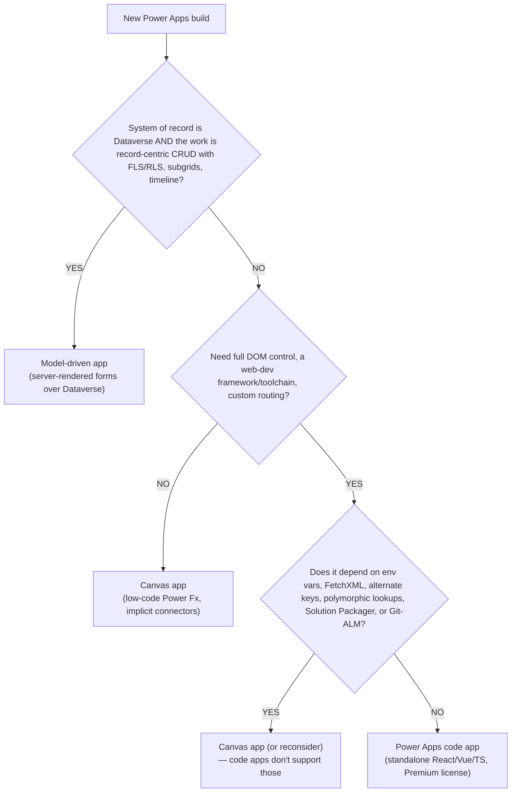
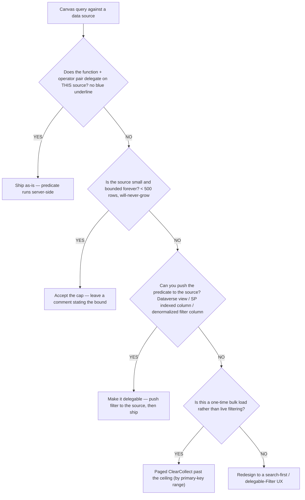
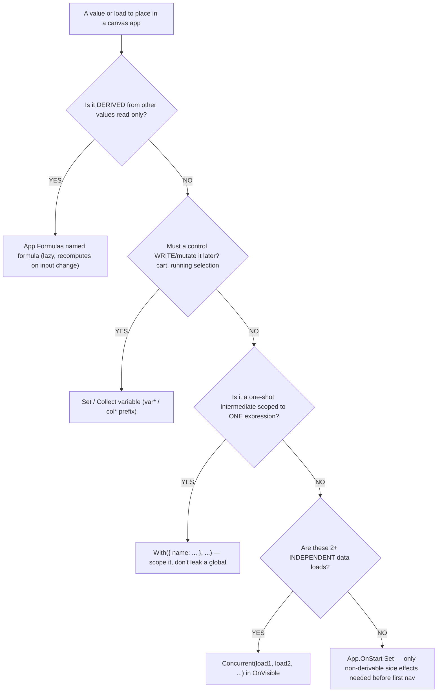

# Apps decision trees — canvas, model-driven, code apps, Power Fx, PCF

> Canonical decision trees for the **apps** domain cluster (canvas apps, model-driven apps, Power Fx, PCF controls, code apps). Follows the marketplace convention in [`../../../docs/best-practices/decision-trees-in-knowledge-files.md`](../../../docs/best-practices/decision-trees-in-knowledge-files.md): each tree names its entry condition in observable terms, carries a `Last verified:` date, a Mermaid flowchart, per-leaf rationale, and a tradeoffs table for trees with ≥3 leaves. **Traverse top-to-bottom before selecting a method — do NOT pattern-match on keywords in the user's situation description.**

The PCF-React-surface decision (virtual control vs code-app vs canvas control vs Power Pages vs web resource) lives in its own file — [`pcf-react-fluent-platform-libraries.md`](pcf-react-fluent-platform-libraries.md) `## Decision Tree: PCF — Which React surface?` — and is the canonical owner of that branch. The trees here cover app-type selection, data-access delegation, the UI-surface (PCF vs web resource vs canvas component vs Custom Page) choice, and the Power Fx state-mechanism choice.

---

## Decision Tree: App type — canvas vs model-driven vs code app

**When this applies:** you are starting a new Power Apps build (or re-platforming an existing one) and must pick the app *type* before any screen/form work. Observable triggers: "build an app for <process>", "should this be canvas or model-driven", "we need a custom React app on the platform". Not for choosing a UI control *inside* an app (that's the surface tree below).

**Last verified:** 2026-05-30 against the `canvas-app-performance` skill, the `ux-decision-guide`, and `power-apps-code-apps/resources/overview.md` shipped in this plugin.



**Rationale per leaf:**

- *Model-driven app* — record-centric Dataverse CRUD gets FLS/RLS, business rules, quick-views, subgrids, and the timeline for free, server-rendered, with no canvas control-count budget.
- *Canvas app* — the default for low-code, multi-source, pixel-controlled, or task-flow UX that doesn't need a full web framework.
- *Canvas app (or reconsider)* — a code app **cannot** use environment variables, FetchXML, alternate keys, polymorphic lookups, Solution Packager, or Git-based ALM; if any is required, the code-app branch is closed — fall back to canvas (or rethink the requirement).
- *Power Apps code app* — full DOM/framework control with platform auth + governance, chosen only when canvas can't deliver the UI *and* none of the unsupported features are needed. **requires:** environment **Enable code apps** toggled + `pac` CLI recent enough (overview cites `1.51.1+` — *verify before quoting*) + **Power Apps Premium** for end users.

**Tradeoffs summary:**

| App type | Build cost | Dataverse security (FLS/RLS) | Control/DOM model | ALM path | Use when |
|---|---|---|---|---|---|
| Model-driven | Low–Medium | Free, server-enforced | Server-rendered forms | Solution-packaged | Record-centric Dataverse CRUD |
| Canvas | Low | Manual in Power Fx | Power Fx control tree | Solution-packaged | Low-code, multi-source, task-flow, branded |
| Code app | High | App-level (no FetchXML/alt-keys) | Full page (React/Vue/TS) | Standard Git (no Solution Packager) | Full framework control, none of the unsupported features needed |

First branch that resolves cleanly wins; the tree front-loads the cheapest viable surface and closes the code-app branch on any unsupported-feature dependency.

---

## Decision Tree: Canvas data access — delegation-safe vs accept-the-cap

**When this applies:** you are writing or reviewing a canvas `Filter`/`LookUp`/`Search`/`Sort` against a connector and must decide whether the query is safe. Observable triggers: the blue "delegation" underline in Studio, a "query can't be delegated" warning, or a report that "the app shows the wrong/missing data" once a table grew past a few hundred rows.

**Last verified:** 2026-05-30 against `skills/canvas-app-performance/SKILL.md` §2 + `resources/delegation-cheatsheet.md` (per-source 2026 limits, tagged volatile upstream).



**Rationale per leaf:**

- *Ship as-is* — both function and operator are on the source's delegable list, so the server applies the predicate; no truncation risk.
- *Accept the cap* — a genuinely small, bounded source (config table, static list) can't exceed the limit; document the bound so nobody "fixes" a non-bug.
- *Make it delegable* — a Dataverse view, a SharePoint indexed column, or a denormalized filter column turns a non-delegable predicate into a delegable one — the durable fix.
- *Paged ClearCollect* — loading-then-operating-locally past the 500/2000 ceiling (collect by primary-key range) is accepted for one-time bulk loads, not live filtering.
- *Redesign to search-first* — when full-list browse forces a non-delegable shape, a search-first UX with a delegable `Filter` is usually faster *and* more usable than raising the cap.

**Tradeoffs summary:**

| Leaf | Effort | Risk of silent truncation | Durable? | Use when |
|---|---|---|---|---|
| Ship as-is | None | None | Yes | Function+operator delegate on the source |
| Accept the cap | None | None (bounded) | Yes, if bound holds | Small, will-never-grow source |
| Make it delegable | Medium | None after fix | Yes | You control the source schema/view |
| Paged ClearCollect | Medium | None for one-time load | N/A (load pattern) | One-time bulk load, then operate locally |
| Redesign UX | High | None | Yes | Full-list browse forces non-delegation |

Raising the limit to 2000 is **not** a leaf — it moves the cliff, it doesn't remove it.

---

## Decision Tree: App UI surface — PCF vs web resource vs canvas component vs Custom Page

**When this applies:** you need a custom UI element *inside* an app (not a whole new app) and must pick the cheapest surface that delivers it. Observable triggers: "build a custom control for <X>", "the form needs a control the built-ins don't have", "should this be a PCF". For *which React technology* a PCF/code-app uses, defer to the React-surface tree in [`pcf-react-fluent-platform-libraries.md`](pcf-react-fluent-platform-libraries.md).

**Last verified:** 2026-05-30 against `pcf-developer.md`, the `ux-decision-guide` ("Custom Page vs Web Resource", "built-in over custom PCF"), and constitution §3 #7 (lowest-tier mechanism).

```mermaid
flowchart TD
    START[Need a custom UI element inside an app] --> Q1{Can a built-in / modern Fluent no-code control do it?}
    Q1 -->|YES| BUILTIN["Built-in / modern control (no code)"]
    Q1 -->|NO| Q2{Is it a public / external-facing Power Pages site?}
    Q2 -->|YES| STDPCF["Standard (non-virtual) PCF or web template<br/>— React platform libraries NOT supported on Pages"]
    Q2 -->|NO| Q3{Interactive UI, reusable in-app, that a Custom Page / canvas component can build?}
    Q3 -->|YES| CUSTOMPAGE["Custom Page / canvas component"]
    Q3 -->|NO| Q4{Model-driven form logic JS can do (no novel rendering)?}
    Q4 -->|YES| WEBRES["JS web resource (TypeScript, source-controlled)"]
    Q4 -->|NO| PCF["PCF control<br/>(complex viz / specialized input / cross-app reuse)"]
```

**Rationale per leaf:**

- *Built-in / modern control* — cheapest and least maintenance; never reach past it when a no-code control themes itself and does the job.
- *Standard PCF / web template (Power Pages)* — React virtual controls & platform libraries are **not supported** on Power Pages; a standard (non-virtual) PCF or a web template is the mechanism. Picking a virtual control here fails late — that's why it's surfaced before the Custom Page branch.
- *Custom Page / canvas component* — covers ~70% of "we need a custom control" asks faster than a PCF; reusable in-app, full Power Fx + connectors.
- *JS web resource* — model-driven form-context logic (Web API calls, branching) that doesn't need novel rendering; keep it source-controlled TypeScript.
- *PCF control* — the residual leaf for complex visualizations (D3/charts), specialized inputs (signature, constrained rich-text, code editor), or one versioned control reused across many apps. **requires:** TypeScript build + manifest contract + solution-packaging; bundle <~2 MB (loads on every form render).

**Tradeoffs summary:**

| Surface | Build cost | Maintenance tax | Reusable across apps? | Use when |
|---|---|---|---|---|
| Built-in / modern control | None | None | N/A | A no-code control does it |
| Standard PCF / web template | Medium | Medium | Some | Public Power Pages site (platform libs unsupported) |
| Custom Page / canvas component | Low–Medium | Low | Yes (in-app) | Interactive UI a Custom Page can build |
| JS web resource | Medium | Medium | Per-form | MDA form logic JS can do |
| PCF control | High | High | Yes (versioned contract) | Complex viz / specialized input / cross-app reuse |

---

## Decision Tree: Power Fx state — named formula vs Set/OnStart vs With vs Concurrent

**When this applies:** you're deciding *where* a value lives in a canvas app — a derived value, a value to mutate, a one-shot scoped intermediate, or a set of independent data loads. Observable triggers: a monolithic `App.OnStart` delaying first paint, `Set()` scattered across control events, a delegation-breaking aggregate inside a row predicate, or sequential `ClearCollect` chains.

**Last verified:** 2026-05-30 against `power-fx-engineer.md` opinions and `skills/canvas-app-performance/SKILL.md` §3–§5.



**Rationale per leaf:**

- *Named formula* — derived, read-only state recomputes lazily only when inputs change, so it never bloats startup; the agent's stated top default over `Set` in `OnStart`.
- *Set/Collect variable* — anything a button must *write* (cart, selection) can't be a named formula (those are read-only); use `var*`/`col*` so scope reads without IntelliSense.
- *With()* — scope a computed scalar to one expression instead of leaking a global; also the canonical way to lift a delegation-breaking aggregate out of a row predicate.
- *Concurrent()* — 2+ independent loads run in parallel for ~1/Nth the wall-clock on a network-bound load; put them in `Screen.OnVisible`, not `OnStart`.
- *App.OnStart Set* — reserved for genuine non-derivable side effects that must exist before first navigation (`Set(varUser, User())`, `Set(varStartTime, Now())`); not bulk data loads.

**Tradeoffs summary:**

| Mechanism | Mutable? | Startup cost | Scope | Use when |
|---|---|---|---|---|
| Named formula (`App.Formulas`) | No (read-only) | None (lazy) | App-global, declarative | Derived value from other values |
| `Set` / `Collect` var | Yes | Per call | Global / screen-context | A control must write it |
| `With({...}, ...)` | No | None | One expression | One-shot scoped intermediate |
| `Concurrent(...)` | N/A (loads) | Parallel (cheap) | Wherever placed | 2+ independent loads |
| `App.OnStart` `Set` | Yes | Blocks splash | App-global | Non-derivable side effect before first nav |

First branch that resolves cleanly wins — derivation outranks mutation outranks scoping outranks parallel-load, with `OnStart` as the deliberate last resort.

---

## Citations / sources

- App-type + code-app limits: [`../skills/power-apps-code-apps/resources/overview.md`](../skills/power-apps-code-apps/resources/overview.md) (not-supported table, comparison matrix, prerequisites).
- Delegation: [`../skills/canvas-app-performance/SKILL.md`](../skills/canvas-app-performance/SKILL.md) §2 + [`../skills/canvas-app-performance/resources/delegation-cheatsheet.md`](../skills/canvas-app-performance/resources/delegation-cheatsheet.md) (per-source 2026 limits — volatile, re-verify before quoting).
- UI surface: [`../agents/pcf-developer.md`](../agents/pcf-developer.md), [`../skills/dataverse-web-resources/resources/ux-decision-guide.md`](../skills/dataverse-web-resources/resources/ux-decision-guide.md), Power Pages unsupported cross-checked against [`pcf-react-fluent-platform-libraries.md`](pcf-react-fluent-platform-libraries.md).
- Power Fx state: [`../agents/power-fx-engineer.md`](../agents/power-fx-engineer.md) opinions + [`../skills/canvas-app-performance/SKILL.md`](../skills/canvas-app-performance/SKILL.md) §3–§5.
- Decision-tree format convention: [`../../../docs/best-practices/decision-trees-in-knowledge-files.md`](../../../docs/best-practices/decision-trees-in-knowledge-files.md).
