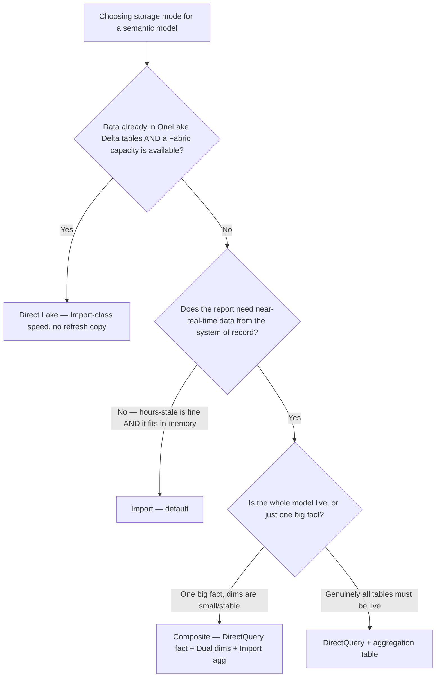
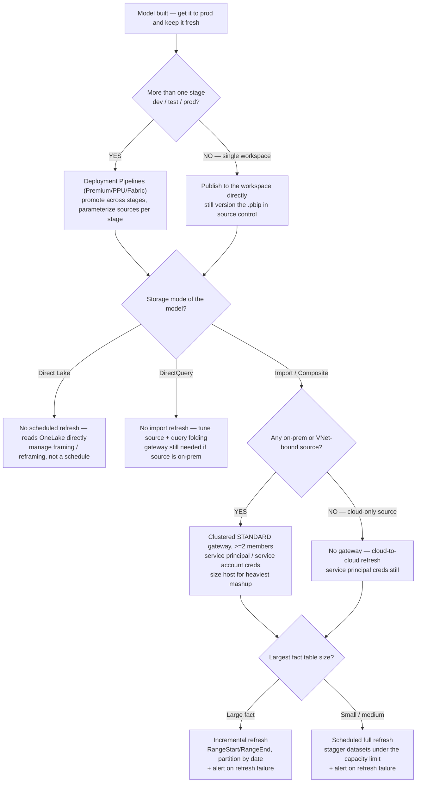
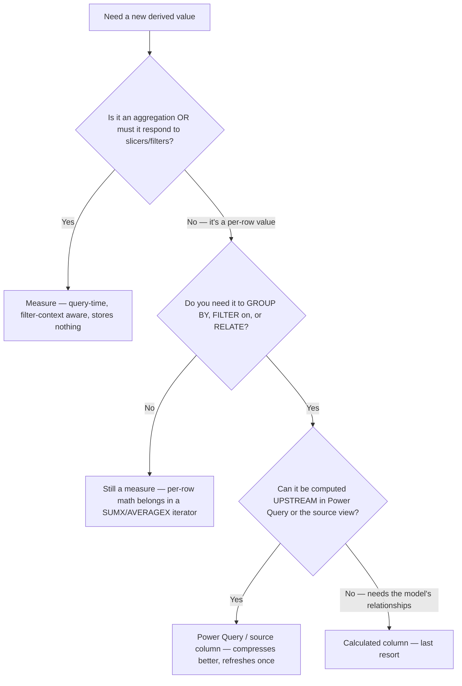
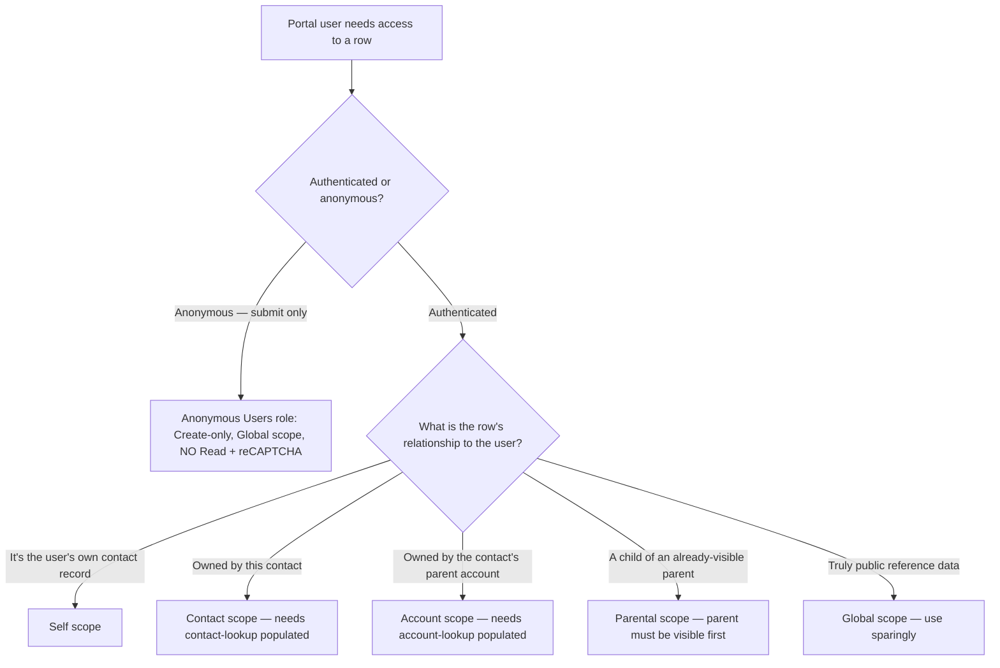
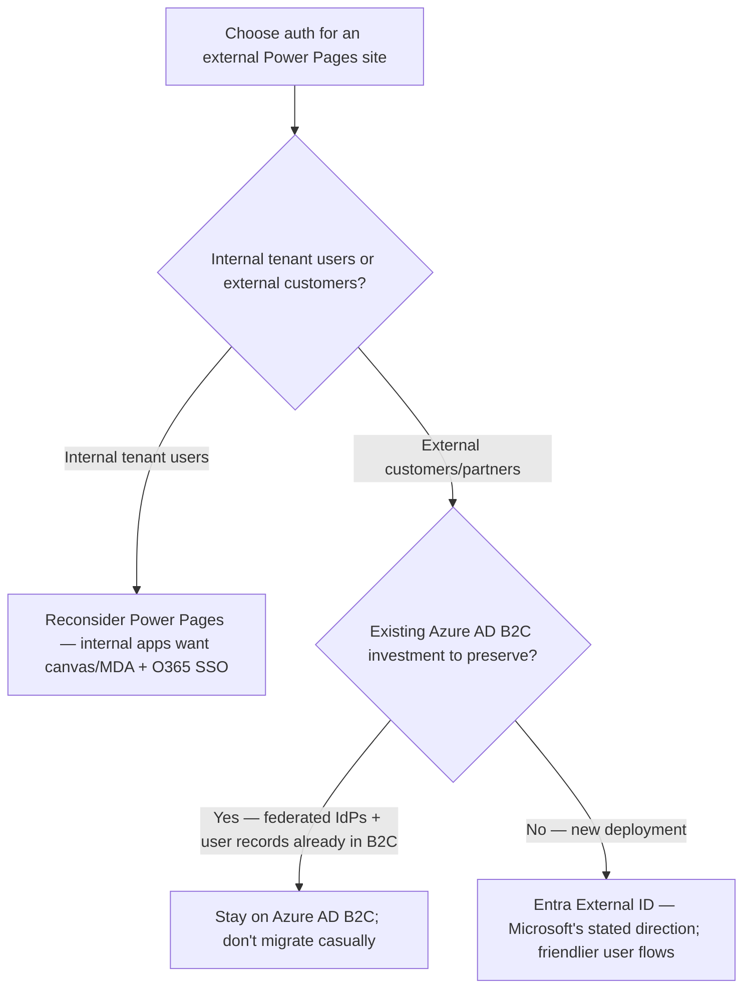
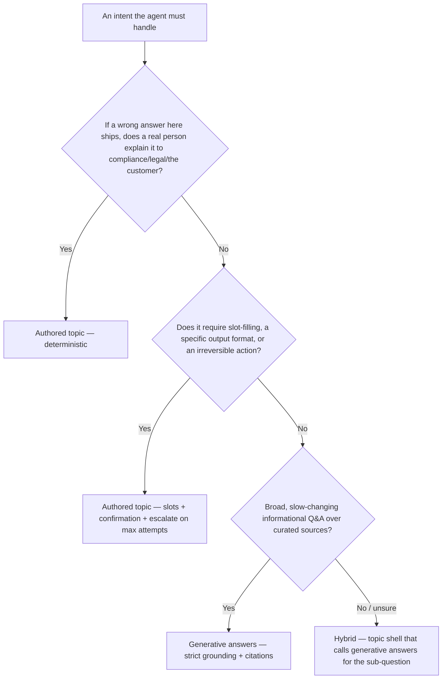
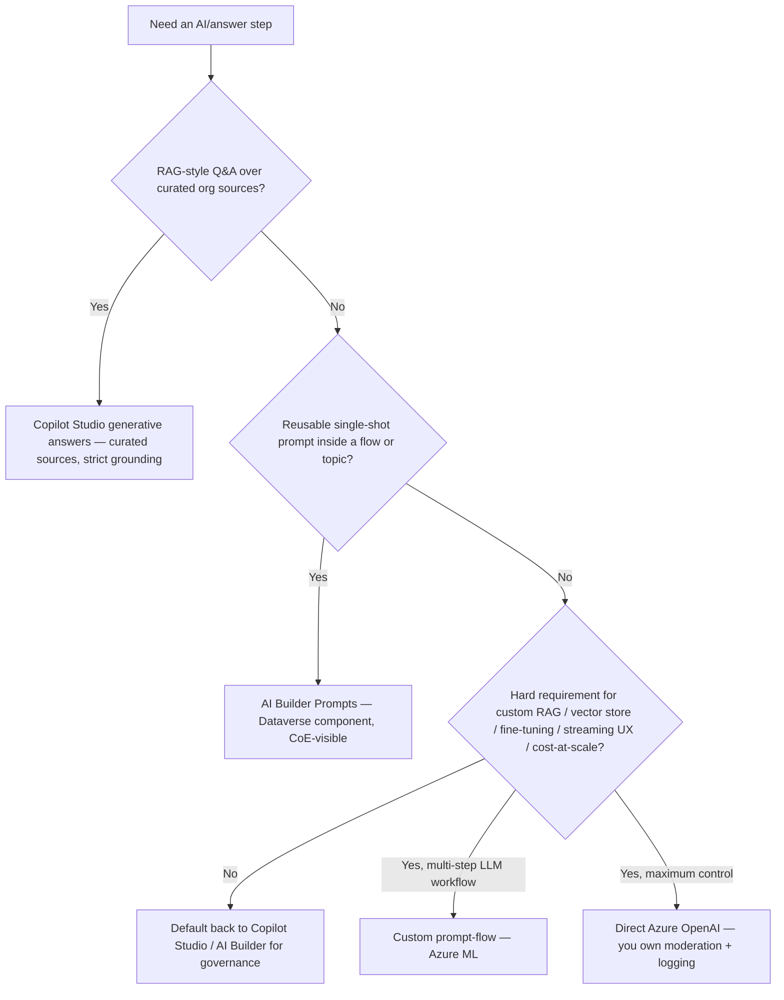

# BI / Pages / Copilot decision trees

**Last reviewed:** 2026-05-30 · **Confidence:** high for the structural decisions (first-party Microsoft Learn + in-house skills); **medium** for the volatile leaves marked inline (Fabric Direct Lake behavior, Entra External ID positioning) — re-verify on the Researcher sweep.
**Owners:** `power-bi-engineer` (BI trees), `power-pages-engineer` (Pages tree), `copilot-studio-engineer` (Copilot trees). Complements the `power-bi`, `power-pages-permissions`, and `copilot-studio-bot-design` skills, and the `bi-*` / `pages-*` / `copilot-*` best-practice docs.

**Decision-tree traversal (priors).** When a situation matches an entry condition below, traverse the relevant Mermaid graph **top-to-bottom before selecting an approach** — do NOT pattern-match on keywords in the request. The first branch whose condition resolves cleanly is the leaf to apply. This file is the proactive complement to the Capability Grounding Protocol (`../CLAUDE.md` §5): the protocol catches a wrong branch *after* a failure; these trees prevent picking the wrong branch in the first place. Format follows [`../../../docs/best-practices/decision-trees-in-knowledge-files.md`](../../../docs/best-practices/decision-trees-in-knowledge-files.md).

---

## Decision Tree: Power BI — Storage mode (Import / DirectQuery / Direct Lake / Composite)

**When this applies:** You are creating a new semantic model, or an existing model is slow, over-budget on capacity, or showing stale data, and you must choose (or change) how tables are stored. Observable triggers: report falls off a performance cliff at scale, refresh takes too long / can't fit, or stakeholders ask for "live" data.

**Last verified:** 2026-05-30 against [Semantic model modes](https://learn.microsoft.com/power-bi/connect-data/service-dataset-modes-understand) and [Direct Lake overview](https://learn.microsoft.com/fabric/fundamentals/direct-lake-overview).

**Rationale per leaf:**
- *Import* — the default; fastest interactivity, simplest, costs only a refresh window. Choose unless a named requirement forbids it.
- *DirectQuery* — live data the source owns, too big to import; **always pair with an aggregation table** or every visual round-trips to the source. **requires:** a source that can sustain the per-visual query load.
- *Direct Lake* — Import-class speed over Delta without a refresh copy. **requires:** Fabric capacity + OneLake Delta tables; watch the **fallback-to-DirectQuery** triggers (unsupported DAX, capacity guardrails) which silently slow queries. `[volatile — Fabric ships monthly; re-verify fallback rules]`
- *Composite* — mix per-table: DirectQuery the big live fact, set shared dimensions to **Dual**, add an **Import** aggregation table. Best of both when only the fact needs to be live.

**Tradeoffs summary table:**

| Mode | Freshness | Query speed | Capacity need | Use when |
|---|---|---|---|---|
| Import | Stale until refresh | Fastest | Memory for full copy | Default; fits in memory, hours-stale OK |
| DirectQuery | Live | Slowest (per-visual SQL) | Source must scale | Live data, too big to import — add aggregations |
| Direct Lake | Near-live (Delta) | Import-class | Fabric capacity | Data already in OneLake Delta + Fabric |
| Composite | Mixed per-table | Fast (Import dims) | Moderate | One big live fact + small fast dims |

See: [`../best-practices/bi-storage-mode-selection.md`](../best-practices/bi-storage-mode-selection.md), [`../best-practices/bi-star-schema-not-flat-table.md`](../best-practices/bi-star-schema-not-flat-table.md).

---

## Decision Tree: Power BI — Deployment & refresh (the day-2 layer)

**When this applies:** the model is built and the question is how it reaches production and stays fresh — "how do I promote dev→test→prod?", "the 6 a.m. refresh keeps failing", "do I need a gateway?", "the full refresh times out". Observable inputs: storage mode (resolve the storage-mode tree above first), whether any source is on-prem/VNet-bound, fact-table size, and whether multiple stages exist. This is the operational complement to the modeling trees; it does **not** re-decide storage mode.

**Last verified:** 2026-05-30 against [`../best-practices/bi-refresh-and-gateway-reliability.md`](../best-practices/bi-refresh-and-gateway-reliability.md). Capacity refresh-time limits and refresh-concurrency are SKU-specific — `[verify-at-build]`, never quote from memory.

**Rationale per leaf:**

- _PIPE_ — multi-stage deployments use Power BI / Fabric Deployment Pipelines to promote a dataset+report across dev/test/prod with per-stage data-source rules; hand-republishing per stage drifts. **requires:** Premium / PPU / Fabric capacity.
- _DIRECT_ — a single-workspace deliverable can publish directly, but still version the `.pbip` so the model is recoverable and diffable.
- _DL_ — Direct Lake reads OneLake directly: there is no import-refresh schedule; you manage framing/reframing instead. Don't stand up a refresh schedule it doesn't use.
- _DQ_ — DirectQuery has no import refresh; "stale" there is a source/query-folding problem, and a gateway is still required if the source is on-prem.
- _GWCFG_ — any on-prem/VNet source needs a **clustered standard** gateway (a single node or a personal gateway is the top silent-failure cause), with service-principal/service-account creds so a person leaving or an MFA prompt doesn't kill the schedule.
- _NOGW_ — a cloud-only source (Dataverse, SharePoint Online, Azure SQL reachable from the Service) needs **no** gateway; don't add one out of habit.
- _INCR_ — a large fact table must use incremental refresh or it eventually exceeds the capacity refresh-time limit; pair with a refresh-failure alert so staleness isn't discovered by a stakeholder.
- _FULL_ — small/medium tables refresh fully; stagger schedules under the capacity concurrency/time limit and alert on failure.

**Tradeoffs summary table:**

| Leaf | Refresh model | Gateway? | Identity | Use when |
|---|---|---|---|---|
| Deployment Pipelines | inherits model | inherits model | SPN | dev/test/prod stages (Premium/PPU/Fabric) |
| Direct Lake | framing/reframe (no schedule) | no | SPN | Fabric-hosted model on OneLake |
| DirectQuery | none (live) | if source on-prem | SPN | real-time / very large source |
| Import + clustered gateway | incremental or full | yes (clustered standard) | SPN / service acct | on-prem / VNet source |
| Import cloud-only | incremental or full | no | SPN | cloud-only source |

Refresh-failure triage: read the refresh-history error → classify (credential/auth · gateway-unreachable · timeout/limit · source-side) → fix that class, don't blind-rerun ([`../best-practices/bi-refresh-and-gateway-reliability.md`](../best-practices/bi-refresh-and-gateway-reliability.md)). Storage-mode-dependent leaves resolve the storage-mode tree above first.

---

## Decision Tree: Power BI — Measure vs calculated column

**When this applies:** You are adding a derived value to a semantic model and must decide whether it is a measure, a calculated column, or a Power Query / source transform. Observable trigger: "I need a new field for X" where X is a number, a ratio, a classification, or a key.

**Last verified:** 2026-05-30 against [DAX: avoid converting measures to columns](https://learn.microsoft.com/power-bi/guidance/dax-avoid-converting-use-cases) and [Import modeling data reduction](https://learn.microsoft.com/power-bi/guidance/import-modeling-data-reduction).

**Rationale per leaf:**
- *Measure* — anything filter-context-dependent or aggregated; computed at query time, stores nothing, gives the right answer under any slice.
- *Measure (iterator)* — per-row math that's only ever summed/averaged belongs inside `SUMX`/`AVERAGEX`, not a materialized column.
- *Power Query / source column* — a genuine per-row attribute you must group/filter/relate on; push it upstream where VertiPaq compresses it better and it refreshes once.
- *Calculated column* — only when the per-row value needs the model's relationships and genuinely can't be built upstream (e.g., a key derived across related tables). **Note:** limited/unmaterialized under Direct Lake — push to the Delta source instead.

**Tradeoffs summary table:**

| Option | When evaluated | Storage cost | Filter-aware? | Use when |
|---|---|---|---|---|
| Measure | Query time | None | Yes | Aggregations, ratios, anything sliced |
| Calculated column | Refresh time | Per-row VertiPaq | No | Per-row group/filter/relate key, can't be done upstream |
| Power Query column | Refresh (ETL) | Per-row, well-compressed | No | Per-row attribute computable before the model |

See: [`../best-practices/bi-measures-not-calculated-columns.md`](../best-practices/bi-measures-not-calculated-columns.md), [`../best-practices/test-dax-correctness-as-code.md`](../best-practices/test-dax-correctness-as-code.md).

---

## Decision Tree: Power Pages — Granting a portal user access to a row

**When this applies:** A portal user (anonymous or authenticated) needs to see/create/edit a Dataverse row in Power Pages, or a row is unexpectedly visible/invisible in Pages while behaving differently in the model-driven app. Observable triggers: "the list is blank", "they can submit but not see their submission", "this row shows in MDA but not Pages".

**Last verified:** 2026-05-30 against [Power Pages table permissions](https://learn.microsoft.com/power-pages/security/table-permissions) and the in-house [`power-pages-permissions`](../skills/power-pages-permissions/SKILL.md) skill.

**Rationale per leaf:**
- *Anonymous (Create-only)* — no contact exists yet to own the row, so Global scope is required; grant **Create without Read** so visitors can't enumerate others' submissions. Add reCAPTCHA.
- *Self* — "edit my profile"; just the signed-in contact's own record.
- *Contact* — "my cases/orders"; **requires:** the contact-lookup column on the row is populated to the signed-in contact (MDA-created rows often own to a User, not a contact, and are then invisible).
- *Account* — "my company's data"; **requires:** the account-lookup populated and the contact's parent account set.
- *Parental* — child tables inheriting from a parent; **requires:** the parent row itself passes its permission (debug from the top of the chain).
- *Global* — truly public reference data (countries, catalog) or admin-tier roles only; the leak risk if misapplied to business data.

**Tradeoffs summary table:**

| Scope | Rows visible | Ownership column needed | Risk if misused | Use when |
|---|---|---|---|---|
| Self | The contact's own record | n/a | Low | Edit-my-profile |
| Contact | contact-lookup = me | contact lookup | Low | My cases/orders |
| Account | account-lookup = my account | account lookup | Medium | My company's data |
| Parental | inherited from visible parent | parent relationship | Medium | Child tables (case notes) |
| Global | All rows | none | High (mass data leak) | Public reference data / anon Create only |

See: [`../best-practices/pages-table-permissions-before-publish.md`](../best-practices/pages-table-permissions-before-publish.md), [`../best-practices/pages-web-roles-assigned-by-automation.md`](../best-practices/pages-web-roles-assigned-by-automation.md), [`../best-practices/test-as-real-security-context-not-admin.md`](../best-practices/test-as-real-security-context-not-admin.md). The 9-step "visible in MDA but not Pages" debug walkthrough lives in the `power-pages-permissions` skill §6.

---

## Decision Tree: Power Pages — Authentication provider choice

**When this applies:** Standing up auth on a new external-facing Power Pages site, or deciding whether to migrate an existing one. Observable trigger: "which login should customers use" / "should we move off B2C".

**Last verified:** 2026-05-30 against the in-house [`power-pages-permissions`](../skills/power-pages-permissions/SKILL.md) skill §2 and [`../knowledge/power-pages-2026.md`](power-pages-2026.md).

**Rationale per leaf:**
- *Reconsider Power Pages* — Power Pages is for anonymous/B2C; an internal-tenant audience fights the licensing model and loses O365 SSO conveniences. Route to canvas/model-driven instead.
- *Stay on B2C* — an existing B2C investment (custom policies, federated IdPs, user records) doesn't migrate casually; sign-in flows and user re-bind are a multi-week project, not a toggle. `[volatile — Microsoft's B2C/External-ID positioning evolves; re-verify direction]`
- *Entra External ID* — the default for new external deployments: built-in user-flow designer, cleaner attribute schema, Microsoft's stated future direction. `[volatile — re-verify "stated direction" on the Researcher sweep]`

Whichever provider, the Pages-side bind is the **Contact** record — everything from web roles onward anchors to that contact.

See: [`../best-practices/pages-table-permissions-before-publish.md`](../best-practices/pages-table-permissions-before-publish.md), [`power-pages-2026.md`](power-pages-2026.md). Any B2C ↔ External ID migration → `ravenclaude-core/security-reviewer` + `architect` (multi-week project).

---

## Decision Tree: Copilot Studio — Topic vs generative answers

**When this applies:** Deciding, for a specific intent in a Copilot Studio agent, whether to author a deterministic topic or let generative answers handle it. Observable trigger: building a new intent, or a deployed bot is hallucinating / giving inconsistent answers on a class of questions.

**Last verified:** 2026-05-30 against the in-house [`copilot-studio-bot-design`](../skills/copilot-studio-bot-design/SKILL.md) skill §2 and [Copilot Studio topics](https://learn.microsoft.com/microsoft-copilot-studio/authoring-create-edit-topics).

**Rationale per leaf:**
- *Authored topic* — regulated/high-blast-radius content where a wrong answer has a named human owner; deterministic, logged, reviewable.
- *Authored topic (slots)* — anything needing inputs, a specific format, or an irreversible action; add **confirmation before submit** and **escalate after N failed attempts**.
- *Generative answers* — broad, slow-changing informational Q&A; **requires** curated knowledge sources + strict grounding + citations or it hallucinates.
- *Hybrid* — a deterministic topic frame that delegates one sub-question to generative answers; the right call when most of the flow is fixed but one step needs synthesis.

**Tradeoffs summary table:**

| Choice | Determinism | Maintenance | Hallucination risk | Use when |
|---|---|---|---|---|
| Authored topic | Exact | High (hand-built branches) | None | Regulated, high-stakes, slot-filled, formatted |
| Generative answers | Variable | Low (curate sources) | Real — needs grounding | Broad informational FAQ |
| Hybrid | Mostly fixed | Medium | Bounded to sub-question | Fixed flow + one synthesis step |

See: [`../best-practices/copilot-topic-vs-generative-routing.md`](../best-practices/copilot-topic-vs-generative-routing.md), [`../best-practices/copilot-escalation-and-guardrails.md`](../best-practices/copilot-escalation-and-guardrails.md).

---

## Decision Tree: Copilot Studio — Grounding source choice (where the AI step lives)

**When this applies:** An agent needs an AI/answer step and you must choose where it runs — Copilot Studio generative answers, AI Builder prompts, a custom prompt-flow, or direct Azure OpenAI. Observable trigger: "the bot needs to answer from our docs" or "we need an LLM step here" and you're weighing cost/governance/control.

**Last verified:** 2026-05-30 against the in-house [`copilot-studio-bot-design`](../skills/copilot-studio-bot-design/SKILL.md) skill §8 and [`../knowledge/copilot-agents-2026.md`](copilot-agents-2026.md).

**Rationale per leaf:**
- *Copilot Studio generative answers* — RAG over curated sources, inside Copilot Studio's governance roof (content moderation included). The default for "answer from our docs". **requires:** curated, de-duplicated, freshness-controlled sources (the #1 hallucination control).
- *AI Builder Prompts* — a reusable single-shot prompt as a Dataverse component, visible in the CoE kit; **licensing:** consumes AI Builder credits per call.
- *Default back* — if there's no concrete requirement forcing you out, stay inside Copilot Studio / AI Builder for governance.
- *Custom prompt-flow* — multi-step LLM workflow with branching/tool-use; **requires:** Azure ML ownership, a separate identity surface.
- *Direct Azure OpenAI* — maximum control / cheapest at scale, but **you own** moderation, abuse prevention, and prompt logging. Seam to `azure-cloud` for hosting.

**Tradeoffs summary table:**

| Path | Best for | Cost shape | Governance | You own moderation? |
|---|---|---|---|---|
| CS generative answers | RAG over curated sources | Per-message licensing | In Copilot Studio (moderation included) | No |
| AI Builder Prompts | Reusable single-shot prompt | AI Builder credits/call | Dataverse component, CoE-visible | No |
| Custom prompt-flow | Multi-step LLM workflow | Compute + LLM tokens | Azure ML, separate identity | Partly |
| Direct Azure OpenAI | Max control / scale | Tokens directly | You own everything | Yes |

See: [`../best-practices/copilot-grounding-source-selection.md`](../best-practices/copilot-grounding-source-selection.md), [`copilot-agents-2026.md`](copilot-agents-2026.md) (which *builder* before which AI step). Stepping out to Azure OpenAI / Foundry hosting → `azure-cloud`; agent connector/DLP/injection design → `ravenclaude-core/security-reviewer`.

---

## Staleness note

Per [`../../../docs/best-practices/decision-trees-in-knowledge-files.md`](../../../docs/best-practices/decision-trees-in-knowledge-files.md), the Researcher meta-skill flags any tree with `Last verified:` older than 90 days. The fastest-moving leaves here are the **Fabric Direct Lake** fallback rules (storage-mode tree) and the **Entra External ID** positioning (Pages auth tree) — both tagged `[volatile]` inline; re-verify those first.
