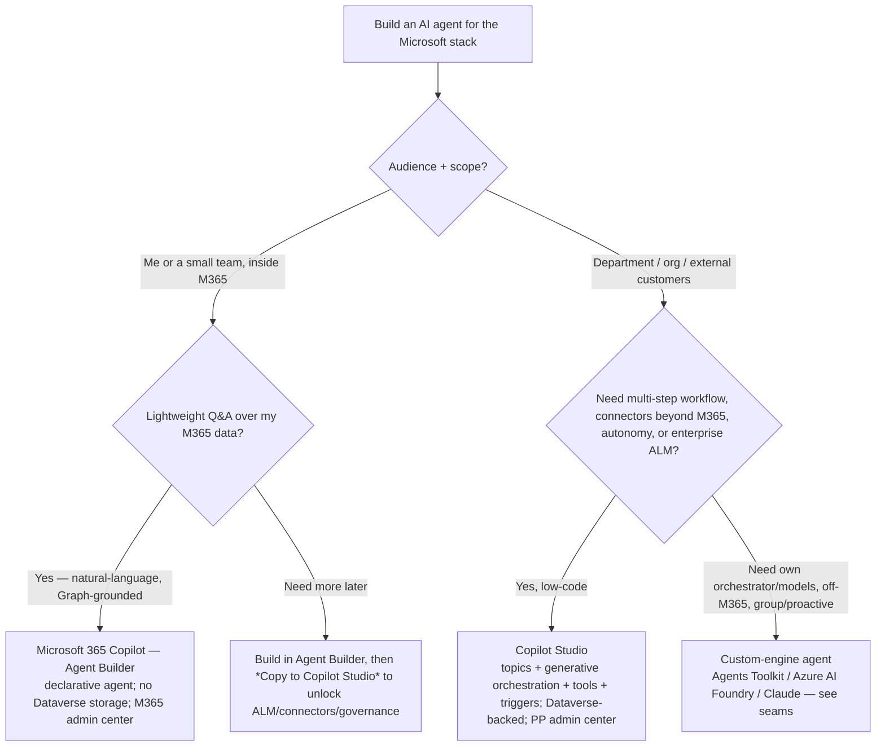

# Copilot agents in 2026 — M365 Copilot vs Copilot Studio vs custom-engine

**Last reviewed:** 2026-05-28 · **Confidence:** medium-high (first-party Microsoft Learn, retrieved 2026-05-28). The agent surface ships monthly — re-verify on the Researcher sweep.
**Owner:** `copilot-studio-engineer` (+ `power-platform-admin` for governance). Complements the `copilot-studio-bot-design` skill.

The most-asked Power-Platform AI question in 2026 is **"which tool do I build the agent in?"** This is the decision tree to traverse before recommending — don't keyword-match "Copilot agent" to Copilot Studio.

## Decision Tree: Copilot agents — which builder?

## The two first-party builders (Microsoft's own comparison)
| | **Microsoft 365 Copilot (Agent Builder)** | **Copilot Studio** |
|---|---|---|
| User | information workers | makers + developers |
| Scope | individuals / small teams | department / org / external |
| Agent type | lightweight **declarative** Q&A on org knowledge (Graph) | complex multi-step workflows, business-system integration, **autonomous** |
| Orchestrator/model | M365 Copilot's built-in orchestrator + foundation models | Copilot Studio (advanced models + Azure AI; prebuilt + custom connectors) |
| Storage | **no Dataverse entitlement consumed** | **Dataverse-backed** (catalog, solutions, security, virtualization) |
| Governance | M365 admin center; respects existing M365 permissions ("no new privileges") | **Power Platform admin center** — ALM (dev/test/prod), DLP, connector governance, RBAC, telemetry |
| Channels | M365 Copilot + Teams/Word/Excel/Outlook | Teams, web, custom endpoints, Azure Bot channels |

**Upgrade path:** start in Agent Builder for speed → **Copy to Copilot Studio** when you need enterprise ALM, broader connectors, or granular governance (config + instructions are preserved).

## Declarative vs custom-engine (Microsoft 365 Copilot extensibility)
- **Declarative agent** — your instructions + knowledge + actions on **Copilot's** orchestrator/models (no hosting). Build low-code (Agent Builder) or pro-code (**Microsoft 365 Agents Toolkit** in VS/VS Code). Knowledge = SharePoint / Graph connectors / OneDrive / Teams; actions = API plugins.
- **Custom-engine agent** — **you bring the orchestrator + models** (custom business logic, your own/ domain models, off-M365 publishing, group/proactive messaging). This is the seam to `claude-app-engineering` (Claude Agent SDK) and `azure-cloud` (Azure AI Foundry hosting).

## Autonomous agents (Copilot Studio)
Autonomous agents act **without a user prompt**: **triggers** (events/conditions) → **instructions** + **guardrails** → actions, running in the background at scale. They stay controlled — **scoped permissions, explicit decision boundaries, auditable processes**. Power Apps **Agent Builder** can generate an autonomous agent from an app (adds knowledge + triggers from app metadata). Design: name the trigger, the guardrails, the human-in-the-loop escalation, and the connector/DLP posture.

## Governance (house-opinion alignment, §3/§4)
- **Solutions, always** — Copilot Studio agents are Dataverse assets; manage in solutions for ALM (dev/test/prod), not hand-edited in prod.
- **DLP + connector governance** — agents call tools/connectors that ingest **untrusted content** (emails, tickets) → prompt-injection surface; configure secure connectors + DLP (Power Platform admin center). Route security design to `ravenclaude-core/security-reviewer`.
- **Purview** — sensitivity labels, audit logs, retention apply.

## Seams
- **`claude-app-engineering`** (when installed) — a **custom-engine** agent on the **Claude** Agent SDK / API (own orchestrator, evals, MCP) is built there; this plugin owns the Power-Platform/Copilot-Studio low-code + M365-Copilot declarative path.
- **`azure-cloud`** (when installed) — hosting a custom-engine agent on **Azure AI Foundry** / Container Apps, and the Entra/identity + networking around it, is `azure-cloud`.
- **`ravenclaude-core/security-reviewer`** — agent connector/DLP/injection design.

## Sources (retrieved 2026-05-28)
MS Learn: [Choose M365 Copilot vs Copilot Studio](https://learn.microsoft.com/microsoft-365/copilot/extensibility/copilot-studio-experience), [Agents for M365 Copilot](https://learn.microsoft.com/microsoft-365/copilot/extensibility/agents-overview), [Declarative agents](https://learn.microsoft.com/microsoft-365/copilot/extensibility/overview-declarative-agent), [Design autonomous agent capabilities](https://learn.microsoft.com/microsoft-copilot-studio/guidance/autonomous-agents), [Copilot Studio overview](https://learn.microsoft.com/microsoft-copilot-studio/fundamentals-what-is-copilot-studio), [Copy an agent to Copilot Studio](https://learn.microsoft.com/microsoft-365/copilot/extensibility/copy-agent-to-copilot-studio). M365 Copilot release notes (Jan 13 2026) for declarative-agent Mail/People/Meeting knowledge.
