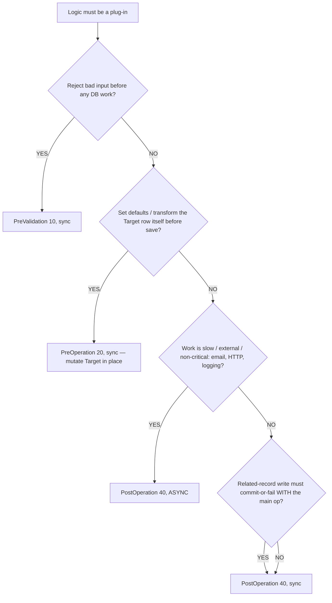
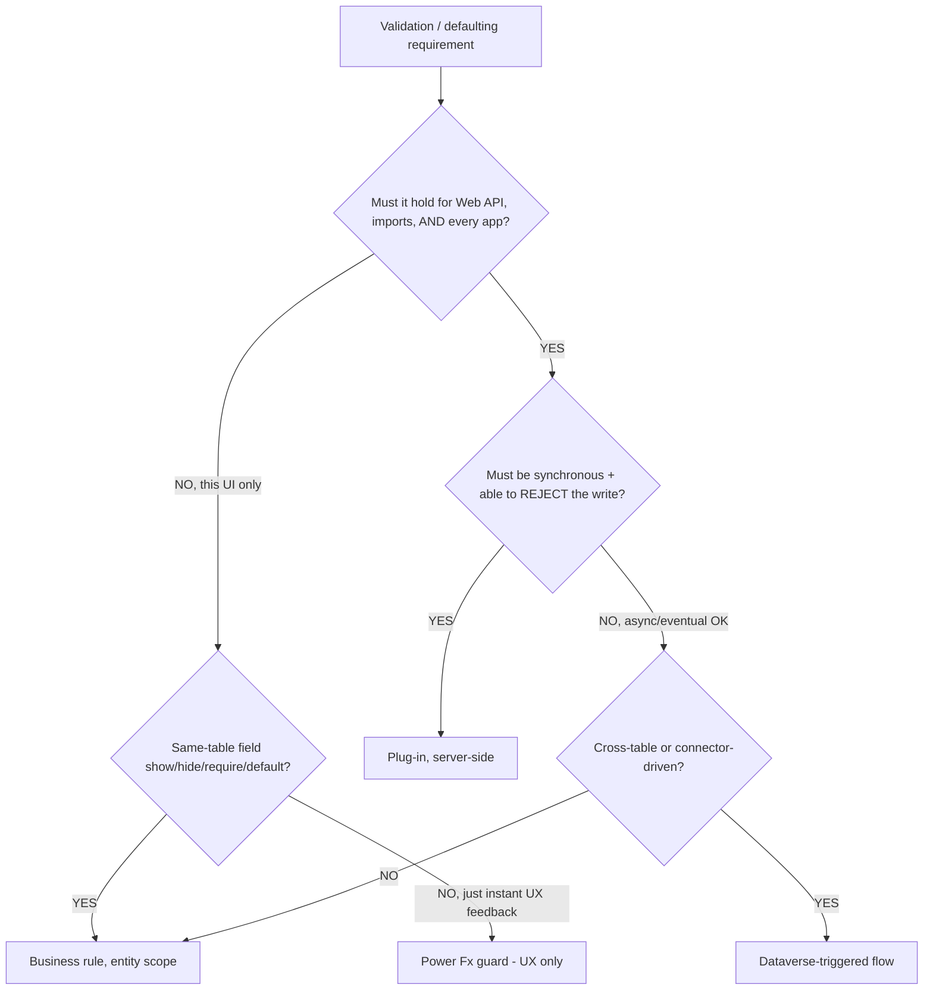
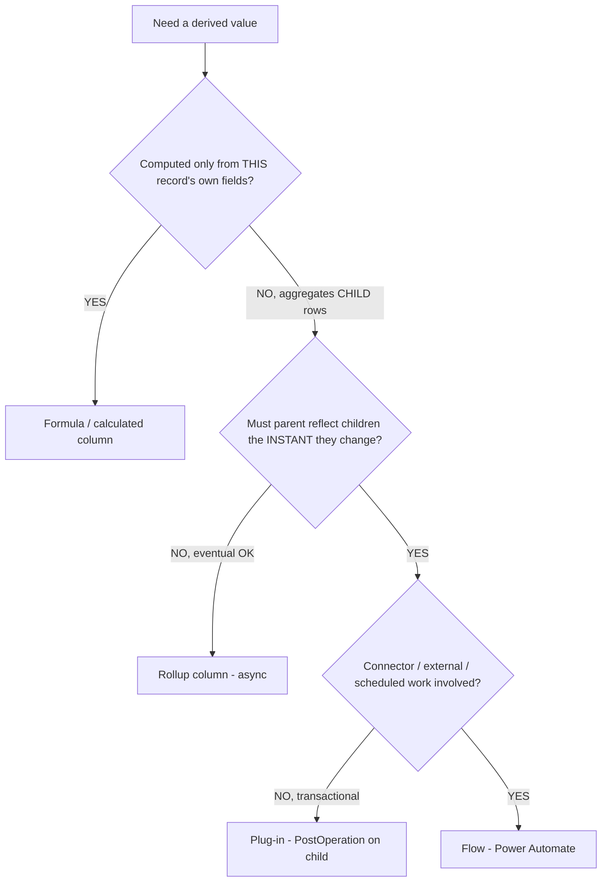
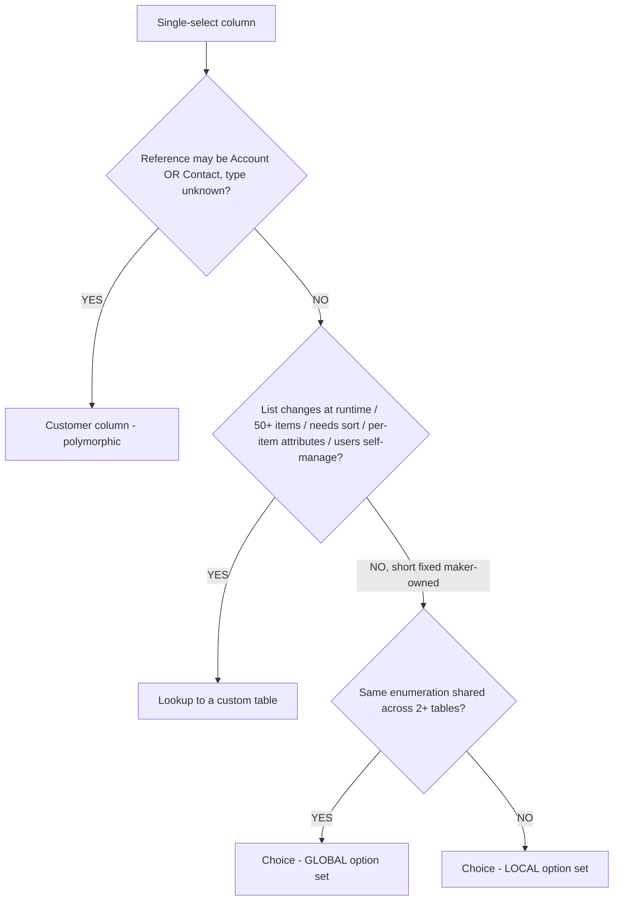
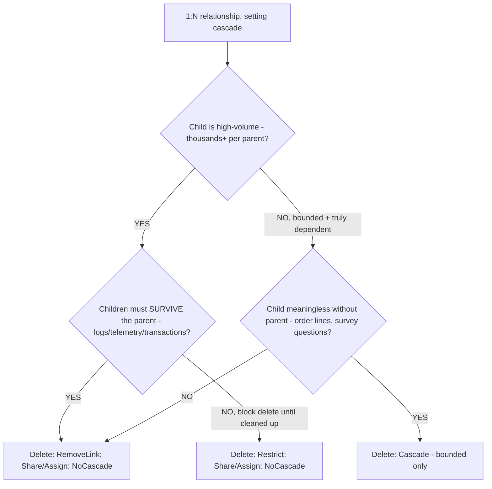
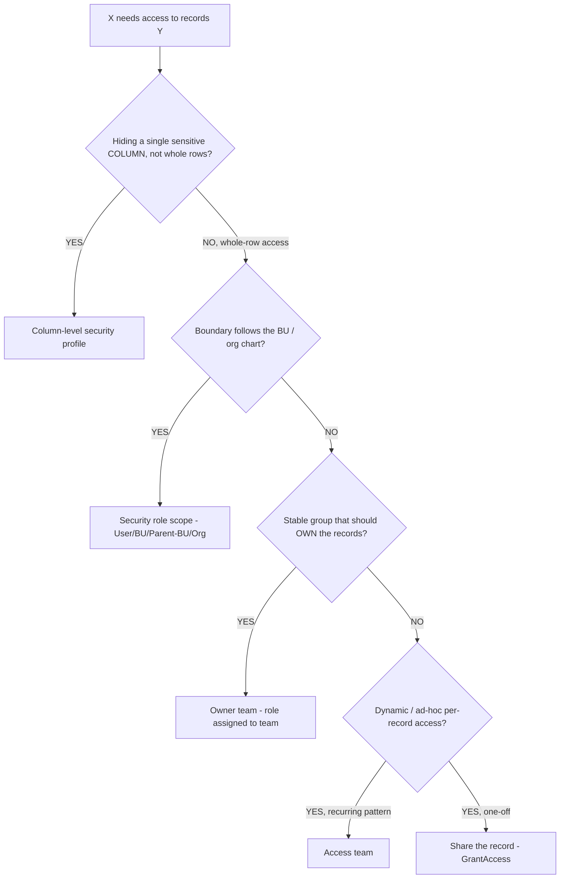
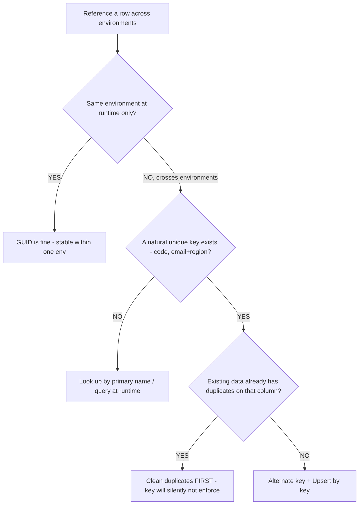

# Dataverse decision trees

> **Last reviewed: 2026-05-30 by `claude`.** Canonical decision trees for the Dataverse data-modeling, security, and server-side-logic surface owned by [`../agents/dataverse-architect.md`](../agents/dataverse-architect.md). Each tree follows the marketplace convention in [`../../../docs/best-practices/decision-trees-in-knowledge-files.md`](../../../docs/best-practices/decision-trees-in-knowledge-files.md): an observable entry condition, a `Last verified` date, a Mermaid graph, per-leaf rationale, and a tradeoffs table for any tree with ≥3 leaves.
>
> **Decision-tree traversal (priors).** When the user's situation matches an entry condition below, traverse the Mermaid graph top-to-bottom **before** selecting a mechanism. Do NOT pattern-match on keywords in the user's description. The first branch where the condition resolves cleanly is the leaf to apply. Each tree links to the best-practice doc that justifies its leaves.

---

## Decision Tree: Plug-ins — pipeline stage + execution mode

**When this applies:** you've already decided the logic must be a Dataverse plug-in (not a business rule/flow — see the logic-placement tree below) and must choose the registration **stage** (PreValidation 10 / PreOperation 20 / PostOperation 40) and **mode** (sync / async). Observable trigger: you're filling in the Plug-in Registration Tool / `pac plugin` step and don't know which stage to pick.

**Last verified:** 2026-05-30 against the plugin's `skills/dataverse-plugins/` (Dataverse SDK, .NET 4.6.2+); stage numbers 10/20/40 and the 2-min-sync / 24-h-async budgets are from that skill's CRITICAL RULES.

**Rationale per leaf:**
- *PreValidation 10, sync* — runs **outside** the transaction, so rejecting with `InvalidPluginExecutionException` is the cheapest rollback; the place for input validation.
- *PreOperation 20, sync* — mutate `Target` in place (no second `Update` round-trip), all inside the transaction; the place for defaults/auto-number/transform.
- *PostOperation 40, sync* — the row exists and `PostEntityImages` are available; related writes roll back together with the main op. **requires:** if you need new-row values on Create or old values for compare, register the matching Pre/Post **image**.
- *PostOperation 40, async* — 24-hour budget instead of the 2-minute sync timeout, and a failure doesn't roll back the user's save; the place for email/HTTP/logging.

**Tradeoffs summary:**

| Stage + mode | In transaction? | Can reject the write? | Latency added to user | Timeout budget | Use when |
|---|---|---|---|---|---|
| PreValidation 10, sync | No | Yes (cheapest) | Low | 2 min | Validate-and-reject early |
| PreOperation 20, sync | Yes | Yes | Low (no extra round-trip) | 2 min | Defaults / auto-number / transform Target |
| PostOperation 40, sync | Yes | Awkward (compensating delete) | Medium | 2 min | Transactional related-record write |
| PostOperation 40, async | No | No | None (off the save path) | 24 h | Email / external HTTP / logging |

→ Full rule: [`../best-practices/dataverse-plugin-pipeline-stage-selection.md`](../best-practices/dataverse-plugin-pipeline-stage-selection.md)

---

## Decision Tree: Logic placement — business rule vs Power Fx vs flow vs plug-in

**When this applies:** you have a validation/defaulting/derivation requirement and must decide **where the logic lives**. Observable trigger: "should this be a business rule, a flow, or a plug-in?" The tie-breaker is **enforcement reach** — must it hold for the Web API/imports/every app, or only in one UI?

**Last verified:** 2026-05-30 against house rule §3 #7 ([`../CLAUDE.md`](../CLAUDE.md)) and the `dataverse-architect` personality ("business rules over JS over plug-ins").

**Rationale per leaf:**
- *Business rule (entity scope)* — fires in every client **and** server-side for that one table, no code; the lowest tier for same-table field logic.
- *Power Fx guard* — only the app running it enforces, so it's UX/instant-feedback, **never** a security or integrity boundary.
- *Dataverse-triggered flow* — server-side and covers the API/import path, but **async** — use when eventual enforcement is acceptable and the work is cross-table/connector-shaped. **requires:** premium/connector licensing per the flow's connectors.
- *Plug-in* — the only tier that's server-side, synchronous, and able to **reject** the write (`InvalidPluginExecutionException`) across every write path. **requires:** registered on a Pre stage to reject cleanly.

**Tradeoffs summary:**

| Mechanism | Enforces in | Sync / async | Can reject the write? | Cost | Use when |
|---|---|---|---|---|---|
| Business rule (entity) | All clients + server, one table | Sync | Yes (form-level) | Lowest (no code) | Same-table require/default/show-hide |
| Power Fx | Only that app | Sync | No (UX only) | Low | Instant feedback, not a boundary |
| Dataverse flow | Server-side | Async | No | Medium (+ licensing) | Cross-table / connector, eventual OK |
| Plug-in | Every write path | Sync or async | Yes (sync) | High (C# + reg) | Must-hold-everywhere transactional invariant |

→ Full rule: [`../best-practices/dataverse-where-to-enforce-logic.md`](../best-practices/dataverse-where-to-enforce-logic.md)

---

## Decision Tree: Derived values — rollup vs calculated vs plug-in vs flow

**When this applies:** you need to **store/show a derived value** (a total, a concatenation, a status) and must pick the mechanism. Observable trigger: "how do I keep this parent total / computed field up to date?" Decisive axes: **same-record vs child-aggregate**, and **real-time vs eventual**.

**Last verified:** 2026-05-30 against the plugin's `skills/dataverse-web-api/resources/formula-columns.md` ("When to Use What" table; same-record-only constraint) and house rule §3 #7.

**Rationale per leaf:**
- *Formula / calculated column* — same-record only, synchronous, no storage; the cheapest tier for arithmetic/concat/conditional on the row's own fields.
- *Rollup column* — aggregates child rows (SUM/COUNT/MIN/MAX) but refreshes on an **async** system job (hourly default / on-demand), so it's "eventually correct" — wrong when the parent must be exact immediately.
- *Plug-in (PostOperation on child)* — recompute the parent the instant a child changes; the only real-time, transactional child-aggregate option.
- *Flow (Power Automate)* — async/connector/scheduled derivations. **requires:** premium/connector licensing per the flow.

**Tradeoffs summary:**

| Mechanism | Scope | Timing | Cost | Use when |
|---|---|---|---|---|
| Formula / calculated | Same record | Sync (on read) | Lowest | Concatenation, arithmetic, conditional on own fields |
| Rollup | Parent ← child aggregate | **Async** (hourly/on-demand) | Low | SUM/COUNT/MIN/MAX where eventual is OK |
| Plug-in | Anything (cross-table) | Sync or async | High | Real-time exact total; transactional |
| Flow | Connector-reachable | Async | Medium (+ licensing) | External / scheduled / long-running |

→ Full rule: [`../best-practices/dataverse-rollup-vs-calculated-vs-plugin.md`](../best-practices/dataverse-rollup-vs-calculated-vs-plugin.md)

---

## Decision Tree: Data modeling — choice vs lookup vs customer column

**When this applies:** you're adding a column that "picks one value from a set" and must choose the type. Observable trigger: a single-select field where you're unsure between an option set and a lookup. Decisive axes: **who owns/maintains the value list** and **do you need polymorphism (Account ∪ Contact)**. Remember column **data type is permanent**.

**Last verified:** 2026-05-30 against `skills/dataverse-web-api/resources/dataverse-design-rules.md` ("When to Use Lookup Instead of Choice") and `resources/columns-attributes.md` (local vs global option sets).

**Rationale per leaf:**
- *Customer column* — one polymorphic column instead of two mutually-exclusive lookups; use **only** when both Account and Contact are genuinely populated.
- *Lookup to a custom table* — the value list becomes queryable data: sortable, user-maintainable, carries per-item attributes; the answer whenever the list isn't static maker-owned metadata.
- *Choice (global)* — one shared definition across tables, but harder to refactor; only when the enumeration is truly shared.
- *Choice (local)* — cheapest, no join, but the list is metadata (not user-editable, not sortable); the default for short fixed maker-owned lists.

**Tradeoffs summary:**

| Type | List owned by | Sortable? | User-editable at runtime? | Polymorphic? | Use when |
|---|---|---|---|---|---|
| Choice (local) | Makers (metadata) | No | No | No | Short, fixed, single-table list |
| Choice (global) | Makers (metadata) | No | No | No | Same enumeration across 2+ tables |
| Lookup | Data (a table) | Yes | Yes | No (single target) | Long/changing/sorted/attributed list |
| Customer | Data (Account/Contact) | n/a | n/a | **Yes** | Reference could be Account or Contact |

→ Full rule: [`../best-practices/dataverse-choice-vs-lookup-vs-customer-column.md`](../best-practices/dataverse-choice-vs-lookup-vs-customer-column.md)

---

## Decision Tree: Data modeling — cascade behavior on a 1:N relationship

**When this applies:** you're configuring `CascadeConfiguration` on a 1:N relationship and must set Delete / Share / Assign / Reparent. Observable trigger: creating the relationship payload, or the child table is (or will be) high-volume. Decisive axis: **child row count per parent** and whether children have **standalone meaning**.

**Last verified:** 2026-05-30 against `skills/dataverse-web-api/resources/relationships.md` (the `CascadeConfiguration` matrix) and the `dataverse-architect` anti-pattern list.

**Rationale per leaf:**
- *RemoveLink + NoCascade* — clears the child lookup but keeps the rows; the safe default for high-volume children that outlive the parent, and avoids POA blow-up on share.
- *Restrict + NoCascade* — blocks the parent delete while children exist (referential-integrity guard); pair with a documented cleanup/archive path.
- *Cascade* — deletes all children with the parent; **only** for bounded, truly-dependent children (order lines, survey questions) where row count per parent is small and capped.
- All high-volume branches keep **Share/Assign/Reparent = NoCascade** — cascade sharing fans out across every child and explodes the POA (Principal Object Access) table.

**Tradeoffs summary:**

| Delete behavior | What happens on parent delete | Children survive? | Blast radius | Use when |
|---|---|---|---|---|
| `Cascade` | Deletes every child in one transaction | No | High on volume | Bounded, truly-dependent children only |
| `RemoveLink` | Clears child lookup, keeps rows | Yes | Low | High-volume children that outlive parent |
| `Restrict` | Blocks the delete while children exist | Yes | None (delete blocked) | Force human cleanup first |
| `Active` | Cascades only to active children | Partly | Medium | Large child set, ignore soft-deleted |

→ Full rule: [`../best-practices/dataverse-avoid-cascade-on-high-volume-child.md`](../best-practices/dataverse-avoid-cascade-on-high-volume-child.md)

---

## Decision Tree: Security — record access mechanism (role scope vs team vs sharing)

**When this applies:** "user/group X needs to see/edit records Y" and you must pick the access mechanism. Observable trigger: a security requirement phrased as who-sees-what. Decisive axes: **does the boundary follow the org chart**, is it a **stable group** or **ad-hoc**, and is it **whole-row** or **one column**.

**Last verified:** 2026-05-30 against `skills/dataverse-web-api/resources/security-model.md` (the 7-layer model, 4 scopes, owner vs access teams, sharing, column-level security).

**Rationale per leaf:**
- *Column-level security profile* — overrides role permissions for one column only; the scalpel for "same row, hide salary/SSN." Use sparingly.
- *Security role scope* — the primary model: set the lowest scope per table (User → BU → Parent-Child BU → Org) that satisfies the need; access is the additive union of all roles.
- *Owner team* — records owned by a group; members inherit the team's roles. Use Entra-group teams to sync membership automatically.
- *Access team* — dynamic ad-hoc sharing as a repeatable pattern (auto-created per record via a team template) without inflating role count.
- *Share (GrantAccess)* — the supported escape hatch for one record / one principal above their role scope; doesn't scale to many records.

**Tradeoffs summary:**

| Mechanism | Granularity | Scales to many records? | Follows org chart? | Maintenance | Use when |
|---|---|---|---|---|---|
| Role scope | Table × scope | Yes | Yes | Low (per role) | The default, BU-aligned access |
| Owner team | Per record (owned) | Yes | Configurable | Low (per team) | Stable group owns the records |
| Access team | Per record (shared) | Yes (templated) | No | Medium | Recurring dynamic sharing |
| Sharing (GrantAccess) | Per record × principal | No (manual) | No | High at volume | One-off above-scope grant |
| Column security | Per column | Yes | No | Medium | Hide one sensitive column |

→ Full rules: [`../best-practices/dataverse-security-least-privilege-roles.md`](../best-practices/dataverse-security-least-privilege-roles.md), [`../best-practices/dataverse-field-level-security-sparingly.md`](../best-practices/dataverse-field-level-security-sparingly.md)

---

## Decision Tree: Data modeling — addressing rows across environments

**When this applies:** code/flows/imports need to reference a Dataverse row in a way that **survives moving between dev/test/prod**, where the GUID differs. Observable trigger: you're about to hard-code a GUID, or designing a data-migration script. Decisive axis: **is there a natural unique key**, and does the data **already contain duplicates**.

**Last verified:** 2026-05-30 against `skills/dataverse-web-api/resources/dataverse-design-rules.md` (alternate-key-over-duplicates silent failure) and house rule §3 #11 (no GUIDs in formulas/expressions).

**Rationale per leaf:**
- *GUID is fine* — within a single environment the GUID is stable; the cross-env translation problem only bites when moving between environments.
- *Look up by primary name / query* — when no natural key exists, resolve the GUID at runtime by querying on a business value rather than hard-coding it.
- *Clean duplicates first* — an alternate key created over existing duplicates is **defined but not enforced**, with no designer warning; verify uniqueness before relying on it.
- *Alternate key + Upsert* — define the key on the natural-key column(s), then `PATCH table(key=value)` for idempotent, GUID-free, re-runnable create-or-update.

**Tradeoffs summary:**

| Mechanism | Survives env move? | Idempotent import? | Setup cost | Use when |
|---|---|---|---|---|
| GUID | No | No | None | Runtime, single environment only |
| Look up by name / query | Yes | No (read-then-write) | Low | No natural unique key available |
| Alternate key + Upsert | Yes | Yes | Medium (key + cleanup) | A clean natural key exists |

→ Full rule: [`../best-practices/dataverse-alternate-keys-and-upsert.md`](../best-practices/dataverse-alternate-keys-and-upsert.md)

---

## Staleness check

Per the marketplace convention, the Researcher meta-skill flags any tree whose `Last verified` is older than 90 days for re-verification. Volatile facts in these trees — rollup async cadence, service-protection numeric thresholds, exact Upsert header semantics, plug-in timeout budgets — are the first things to re-check against current Microsoft Learn on each sweep. Stage numbers (10/20/40), the 4 security scopes, and the cascade-behavior set are stable platform contracts and rarely move.
