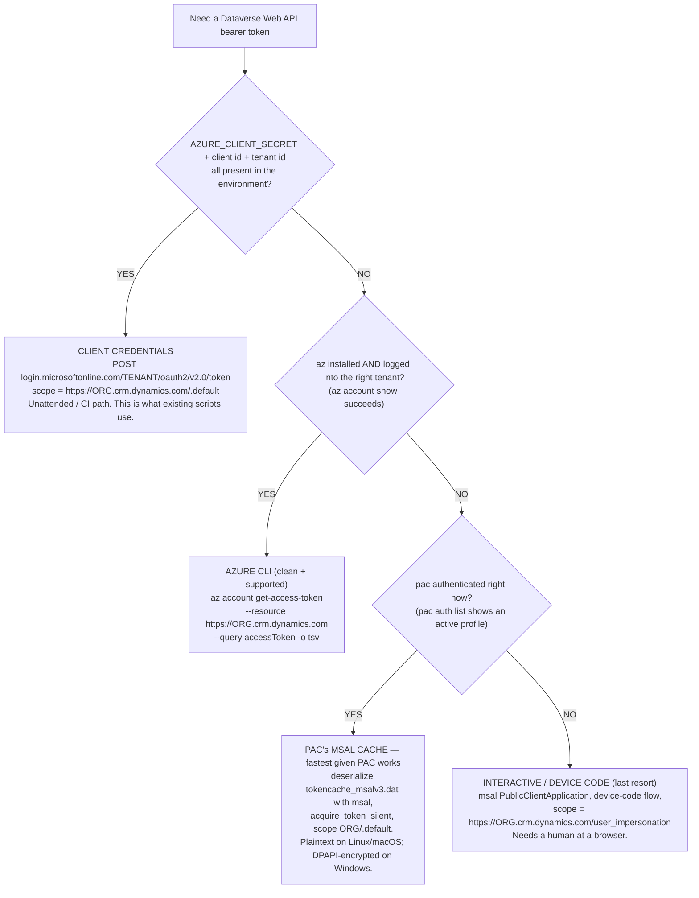

# Acquiring a Dataverse Web API bearer token — the fast path by environment

> **Last reviewed:** 2026-05-26. Source: production lesson — an agent updating a
> Power Automate flow via the Dataverse Web API in a GitHub Codespace burned many turns
> on auth dead-ends (churned through `az` CLI → `azure-identity` → a nonexistent
> `pac auth token` command before finding the PAC MSAL cache). Refresh when (a) `pac`
> ships a token-emitting command, (b) the PAC MSAL cache filename/format changes, or
> (c) Microsoft changes the Dataverse OAuth scope contract.

Every Dataverse Web API call needs an OAuth bearer token in the `Authorization` header.
The trap this file closes: **there are several ways to get that token, they depend on
what's already authenticated in the environment, and picking the wrong one first wastes
real time.** The companion file [`programmatic-flow-creation.md`](programmatic-flow-creation.md)
assumes you already hold a token — *this* file is how you get one.

---

## Decision Tree: Dataverse Web API — get a bearer token

**When this applies:** you need to call `https://<org>.api.<region>.dynamics.com/api/data/v9.2/…`
(create/read/update a `workflow` record, query a table, anything) from a script or shell,
and you need a token to do it. **Traverse top-to-bottom; the first branch whose condition
holds is your path — do NOT default to the client-credentials path just because the repo's
existing scripts use it.**

**Last verified:** 2026-05-26 against `pac` 2.7.x, Azure CLI 2.6x, Dataverse Web API v9.2.



### The heuristic (the actual lesson)

> **What is already authenticated is your fastest token source.** If `pac` is working,
> its token cache is *right there* — reach for it before assuming the client-credentials
> path. And: **the absence of `AZURE_CLIENT_SECRET` is a signal to switch paths, not to
> keep retrying it.** The secret is routinely *absent* on dev machines and Codespaces
> (it lives in CI/automation), so a failing client-credentials attempt there is expected,
> not a problem to debug.

This is the [Capability Grounding Protocol's](../CLAUDE.md) alternate-methods rule made
concrete: rank the paths by what's already authenticated (cheapest first), and try the
next one rather than retrying a path whose prerequisite is missing.

---

## The paths in detail

### 1. Client credentials — `AZURE_CLIENT_SECRET` present (CI / unattended)

The right path for pipelines and headless automation. The SPN must be an **Application
User** in the target environment with a Dataverse security role (see
[`scenarios/2026-05-21-spn-flow-create-403.md`](../scenarios/2026-05-21-spn-flow-create-403.md)
for the 403-if-missing trap).

```bash
curl -s -X POST "https://login.microsoftonline.com/${TENANT_ID}/oauth2/v2.0/token" \
  -d "client_id=${CLIENT_ID}" \
  -d "client_secret=${AZURE_CLIENT_SECRET}" \
  -d "grant_type=client_credentials" \
  -d "scope=https://${ORG}.crm.dynamics.com/.default" | jq -r .access_token
```

Confidential clients use the **`/.default`** scope.

### 2. Azure CLI — `az` logged into the tenant

Clean, supported, no secret to handle. Works when a human (or the env) has run `az login`
to the same tenant as the Dataverse org.

```bash
az account get-access-token \
  --resource "https://${ORG}.crm.dynamics.com" \
  --query accessToken -o tsv
```

(Newer Azure CLI also accepts the v2.0 form `--scope https://${ORG}.crm.dynamics.com/.default`.)
The PowerShell equivalent is `Get-AzAccessToken -ResourceUrl "https://${ORG}.crm.dynamics.com"`.

### 3. PAC's MSAL cache — `pac` is authenticated (the dev-machine fast path)

When `pac` is the thing that's working, **do not re-authenticate** — reuse its cached
session. `pac` is built on MSAL and persists its cache to:

| OS | Path | At rest |
|---|---|---|
| Linux / macOS | `~/.local/share/Microsoft/PowerAppsCli/` | **plaintext** |
| Windows | `%LOCALAPPDATA%\Microsoft\PowerAppsCli\` | **DPAPI-encrypted** (raw read is ciphertext) |

Filenames: `tokencache_msalv3.dat` (user auth) / `tokencache_spn_msalv3.dat` (SPN/S2S auth).

**Do not scrape the raw `access_token` out of the file** — it expires in ~1 hour. Load the
cache into MSAL and let it refresh silently:

```python
# Reference snippet — dev/Codespace only (plaintext cache assumed; Windows needs DPAPI unprotect)
import os, msal

ORG = "yourorg.crm.dynamics.com"                       # no scheme
CACHE = os.path.expanduser("~/.local/share/Microsoft/PowerAppsCli/tokencache_msalv3.dat")

cache = msal.SerializableTokenCache()
cache.deserialize(open(CACHE).read())
app = msal.PublicClientApplication(
    client_id="<the public client id pac is registered as>",  # from the cached account / pac
    token_cache=cache,
)
account = app.get_accounts()[0]
result = app.acquire_token_silent([f"https://{ORG}/.default"], account=account)
token = result["access_token"]                          # use in Authorization: Bearer <token>
```

This is brittle by nature — you're reusing an internal cache file whose name/format is
version-specific. **Prefer paths 1 or 2 when available; this is the pragmatic fallback when
`pac` is the only thing authenticated** (the common Codespace reality).

### 4. Interactive / device code — nothing is authenticated

Last resort; needs a human at a browser. Use `msal.PublicClientApplication` with the
device-code flow and the **`/user_impersonation`** scope (public clients use
`user_impersonation`, not `.default`).

---

## Scope cheat-sheet

| Client type | Scope |
|---|---|
| Confidential (client credentials, path 1) | `https://<org>.crm.dynamics.com/.default` |
| Public / interactive / device-code (paths 3–4) | `https://<org>.crm.dynamics.com/user_impersonation` |

The resource/audience is always the environment URL (`https://<org>.crm.dynamics.com`), no
trailing path.

---

## Security rules (non-negotiable)

- **Never print a full token** to the user or to logs. If you must show something, show
  the decoded claims (`aud`, `roles`/`scp`, `tid`, `exp`) — never the `aaa.bbb.ccc` string.
- **Tokens expire (~1 h).** Acquire on demand; don't persist them.
- **The cache file is not a credential to copy around.** Read it in place; never commit it,
  never move it to another machine.
- **`AZURE_CLIENT_SECRET` stays in env / Key Vault**, never in a file the repo tracks.

---

## Citations / sources

- Dataverse OAuth scopes (`/.default` confidential vs `/user_impersonation` public):
  [Use OAuth authentication with Microsoft Dataverse](https://learn.microsoft.com/power-apps/developer/data-platform/authenticate-oauth).
- `az account get-access-token` reference:
  [az account](https://learn.microsoft.com/cli/azure/account#az-account-get-access-token).
- Dataverse Web API via PowerShell (`Get-AzAccessToken -ResourceUrl`):
  [Quickstart: Web API with PowerShell](https://learn.microsoft.com/power-apps/developer/data-platform/webapi/quick-start-ps).
- PAC CLI auth command group (no token-print command exists):
  [pac auth](https://learn.microsoft.com/power-platform/developer/cli/reference/auth).
- MSAL token cache at rest (plaintext on Linux/macOS, encrypted on Windows):
  [Acquire and cache tokens with MSAL](https://learn.microsoft.com/entra/identity-platform/msal-acquire-cache-tokens).
- Internal: production after-action, Codespace flow-update engagement, 2026-05-26 (Matt Corbett).
- Companion: [`programmatic-flow-creation.md`](programmatic-flow-creation.md) (what to do once you have the token),
  [`../scenarios/2026-05-26-dataverse-token-acquisition-deadends.md`](../scenarios/2026-05-26-dataverse-token-acquisition-deadends.md) (the field-note symptom).
```
