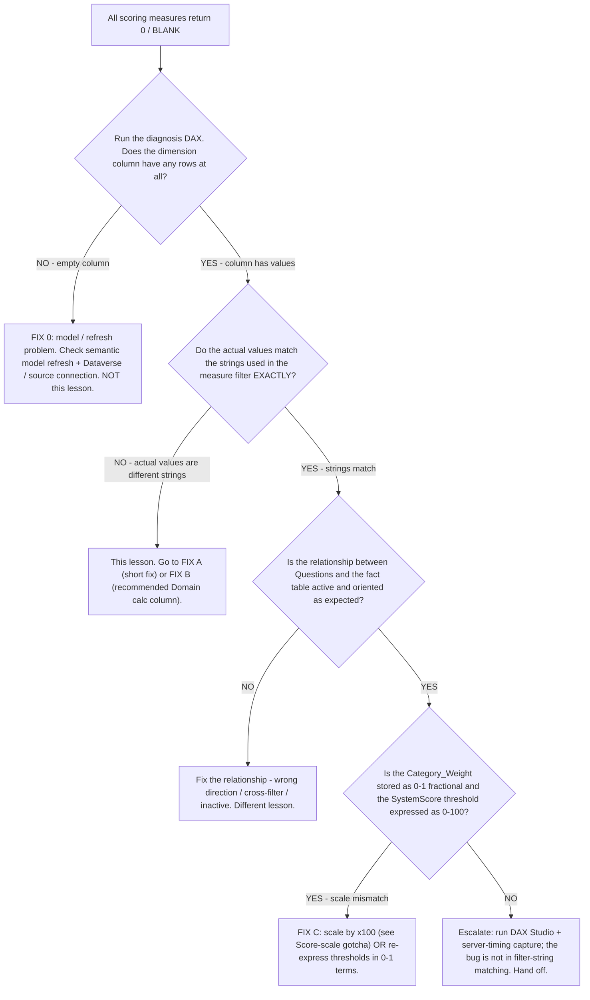

# DAX measure filters with hardcoded category names — silent zero-score bug

> **Last reviewed:** 2026-06-04. **Refreshed 2026-06-04** with the §Question-number variant section (Lessons 3 + 4 from the BMA-CSP-Risk-Scoring session — same silent-zero shape, same `EVALUATE SUMMARIZE` diagnosis pattern, applied to question numbers rather than category names) and a cross-link to the new [`pbir-fabric-rest-debugging.md`](pbir-fabric-rest-debugging.md) reference. Source: production incident on the **BMA CSP Thematic Review** engagement (BTCSI DEV workspace, June 2026). All scoring measures in a deployed PBIR Enhanced report returned `0` / `BLANK()` for 59 entities that had actual response data. Refresh when (a) a downstream consumer migrates the lesson to a richer test discipline (live-query smoke test in the deploy step), (b) Power BI / Fabric surfaces a "no rows matched filter" warning in measures (it does not today, which is why this lesson exists), or (c) calculation-group surfaces evolve in a way that makes the `Domain` calculated-column pattern obsolete.
>
> **Claim-grounding note.** The bug shape (silent zero from a no-match string filter), the diagnosis DAX, and the two fix patterns are taken from a real customer-engagement debug session at the date above. The specific category strings and score-scale numbers are from that engagement; treat them as illustrative — re-derive the analogous strings for your model.

## TL;DR — the silent failure

A DAX measure that filters by **hardcoded string literal** against a dimension column:

```dax
Questions[Category] = "Core"
```

…returns an empty table if `"Core"` does not exactly match any value in `Questions[Category]`. `SUMX` / `CALCULATE` over an empty table return `BLANK()`. Every downstream measure that builds on it returns 0 or `BLANK()`. **Power BI shows the result as 0 — no warning, no error, no broken visual.** The report deploys cleanly, renders cleanly, and shows 0 across the board.

This is the failure mode that bit the BMA CSP Thematic Review report: every measure assumed short category names (`"Core"`, `"Client Money"`, `"Directorship"`, `"Nominee"`) while the actual data carried the long `"SERVICES PROVIDED AS PART OF ITS CSP LICENSE"`-style strings. Result: `System Score = 0` and `Applicable Ceiling = 0` for all 59 entities; `SystemScore% = BLANK()`; every entity landed in "Low Risk" regardless of compliance.

## Why it's silent (and why this matters)

| What happens | What Power BI surfaces |
|---|---|
| `Questions[Category] = "Core"` matches zero rows | No warning |
| `CALCULATE(MEASURE, <empty filter>)` returns `BLANK()` | Treated as `0` in arithmetic |
| `SUMX(<empty>, …)` returns `BLANK()` | Treated as `0` in arithmetic |
| Cards/tables/charts plot `0` | Renders as a normal `0` — indistinguishable from a true zero |
| `SystemScore` is `0` and threshold is `>= 75` | Every entity in the low band |

There is no error, no broken visual, no measure-level warning, no semantic-model validation flag. The report is *wrong*, not *broken*. The downstream stakeholder reading the report sees a coherent, plausible-looking dashboard with all-zero scores and assumes either "no one is compliant" or "the data isn't loading yet" — neither of which is the real cause.

## Decision Tree: every scoring measure returns 0 or BLANK

**When this applies:** a PBIR Enhanced (or classic PBIX) report deployed against a real semantic model shows `0` / `BLANK` across every entity for measures that filter a dimension column by a hardcoded string. **Traverse top-to-bottom — do not pattern-match on the stakeholder's description.**



**Each leaf in plain words:**

- **FIX 0** is a different problem — a semantic-model refresh / source connection failure. Out of scope here.
- **FIX A / FIX B** are this lesson. FIX A is the in-place string fix; FIX B is the recommended `Domain` calculated-column pattern.
- **FIX C** is the score-scale gotcha. Often co-occurs with FIX B (the `Domain` fix surfaces fractional weights and the scale problem becomes visible).
- **FIX_REL** and **ESCALATE** are out of scope for this file; they earn their own lessons.

## Real example — BMA CSP Thematic Review (2026-06)

| Short name (assumed in the broken DAX) | Actual `Questions[Category]` value(s) in the deployed model |
|---|---|
| `"Core"` | `"SERVICES PROVIDED AS PART OF ITS CSP LICENSE"` |
| `"Client Money"` | `"PART 1: DEFINITION OF CLIENT MONEY"`, `"PART 2: SEGREGATION OF FUNDS"`, `"PART 3: ACCOUNTING AND RECORD - KEEPING"`, `"PART 4: RECONCILIATION"` *(spans **4** categories)* |
| `"Directorship"` | `"PART 5: DIRECTORSHIP SERVICES"` |
| `"Nominee"` | `"PART 6: NOMINEE SHAREHOLDER SERVICES"` |

The one-to-many cases (`"Client Money"` → four `PART N:` categories) make this **worse than a simple typo**: even hand-fixing the short string to one of the four `PART N:` strings leaves three categories silently excluded, so the measure looks half-fixed but still loses 75% of the data.

## Diagnose — the SUMMARIZE pattern

When every scoring measure returns 0, run this against the live semantic model — via DAX Studio, Tabular Editor, or the Power BI REST `executeQueries` endpoint (`POST .../groups/{wid}/datasets/{did}/executeQueries`):

```dax
EVALUATE
SUMMARIZE(
    Questions,
    Questions[Category],
    "Count", COUNTROWS(Questions),
    "Weight", MAX(Questions[Category_Weight])
)
ORDER BY Questions[Category]
```

What to look for:

1. **Are there any rows?** If `Count` is empty everywhere, FIX 0 (refresh / source) — not this lesson.
2. **Do the strings match the measure filters?** Eyeball the `Category` column against the literal strings in every `CALCULATE(... Questions[Category] = "X")`. Any mismatch → this lesson.
3. **Is there a many-to-one mapping?** If logical groupings (`"Client Money"`) span multiple categorical rows (`"PART 1:"`–`"PART 4:"`), you need FIX B (the `Domain` calculated column), not FIX A.
4. **What's the weight scale?** If `Weight` is `0.167`-style fractions summing to 1.0 *and* downstream thresholds use absolute integers (`>= 75`), you need FIX C (score-scale) on top.

## FIX A — quick in-place fix (simple 1:1 mapping)

When each short name maps to exactly one actual category string (no `"Client Money"`-style many-to-one), update the literals in-place:

```dax
-- before (broken)
CALCULATE([Section Score], Questions[Category] = "Core")

-- after
CALCULATE([Section Score], Questions[Category] = "SERVICES PROVIDED AS PART OF ITS CSP LICENSE")
```

**When this is the right choice:** prototype phase, exploratory report, one-time deliverable. The category strings are now hard-coded to *the data source's current naming*, so a future rename in the source rebreaks the report silently — the bug just moved.

## FIX B — recommended: `Domain` calculated column (decouples DAX from data-source strings)

Add a calculated column to the source dimension table that maps raw category strings to stable, short *domain* names. Every measure references the domain, not the raw category. The DAX becomes resilient to data-source string renames.

```tmdl
column Domain
    dataType: string
    expression =
            SWITCH(
                [Category],
                "SERVICES PROVIDED AS PART OF ITS CSP LICENSE", "Scope",
                "PART 1: DEFINITION OF CLIENT MONEY", "Client Money",
                "PART 2: SEGREGATION OF FUNDS", "Client Money",
                "PART 3: ACCOUNTING AND RECORD - KEEPING", "Client Money",
                "PART 4: RECONCILIATION", "Client Money",
                "PART 5: DIRECTORSHIP SERVICES", "Directorship",
                "PART 6: NOMINEE SHAREHOLDER SERVICES", "Nominee",
                "PART 7: AML QUESTIONS", "AML",
                "Other"
            )
    isDataTypeInferred: false
    summarizeBy: none
    annotation SummarizationSetBy = User
```

Measures then reference `Questions[Domain] = "Client Money"` instead of any raw `Questions[Category]` string.

**Why this is the recommended fix:**

1. The mapping lives in **one place** in the model, not scattered across every measure.
2. A source-side rename of a category string is fixed once in the `SWITCH`, not across every measure.
3. The many-to-one case (`"Client Money"` spanning 4 `PART N:` rows) collapses cleanly to one domain value — measures that compute against `Domain` don't lose 75% of the data.
4. The default fallback (`"Other"`) means a *new* category appearing in the source data is visible and explicit instead of silently dropped.

### Weighting domains correctly when a domain spans multiple categories

When a single domain spans N source categories, the **domain weight** must be the **sum** of the constituent category weights — not `MAX`, not the per-row weight. Otherwise a 4-category domain (`"Client Money"`) is undercounted by 4×.

```dax
-- Correct: sum the per-category weight across every category that maps to Client Money.
-- REMOVEFILTERS(Questions) clears any visual-context filter so the SUMX iterates the
-- full distinct set of categories; the inner CALCULATE pins the weight per category.
VAR CMWeight =
    CALCULATE(
        SUMX(
            DISTINCT(Questions[Category]),
            CALCULATE(MAX(Questions[Category_Weight]))
        ),
        REMOVEFILTERS(Questions),
        Questions[Domain] = "Client Money"
    ) * 100   -- × 100 only if Category_Weight is stored as a 0–1 fraction; see FIX C
```

## FIX C — score-scale gotcha (× 100 if `Category_Weight` is fractional)

If `Category_Weight` is stored as a 0–1 fraction (e.g. each `PART N:` weighted `0.167` so the four parts sum to ~1.0) and the `SystemScore Band` thresholds are expressed in absolute 0–100 terms (`>= 75 → High`), **the unscaled `SystemScore` is in 0–1 territory and `>= 75` is never true**. Every entity lands in the lowest band.

Two fixes — pick one and apply it consistently:

| Fix | Where it lives | Tradeoff |
|---|---|---|
| Scale domain weights by `× 100` in the weight measure (as in § FIX B `VAR CMWeight … * 100`) | Inside the measure | Easy to add, easy to forget on the *next* measure |
| Re-express the `SystemScore Band` thresholds in 0–1 terms (`>= 0.75 → High`) | In the band measure | Once-and-done, but every threshold doc + stakeholder communication needs the same 0–1 convention |

**Picking the wrong one silently:** scaling the weight measure × 100 *and* leaving thresholds at `>= 75` is correct; scaling the weight × 100 *and* moving thresholds to `>= 0.75` double-shifts and every entity ends up in `High` regardless of compliance. The score-scale and the threshold-scale are a single contract — both must move together.

## Prevention rule (for every future DAX measure)

> **Every time a DAX measure is written with a hardcoded string filter on a dimension column, verify that string exists in the actual data before deploying.**
>
> Run the § Diagnose `SUMMARIZE` against the live semantic model and confirm the filter string is one of the returned `Category` values. Do this as part of build/deploy verification, **not** after noticing all scores are zero.

This pairs naturally with the `power-platform-tester` agent's coverage (a "string-filter-against-live-model" smoke test in the DAX-Studio/server-timings layer) and with the `solution-alm-engineer` agent's deploy checklist. **Make the verification a deploy-step, not a vigilance discipline** — the lesson learned here is *that vigilance fails silently when there's no surfaced error*.

## Variant — question-number string mismatch (BMA-CSP Lessons 3 + 4, 2026-06-04)

The same silent-zero shape applies to **question numbers** in a scorer DAX, not just category names. From the BMA-CSP-Risk-Scoring session (`mcorbettbma/BTCSIReporting`, 2026-06-04):

- Gateway-applicability measures filtered `Questions[Question_Number] = <N>` where `<N>` had been read from the project's design doc, not from the live data. Three of the four gateway measures pointed at the wrong question (e.g. `Client Money Applicable` checked Q1 — "Acting as company formation agent" — when it should have checked Q14 — "Does your company hold or receive money on behalf of clients?"). Result: every entity scored Low Risk; nothing flagged Medium / High / Very High.
- The downstream `Question Raw Score` had **SWITCH routing bugs**: Yes/No questions (Q8, Q9, Q15, Q17–Q20, Q23) were mapped to A/B/C/D custom scorers and always returned BLANK; multi-choice questions (Q16, Q21, Q29, Q32, Q33, Q34, Q36, Q37) were not in the SWITCH at all and also returned BLANK; one inner reference looked at `Question_Number = 19` (a Yes/No question) when it should have been `= 16`; one mapping was missing the `E=5` entry. All silent.

**The diagnosis pattern is identical to the §Diagnose pattern above** — `EVALUATE SUMMARIZE(...)` against the live model via REST. The query that closed the gateway diagnosis in <5 minutes (after 2 hours of in-portal iteration):

```dax
EVALUATE
    SUMMARIZECOLUMNS(
        Questions[Question_Number],
        Questions[Question_Text],
        "Sample_Answer", FIRSTNONBLANK(Responses[Value], 1)
    )
```

And the query that closed the SWITCH routing bugs by enumerating every distinct (Question_Number, Value) combination:

```dax
EVALUATE SUMMARIZE(Responses, Responses[Question_Number], Responses[Value])
```

Run it via the Fabric REST `executeQueries` endpoint — full pattern + auth chain in [`pbir-fabric-rest-debugging.md`](pbir-fabric-rest-debugging.md). The general rule from the BMA-CSP session: **before writing any string-literal or integer-literal filter in a scorer DAX, run a SUMMARIZE against the live model and confirm the actual values match the assumption.** 5 minutes of REST query saves 2 hours of in-portal iteration; the failure mode is identical to the Category case above (silent zero, no warning, plausible-looking dashboard).

### Prevention rule for SWITCH-based scorers (Lesson 4 follow-on)

When authoring a `Question Raw Score` (or any `SWITCH`-on-question-number scorer):

1. **First** enumerate every distinct (Question_Number, Value) combination via REST `executeQueries` (`EVALUATE SUMMARIZE(Responses, [Question_Number], [Value])`).
2. **Then** classify each question by answer-shape: Yes/No, A/B/C/D, multi-choice with custom weights, free-text.
3. **Then** write the `SWITCH` — one branch per question-shape, with the right scorer function per branch.

Skipping step 1 = silent zeros for every misrouted question. The author has no signal until a stakeholder asks "why is every entity Low Risk?" — by which point the model has been deployed and consumed downstream.

---

## Why a generated test, not a code-review-only fix

A code reviewer reading the broken measure has no way to know the source data uses `"PART 1: DEFINITION OF CLIENT MONEY"` and not `"Client Money"` — the filter string *looks* reasonable on its own. The only way to catch this class of bug is by running the measure (or the equivalent SUMMARIZE) against the live model and asserting non-empty rows. So:

- **Code review catches structural problems** (missing relationships, wrong DAX shape).
- **Generated runtime tests catch data-driven problems** (string filters with no matches, scale mismatches, missing-category fallback).

The two are complementary; this lesson lives at the boundary.

## Owner & cross-reference

**Primary owner:** `power-bi-engineer` (carries the inline knowledge prior for this file).

**Companion files in this knowledge bank:**

- [`pbir-enhanced-report-loading.md`](pbir-enhanced-report-loading.md) — the debug runbook for PBIR Enhanced reports that won't render. This file lives one step downstream: report *renders* but every measure returns 0.
- [`pbir-enhanced-reference.md`](pbir-enhanced-reference.md) — full PBIR Enhanced format reference for new visual / page / report authoring. Read when *building*, not when *debugging measures*.
- [`sempy-fabric-reference.md`](sempy-fabric-reference.md) — the Python-from-a-Fabric-notebook reference. `evaluate_dax(dataset, "EVALUATE SUMMARIZE(...)")` is the single most useful sempy call for live-verifying filter strings against the deployed model. Use it inside a notebook to automate the § Diagnose pattern across all measures.

**Routing notes for the Team Lead:**

- A bug report shaped "every score is 0 / BLANK in the report" → `power-bi-engineer` traverses § Decision Tree before opening the model.
- A request for a new scoring report → `power-bi-engineer` authors with FIX B (`Domain` calculated column) by default and hands off to `power-platform-tester` for the smoke-test layer.
- A request to verify deployed measure correctness across a workspace → `power-bi-engineer` writes a sempy notebook that iterates measures + asserts `executeQueries` returns non-empty for known-good entities.
- Hand-off to `solution-alm-engineer` when the fix is in and the deploy step needs the smoke test wired into the pipeline.
