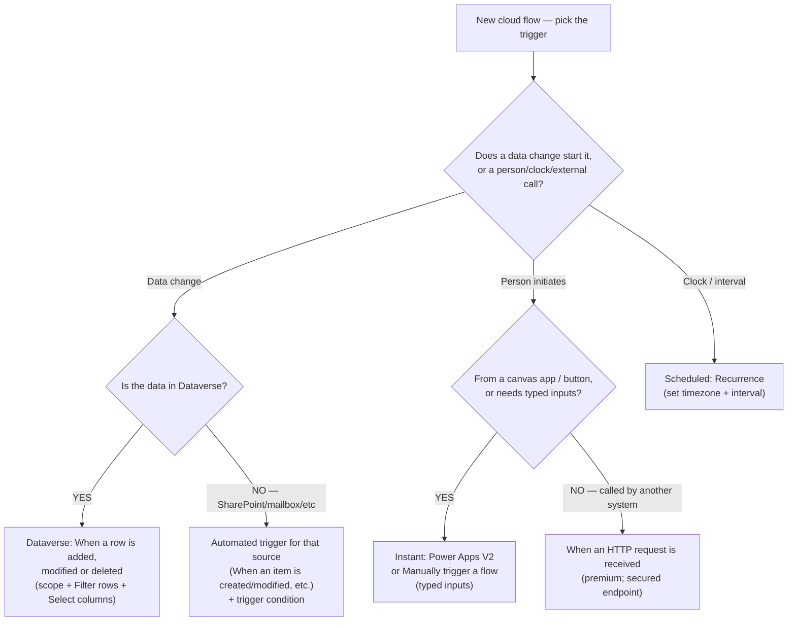
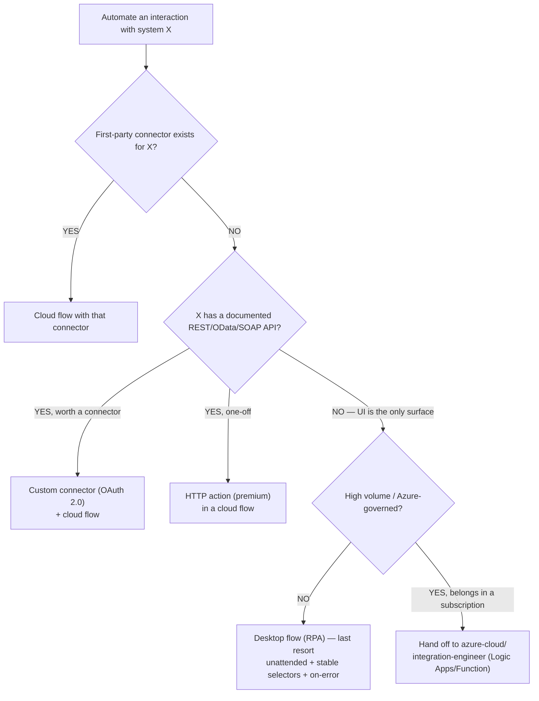
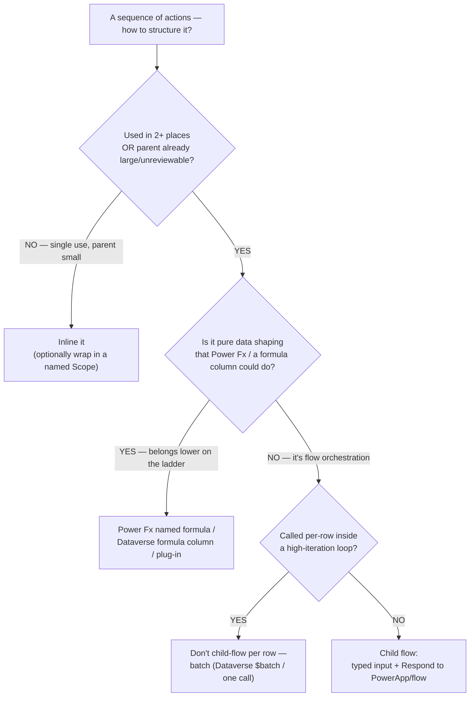
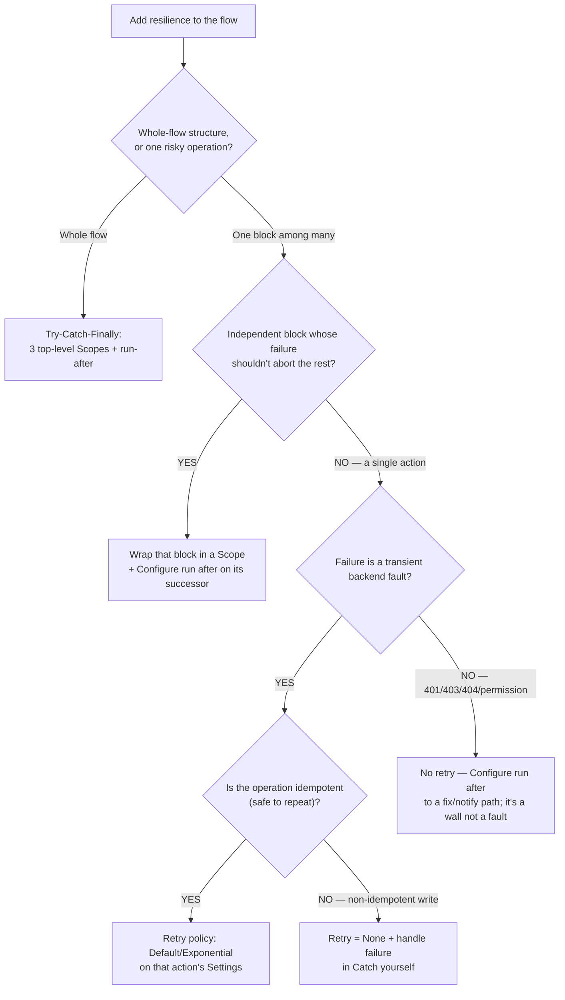
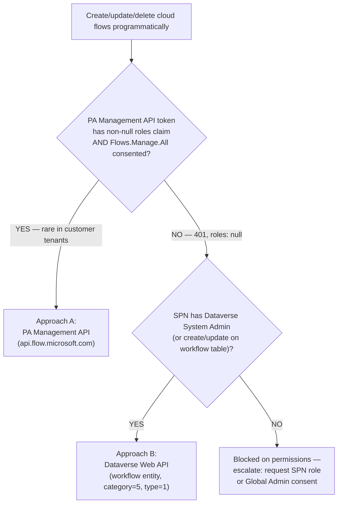
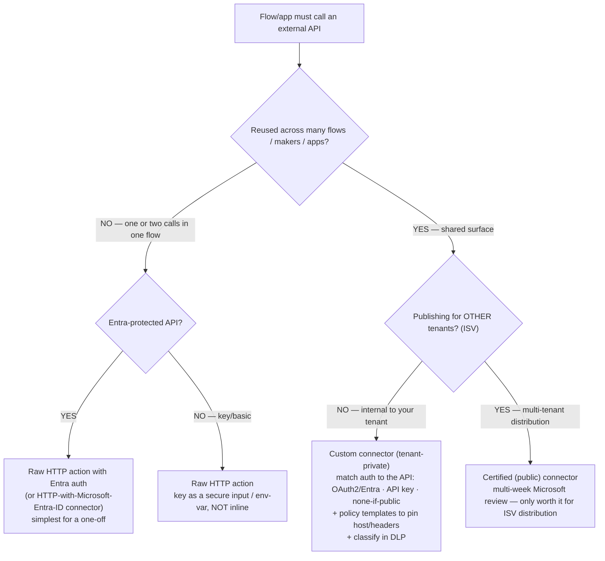
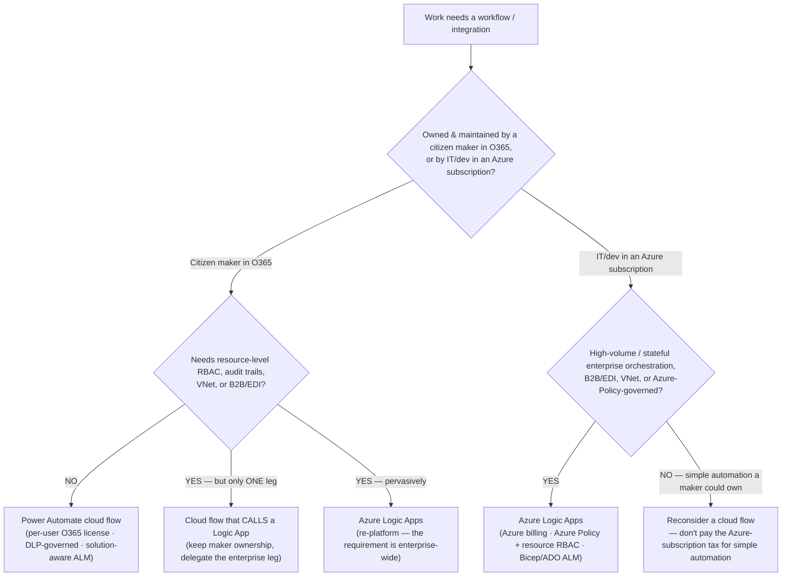

# Power Automate flow decision trees

> **Last reviewed:** 2026-05-30. Canonical multi-tree reference for `flow-engineer`. Format follows [`../../../docs/best-practices/decision-trees-in-knowledge-files.md`](../../../docs/best-practices/decision-trees-in-knowledge-files.md). Each tree is traversed **top-to-bottom before selecting a method** — do NOT pattern-match on keywords in the user's situation description; the first branch whose condition resolves cleanly is the leaf to apply.
>
> The PA-flow-*recovery* tree (a flow that's stuck / off / broken after import) lives separately in [`programmatic-flow-creation.md`](programmatic-flow-creation.md) — this file covers *design-time* decisions (which trigger, which surface, reuse, error pattern, programmatic-create approach). Refresh any tree whose `Last verified` is older than ~90 days.

---

## Decision Tree: Triggers — which trigger type?

**When this applies:** You are starting a new cloud flow and must pick its trigger. The observable inputs are: *what kicks it off* (a data change, a person, a clock, an external system) and *where the data lives* (Dataverse, SharePoint, a mailbox, an external API).

**Last verified:** 2026-05-30 against Power Platform release wave 2026.1 (trigger categories: automated / instant / scheduled; Dataverse *When a row is added, modified or deleted*).

**Rationale per leaf:**

- *Dataverse trigger (DV)* — when the source is a Dataverse table, the first-party row trigger gives you server-side **Filter rows** (OData) + **Select columns** + **scope** (User/BU/Org), which filter *before* a run is created. **requires:** the trigger's connection reference bound in the target environment.
- *Automated (AUTO)* — for non-Dataverse sources (SharePoint, Outlook, etc.), use that source's automated trigger and add a **trigger condition** to gate runs at the source (see `flow-trigger-conditions-not-runtime-filters.md`).
- *Instant (INSTANT)* — a human (or a canvas app) starts it and you want **typed inputs**; Power Apps V2 / Manually-trigger carry a typed schema the caller fills.
- *HTTP* — an external system calls in; *When an HTTP request is received* is the inbound webhook surface (premium, secure the URL/SAS, validate payload).
- *Scheduled (SCHED)* — time-driven; Recurrence with an explicit timezone (the #1 scheduled-flow bug is a missing/UTC timezone firing at the wrong local hour).

**Tradeoffs summary:**

| Trigger type | Fires on | Filters before run? | Premium? | Use when |
|---|---|---|---|---|
| Dataverse row add/mod/del | A Dataverse row change | YES — Filter rows + Select columns + scope | Dataverse = premium | Source is a Dataverse table |
| Automated (SharePoint/mail/etc.) | A source-system event | Partial — trigger condition only | Depends on connector | Source is a non-Dataverse first-party connector |
| Instant (Power Apps V2 / Manual) | A person / canvas app | n/a | No (unless premium action inside) | Human- or app-initiated, typed inputs |
| When an HTTP request is received | External inbound call | n/a (validate in-flow) | **Yes** | Another system calls the flow as a webhook |
| Scheduled (Recurrence) | A clock / interval | n/a | No | Time-driven batch work |

---

## Decision Tree: Automation surface — cloud flow vs desktop flow (RPA)

**When this applies:** You must automate an interaction with some system and are deciding *how* the flow touches it. Observable input: does the target system expose a programmatic surface (connector / REST / OData / SOAP), or is its UI the only way in?

**Last verified:** 2026-05-30 against Power Automate (cloud) + Power Automate for desktop. RPA licensing/capacity specifics marked volatile.

**Rationale per leaf:**

- *Cloud + connector (CLOUD)* — observable, testable, survives vendor UI changes; always first choice when a connector exists.
- *Custom connector (CUSTOM)* — the system has an API but no first-party connector worth reusing; wrap it once in an OAuth-2.0 custom connector. **requires:** an OAuth app registration / API credentials for X.
- *HTTP action (HTTPACT)* — API exists but a full custom connector isn't justified for a single call; the premium HTTP action does it inline. **requires:** premium licensing.
- *Desktop flow (RPA)* — **only** when there is genuinely no programmatic surface; fragile, needs a machine group + gateway, premium/RPA capacity. Build defensively (see `flow-desktop-rpa-is-last-resort.md`). **requires:** RPA capacity + a registered machine/machine-group + gateway.
- *Azure handoff (AZURE)* — if it's high-volume, Bicep/Terraform-governed, and lives in an Azure subscription, it's not a Power Automate flow at all (CLAUDE.md §11).

**Tradeoffs summary:**

| Surface | Fragility | Testable? | Licensing | Use when |
|---|---|---|---|---|
| Cloud flow + first-party connector | Low | Yes | Standard/premium per connector | A connector exists |
| Custom connector + cloud flow | Low | Yes | Premium | Documented API, reusable |
| HTTP action in cloud flow | Low | Yes | Premium | Documented API, one-off |
| Desktop flow (RPA) | **High** — breaks on UI change | Hard | Premium + RPA capacity | No API; UI is the only surface |
| Azure Logic App / Function | Low | Yes | Azure subscription | High-volume, subscription-governed |

---

## Decision Tree: Reuse — child flow vs inline vs other surface

**When this applies:** You have a sequence of actions and must decide whether to inline it, extract it into a child flow, or push it to another platform tier. Observable input: how many call sites reuse it, how big the parent already is, and whether the logic belongs lower on the mechanism ladder.

**Last verified:** 2026-05-30 against Power Automate solution-aware child-flow model (Run a Child Flow).

**Rationale per leaf:**

- *Inline (INLINE)* — single use in a small parent; a child flow's synchronous round-trip and extra run record aren't worth it. Wrap in a named `Scope` for readability/error-isolation if useful.
- *Lower on the ladder (LOWER)* — if it's pure data shaping, the platform's "lowest-tier mechanism" rule says do it in Power Fx / a formula column / a plug-in, not a flow round-trip.
- *Batch (BATCH)* — reusable but invoked per-row in a big loop; N child-flow calls is N runs against your budget. Collapse to a batch call instead (see `flow-concurrency-and-pagination.md`).
- *Child flow (CHILD)* — genuine reuse (2+ sites) or a parent that's grown unreviewable; extract with a **typed input schema** + **Respond to a PowerApp or flow** output. **requires:** child and parent in the **same solution** (child must be solution-aware to be callable, and inherits the parent's connection references).

**Tradeoffs summary:**

| Choice | Maintenance | Run/latency cost | Review impact | Use when |
|---|---|---|---|---|
| Inline (+ Scope) | Drift risk if copied | None extra | Larger parent | Single use, small parent |
| Power Fx / formula column / plug-in | Lowest (right tier) | None (no flow round-trip) | Logic leaves the flow | Pure data shaping |
| Batch instead of per-row child | One call to maintain | **Far lower** than N calls | Simpler loop | Reusable but per-row in big loop |
| Child flow | One place to fix/test | One sync round-trip per call | Smaller, reviewable parent | Reused 2+ times / big parent |

---

## Decision Tree: Error handling — which resilience pattern?

**When this applies:** You are adding error handling to a flow and choosing the *shape*. Observable input: is this the whole flow, one risky block, or a transient backend fault — and is the failing operation safe to repeat?

**Last verified:** 2026-05-30 against Power Automate / Logic Apps shared runtime (Scope + Configure run after; retry policies Default/Exponential/Fixed/None).

**Rationale per leaf:**

- *Try-Catch-Finally (TCF)* — the mandatory whole-flow scaffold for any production flow: a `Try`, a `Catch` (run-after **has failed / has timed out / is skipped**), a `Finally` (all four). See `flow-error-handling-and-retry-policy.md`.
- *Scope (SCOPE)* — one block whose failure should be contained without aborting the run; wrap it and route its successor's run-after to handle the failure locally.
- *Retry (RETRY)* — a single action hitting a transient 408/429/5xx, and the op is **idempotent**; Default (4 exponential) or a tuned Exponential policy.
- *Retry = None (NONE)* — transient-looking but the op is **non-idempotent** (a `POST` that creates a record); retrying risks duplicates, so disable retry and recover in `Catch`.
- *No retry / run-after (RUNAFTER)* — 401/403/404 are permission/not-found **walls**, not transient faults; retrying just delays the fix. Route run-after to a notify/fix path.

**Tradeoffs summary:**

| Pattern | Scope of protection | Risk if misused | Use when |
|---|---|---|---|
| Try-Catch-Finally | Whole flow | Boilerplate on tiny flows | Every production flow |
| Scope + run-after | One block | Over-nesting | Contain one risky block |
| Retry (Default/Exponential) | One action | Duplicates if non-idempotent | Transient fault, idempotent op |
| Retry = None + Catch | One action | Lost recovery if Catch absent | Transient-looking, non-idempotent write |
| No retry, run-after to fix | One action | Retrying masks the real wall | 401/403/404 permission/not-found |

---

## Decision Tree: Programmatic flow creation — Approach A vs B

**When this applies:** You must create / update / delete cloud flows *programmatically* (a script, not the designer) — typically bulk. Observable inputs: does a service-principal token come back from the PA Management API with a usable `roles` claim, and does the SPN hold Dataverse `System Administrator` (or create/update on the `workflow` table)?

**Last verified:** 2026-05-30 (consistent with [`programmatic-flow-creation.md`](programmatic-flow-creation.md), production lesson May 2026; `pac flow` still does not exist as of `pac` v2.7.4).

**Rationale per leaf:**

- *Approach A (PA Management API)* — only viable when a Global Admin has consented `Flows.Manage.All` (application permission) to the SPN, so the token carries a usable `roles` claim. Needed regardless for run-history inspection, ownership transfer, and sharing. **requires:** Global-Admin-consented `Flows.Read.All`/`Flows.Manage.All` on the SPN.
- *Approach B (Dataverse Web API)* — the reliable path in real tenants: cloud flows are `workflow` records (`category=5`, `type=1`, `primaryentity="none"`); three calls (`POST /workflows`, `POST /AddSolutionComponent` ComponentType 29, `DELETE /workflows({id})`) do create/bind/delete. The SPN you already use for solution import usually suffices. **requires:** SPN with `System Administrator` (or create/update/delete on the `workflow` + `solution` tables) in the target environment. Watch the two failure modes: `clientdata` must be templated from a **live** record (not a PA export), and dependent-flow GUIDs must be injected after the parent is created.
- *Escalate (ESCALATE)* — neither permission held; this is the Capability Grounding Protocol's "do I have authority?" moment — request the SPN role or Global Admin consent rather than guessing.

**Tradeoffs summary:**

| Approach | Permission needed | Reliability in customer tenants | Covers | Use when |
|---|---|---|---|---|
| A — PA Management API | Global-Admin-consented app permission | Low (usually 401, roles null) | Create + run history + sharing + ownership | App permission genuinely consented |
| B — Dataverse Web API | SPN System Admin (or workflow CRUD) in env | High (same SPN as solution import) | Create / read / update / delete of the workflow record | Default for bulk create/update/delete |
| Escalate | n/a | n/a | n/a | Neither permission held |

The canonical write-up — auth-surface trap, the `clientdata` live-shape gotcha, the GUID-injection rule, and the full bulk-create checklist — is [`programmatic-flow-creation.md`](programmatic-flow-creation.md); the adjacent best-practice is [`../best-practices/create-cloud-flows-via-dataverse-web-api.md`](../best-practices/create-cloud-flows-via-dataverse-web-api.md).

---

## Decision Tree: Calling an external API — raw HTTP action, custom connector, or certified connector?

**When this applies:** a flow (or app) needs to call an external/back-end API and the question is _how to wrap it_ — a raw `HTTP` action inline, an authored **custom connector**, or pursuing **Microsoft certification**. Observable inputs: how many flows/makers will reuse it, whether the API is Entra-protected vs key-based, whether per-user delegated access is needed, and whether you're an ISV publishing for _other_ tenants. **Scope:** this tree is about _how to wrap an HTTP-callable API_; it does **not** decide Power Automate vs Logic Apps vs Azure Function (that's the automation-surface call `flow-engineer` makes per §11) — assume the work already belongs in a Power Platform flow/app.

**Last verified:** 2026-05-30 against [`../best-practices/connector-custom-connector-auth-and-policy.md`](../best-practices/connector-custom-connector-auth-and-policy.md). Certification mechanics + the policy-template catalog are platform-version-sensitive — `[verify-at-build]`.

**Rationale per leaf:**

- _HTTPENTRA / HTTPKEY_ — a one-off call doesn't justify authoring a whole connector; a raw HTTP action (Entra auth for Entra-protected APIs, key as a **secure input / env-var** for key-based) is simpler. Never inline a secret in the action (anti-pattern; auth verdict escalates to `ravenclaude-core/security-reviewer`).
- _CUSTOM_ — the moment the API is reused across flows/makers, author a **tenant-private custom connector**: it lives in your environment, is governed by your DLP, needs no Microsoft review. Match the auth scheme to the API's real model (OAuth2/Entra · API key as a connection credential · none only for genuinely public read-only), use policy templates to pin the backend host/headers, and **classify it in DLP** (Business/Non-Business/Blocked) so it doesn't default-surprise.
- _CERT_ — certification is a multi-week Microsoft process worth it **only** if you're an ISV publishing the connector for other tenants; it is not a deployment step for an internal connector.

**Tradeoffs summary:**

| Path | Reuse | Auth handling | Governance | Effort | Use when |
|---|---|---|---|---|---|
| Raw HTTP action | none (one flow) | inline action auth (secret as secure input) | per-flow | lowest | one/two calls, one flow |
| Custom connector (tenant-private) | across your tenant | declared scheme (OAuth2/key) + policy templates | your DLP, no MS review | medium | reused internal API |
| Certified (public) | across other tenants | declared scheme + MS review | Microsoft + your DLP | highest (multi-week) | ISV distributing to other tenants |

This tree operationalizes [`../best-practices/connector-custom-connector-auth-and-policy.md`](../best-practices/connector-custom-connector-auth-and-policy.md); DLP classification of any new connector runs through the [`alm-governance-decision-trees.md`](alm-governance-decision-trees.md) connector-classification tree, and any auth/secret verdict escalates to `ravenclaude-core/security-reviewer`.

---

## Decision Tree: Integration platform — Power Automate cloud flow vs Azure Logic Apps

**When this applies:** the work clearly needs a *workflow/integration* (not a canvas-app `Patch`, not a Dataverse plug-in), and the question is **which platform** authors and runs it. Observable inputs: who will own and maintain it, how it's licensed (per-user O365 vs an Azure subscription), which governance plane controls it (DLP vs Azure Policy), how it deploys (Power Platform solution vs Bicep/ADO), and whether the workload is simple business automation or high-volume/B2B/VNet-bound enterprise integration. This is the **initial call `flow-engineer` makes per CLAUDE.md §11** — and the hand-off branch to `azure-cloud/integration-engineer`.

**Last verified:** 2026-06-08 against Microsoft Learn *Integration and Automation Platform Options in Azure* (`functions-compare-logic-apps-ms-flow-webjobs`, first-party, `ms.date 2026-03-23`) and *Power Automate vs Logic Apps* (`microsoft-365/community/power-automate-vs-logic-apps`, community, `updated_at 2025-11-14`). Pricing/plan economics are volatile — `[verify-at-use]`. Research: [`../../../docs/research/2026-06-08-power-platform-best-practices/`](../../../docs/research/2026-06-08-power-platform-best-practices/).

**Rationale per leaf:**

- *Power Automate cloud flow (FLOW)* — a citizen maker owns it, it's licensed per-user in Office 365, governed by **DLP**, and ships via solution-aware ALM (connection refs + env vars + pipelines). The default for approvals, notifications, and simple first-party-connector automation. **requires:** the maker's per-user (or per-flow) Power Automate license + any premium-connector license.
- *Cloud flow calls a Logic App (HYBRID)* — the workflow is maker-owned but **one** leg needs an enterprise capability (B2B/EDI, VNet, resource RBAC). "A Power Automate flow can call an Azure Logic Apps workflow" (first-party), so delegate that leg instead of re-platforming everything. **requires:** an Azure subscription for the Logic App.
- *Azure Logic Apps (LOGIC1 / LOGIC2)* — it lives in an Azure subscription, is governed by **Azure Policy** with **resource-level RBAC** (survives the author leaving) + audit trails, deploys via Bicep/CLI/VS Code/Azure DevOps, and suits high-volume, stateful, B2B/EDI, or VNet-integrated enterprise integration. **Hand off to `azure-cloud/integration-engineer`** the moment this leaf is reached. **requires:** an Azure subscription + a platform team to own it.
- *Reconsider a cloud flow (RECONSIDER)* — simple automation that happens to be requested by a platform team still doesn't need Azure-subscription billing/governance; don't over-engineer.

**Tradeoffs summary:**

| Platform | Owner | Licensing | Governance plane | RBAC | ALM | Use when |
|---|---|---|---|---|---|---|
| Power Automate cloud flow | Citizen maker (O365) | Per-user O365 | DLP | User-level | Solution + Power Platform pipelines | Simple business automation, maker-owned |
| Cloud flow → calls Logic App | Maker + one Azure leg | O365 + Azure for the leg | DLP + Azure Policy (leg) | Mixed | Both | Maker-owned but one enterprise leg |
| Azure Logic Apps | IT/dev (Azure sub) | Azure consumption/Standard | Azure Policy + resource RBAC | Resource-level | Bicep / Azure DevOps | High-volume, B2B/EDI, VNet, enterprise |

First branch that resolves cleanly wins; ownership + governance plane outrank workload shape, because a wrong governance/ALM choice is the expensive one to unwind. Don't choose by connector availability — both reach ~1,400 connectors. The detailed capability rows live in Microsoft's [*Power Automate migration → Compare capability details*](https://learn.microsoft.com/en-us/azure/logic-apps/power-automate-migration#compare-capability-details) (`[rows verify-at-use]`).

---

## Citations / sources

- Cloud-flow-vs-Logic-Apps tree: Microsoft Learn [*Integration and Automation Platform Options in Azure*](https://learn.microsoft.com/en-us/azure/azure-functions/functions-compare-logic-apps-ms-flow-webjobs) (first-party, `ms.date 2026-03-23`) + [*Power Automate vs Logic Apps*](https://learn.microsoft.com/en-us/microsoft-365/community/power-automate-vs-logic-apps) (community, `updated_at 2025-11-14`), both retrieved 2026-06-08; corroborated in [`../../../docs/research/2026-06-08-power-platform-best-practices/`](../../../docs/research/2026-06-08-power-platform-best-practices/). Adjacent rule: [`../best-practices/flow-cloud-flow-vs-logic-apps.md`](../best-practices/flow-cloud-flow-vs-logic-apps.md). Escalation seam: CLAUDE.md §11 → `azure-cloud/integration-engineer`.
- The other trees in this file cite their own sources inline (trigger / surface / reuse / error / programmatic-create / external-API).
