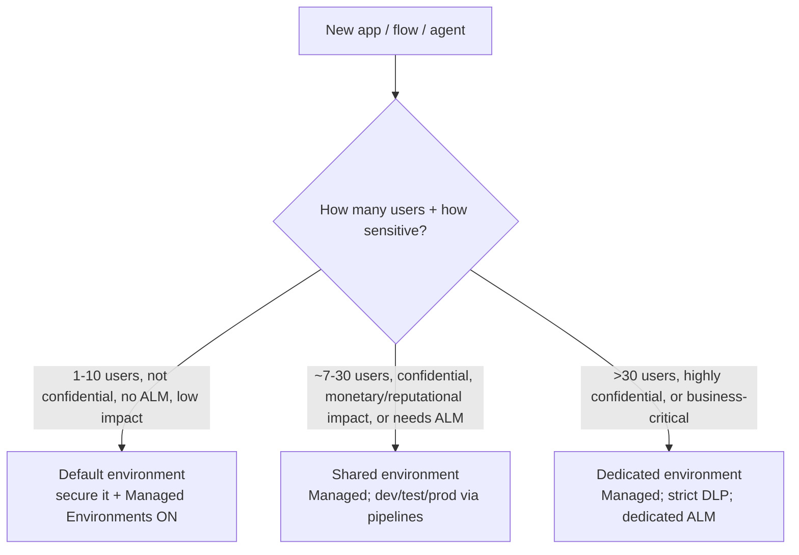

# Managed Environments & governance at scale — 2026

**Last reviewed:** 2026-05-28 · **Confidence:** high (first-party Microsoft Learn, retrieved 2026-05-28). Power Platform governance ships continuously — re-verify on the Researcher sweep.
**Owner:** `power-platform-admin`. **Complements** the [`dlp-policy-design`](../skills/dlp-policy-design/SKILL.md) skill (DLP specifics) and [`alm-pipeline-design`](../skills/alm-pipeline-design/SKILL.md) skill (dev/test/prod) — this doc is the *environment-and-tenant governance baseline* those sit inside.

## The 2026 baseline: Managed Environments first, CoE Starter Kit to complement
- **Managed Environments** (now surfaced as **Environment management** in the new Power Platform admin center) = **proactive, in-product governance** on **private APIs** — guardrails enforced *before* the action (e.g. a sharing limit blocks the over-share rather than reporting it after). Out-of-the-box, fully supported. Two pillars: **Managed security** (posture management, data protection, IAM, threat protection, compliance) and **Managed governance** (management-at-scale, environment strategy, reactive governance, full visibility, capacity & cost).
- **CoE Starter Kit** = **reactive** governance on **public APIs** (asynchronous; can only react *after* a limit is exceeded), plus a Power BI dashboard + features not yet in Managed Environments (bulk permission updates, abandoned-resource cleanup, maker surveys, idea-ROI).

> **House-opinion alignment (start proactive, supported):** Microsoft's own recommendation — **start with Power Platform admin center + Managed Environments** (robust, supported, proactive); add the **CoE Starter Kit** only where you hit an unmet need. Don't lead a client with the CoE kit as the governance foundation; lead with Managed Environments. The CoE kit is *sample implementations* you customize, not a product.

## Managed Environments features (what you get out of the box)
| Feature | What it does |
|---|---|
| **Sharing limits** | proactively cap how broadly canvas apps / flows / agents can be shared (e.g. ≤ N users, or no security-group sharing) — **enforced before** the share |
| **Maker welcome content** | custom getting-started message shown in-studio on a maker's first visit (per-environment) |
| **Weekly digest** | admin email highlighting inactive apps/flows, usage, recommendations |
| **Usage insights** | per-environment adoption/usage analytics |
| **Data policies (DLP)** | see which DLP policies apply; pair with the `dlp-policy-design` skill |
| **IP firewall / IP cookie binding** | restrict Dataverse access to allowed IP ranges |
| **Actions / Advisor** | personalized recommendations to optimize/secure the environment |
| **Solution checker enforcement** | block imports that fail solution-checker rules |

Plus **tenant-level analytics** in PPAC (most-used apps, top makers, inventory across environments).

## Decision Tree: which environment tier?

(Drivers: # users, data confidentiality, monetary/reputational impact, ALM need — promote up the tiers as any one increases.)

## Tenant hygiene (the recurring admin asks)
- **Secure the default environment** — it's everyone's sandbox by default: turn **Managed Environments ON** for it, set sharing limits, restrict who can create environments, monitor with tenant analytics. (The default env is the #1 governance gap.)
- **Restrict environment creation** — by default many users can self-create; lock it down + run an environment-request process (PPAC, or the CoE kit's environment + DLP request flow).
- **Environment strategy** — separate dev/test/prod (pairs with `alm-pipeline-design`); per-business-unit or per-app-criticality dedicated environments for confidential/critical workloads; security-group-scoped environments to control membership.
- **Capacity & cost** — Managed governance surfaces capacity/cost; watch Dataverse capacity, premium/PAYG consumption.

## Seams
- **DLP policy specifics** → the [`dlp-policy-design`](../skills/dlp-policy-design/SKILL.md) skill (3-bucket classification, connector governance, precedence, exemptions).
- **dev/test/prod promotion** → the [`alm-pipeline-design`](../skills/alm-pipeline-design/SKILL.md) skill + `solution-alm-engineer`.
- **Tenant-wide identity / Conditional Access / cross-cloud security** → `azure-cloud/entra-identity-engineer` + `ravenclaude-core/security-reviewer` (mandatory for auth/data-exfiltration design).
- **Agent governance** (Copilot Studio / M365 Copilot agents under Managed Environments) → [`copilot-agents-2026.md`](copilot-agents-2026.md).

## Sources (retrieved 2026-05-28)
[Environment management overview](https://learn.microsoft.com/power-platform/admin/environment-management-overview), [Managed Environments overview](https://learn.microsoft.com/power-platform/admin/managed-environment-overview), [CoE Starter Kit overview](https://learn.microsoft.com/power-platform/guidance/coe/overview), [Reactive governance: Managed Environments vs CoE](https://learn.microsoft.com/power-platform/guidance/adoption/reactive-governance), [Secure the default environment](https://learn.microsoft.com/power-platform/guidance/adoption/secure-default-environment), [Environment strategy](https://learn.microsoft.com/power-platform/guidance/adoption/environment-strategy).
