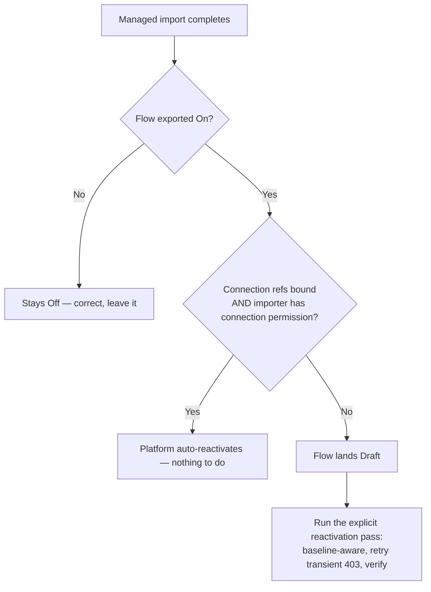

# Managed-import cloud-flow deactivation — the conditional model + the reactivation pass

> **Last reviewed:** 2026-06-30. Source: generalized from a real engagement (BTCSI) where an
> SPN-driven managed import left every Power Automate cloud flow in Draft and automations silently
> stopped. Reconciled against Microsoft Learn ("Import a solution" FAQ + ALM performance-recommendations,
> retrieved 2026-06-30). Refresh when (a) the Dataverse `workflow` activation contract changes, (b) `pac
> solution import` flag semantics change, or (c) the platform's auto-reactivation conditions change.

The trap this file closes: the blunt belief that **"a managed import always drops all flows to Draft."**
The truth is **conditional**, and knowing the condition tells you exactly when the explicit reactivation
pass (the [`managed-solution-import`](../skills/managed-solution-import/SKILL.md) skill) is required vs.
redundant.

## The conditional model (verified)

When a solution is imported, **its flows are turned off and on again** (Microsoft Learn). The platform
**attempts to restore each flow to its exported state**, but auto-reactivation only succeeds when **all
three** hold:

1. the flow was **exported in the On state**, AND
2. its **connection references are bound** to connections in the target, AND
3. the **importing identity has permission** to those connections (can "turn on" the flow).

A flow whose update is imported over an **already-existing** flow keeps the target's current state
(an Off flow stays Off) — which is *why* baseline-aware targeting is correct.

**Why SPN-driven CI/CD is the high-risk case:** an unattended service-principal import frequently hits
condition 3 — the SPN often does **not** own / lack permission to the connections behind the connection
references at import time (and binding via `--settings-file` may not have propagated yet). So in CI/CD the
explicit reactivation pass is the reliable path, not an edge case.

## The reactivation algorithm (what the script does)

1. **Baseline first** (before the import): query `workflow` rows where `category = 5` and record which
   are **Active**, keyed by the **solution unique name** (`uniquename`) — **not** `workflowid`, because a
   managed import can recreate the row with a **new GUID** (matching by GUID would silently skip a
   recreated flow — the exact "worse than before" failure this exists to prevent). A flow with no
   `uniquename` is skipped (and warned), never matched on its non-unique display name — a display-name
   collision could otherwise reactivate the wrong flow.
2. **After the import**, re-query and compute the targets = currently **Draft** ∩ **was Active in the
   baseline**. Never reactivate a flow that was Draft pre-import (it may be intentionally off).
3. **PATCH** each target `{ statecode: 1, statuscode: 2 }` via the **Dataverse Web API** (the supported
   path; `api.flow.microsoft.com` is explicitly unsupported per Microsoft Learn).
4. **Verify** — a `204` is **not** proof of activation; re-query and assert **both** `statecode == 1`
   **and** `statuscode == 2` before counting the flow activated, else warn.

### The two-cause `403` (ConnectionAuthorizationFailed)

A `403` on the activation PATCH has two distinct causes — and conflating them sends the operator down the
wrong fix path:

| Cause | Fixed by retry? | Remediation |
|---|---|---|
| **Transient** — connection-reference binding still propagating | **Yes** | retry with backoff (the script does 3 attempts, 15s/45s) |
| **Durable** — the importing identity lacks permission to the connection | **No** | **share the connection with the SPN / bind the connection reference** to a connection the SPN owns, then re-run |

The script retries (assuming transient), and on exhaustion reports the **durable** remediation rather than
a generic "auth failed."

## `[unverified — training knowledge]` — the activation contract

`category = 5` (modern flow), `statecode = 1` / `statuscode = 2` (Activated) vs `statecode = 0` (Draft) is
the standard Dataverse `workflow` contract but was **not** surfaced from first-party docs in the
verification session (only that the Dataverse Web API is the supported transport). **Settle it** by a live
query of the org's `workflow` `EntityDefinitions` / a known-Active flow before trusting a bare `204`. The
script is built to fail loud (post-PATCH re-query + assert both codes) if a tenant differs.

## Cross-references

- The skill that runs this: [`../skills/managed-solution-import/SKILL.md`](../skills/managed-solution-import/SKILL.md)
- The house rule: [`../best-practices/alm-reactivate-flows-after-managed-import.md`](../best-practices/alm-reactivate-flows-after-managed-import.md)
- Token acquisition (how the script authenticates): [`dataverse-token-acquisition.md`](dataverse-token-acquisition.md)
- Programmatic flow ops (the `workflow` entity, category=5, the `clientdata` gotcha): [`programmatic-flow-creation.md`](programmatic-flow-creation.md)
- Flow recovery decision trees: [`flow-decision-trees.md`](flow-decision-trees.md)

## Citations / sources

- Import turns flows off/on; auto-reactivation conditions; update preserves existing state:
  [Import a solution — FAQ](https://learn.microsoft.com/power-automate/import-flow-solution#faq) (2026-06-30).
- `--publish-changes`/`--force-overwrite` discouraged for managed imports:
  [Performance recommendations](https://learn.microsoft.com/power-platform/alm/performance-recommendations) (2026-06-30).
- `pac solution import` flag set (`--activate-plugins`, `--settings-file`, `--publish-changes`, `--force-overwrite`):
  [pac solution reference](https://learn.microsoft.com/power-platform/developer/cli/reference/solution#pac-solution-import) (2026-06-30).
- Dataverse Web API is the supported flow-management path (`api.flow.microsoft.com` unsupported):
  [Work with cloud flows using code](https://learn.microsoft.com/power-automate/manage-flows-with-code#import-flows) (2026-06-30).
- Internal: generalized from the BTCSI managed-import flow-activation engagement, 2026-06-30.
