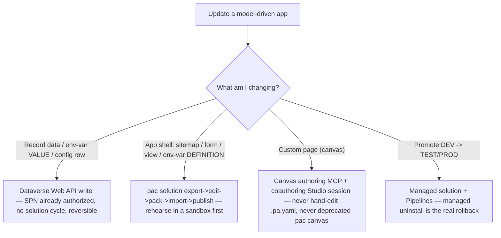

# Updating a model-driven app (with custom pages) — the paths that actually work

> **Last reviewed:** 2026-06-09. Sources: production planning lesson (a cross-model + grounded-critic
> review of "let an agent update a model-driven app, with custom pages, in a customer DEV env via the
> existing SPN"). Every load-bearing claim verified against learn.microsoft.com on 2026-06-09 — URLs
> inline. Refresh when (a) the canvas-authoring-MCP preview GAs or changes its command surface, (b) the
> `.pa.yaml` schema stabilizes, or (c) `pac` changes solution/canvas behavior.

This is the companion knowledge to the [`update-model-driven-app`](../skills/update-model-driven-app/SKILL.md)
skill. The skill is the operational playbook; this file is *why* the playbook is shaped the way it is —
the four facts that overturn the naive "headless hand-edit + import" instinct.

## The naive plan is a trap — two facts reshape it

1. **Canvas / custom-page `.pa.yaml` is READ-ONLY.** *"The generated canvas app YAML code is read-only
   and can't be modified. Any changes to the file are ignored and might be lost."* and *".pa.yaml files
   are read-only… not used when an app is loading."* External editing is supported **only** via Power
   Platform Git Integration (minor edits), and **not at all** if the app contains code components
   ([power-apps-yaml](https://learn.microsoft.com/power-apps/maker/canvas-apps/power-apps-yaml),
   [canvas-apps-git-integration](https://learn.microsoft.com/power-platform/alm/git-integration/canvas-apps-git-integration)).
   → **You cannot headlessly hand-patch a custom page.** The sanctioned AI path is the **canvas
   authoring MCP server + a live coauthoring Studio session** — a Microsoft preview that explicitly
   names **GitHub Copilot CLI and Claude Code** (`/configure-canvas-mcp`, `/edit-canvas-app`;
   generates `.pa.yaml` → validates against the live authoring server → syncs to the coauthoring
   session) ([create-canvas-external-tools](https://learn.microsoft.com/power-apps/maker/canvas-apps/create-canvas-external-tools)).

2. **Unmanaged solution import is IRREVERSIBLE.** *"Changes applied by importing an unmanaged solution
   cannot be uninstalled. Do not install an unmanaged solution if you want to roll back the changes."*
   Import is **additive**; *"You can't delete the components by uninstalling the solution… You can't
   undo this."* ([solutions-overview](https://learn.microsoft.com/dynamics365/customerengagement/on-premises/customize/solutions-overview),
   [create-export-import-unmanaged-solution](https://learn.microsoft.com/dynamics365/customerengagement/on-premises/developer/create-export-import-unmanaged-solution),
   [solution-api](https://learn.microsoft.com/power-platform/alm/solution-api)).
   → A backup zip is a **forensic artifact, not an undo button**. Property overwrites can be
   re-overwritten back; added/deleted structural components can't be cleanly undone. Use **managed
   solutions + Power Platform Pipelines** for promotion reversibility, and **rehearse in a throwaway
   sandbox copy** before touching the real env.

## Choosing the update path (decision aid — NOT a canonical `## Decision Tree:` to avoid the SVG gate)

## The other two facts that bite

3. **`pac solution pack` exit 0 ≠ success (silent component omission).** *"If you list a component in
   `rootcomponents.yml` but don't include its source files (for example, a canvas app `.msapp` under
   `canvasapps/<name>/`), the pack operation still succeeds but omits that component."* Exit code 0 with
   a valid zip — and a dropped custom page
   ([solution-packager-tool#troubleshooting](https://learn.microsoft.com/power-platform/alm/solution-packager-tool#troubleshooting)).
   → Assert every declared component's source file exists **pre-pack**, and **re-unpack the output zip
   and diff** it **post-pack**. Never gate on the exit code.

4. **Running flows ≠ solution-import rights.** Cloud-flow execution uses record/connector privileges;
   `ImportSolutionRequest` + publish need **customization** privileges (**System Customizer** /
   **System Administrator**). An SPN provisioned to run flows is frequently scoped to exactly that
   ([powerplatform-api-create-service-principal](https://learn.microsoft.com/power-platform/admin/powerplatform-api-create-service-principal),
   [solution-api](https://learn.microsoft.com/power-platform/alm/solution-api)).
   → Probe `systemuserroles_association` and **abort if the role is absent** — granting it is a customer
   PP-admin action (the alternate-methods "read the error, name the cause" rule: an insufficient-scope
   `403` selects *grant the role*, not *switch surfaces* or *retry*).

## Two more operational gotchas

- **Custom pages need an ordered re-publish.** *"Model-driven apps must be re-published after a custom
  page is published. Otherwise the model-driven app continues to use the previous published custom
  page."* ([add-page-to-model-app](https://learn.microsoft.com/power-apps/maker/model-driven-apps/add-page-to-model-app))
  — a successful import can leave the app pinned to the old page with **no error**.
- **`Block unmanaged customizations` may be ON.** If set, unmanaged import + component creation are
  blocked by policy; **record/env-var-value writes still work**, and the solution path becomes
  managed-only ([block-unmanaged-customizations](https://learn.microsoft.com/power-platform/alm/block-unmanaged-customizations)).

## YAML source-format note (version-dependent — probe, don't assume)

The MS docs are internally inconsistent on whether `pac solution clone`/`sync` emit YAML: the
git-integration FAQ says *"unpack, clone, and sync don't currently support YAML format,"* while the
YAML-format reference + `pac solution unpack` remarks say clone *does* produce YAML and is *"the
recommended way to get a complete packable YAML folder."* YAML support requires
**Microsoft.PowerApps.CLI ≥ 2.4.1**. → **Probe it on the actual CLI at Phase 0**, don't hard-code an
assumption. Moot for custom pages anyway (those go through the canvas authoring MCP, not source
editing).

## See also

- [`dataverse-token-acquisition.md`](dataverse-token-acquisition.md) — get the SPN bearer token (the auth layer this builds on).
- [`programmatic-flow-creation.md`](programmatic-flow-creation.md) — the Web-API-update precedent (assumes you already hold a token).
- [`apps-decision-trees.md`](apps-decision-trees.md) — app-type + UI-surface selection (where Custom Page is a first-class surface).
