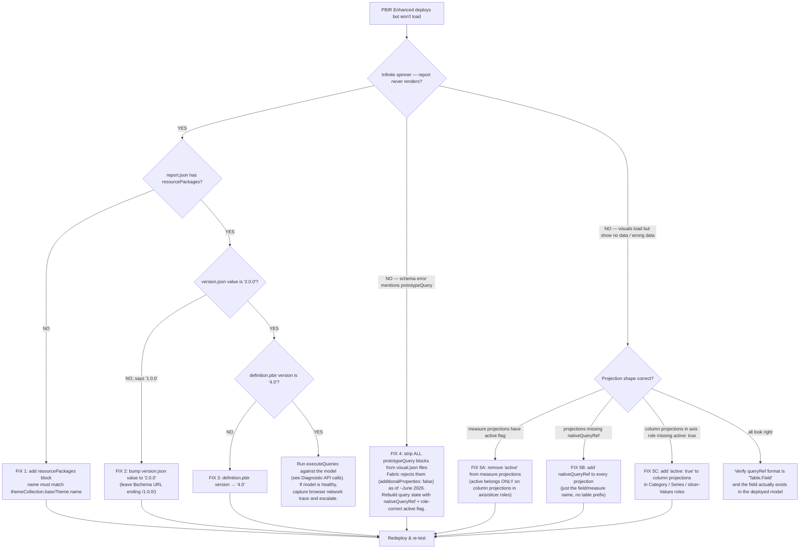

# PBIR Enhanced report won't load — `resourcePackages` + `version.json` + the `prototypeQuery` breaking change

> **Last reviewed:** 2026-06-02. Source: production lesson learned debugging the `BMA-CSP-Risk-Scoring` report (BTCSI DEV workspace) on 2026-06-02 — infinite-spinner-on-load resolved at commit `8868af0` after a multi-phase debug loop. Refresh when (a) Microsoft updates the Fabric report-definition schema versions, (b) `prototypeQuery` is re-allowed or its replacement contract changes, or (c) the `version.json` `"2.0.0"` value changes (it lagged the `$schema` URL last time — easy to miss).
>
> **Claim-grounding note.** This file documents a Microsoft platform contract that has *already* changed once between May and June 2026. Treat the specific schema versions, the `additionalProperties: false` enforcement, and the `version.json` value as `[verify-at-use]` — re-check against a current real-world Enhanced report before quoting them into customer code.

---

## TL;DR — the two fields that cause the infinite spinner

A PBIR (Power BI Project) **Enhanced** report deploys cleanly but shows an infinite spinner on first load. The Fabric service starts the render pipeline, fails to resolve the base theme, and stalls waiting forever. Two fields in `definition/` are the culprits — both are easy to miss because PBIR's older "byPath" reports often worked without them:

### 1. `resourcePackages` missing from `definition/report.json` — **PRIMARY ROOT CAUSE**

Without `resourcePackages`, Fabric cannot locate the base theme file. Every working real-world PBIR Enhanced report includes this block.

```json
"resourcePackages": [
  {
    "name": "SharedResources",
    "type": "SharedResources",
    "items": [
      {
        "name": "CY24SU10",
        "path": "BaseThemes/CY24SU10.json",
        "type": "BaseTheme"
      }
    ]
  }
]
```

`items[0].name` **must match** `themeCollection.baseTheme.name` exactly.

### 2. `definition/version.json` saying `"1.0.0"` — **SECONDARY ISSUE**

```json
{
  "$schema": "https://developer.microsoft.com/json-schemas/fabric/item/report/definition/versionMetadata/1.0.0/schema.json",
  "version": "2.0.0"
}
```

The `$schema` URL still ends in `/1.0.0/` — only the `version` *value* must be `"2.0.0"`. This is the trap: the URL and the value drift apart, and the human eye reads them as consistent.

---

## Decision Tree: PBIR Enhanced report deploys but won't load

**When this applies:** a PBIR Enhanced report imports/deploys with no schema error, but the rendered report either spins forever, throws a schema error mid-render, or loads with empty visuals. **Traverse top-to-bottom — do not pattern-match on the user's situation description.**

**Last verified:** 2026-06-02 against Fabric report schemas: report `3.2.0`, visualContainer `2.7.0`, visualConfiguration `2.3.0`, versionMetadata `1.0.0` (URL) / `"2.0.0"` (value), definitionProperties `2.0.0`.



**Rationale per leaf:**

- **FIX 1 — `resourcePackages`** — the renderer stalls during theme resolution. No error, just an infinite spinner. This is the single most likely cause of "report deployed fine, doesn't load." Every real-world Enhanced report ships this block.
- **FIX 2 — `version.json` value `"2.0.0"`** — verified across 7 real PBIR Enhanced repos (see § Repos consulted). The `$schema` URL ending in `/1.0.0/` does **not** imply the value should be `"1.0.0"`; the URL is the schema-of-the-versionMetadata-file, the value is the report-definition-version.
- **FIX 3 — `definition.pbir` `"version": "4.0"`** — the outer project-definition version. Lower values are pre-Enhanced and Fabric will treat the bundle differently.
- **FIX 4 — strip `prototypeQuery`** — **Fabric breaking change ~June 2026.** The `visualConfiguration/2.3.0/schema-embedded.json` has `additionalProperties: false`. Allowed `visual` keys: `visualType`, `autoSelectVisualType`, `query`, `expansionStates`, `objects`, `visualContainerObjects`, `syncGroup`, `drillFilterOtherVisuals`. `prototypeQuery` is **not** in this list. Reports that worked in May 2026 with `prototypeQuery` started failing schema validation in June. Strip it; do not try to rename it.
- **FIX 5A / 5B / 5C — projection shape** — `active: true` is the "show this in axis/slicer" flag and only makes sense on column projections in roles like Category / Series / slicer Values. Putting it on a measure projection corrupts the query state. `nativeQueryRef` (just the field/measure name, no table prefix) is now **required** on every projection; without it the visual's query plan can't resolve.

---

## Correct `definition/report.json` template (schema 3.2.0)

```json
{
  "$schema": "https://developer.microsoft.com/json-schemas/fabric/item/report/definition/report/3.2.0/schema.json",
  "themeCollection": {
    "baseTheme": {
      "name": "CY24SU10",
      "reportVersionAtImport": {
        "visual": "2.7.0",
        "page": "2.1.0",
        "report": "3.2.0"
      },
      "type": "SharedResources"
    }
  },
  "objects": {
    "section": [
      {
        "properties": {
          "verticalAlignment": {
            "expr": { "Literal": { "Value": "'Top'" } }
          }
        }
      }
    ]
  },
  "resourcePackages": [
    {
      "name": "SharedResources",
      "type": "SharedResources",
      "items": [
        {
          "name": "CY24SU10",
          "path": "BaseThemes/CY24SU10.json",
          "type": "BaseTheme"
        }
      ]
    }
  ],
  "settings": {
    "allowChangeFilterTypes": true,
    "useStylableVisualContainerHeader": true,
    "exportDataMode": "AllowSummarized",
    "defaultDrillFilterOtherVisuals": true,
    "useEnhancedTooltips": true,
    "useDefaultAggregateDisplayName": true
  }
}
```

### `definition/version.json`

```json
{
  "$schema": "https://developer.microsoft.com/json-schemas/fabric/item/report/definition/versionMetadata/1.0.0/schema.json",
  "version": "2.0.0"
}
```

### `definition.pbir` (the source-of-truth bundle file; `fabric-cicd` converts `byPath` → `byConnection` at deploy)

```json
{
  "$schema": "https://developer.microsoft.com/json-schemas/fabric/item/report/definition/definitionProperties/2.0.0/schema.json",
  "version": "4.0",
  "datasetReference": {
    "byPath": { "path": "../BMA-CSP-Risk-Scoring.SemanticModel" }
  }
}
```

---

## Visual query format rules

Even after the report loads, wrong projection shape causes visual-level errors or empty visuals.

### Measure projections — NO `active` flag

```json
{
  "field": {
    "Measure": {
      "Expression": { "SourceRef": { "Entity": "_Measures" } },
      "Property": "Total Active CSPs"
    }
  },
  "queryRef": "_Measures.Total Active CSPs",
  "nativeQueryRef": "Total Active CSPs"
}
```

### Column projections in axis/slicer roles — `active: true` required

```json
{
  "field": {
    "Column": {
      "Expression": { "SourceRef": { "Entity": "Questions" } },
      "Property": "Domain"
    }
  },
  "queryRef": "Questions.Domain",
  "nativeQueryRef": "Domain",
  "active": true
}
```

### Hard rules

- `queryRef` = `"TableName.FieldName"` (with the dot).
- `nativeQueryRef` = just the field/measure name, **no table prefix**. Required on every projection.
- `active: true` = column projections in **axis-shaped roles only** (Category / Series / slicer Values). Never on measure projections — corrupts query state.
- **No `prototypeQuery` anywhere.** Fabric rejects it (`additionalProperties: false` on `visualConfiguration/2.3.0/schema-embedded.json`) as of ~June 2026 `[verify-at-use]`.

---

## What was tried that didn't work (compressed timeline)

Reading this section *first* on a future infinite-spinner debug saves the loop. If the symptom looks the same, jump straight to FIX 1.

| Phase | Action | Result |
|---|---|---|
| 1 | Working baseline (~May 22 2026): no `resourcePackages`, `active: false` on all projections, `prototypeQuery` present. Loaded fine. | Worked then; would not work now. Fabric tightened between May and June. |
| 2 | Renamed page sections, flipped `active: false` → `true` everywhere, dropped `prototypeQuery`. | Broke loading. |
| 3 | Restored full `prototypeQuery` block. | **Fabric rejected schema:** `Property 'prototypeQuery' has not been defined and the schema does not allow additional properties`. |
| 4 | Fixed projection shape: removed `active` from measure projections, kept it on column projections in axis roles, added `nativeQueryRef` everywhere. | Deploy succeeded — **report still wouldn't load**. |
| 5 | Verified semantic model was healthy: `executeQueries` returned data, 3 successful refreshes, `isRefreshable: true`, `getDefinition` LRO showed everything correctly deployed, `definition.pbir` version `"4.0"` confirmed against real repos. | Model not the problem. Report definition was. |
| 6 | Searched 7 real-world PBIR Enhanced repos (see § Repos consulted). Found: **every one** had `resourcePackages` in `report.json` and **every one** had `"version": "2.0.0"` in `version.json`. Ours had neither. | Root cause located. |
| 7 | Added `resourcePackages` to `report.json`; bumped `version.json` value to `"2.0.0"`; added the `defaultDrillFilterOtherVisuals` / `useEnhancedTooltips` settings; added `objects.section.verticalAlignment`. Deployed. | **Report loaded** (commit `8868af0`). |

Lessons:
- The `resourcePackages` block is the field most likely to be silently missing on first author of an Enhanced report.
- "It used to work" is not a reliable test against a Microsoft schema. Fabric tightens `additionalProperties: false` rules between releases.
- A green deploy + a healthy semantic model + a happy `getDefinition` LRO can **all coexist** with a non-loading report. The report-definition contract is independent.

---

## Pre-flight checklist for PBIR Enhanced reports

- [ ] `definition/version.json` has `"version": "2.0.0"` (not `"1.0.0"` — the `$schema` URL ending in `/1.0.0/` is unrelated).
- [ ] `definition/report.json` has a `resourcePackages` array whose `items[0].name` matches `themeCollection.baseTheme.name` exactly.
- [ ] `definition.pbir` has `"version": "4.0"`.
- [ ] All measure projections have `queryRef` + `nativeQueryRef`, **no** `active` flag.
- [ ] All column projections in axis/slicer roles have `queryRef` + `nativeQueryRef` + `active: true`.
- [ ] **No `prototypeQuery`** anywhere in any `visual.json`.
- [ ] Semantic model is refreshed at least once before testing report render (the report can render against an empty model, but visual-level errors will mask schema bugs).

If a generator script writes any of these files, the checklist must be encoded in the generator — not just enforced by hand. The same person who forgets to add `resourcePackages` to one report will forget on the next one.

---

## Diagnostic API calls

### Verify the model is queryable end-to-end (Power BI `executeQueries`)

If this returns data, the model is fine and you are debugging the *report*, not the model.

```python
from azure.identity import AzureCliCredential
import urllib.request as R, json as J

cred = AzureCliCredential()
tok = cred.get_token('https://analysis.windows.net/powerbi/api/.default').token
wid = '<workspace-id>'
did = '<dataset-id>'

payload = J.dumps({
    "queries": [{"query": "EVALUATE ROW(\"N\", [YourMeasure])"}],
    "serializerSettings": {"includeNulls": True}
}).encode()

req = R.Request(
    f'https://api.powerbi.com/v1.0/myorg/groups/{wid}/datasets/{did}/executeQueries',
    method='POST', data=payload,
    headers={'Authorization': f'Bearer {tok}', 'Content-Type': 'application/json'}
)
print(J.loads(R.urlopen(req).read()))
```

### Retrieve the deployed report definition (Fabric `getDefinition` LRO)

Confirms what Fabric actually has, regardless of what you thought you deployed. The endpoint is async (long-running operation) — poll the `Location` header until `status == "Succeeded"`, then fetch `<op_url>/result`.

```python
from azure.identity import AzureCliCredential
import urllib.request as R, json as J

cred = AzureCliCredential()
tok = cred.get_token('https://api.fabric.microsoft.com/.default').token
wid = '<workspace-id>'
rid = '<report-id>'

req = R.Request(
    f'https://api.fabric.microsoft.com/v1/workspaces/{wid}/reports/{rid}/getDefinition',
    method='POST', data=b'{}',
    headers={'Authorization': f'Bearer {tok}', 'Content-Type': 'application/json'}
)
resp = R.urlopen(req)
op_url = resp.headers.get('Location') or resp.headers.get('x-ms-operation-id')
# poll op_url until status == "Succeeded", then fetch op_url + "/result"
```

---

## Visual container schema — the canonical allowed-properties list

For reference when triaging a "Property X has not been defined" schema error:

- Schema: `visualContainer/2.7.0/schema.json` → references `visualConfiguration/2.3.0/schema-embedded.json`.
- `additionalProperties: false` on the `visual` object.
- Allowed `visual` keys: `visualType`, `autoSelectVisualType`, `query`, `expansionStates`, `objects`, `visualContainerObjects`, `syncGroup`, `drillFilterOtherVisuals`.
- **`prototypeQuery` is NOT allowed.** Strip it; do not try to rename it. This is the ~June 2026 breaking change `[verify-at-use]`.

---

## Repos consulted (cross-source verification, 2026-06-02)

Used during phase 6 to prove the `resourcePackages` and `version.json` patterns are universal across real Enhanced reports. Useful as a re-verification list when this file is next refreshed.

| Repo | What it provided |
|---|---|
| [`kfprugger/FabricDicomCohortingToolkit`](https://github.com/kfprugger/FabricDicomCohortingToolkit) | Complete schema 3.2.0 `report.json` with `resourcePackages` |
| [`bernatagulloesbrina/contoso-examples`](https://github.com/bernatagulloesbrina/contoso-examples) | `byConnection` `definition.pbir` + `resourcePackages` |
| [`Eivind4/SemanticLinkLabsReport`](https://github.com/Eivind4/SemanticLinkLabsReport) | Full settings block + `resourcePackages` |
| [`data-goblin/power-bi-agentic-development`](https://github.com/data-goblin/power-bi-agentic-development) | Visual queryState format examples |
| [`ServiceuserFabric/FabricDev`](https://github.com/ServiceuserFabric/FabricDev) | Schema 3.2.0 with `publicCustomVisuals` |
| [`bcgov/nrids-bcts-data`](https://github.com/bcgov/nrids-bcts-data) | Schema 3.0.0 real-world Fabric report |
| [`microsoft/fabric-cicd`](https://github.com/microsoft/fabric-cicd) | Official `ByConnection.Report` sample |

---

## Owner & escalation

Primary: `power-bi-engineer`. The agent carries the decision-tree-traversal prior pointing at this file.

When the decision tree exits to *ESCALATE* (model healthy, schema all confirmed, still won't load): hand off to `solution-alm-engineer` for the deploy-pipeline review (sometimes the deploy step swaps the `byPath` reference incorrectly), or to `ravenclaude-core/deep-researcher` to verify whether the Fabric schema has shifted again since this file's last review.

When the lesson is that `prototypeQuery` (or any other newly-stripped property) was re-allowed by a Fabric release: refresh this file and update the "Last reviewed" date at the top.
