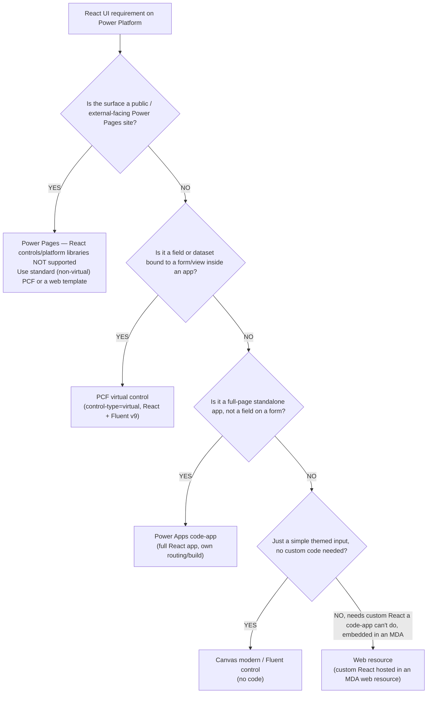

# PCF React + Fluent UI platform libraries — version source-of-truth + cross-surface decision tree

> **Last reviewed:** 2026-05-27. Source: [React controls & platform libraries](https://learn.microsoft.com/en-us/power-apps/developer/component-framework/react-controls-platform-libraries) (MS Learn, ms.date 2025-10-10) + the [platform-library manifest element](https://learn.microsoft.com/en-us/power-apps/developer/component-framework/manifest-schema-reference/platform-library). **Refresh when** (a) `pac` releases a new platform-library version (re-verify the version table below), or (b) Fluent ships a new major (`@fluentui/react-components` v10+ → re-verify the v8/v9 mutual-exclusion rule and the default-for-new-work call).

This file is the **canonical version source** for the React + Fluent platform-library declarations that go in `ControlManifest.Input.xml`. The manifest reference ([`../skills/pcf-controls/resources/manifest-reference.md`](../skills/pcf-controls/resources/manifest-reference.md)) shows the XML shape; this file owns the *versions* and the *which-surface* decision.

---

## Supported platform-library version table

Platform libraries are provided by the host both at build and at runtime — controls don't bundle their own React/Fluent. You **author against the allowed (declared) version's typings**, while the platform may **load a higher compatible version at runtime**. Both columns matter: the left is what you put in the manifest, the right is what actually runs.

**Every version below is tagged "verify before quoting" — re-confirm against the MS Learn page above before you put it in front of a customer.** Microsoft bumps the runtime-loaded versions without changing the allowed range.

| Library | npm package | Allowed version (declare in manifest) | Version loaded at runtime | Notes |
|---|---|---|---|---|
| React | `react` | `16.14.0` *(verify before quoting)* | **`17.0.2` (model-driven)** / **`16.14.0` (canvas)** *(verify before quoting)* | You author against `16.14.0` typings; the platform may load a higher compatible version at runtime (17.0.2 on model-driven). Don't assume the loaded version equals the declared one. |
| Fluent v8 | `@fluentui/react` | `8.29.0` *(verify before quoting)* | `8.29.0` *(verify before quoting)* | Legacy/v8 lane. |
| Fluent v8 | `@fluentui/react` | `8.121.1` *(verify before quoting)* | `8.121.1` *(verify before quoting)* | Higher v8 pin. |
| Fluent v9 | `@fluentui/react-components` | `>=9.4.0 <=9.46.2` *(verify before quoting)* | **`9.68.0`** *(verify before quoting)* | Default for new work. The platform loads a higher v9 than the declared ceiling. |

**Reading the table:** the "allowed version" is the value you write into `<platform-library name="React" version="..." />`. The "version loaded at runtime" is what the host actually injects — often higher and compatible, never guaranteed to be the latest. Author and type-check against the allowed version; test against the runtime version.

## The hard rule: you cannot declare Fluent v8 AND v9 in the same manifest

`<platform-library name="Fluent" .../>` resolves to **one** Fluent major per control. Per MS Learn: *"Fluent 8 and Fluent 9 are each supported but can not both be specified in the same manifest."*

- **Fluent v9 (`@fluentui/react-components`) is the default for new work.** Use it unless you have a specific reason not to.
- **Fluent v8 (`@fluentui/react`) only when** porting an existing v8 control or you need a v8-only component that has no v9 equivalent.
- If you don't use Fluent at all, **remove** the `<platform-library name="Fluent" .../>` element entirely (don't declare an unused library).

For the v8→v9 component mapping and theming bridge, see [`../skills/pcf-controls/resources/fluent-v9-theming-and-migration.md`](../skills/pcf-controls/resources/fluent-v9-theming-and-migration.md).

## GA status, CLI rebuild, and the no-auto-convert gotchas

- **GA.** The platform-libraries capability is generally available. Reusing the host's React/Fluent is the expected default for new code components.
- **Rebuild existing virtual controls with CLI `>=1.37`.** Per the GA note: existing virtual controls keep working, but should be **rebuilt and redeployed with `pac` CLI `>=1.37`** so they pick up future platform React-version upgrades. Run `pac install latest` if unsure of your CLI version.
- **No auto-convert standard → virtual.** Setting `control-type="virtual"` on an existing standard control does **not** convert it. You must scaffold a new control (`pac pcf init ... -fw react`) and port the manifest + `index.ts` (the `ReactControl.init` has no `div` parameter; `updateView` returns a `ReactElement`).

---

## Decision Tree: PCF — Which React surface?

**When this applies:** you have a UI requirement on the Power Platform that you're considering building as React, and you need to pick the *surface* before writing any code — a field/dataset on a form, a full standalone app, a simple themed input, a public-facing page, or custom React embedded in a model-driven app. **Traverse this tree top-to-bottom before selecting a surface — do NOT pattern-match on keywords in the user's situation description.**

**Last verified:** 2026-05-27 against the MS Learn React-controls-platform-libraries page (ms.date 2025-10-10) and Power Platform release wave 2026.1.

**Rationale per leaf:**

- *Power Pages* — React controls & platform libraries are **not supported in Power Pages** (verified primary-source: MS Learn FAQ — *"In Power Pages, React controls don't update based on changes in other fields"*). Use a **standard (non-virtual) PCF** or a **web template** instead. This is the most-missed gotcha — Power Pages looks like "just another app surface" but the platform-library contract does not extend to it.
- *PCF virtual control* — a field or dataset bound to a form/view is exactly what virtual controls are for: they reuse the host's React + Fluent, ship a smaller bundle, and theme-align with the app shell.
- *Power Apps code-app* — a full-page standalone React app (own routing, own build) is a code-app, not a PCF. See the [`power-apps-code-apps`](../skills/power-apps-code-apps/SKILL.md) skill for the CLI, config schema, and SDK reference.
- *Canvas modern / Fluent control* — if it's a simple themed input and no custom code is genuinely required, the cheapest mechanism is a modern/Fluent canvas control. Don't reach for PCF when a no-code control themes itself.
- *Web resource* — custom React embedded in a model-driven app that a code-app can't deliver (e.g. tight MDA form-context integration) lands in an MDA **web resource**. This is the residual leaf, not the default.

**Tradeoffs summary:**

| Surface | Build cost | Reuses host React/Fluent? | Themes with app shell? | Use when |
|---|---|---|---|---|
| PCF virtual control | Medium | Yes (platform libraries) | Yes (`context.fluentDesignLanguage`) | Field/dataset bound to a form/view |
| Power Apps code-app | High | No (own React build) | Partial (own theming) | Full-page standalone app |
| Canvas modern/Fluent control | Low (no code) | N/A | Yes (canvas theme) | Simple themed input, no code |
| Power Pages (standard PCF / web template) | Medium | **No — platform libraries unsupported** | Site theme/CSS | Public/external-facing page |
| MDA web resource | Medium–High | No | Manual | Custom React in an MDA that code-apps can't do |

If the requirement matches multiple branches, the **first branch where the condition resolves cleanly is the leaf to apply** — the tree is ordered to surface the Power Pages gotcha first (because picking a virtual control there fails late) and to default to the cheapest viable mechanism otherwise.

---

## Citations / sources

- MS Learn (versions, GA note, CLI `>=1.37`, no-auto-convert, v8/v9 mutual-exclusion, Power Pages unsupported): [React controls & platform libraries](https://learn.microsoft.com/en-us/power-apps/developer/component-framework/react-controls-platform-libraries), ms.date 2025-10-10, verified 2026-05-27.
- MS Learn (manifest element shape): [platform-library element](https://learn.microsoft.com/en-us/power-apps/developer/component-framework/manifest-schema-reference/platform-library).
- Decision-tree format convention: [`docs/best-practices/decision-trees-in-knowledge-files.md`](../../../docs/best-practices/decision-trees-in-knowledge-files.md).
