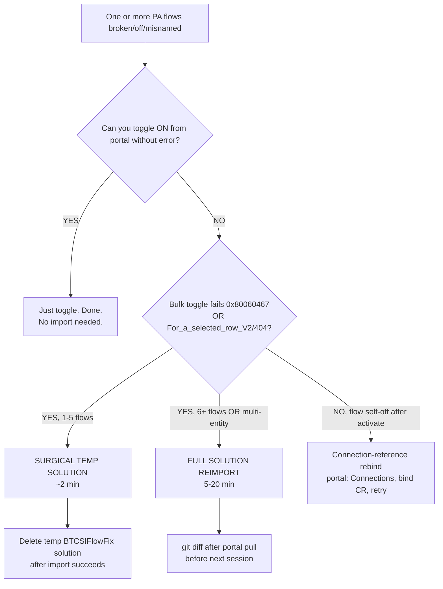

# Programmatic Power Automate cloud-flow creation — without the PA Management API

> **Last reviewed:** 2026-05-21. Source: production lesson learned creating ~136 cloud flows in a customer DEV environment with a service principal, May 2026. Refresh when (a) `pac flow` ships, (b) Microsoft simplifies the application-permission flow for the PA Management API, or (c) the Dataverse `workflow` entity contract changes.

The natural path for bulk cloud-flow creation is the [Power Automate Management API](https://learn.microsoft.com/en-us/connectors/flowmanagement/) at `https://api.flow.microsoft.com`. **That path is almost always blocked for service principals in real customer tenants.** This document captures the trap, the workaround, the exact API shape that works, and the pitfalls that bite once you're on the workaround.

> **Canonical confident-error case.** This lesson is also the textbook example for the core [Claim Grounding & Source Honesty protocol](../../ravenclaude-core/CLAUDE.md): "There is no `pac flow` command" is a **verified** behavioral fact (checked against `pac` v2.6.4/v2.7.4 — note the version, since a `pac` claim is only as good as the `pac --version` behind it). The dangerous, *unverified* leap a confident agent makes next — "so cloud flows can't be created programmatically" — is **false**, and acting on it abandons the whole Dataverse Web API path below. Verified halves earn no tag; the unverified capability leap must be marked `[unverified — training knowledge]` or, better, replaced by the alternate-paths enumeration the Capability Grounding Protocol requires.

---

## Decision Tree: PA flow recovery — stuck / broken / off

**When this applies:** one or more Power Automate flows in a Dataverse-backed solution are off, throwing 404 on `For_a_selected_row_V2`, or otherwise misbehaving after a solution import. **Traverse this tree top-to-bottom before selecting a method — do NOT pattern-match on keywords in the user's situation description.**

**Last verified:** 2026-05-21 against Power Platform release wave 2026.1.



**Rationale per leaf:**

- *TOGGLE* — if the portal accepts the toggle, the flow definition is intact; only the trigger registration was lost. No reimport needed.
- *SURGICAL* — preferred for narrow blast radius. Touches only the named flows; reversible by deleting the temp solution. Steps: (1) create temp `BTCSIFlowFix` solution via Web API, (2) `AddSolutionComponent` (type 29) for each affected flow only, (3) export → `pac unpack` → edit JSON/XML → `pac pack` → import, (4) delete temp solution.
- *FULL* — only when 6+ flows are affected or flows span multiple entities. ⚠ Overwrites portal changes since last export; always `git diff` after portal pull before next session.
- *CONNREF* — flow self-off-after-activate means a missing connection-reference binding in this environment. Reimport will NOT fix this; only portal-side rebinding does.
- *CLEANUP* — temp solutions clutter the env's solution list and confuse later imports. Always delete the temp solution after the surgical fix succeeds.
- *DIFFCHECK* — full reimport is the most-likely-to-cause-regression path; the `git diff` is the cheapest insurance.

**Tradeoffs summary:**

| Method | Time | Blast radius | Approval gate? | Use when |
|---|---|---|---|---|
| Portal toggle | seconds | None | No | Flow just needs activation |
| Surgical temp solution | ~2 min | Named flows only | No | 1-5 broken/misnamed flows |
| Full solution reimport | 5-20 min | Overwrites all components since last export | **YES** (confirm with user before triggering) | 6+ flows or confirmed auth corruption |
| Connection-reference rebind | seconds | None | No | Flow turns off immediately after activation |

If the symptom matches multiple branches, the leaf with the **smaller blast radius is the default**. Escalate to the bigger blast radius only when the smaller one demonstrably failed.

**Node prerequisites (`requires:` — check the session-start capability banner first):**

- *Surgical temp solution* and *Full solution reimport* — **requires:** a service principal (or user) with `System Administrator`, or at minimum create/update/delete on the Dataverse `solution` + `workflow` tables, in the **target environment**. Before choosing either branch, confirm this against the capability banner the [`capability-orientation`](../../ravenclaude-core/hooks/capability-orientation.sh) hook injects at session start and the authoritative `.ravenclaude/environment-context.md`. If the role is held, proceed without asking; if it is absent or unknown, that is the Capability Grounding Protocol's "do I have authority?" moment — confirm or escalate before acting. (Convention per [`docs/best-practices/decision-trees-in-knowledge-files.md`](../../../docs/best-practices/decision-trees-in-knowledge-files.md) §"Node prerequisites".)
- *Portal toggle* and *Connection-reference rebind* — no special Dataverse role; an interactive portal session suffices.

---

## The trap (and why it isn't your fault)

If you point a service principal at the PA Management API, you'll observe:

- Token acquisition against `https://service.flow.microsoft.com/.default` succeeds.
- **Every API call returns HTTP 401.**
- Inspect the token: `roles` claim is `null`.
- The SPN is `System Administrator` in Dataverse. Doesn't matter.

### Why the token is inert

The PA Management API enforces **Azure AD application permissions** on the `https://service.flow.microsoft.com/` resource. The two relevant permissions are `Flows.Read.All` and `Flows.Manage.All`. Both are **application permissions**, and application permissions on this resource **always require Global Admin consent**.

The common misstep: a user with app-registration access can add the *delegated* versions of these permissions (they show "Admin consent required: No" in the portal), thinking they've granted access. They haven't — **delegated permissions do not work with the `client_credentials` OAuth flow**. Only application permissions do, and only after Global Admin consent.

### Why `pac flow` isn't the escape hatch

There is no `pac flow` command. Verified against `pac` v2.6.4 and v2.7.4 (May 2026). There is no CLI path to create or manage cloud flows.

---

## The workaround — Dataverse Web API

Modern Power Automate cloud flows are **Dataverse `workflow` entity records** with `category = 5` and `type = 1`. An SPN with `System Administrator` (or equivalent Dataverse role with create/update on the `workflow` table) can create, read, update, and delete cloud flows **without ever touching the PA Management API**.

The Dataverse Web API at `https://<env>.api.<region>.dynamics.com/api/data/v9.2/` is the right surface. Three calls do the whole job:

```http
POST   /api/data/v9.2/workflows               # create the flow
POST   /api/data/v9.2/AddSolutionComponent    # add it to a named solution (ComponentType=29)
DELETE /api/data/v9.2/workflows({fid})        # clean up if needed
```

`AddSolutionComponent` for flows uses **ComponentType `29`** (the API does not distinguish cloud flows from classic workflows — both are `29`).

### Required fields on the `POST /workflows`

```json
{
  "name": "Flow Display Name",
  "category": 5,
  "type": 1,
  "primaryentity": "none",
  "clientdata": "<JSON string — see next section>"
}
```

- `category: 5` — marks the record as a modern (cloud) flow rather than a classic workflow.
- `type: 1` — definition record (vs. activation record).
- `primaryentity: "none"` — **required and non-null.** Category-5 flows have no primary entity, but the field cannot be omitted or null. Use the literal string `"none"`.
- `clientdata` — the entire flow definition, serialized as a **JSON string** (i.e. the value of `clientdata` is a string whose contents are JSON).

---

## The `clientdata` format — and why exports don't paste in

The most expensive pitfall: **`clientdata` is NOT the same shape as the PA Management API export format.** The live Dataverse shape wraps everything in `properties`, and connection references nest under a `connection` sub-object.

```json
{
  "schemaVersion": "1.0.0.0",
  "properties": {
    "connectionReferences": {
      "shared_commondataserviceforapps": {
        "runtimeSource": "embedded",
        "connection": {
          "connectionReferenceLogicalName": "btcsi_sharedcommondataserviceforapps_spn"
        },
        "api": {
          "name": "shared_commondataserviceforapps"
        }
      }
    },
    "definition": {
      "// trigger + actions go here": "…"
    },
    "templateName": ""
  }
}
```

Critical detail: **`connectionReferenceLogicalName` lives under a `connection` sub-object**, NOT at the top level of the connection-reference entry. Putting it at the top level (the way the PA export format looks) makes the flow import-clean but **non-functional at runtime** — every Dataverse call returns "connection reference not bound".

### Verify by inspection, not by export

Before building a create script, **read a working flow record straight out of Dataverse**:

```http
GET /api/data/v9.2/workflows({fid})?$select=name,category,type,primaryentity,clientdata
```

Pretty-print the `clientdata` string and use *that* shape as your template. Treating the PA export JSON as a drop-in source will silently produce broken flows that import clean and fail at first execution.

---

## Phase-ordering dependent flows (the GUID-injection rule)

If flow B's actions invoke flow A (a "run a child flow" action or a workflow lookup), B's `clientdata` contains A's record GUID. **Create A first, capture the returned GUID, inject it into B's `clientdata` string, then create B.**

### Hard-fail on unresolved placeholders

When iterating, scripts almost always use placeholders like `<PARENT_FLOW_GUID>` or `{{REPLACE_ME}}` during template authoring. If the placeholder is still present in `clientdata` at create time, **the flow will be created successfully and run silently broken** — the placeholder string just becomes the literal action target.

The right pattern: **the create function asserts no placeholder pattern remains in the serialized `clientdata` before issuing the POST.** Match conservatively — e.g. any `<UPPERCASE_WITH_UNDERSCORES>`, `{{ANY}}`, or strings like `TODO`, `PLACEHOLDER`, `FILL_ME_IN`. A false positive is cheap (rename); a false negative is a broken production flow.

---

## What the Dataverse path can't do

The Dataverse Web API covers create, update, delete, list, and read of the workflow record itself. A few flow-management operations still require the PA Management API (or the portal):

- **Run history inspection** — `workflowrun` queries via Dataverse exist but the PA Mgmt API is richer.
- **Ownership transfer** between users (Dataverse-side `ownerid` updates work for many cases, but not all).
- **Sharing the flow with named users / groups outside the solution.**
- **Trigger-state management** (enable/disable) — Dataverse `statecode` updates work for most flows; some triggers require the Mgmt API.

For these, accept that the SPN may need to fall back to a user-context token (delegated permission, interactive sign-in) or the customer's Global Admin grants the application permission for that specific scenario.

---

## Production checklist for a bulk create

- [ ] **SPN has `System Administrator` (or equivalent) in the target Dataverse environment.** Verify via the Power Platform admin center → Environments → S2S apps.
- [ ] **App registration has *no* PA Management API permissions added at all** (so future contributors don't get false confidence). Document the auth surface in the script header.
- [ ] **Template clientdata pulled from a working flow record**, not from a PA export.
- [ ] **Dependency graph computed** before any POST. Topo-sort by parent → child → grandchild.
- [ ] **GUID-substitution map built incrementally** as each flow is created.
- [ ] **Placeholder-residue assertion runs on every serialized `clientdata`** before POST.
- [ ] **`AddSolutionComponent` runs immediately after each create**, with `ComponentType = 29` and the target solution name. Otherwise the flow lives in the default solution and won't promote.
- [ ] **First end-to-end test runs in DEV before the script touches another env.** Don't bulk-create in QA / Prod until DEV has proven the contract.
- [ ] **Idempotency:** before each create, GET by name and skip if exists (or DELETE + recreate, per the script's contract). Avoids "duplicate flow name" landmines on rerun.

---

## Citations / sources

- Internal: production run, ~136 flows created in customer DEV environment, May 2026 (Matt Corbett).
- Microsoft docs (auth surface): [Authenticate as an app registration to the Dataverse Web API](https://learn.microsoft.com/en-us/power-apps/developer/data-platform/use-multi-tenant-server-server-authentication).
- Microsoft docs (PA Mgmt API permission model): [Power Automate Management connector](https://learn.microsoft.com/en-us/connectors/flowmanagement/) — note the application-permissions table at the bottom of the page.
- Field observation: `pac` v2.6.4 and v2.7.4 have no `flow` command (`pac help`).
- The `workflow` entity reference (category, type, primaryentity, clientdata): [Dataverse workflow entity](https://learn.microsoft.com/en-us/dynamics365/customer-engagement/web-api/workflow).
