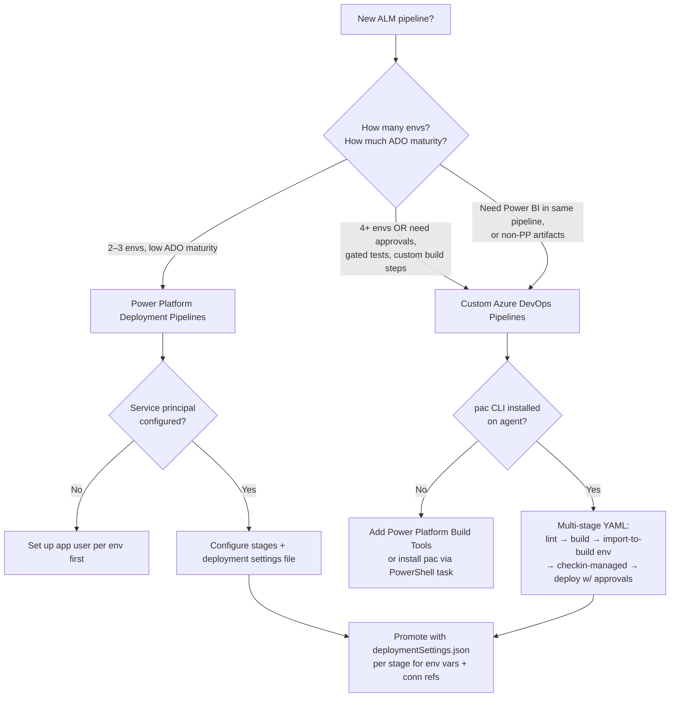

# ALM Pipeline Design Skill

**Purpose:** Give the `solution-alm-engineer` a senior maker's playbook for designing — or fixing — end-to-end ALM for Power Platform solutions. Optimised for greenfield ALM at engagement start, and for diagnosing a specific stage that is failing in a running pipeline.

## When to Use

- **Greenfield ALM** — new tenant, new solution, no pipeline yet. Start here before anyone exports a single .zip.
- **Existing pipeline failing** — an import is breaking, a connection reference won't re-bind, an env var is empty in PROD, a managed layer is shadowed by unmanaged customizations. Reach for the relevant section.
- **Restructuring a working pipeline** — moving from manual export/import to ADO, or from Deployment Pipelines to custom ADO, or splitting one monolithic solution into base + customization layers.

If you are *building* a flow or canvas app, this is not the right skill — finish the build, then come back here for packaging.

## Core Principles (non-negotiable)

1. **Solutions, always.** No artifact lives outside a solution. (Plugin house rule §3 #1.)
2. **Source control the unpacked tree, never the .zip.** `pac solution unpack` produces a reviewable, diff-able directory; that is what goes in git. The .zip is build output. (House rule §3 #12.)
3. **Managed in TEST, UAT, PROD. Unmanaged only in DEV.** (§3 #4.) Anyone customizing managed in PROD has just created an invisible unmanaged layer; flag it loudly.
4. **Environment variables for everything that varies.** URLs, IDs, secrets, feature flags. (§3 #2.) Plaintext defaults are a code smell — secrets resolve via `@Microsoft.KeyVault(...)`.
5. **Connection references over connections.** Consumers re-bind on import; the pipeline does not ship credentials. (§3 #3.)
6. **Test the import, not just the export.** A fresh-sandbox import smoke test is a release gate, not a nice-to-have. (§3 #13.)
7. **Service-principal-driven, not interactive.** Pipelines authenticate as an SPN with explicit application-user permissions in each target environment — never with a maker's personal credentials.
8. **One build artifact, promoted unchanged.** The managed .zip produced in BUILD is the same byte-for-byte object that lands in PROD. Re-packing per stage is a smell — config differences belong in env vars + connection refs, not in different .zips.

## Decision Tree — Pipeline Architecture

**Rule of thumb:** Deployment Pipelines if you can; Custom ADO when you can't. Deployment Pipelines is faster to stand up and has fewer moving parts. Custom ADO is what you need once you have approval gates, automated tests, Power BI in the same release, multiple solutions promoting together, or anything else that does not fit the linear DEV → TEST → PROD shape.

## Playbook

### 1. Source-control discipline (do this first)

- One git repo per logical solution boundary (or one repo per customer with multiple solutions in subdirectories — pick a convention and stick to it).
- `pac solution clone --name <SolutionName>` to bootstrap from an existing dev env, then commit the unpacked tree.
- `.gitignore` must exclude: `bin/`, `obj/`, `*.zip`, `*.user`, `node_modules/`, generated thumbnails.
- The unpacked tree contains `solution.xml`, `customizations.xml`, per-component folders (Entities, Workflows, CanvasApps, WebResources, AppModules, etc.). All of it is text-ish and diff-able. Reviewers should read flow `definition.json` diffs, canvas `*.fx.yaml` diffs, and entity ribbon XML diffs — those are where bugs hide.

### 2. `pac` CLI primitives every pipeline uses

| Command | Purpose |
|---|---|
| `pac solution clone` | First time only — pull existing solution + unpack |
| `pac solution sync` | Re-pull updates from the source env into the existing local unpacked tree |
| `pac solution unpack` | Convert a .zip into the source-controllable tree |
| `pac solution pack` | Convert the unpacked tree back into a .zip for import |
| `pac solution import` | Import a .zip into a target env (with deployment settings) |
| `pac solution check` | Static analysis — run in BUILD and fail the pipeline on critical findings |
| `pac solution online-version` | Inspect what's currently installed in a target env |

### 3. ADO multi-stage shape (the canonical pipeline)

Five stages, each a separate ADO stage with its own gates:

1. **Lint / static-check** — `pac solution check` on the unpacked tree. Fail on Critical/High findings.
2. **Build** — `pac solution pack --packagetype Unmanaged` → import into the dedicated BUILD env → export as Managed → publish artifact.
3. **Check-in-managed** — commit the managed .zip path as a build artifact (versioned by commit SHA + build number).
4. **Deploy to TEST** — import the managed .zip into TEST using `deploymentSettings-test.json` (env vars + connection refs for TEST).
5. **Deploy to UAT, PROD** — same pattern, gated by ADO approvals. PROD always has a human approver. UAT may auto-deploy on green TEST.

See [`resources/ado-pipeline-yaml-skeleton.md`](resources/ado-pipeline-yaml-skeleton.md) for a working YAML example.

### 4. Env-var injection at import

`deploymentSettings-<env>.json` is the right surface. Generated by `pac solution create-settings` against the source solution, then customized per env. Stored in the repo (env-var *values* per env, not secrets — secrets are Key Vault references that resolve at runtime). One file per target env; the pipeline picks the right one based on stage variables.

### 5. Connection-reference rebinding

Connection references are placeholders for connection objects that live per-env, per-user-or-SPN. On first deploy to a new env, the consumer (or the deployment SPN) must create the underlying connections and rebind. The `deploymentSettings-<env>.json` connection-reference section pre-binds them when the connections exist. If the import fails on "connection reference not bound," the SPN does not yet have a connection for that connector in that env — create one and re-import.

### 6. Solution layering — base + customization

When customers diverge from a shipped base solution, do **not** customize the base in place. Build a thin customization solution that depends on the base. Base ships unchanged across all customers; customization is per-customer and gets its own ALM pipeline. The customer's PROD has both solutions installed, with the customization solution above the base in the solution layer stack.

### 7. Patch vs upgrade

- **Patch** — small incremental change against an already-deployed solution. Faster to deploy but stacks layers in PROD over time. Use sparingly for hotfixes between full releases.
- **Upgrade** — full replacement of the solution at a new version. Cleans up deleted components properly. Use as the default for regular releases.

Rule: hotfixes patch; quarterly releases upgrade.

### 8. The fresh-import smoke test

Before declaring a release done, import the produced managed .zip into a clean, throwaway sandbox env. If it fails there, it will fail at the customer too — and the cost of finding it now is hours, not weeks.

## Anti-Patterns to Flag

- Committing the .zip instead of the unpacked tree
- Per-stage rebuilds — TEST and PROD running different .zip bytes
- Maker credentials in pipeline service connections
- Plaintext secrets in `deploymentSettings-*.json`
- Customizing managed solutions in TEST/UAT/PROD to "fix it quickly"
- Importing into PROD without an approval gate
- Skipping `pac solution check` because it's slow
- Branch-per-environment instead of env vars + deployment settings

## Escalation

- **DLP breaks the import** → `power-platform-admin` + `dlp-policy-design` skill.
- **Flow connection-ref rebinding edge cases** → `flow-engineer` + `power-automate` skill.
- **Plug-in registration not flowing through** → `dataverse-architect` + `dataverse-plugins` skill.
- **Power BI artifacts in the same release** → `power-bi-engineer` + `power-bi` skill.
- **Anything touching identity/secrets** → `ravenclaude-core` `security-reviewer`.

When in doubt, bounce back to the Team Lead with the failing stage + the last 50 lines of the pipeline log + the import-result XML if any. Don't guess.
