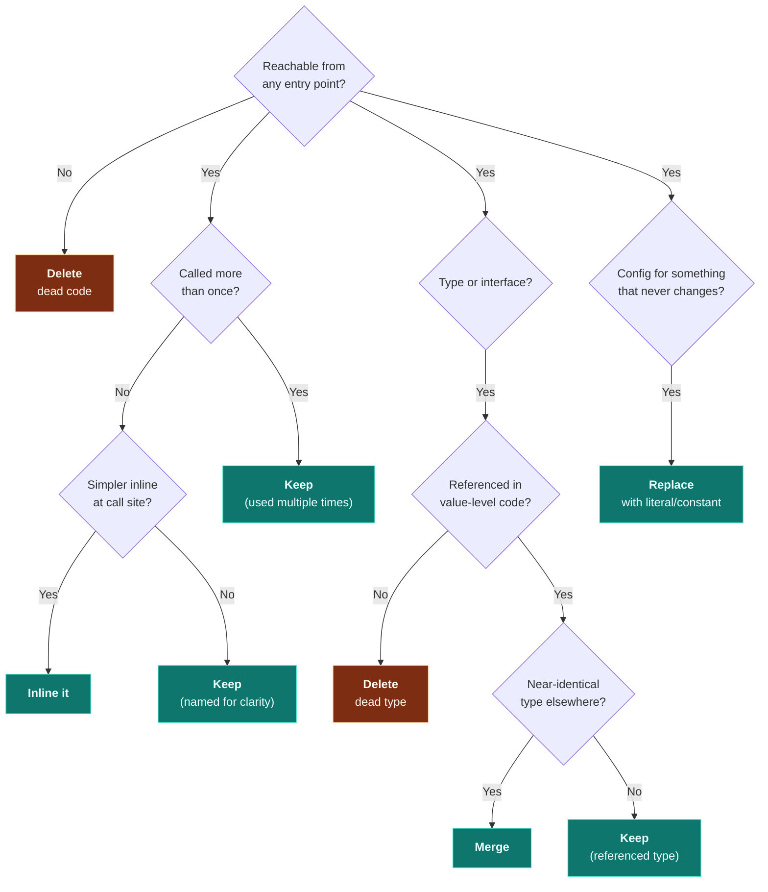

# Pruning Guide

Pruning is the art of making a codebase smaller without breaking anything.
Good pruning makes code easier to read, faster to build, and cheaper to maintain.

---

## The Pruning Mindset

> "The best code is no code at all."

Every line of code is a liability. It must be:
- Read and understood by future developers
- Maintained when dependencies change
- Tested (or it's a silent risk)
- Built and bundled (affects startup time)

If a line doesn't earn its place, it should go.

---

## What to Prune (Decision Tree)



---

## Pruning Categories

### 1. Dead Exports (Safest to prune)

Functions, types, or constants that are exported but never imported.

**How to find:**
```bash
# Get all exports
grep -rn "export " src/ --include="*.ts" --include="*.tsx" -o

# For each exported name, check import count
# Zero imports outside the defining file = dead export
```

**Safety check:** Grep for the name across the ENTIRE project (including tests,
scripts, config files). Only delete if truly zero references.

### 2. Commented-Out Code

Not comments *about* code — actual code that's been commented out.

```bash
# Multi-line commented code
grep -n "^\s*//\s*\(import\|export\|const\|let\|var\|function\|class\|return\|if\|for\)" src/ -r

# Block comments containing code
grep -B1 -A5 "/\*" src/ -r  # review for code inside /* */
```

**Why prune:** Git has the history. Commented code rots — it's not maintained,
not tested, and misleads readers into thinking it might be re-enabled.

### 3. Wrapper Functions (Called Once, Add No Logic)

```typescript
// BAD: Wrapper adds nothing
function getUserName(user: User): string {
  return user.name;
}

// GOOD: Just access user.name directly
```

**Exception:** Keep wrappers that provide a meaningful abstraction boundary
(e.g., a service layer function that wraps a raw API call — even if called once,
it's a deliberate abstraction).

### 4. Over-Configured Constants

```typescript
// BAD: Config object for values that never change
const GRID_CONFIG = {
  width: 25,
  height: 25,
  cellSize: 20,
};

// FINE IF: These values actually change (e.g., per difficulty level)
// BAD IF: They're always the same everywhere
```

**When to keep:** If the config is passed as a parameter, it enables testing
and reuse. If it's always used in one place with the same values, inline it.

### 5. Unused Dependencies

```bash
# Check for unused npm packages
npx depcheck

# Or manually: check each package.json dependency
# is it imported anywhere in src/?
```

Unused deps increase install time, bundle size, and attack surface.

### 6. Redundant Type Assertions

```typescript
// BAD: TypeScript already knows this
const name: string = user.name as string;

// BAD: Unnecessary non-null assertion when the type doesn't allow null
const id = user.id!;  // but id is already `string`, not `string | null`
```

### 7. Files That Should Be Split

A file should do ONE thing. Signs it needs splitting:

| Signal | Action |
|---|---|
| More than 300 lines | Split by responsibility |
| More than 15 imports | It's doing too many things |
| Multiple exported components in one file | One component per file |
| Utility file with 10+ functions | Group into focused modules |
| Store file with 20+ actions | Split into domain slices |

### 8. Redundant Null Checks

```typescript
// BAD: items is string[], it can't be null
if (items && items.length > 0) { ... }

// GOOD: Trust the type system
if (items.length > 0) { ... }
```

**Exception:** When working with external data (API responses, user input)
where the runtime type might differ from the declared type.

---

## Pruning Report Format

After analysis, produce a pruning plan:

```markdown
## Pruning Plan

### Safe to Delete (X lines saved)

| File | Lines | What | Why |
|---|---|---|---|
| `src/utils/old-helper.ts` | 45 | Entire file | Zero imports |
| `src/types/legacy.ts:10-25` | 15 | Interface `OldUser` | Never referenced |

### Should Inline (X lines simplified)

| File | Function | Called From | Action |
|---|---|---|---|
| `src/utils/format.ts:12` | `formatDate()` | 1 call site | Inline the body |

### Should Split (complexity reduction)

| File | Lines | Recommendation |
|---|---|---|
| `src/stores/game-store.ts` | 250 | Split persistence into `src/stores/persistence.ts` |

### Dependencies to Remove

| Package | Reason |
|---|---|
| `lodash` | Only using `_.debounce` — use native or tiny package |

### Total Impact
- Lines removed: ~X
- Files removed: X
- Dependencies removed: X
- Bundle size reduction: ~X KB (estimated)
```

---

## Anti-Patterns to Avoid While Pruning

1. **Don't prune test utilities.** They look dead but are used in test files.
2. **Don't prune type-only exports.** They have zero runtime impact and may be used by consumers.
3. **Don't prune error messages/strings.** They look unused but surface at runtime.
4. **Don't prune polyfills.** They're imported for side effects, not by name.
5. **Don't confuse "infrequently called" with "dead."** A password reset handler runs rarely but is critical.
