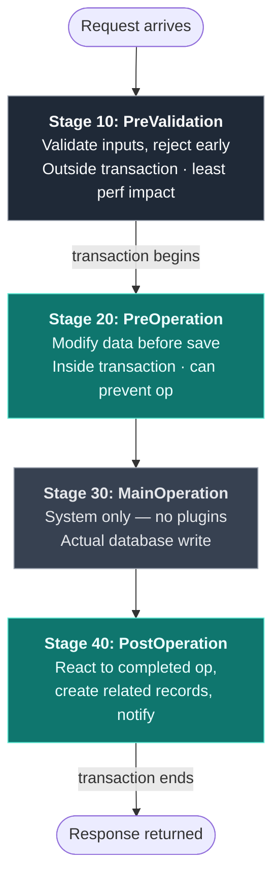

# Execution Pipeline

Dataverse processes data operations through a pipeline with defined stages.
Plugins register at specific stages to intercept operations.

## Pipeline Stages



## When to Use Which Stage

| Stage | Use When |
|---|---|
| **PreValidation (10)** | Validating input data, rejecting invalid operations early, checking business rules that don't need DB state |
| **PreOperation (20)** | Modifying the target entity before save (set defaults, transform data, auto-number), when changes must be part of the same transaction |
| **PostOperation (40) Sync** | Creating/updating related records that must succeed with the main operation, cascading calculations, when you need PostEntityImages |
| **PostOperation (40) Async** | Sending emails/notifications, external API calls, logging, non-critical operations that can tolerate delays |

## Sync vs Async Execution

| Aspect | Synchronous | Asynchronous |
|---|---|---|
| Timing | Immediate, blocks the user | Queued, runs in background |
| Transaction | Inside the DB transaction (PreOp/PostOp) | Outside any transaction |
| Timeout | 2 minutes | 24 hours |
| Error impact | Rolls back the transaction | Logged, doesn't affect original operation |
| User feedback | Errors shown to user immediately | Errors only in system jobs |
| Use cases | Validation, auto-populate, cascade updates | Notifications, integrations, batch processing |

## Entity Images

Entity images capture field values at specific points in the pipeline, avoiding
extra Retrieve calls.

### Pre-Image

Captures field values **before** the operation. Available in:
- Update (PreValidation, PreOperation, PostOperation)
- Delete (PreValidation, PreOperation, PostOperation)

**Not available for Create** (record doesn't exist yet).

### Post-Image

Captures field values **after** the operation. Available in:
- Create (PostOperation only)
- Update (PostOperation only)

**Not available for Delete** (record no longer exists).

### Using Images in Code

```csharp
// Pre-image: values before the update
if (context.PreEntityImages.Contains("PreImage"))
{
    var preImage = context.PreEntityImages["PreImage"];
    var oldBudget = preImage.GetAttributeValue<Money>("cnt_budget");
}

// Post-image: values after the update (includes unchanged fields)
if (context.PostEntityImages.Contains("PostImage"))
{
    var postImage = context.PostEntityImages["PostImage"];
    var newBudget = postImage.GetAttributeValue<Money>("cnt_budget");
}
```

### Image Registration

When registering the plugin step, specify which attributes to include in images:

| Setting | Value |
|---|---|
| Image Type | PreImage, PostImage, or Both |
| Name | Alias used in code (e.g., "PreImage") |
| Entity Alias | Same as Name |
| Attributes | Comma-separated list of logical names to capture |

**Tip:** Only include attributes you actually need. More attributes = more overhead.

## Message Types

| Message | Triggers On | Available Stages |
|---|---|---|
| `Create` | New record creation | 10, 20, 40 |
| `Update` | Record modification | 10, 20, 40 |
| `Delete` | Record deletion | 10, 20, 40 |
| `Retrieve` | Single record read | 10, 20, 40 |
| `RetrieveMultiple` | Query/list read | 10, 20, 40 |
| `Associate` | Relationship created | 10, 20, 40 |
| `Disassociate` | Relationship removed | 10, 20, 40 |
| `SetState` | Status change | 10, 20, 40 |
| `Assign` | Owner change | 10, 20, 40 |

## Filtering Attributes

For Update messages, register **filtering attributes** to limit when the plugin fires:

```
Filtering Attributes: cnt_budget, cnt_status
```

The plugin only fires when one of these attributes is included in the update.
Without filtering attributes, the plugin fires on EVERY update (performance concern).

## Pipeline Execution Order

When multiple plugins register on the same message/stage:

1. Execution order is determined by the **Execution Order** value (lower = first)
2. Equal order values: execution order is non-deterministic
3. Best practice: use increments of 10 (10, 20, 30) to allow insertions
