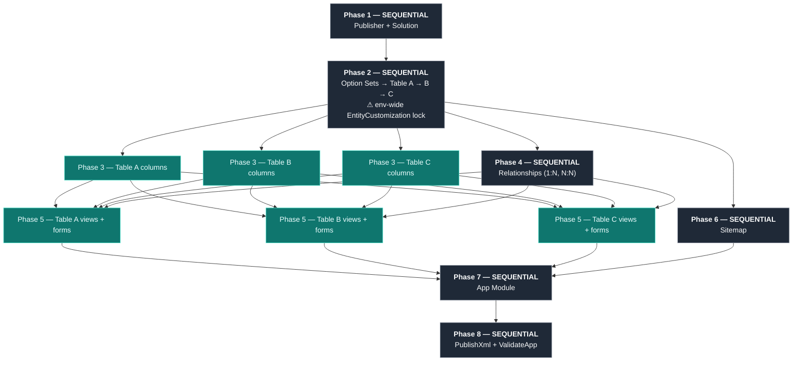

# Schema Creation Parallelization

When building a Dataverse schema via agent teams, certain operations can run in parallel
while others have dependencies that require sequential execution.

## Dependency Graph



> ⚠ Dataverse takes an environment-wide lock during EntityCustomization. Only ONE table can be created at a time — parallel table creation causes: `Cannot start another [EntityCustomization] because there is a previous [EntityCustomization] running at this moment.`
>
> Column additions to DIFFERENT existing tables may be parallelizable since the tables already exist. Table *creation* itself cannot be parallel.

## Agent Team Strategies

### Option A: Main Agent Creates All Tables, Then Parallelize Columns/Views/Forms

Best for 3+ tables with many columns/views/forms each.

```
Main Agent:
  - Phase 1: Publisher + Solution
  - Phase 2: Global Option Sets + ALL Tables (sequential — lock constraint)
  - Phase 4: Relationships (after all tables exist)
  - Phase 6-8: Sitemap, App Module, Publish

Table Agent A (starts after Phase 2 completes):
  - Phase 3: Create Table A columns
  - Phase 5: Create Table A views + forms

Table Agent B (starts after Phase 2 completes):
  - Phase 3: Create Table B columns
  - Phase 5: Create Table B views + forms
```

**Coordination:** Main agent creates publisher/solution/option sets and ALL tables sequentially
(due to EntityCustomization lock). Then broadcasts readiness to table agents.
Table agents add columns, views, and forms in parallel (these don't require the lock).
Main agent creates relationships after all table agents finish, then builds sitemap/app module.

### Option B: Schema Agent + UX Agent

Best for simpler apps (1-2 tables) or when views/forms are complex.

```
Schema Agent:
  - Publisher + Solution
  - Global Option Sets
  - Tables + Columns
  - Relationships

UX Agent (starts after Schema Agent finishes tables):
  - Views for all tables
  - Forms for all tables
  - Sitemap

Main Agent:
  - App Module (after both finish)
  - Publish + Validate
```

## Key Coordination Points

1. **Global option set GUIDs** — Table agents need MetadataId GUIDs to bind option set columns. Main agent must broadcast these after creation.
2. **ObjectTypeCodes** — View creation requires ObjectTypeCode. Each table agent queries its own.
3. **View GUIDs for subgrids** — Form agents need view GUIDs for subgrid controls. Create views before forms.
4. **All component GUIDs for app module** — Main agent collects all entity MetadataIds, view GUIDs, form GUIDs for AddAppComponents.
5. **Publish once at the end** — Don't publish incrementally. One final PublishXml is faster and avoids race conditions.

## Performance Tips

- Batch multiple columns in a loop (sequential per table, but fast)
- Batch all AddAppComponents in a single call
- Use idempotent scripts so partial failures can be safely re-run
- Token refresh: get a fresh token at the start of each agent's work
