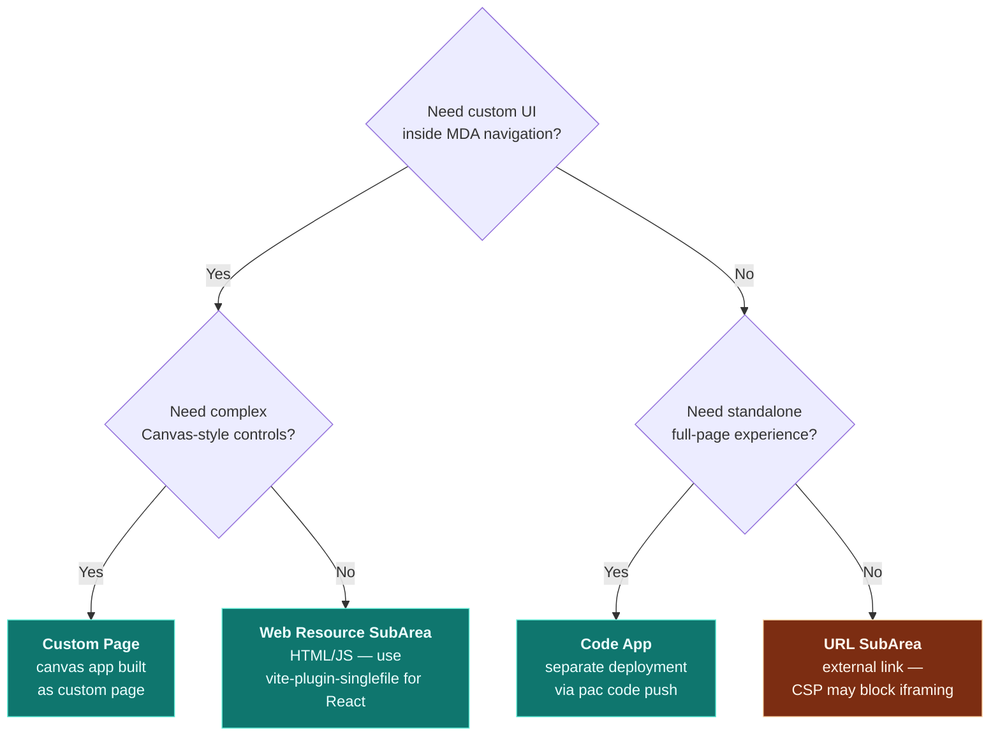

# Model-Driven App Integration Patterns

Code Apps are currently standalone applications. To integrate custom functionality
into Model-Driven Apps (MDA), use these patterns.

## Integration Approaches Comparison

| Approach | Complexity | Use Case | Embedded in MDA? |
|---|---|---|---|
| Custom Page | Medium | Canvas-style UI inside MDA | Yes |
| Web Resource SubArea | Low | HTML/JS page as navigation item | Yes |
| HTML Dashboard | Medium | KPI dashboards with charts | Yes |
| Code App (standalone) | High | Full custom app experience | **NO** (separate URL only) |
| URL SubArea | Low | External URL in navigation | Yes (iframe — but CSP may block) |

## Custom Pages

Canvas-style pages that run inside Model-Driven Apps. Added via sitemap.

**Creating:** Use the Maker Portal to create Custom Pages (Canvas app components).
These appear as pages in the MDA navigation.

**Sitemap reference:**
```xml
<SubArea Id="custompage1" PageType="custom"
         Url="/main.aspx?pagetype=custom&name=cnt_mycustompage"
         Title="Custom Dashboard" />
```

## Web Resource SubAreas

HTML web resources embedded as navigation items in the MDA sitemap.

**Sitemap reference:**
```xml
<SubArea Id="dashboard"
         Url="$webresource:cnt_/html/dashboard.html"
         Title="Dashboard" />
```

The `$webresource:` prefix tells the sitemap to load from the web resource store
rather than an external URL.

**Accessing Dataverse from web resources:**
```javascript
// Inside an HTML web resource loaded in MDA
const Xrm = parent.Xrm; // Access the parent MDA's Xrm object

// Fetch records
const results = await Xrm.WebApi.retrieveMultipleRecords(
    "cnt_project",
    "?$select=cnt_projectname,cnt_budget&$top=10"
);
```

## HTML Dashboard Pages

Build rich dashboard pages with chart libraries (Chart.js, D3.js) as web resources.

**Pattern:**
1. Create an HTML web resource with embedded chart library
2. Fetch data via `parent.Xrm.WebApi` from within the iframe
3. Render charts and KPIs
4. Add as a SubArea in the sitemap with `$webresource:` prefix

**Example dashboard structure:**
```html
<!DOCTYPE html>
<html>
<head>
    <script src="../../cnt_/lib/chart.min.js"></script>
</head>
<body>
    <div id="kpi-container">
        <div class="kpi-card" id="totalProjects"></div>
        <div class="kpi-card" id="totalBudget"></div>
    </div>
    <canvas id="budgetChart"></canvas>
    <script src="../../cnt_/js/dashboard.js"></script>
</body>
</html>
```

## Navigation Patterns

### Open a Web Resource Programmatically

```javascript
// From form script or ribbon command
Xrm.Navigation.openWebResource("cnt_/html/report.html", {
    width: 800,
    height: 600,
    openInNewWindow: true
});
```

### Navigate to a Custom Page

```javascript
// Client API navigation
Xrm.Navigation.navigateTo(
    { pageType: "custom", name: "cnt_mycustompage" },
    { target: 2, width: { value: 80, unit: "%" }, height: { value: 80, unit: "%" } }
);
```

### Navigate to an Entity Record

```javascript
Xrm.Navigation.navigateTo(
    { pageType: "entityrecord", entityName: "cnt_project", entityId: "{record-guid}" },
    { target: 1 } // 1 = inline, 2 = dialog
);
```

## URL SubAreas

Link external URLs as navigation items:

```xml
<SubArea Id="external" Url="https://external-app.contoso.com/dashboard"
         Title="External Dashboard" />
```

The URL loads in an iframe within the MDA shell. Note:
- External sites must allow iframe embedding (no `X-Frame-Options: DENY`)
- No automatic authentication passthrough — the external app must handle its own auth
- Use URL parameters to pass context: `Url="https://app.com?env={!environmentId}"`

## Code Apps Cannot Be Embedded Inside MDAs

**This is a confirmed platform limitation.** Three approaches were tested and all failed:

1. **`pagetype=custom&name=...`** — Code Apps are NOT Custom Pages. Returns "Page does not
   exist in this app" (Error 2147873362). `AddAppComponents` with `canvasapp` type returns 404.

2. **Direct Power Apps player URL in sitemap** — MDA opens it in a new browser tab, not
   inline. The user leaves the MDA context entirely.

3. **Iframe wrapper** (HTML web resource that iframes the Code App player URL) — Blocked by
   Power Platform CSP. The `powerplatformusercontent.com` domain sends `X-Frame-Options: DENY`.

**For React apps inside an MDA, use the web resource deployment approach** (vite-plugin-singlefile
to build a single HTML file, then upload as a Dataverse web resource). Both can coexist — web
resource for in-MDA experience, Code App for standalone access.

## Code App vs MDA Integration Decision Tree


