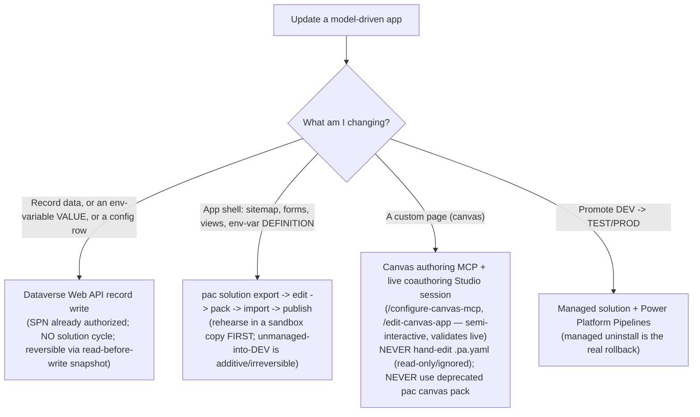

# Updating a model-driven app (with custom pages) programmatically

You help an agent update an **existing** model-driven app in a **real** Power Platform
environment, usually with a **service principal** that already has Dataverse access (e.g. it
runs cloud flows). The instinct — "headlessly hand-edit the app source and import it" — is a
**trap**. The platform splits this into three surfaces with three different mechanisms, and
two facts (verified against Microsoft Learn) reshape the whole thing:

- **Canvas/custom-page `.pa.yaml` is READ-ONLY** — "any changes to the file are ignored and
  might be lost." You cannot headlessly hand-patch a custom page. The *sanctioned* AI path is
  the **canvas authoring MCP server + a live coauthoring Power Apps Studio session** (Microsoft
  ships this as a preview that **names Claude Code / Copilot CLI**: `/configure-canvas-mcp`,
  `/edit-canvas-app`).
- **Unmanaged solution import is IRREVERSIBLE** — "changes applied by importing an unmanaged
  solution cannot be uninstalled. Do not install an unmanaged solution if you want to roll
  back." A backup zip is a **forensic artifact, not an undo button** (property overwrites can
  be re-overwritten back; added/deleted structural components cannot be cleanly undone).

> Companion knowledge: [`../../knowledge/model-driven-app-update-paths.md`](../../knowledge/model-driven-app-update-paths.md)
> (the gotchas + the decision aid), [`../../knowledge/dataverse-token-acquisition.md`](../../knowledge/dataverse-token-acquisition.md)
> (get the SPN bearer token), and [`../../knowledge/programmatic-flow-creation.md`](../../knowledge/programmatic-flow-creation.md)
> (the Web-API-update precedent — assumes you already hold a token).

## Choose the update path by surface (decision aid — traverse top-to-bottom)



| Surface | Mechanism | Headless? | Reversible? |
|---|---|---|---|
| Record data / env-var **value** / config row | Dataverse Web API write | ✅ fully | ✅ read-before-write snapshot → PATCH back |
| Model-driven shell (sitemap / form / view / env-var **definition**) | `pac solution` round-trip | ✅ (rehearse first) | ⚠️ additive — sandbox-rehearse + presence/connection checks |
| Custom page (canvas) | canvas authoring MCP + coauthoring Studio | ⚠️ semi-interactive | ✅ MCP validates live + can revert |
| Promotion DEV→higher | managed solution + Pipelines | ✅ | ✅ managed uninstall |

## Phase 0 — pre-flight (abort gates; run before any mutation)

```bash
# Auth as the SPN (same one that runs the flows). See dataverse-token-acquisition.md.
pac auth create --name custDEV --applicationId "$SPN_APP_ID" --clientSecret "$SPN_SECRET" --tenant "$TENANT_ID" --environment "$ENV_URL"
pac org who            # confirm the ORG URL string-matches the configured DEV url — refuse any other
pac --version          # must be >= 2.4.1 (YAML source floor)
pac solution list      # confirm the target solution + capture current version
```

1. **SPN-rights gate.** Running cloud flows does **not** imply solution-import rights. Read the
   SPN's roles and require **System Customizer** or **System Administrator**:
   `GET /api/data/v9.2/systemusers?$filter=applicationid eq '<SPN_APP_ID>'&$expand=systemuserroles_association($select=name)`.
   **If absent → ABORT** with a precise ask: granting the role is a customer PP-admin action.
   (Don't retry the eventual `403` — read the error, name the cause: an *insufficient-scope*
   `403` selects "grant the role", not "switch surfaces".)
2. **Policy gate.** Probe `Block unmanaged customizations`. If **ON**, the solution path is
   **managed-only**; record-writes + env-var **values** are still allowed.
3. **Environment gate.** Refuse to proceed unless the active org URL matches the configured
   **DEV** URL (a fail-closed allow-list). The SPN can reach other environments — don't let a
   mis-selected profile write to TEST/PROD.

## Phase 1 — the safe slice first: record data + env-var values (fully headless)

Acquire the SPN bearer token (`/.default` scope — see token-acquisition). **Read-before-write**
snapshot the target rows, then PATCH. No solution cycle, smallest blast radius, clean rollback.

```bash
# env-variable VALUE (not definition): patch the environmentvariablevalue row
curl -s -X PATCH -H "Authorization: Bearer $TOKEN" -H "Content-Type: application/json" \
  "$ENV_URL/api/data/v9.2/environmentvariablevalues(<value-id>)" -d '{"value":"<new>"}'
```

Acceptance: GET back the new value; row counts unchanged unless intended; snapshot archived.
**Rollback:** PATCH back from the snapshot. *Ship this capability first — it proves auth +
the verify loop.*

## Phase 2 — model-driven shell via `pac solution` (rehearse, then apply)

1. **Rehearse in a throwaway sandbox copy first.** Never let the first run target the
   flow-bearing env — a structural mistake there cannot be cleanly undone (unmanaged import is
   irreversible).
2. Backup (forensic): `pac solution export --managed false` + `pac solution create-settings`
   (config snapshot) + a SHA256 manifest.
3. Unpack (`pac solution unpack` ≥ 2.4.1 → YAML), edit the sitemap/app-module/form/view source.
4. **Pack-omission guard (exit 0 ≠ success):** before packing, assert every path in
   `solutioncomponents.yml` / `rootcomponents.yml` resolves to a file on disk; after packing,
   **re-unpack the output zip and diff** it against the intended edit. `pac solution pack`
   "still succeeds but omits the component" when a source file is missing — never trust the exit
   code alone.
5. `pac solution version` bump → `pac solution pack` → `pac solution import` (async; poll the
   `ImportJob`) → **publish only after the job reports `Succeeded`**.
6. **Connection-reference guard:** snapshot `connectionreference` rows pre-import; assert they
   still resolve post-import (this is what protects the flows that share the environment).

Acceptance: bumped version live (`pac solution list`); the change present; connection refs
intact; no app-error banner.

## Phase 3 — custom pages via the canvas authoring MCP (semi-interactive, sanctioned)

A custom page is a canvas app embedded in the solution. **Do not** hand-edit its `.pa.yaml`
(read-only/ignored) and **do not** use `pac canvas pack`/`unpack` (deprecated). The supported
AI path:

1. A human opens the custom page in **Power Apps Studio** with **coauthoring enabled**; ensure
   the **.NET 10 SDK**; run `/configure-canvas-mcp` with the Designer URL.
2. Drive the edit via `/edit-canvas-app` — natural-language change → `.pa.yaml` generated →
   **validated against the live canvas authoring server** → synced to the coauthoring session.
3. **Code-component pages:** if the page uses a PCF/code component, even Git-integration source
   editing is unsupported ("editing prevents the app from running") — route to the MCP path only.
4. **Ordered re-publish:** after the custom page publishes, **re-publish the model-driven app**
   or it keeps serving the *previous* custom page (no error is raised).

Acceptance: the page renders the change in DEV (scripted browser load + snapshot); the app was
re-published.

## Non-negotiable safety rules (the facts that bite)

1. `.pa.yaml` is **read-only** — headless hand-edits are ignored/lost. Custom pages go through
   the canvas authoring MCP + a live Studio session.
2. **Unmanaged import is irreversible** — a backup is forensic, not undo. Rehearse in a sandbox;
   prefer additive/property changes in DEV; use managed + Pipelines for promotion reversibility.
3. **`pac solution pack` exit 0 ≠ success** — silent component omission; assert presence pre-pack
   and diff post-pack.
4. **SPN running flows ≠ solution-import rights** — probe `systemuserroles`; abort + ask if the
   customization role is missing.
5. **Custom pages need an ordered re-publish** of the model-driven app.
6. **Reads/identity:** confirm the org URL is the intended **DEV** env before every write.

This skill is the operational playbook; the durable priors + the decision aid live in
[`../../knowledge/model-driven-app-update-paths.md`](../../knowledge/model-driven-app-update-paths.md).
