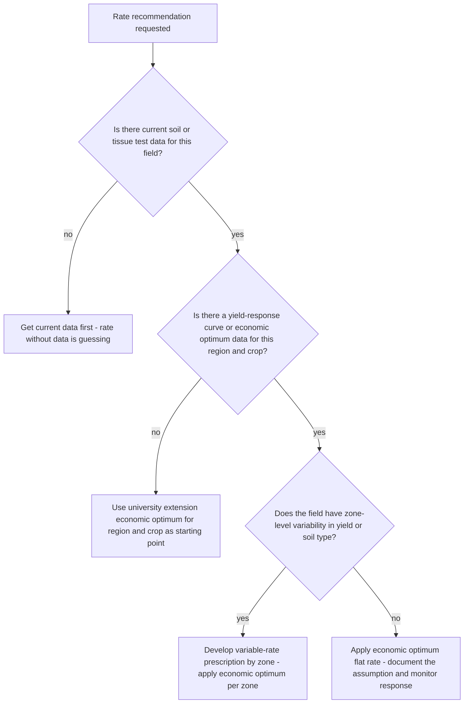
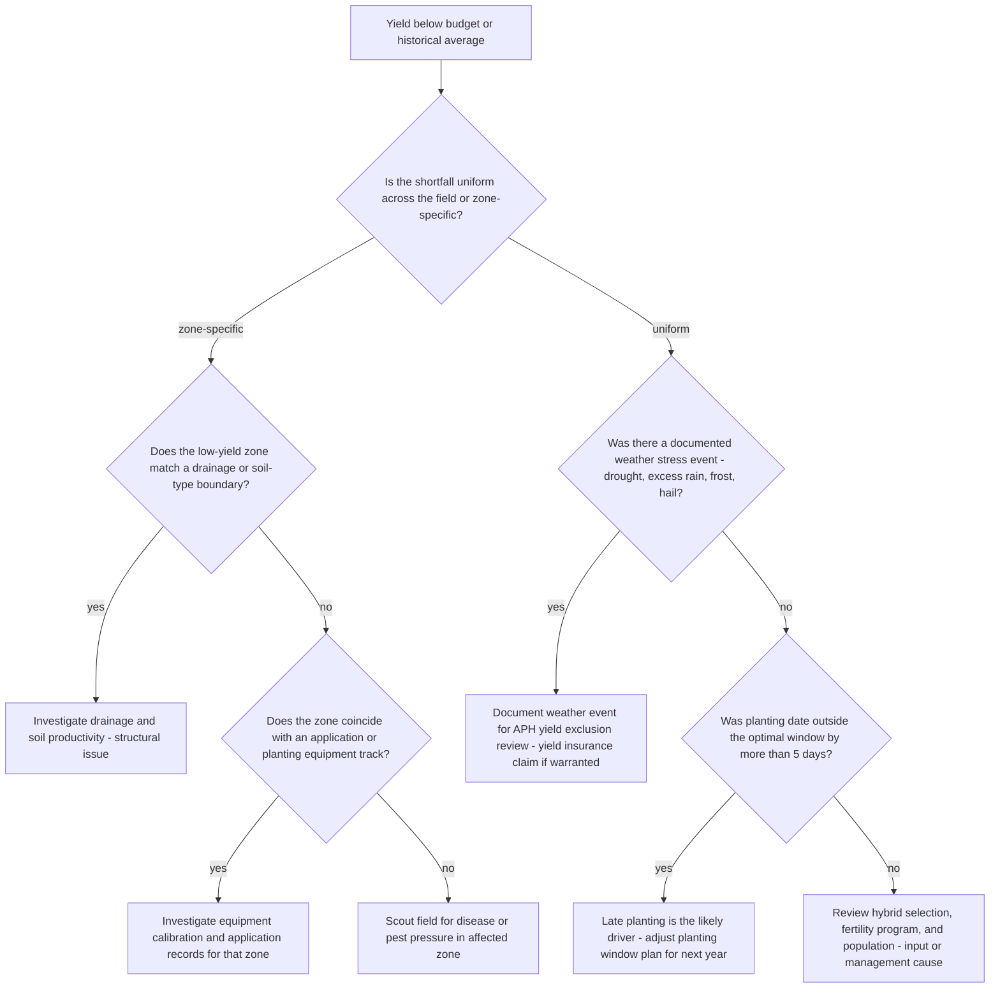

# Precision-ag decision trees

Which analysis for which symptom — traverse top-to-bottom before picking a method.

## Decision Tree: Margin per acre is shrinking

1) Build per-acre economics by field (§3 #4). 2) Read yield by zone (§3 #2). 3) Optimize input economics (§3 #1). 4) Check operation timing (§3 #3).

## Decision Tree: Should I apply this input?

1) Build the response curve (§3 #1). 2) Find the economic optimum. 3) Vary by zone (§3 #2).

## Decision Tree: Sell now or store?

1) Read price, basis, and storage cost (§3 #7). 2) Weigh against risk tolerance. 3) Date the figures (§3 #8).

## How to read these trees

Traverse top-to-bottom and stop at the first matching branch — the order encodes the cheap-checks-before-expensive-checks discipline (§3). Each leaf names a skill, a specialist, or a house-opinion to apply. Never skip a higher branch because a lower one looks more interesting; a denominator, seasonal, or definitional artifact masquerades as a finding more often than not.

## Decision Tree: Which skill for which task

- **Optimize input economics** → use when: Set input rates at the economic optimum where marginal return equals marginal cost, not at agronomic maximum, so the last unit pays. ([`../skills/optimize-input-economics/SKILL.md`](../skills/optimize-input-economics/SKILL.md))
- **Manage by zone** → use when: Read yield and soil by management zone and apply variable-rate inputs where they pay, instead of a field average. ([`../skills/manage-by-zone/SKILL.md`](../skills/manage-by-zone/SKILL.md))
- **Time the operations** → use when: Time planting, application, and harvest to the agronomic and weather window, since timing drives yield and quality more than rate. ([`../skills/time-the-operations/SKILL.md`](../skills/time-the-operations/SKILL.md))
- **Build fertility from data** → use when: Build the fertility program from current soil/tissue data and removal rates, not last year's program, so neither over- nor under-application costs margin. ([`../skills/build-fertility-from-data/SKILL.md`](../skills/build-fertility-from-data/SKILL.md))
- **Build per-acre economics** → use when: Build cost and margin per acre by field so the money-losing acres are visible. ([`../skills/build-per-acre-economics/SKILL.md`](../skills/build-per-acre-economics/SKILL.md))

## Decision Tree: Which specialist owns this

- **The engagement** → [`agronomy-engagement-lead`](../agents/agronomy-engagement-lead.md)
- **Agronomy** → [`crop-agronomist`](../agents/crop-agronomist.md)
- **The numbers** → [`farm-operations-analyst`](../agents/farm-operations-analyst.md)
- **The outside view** → [`ag-market-analyst`](../agents/ag-market-analyst.md)

When two leaves apply, route to the **lead** first to scope and sequence — overlapping symptoms usually mean two drivers at once, and the lead keeps the analysis from collapsing into a single-cause story.

## Decision Tree: Which house-opinion gates the call

Before picking any method, check whether one of the standing biases (§3) already decides the framing:

1. Manage to economic optimum, not maximum yield — if this is in question, apply §3 #1 before any method.
2. Read yield by management zone, not field average — if this is in question, apply §3 #2 before any method.
3. Time operations to the agronomic and weather window — if this is in question, apply §3 #3 before any method.
4. Cost and margin are per acre, by field — never whole-farm only — if this is in question, apply §3 #4 before any method.
5. Soil test and tissue data drive fertility, not the rear-view — if this is in question, apply §3 #5 before any method.
6. Crop protection is threshold-and-resistance management, not calendar spraying — if this is in question, apply §3 #6 before any method.
7. Weather and price are the risk — hedge the controllable, plan the rest — if this is in question, apply §3 #7 before any method.
8. Date and source any price, rate, or benchmark figure — if this is in question, apply §3 #8 before any method.

## Escalation & guardrails

- Anything touching client PII / regulated records → stop and route to `ravenclaude-core` `security-reviewer`.
- Any external figure entering a deliverable → carry a source URL + retrieval date, or mark it `[unverified — training knowledge]` / `[ESTIMATE]` (§3, final house opinion).
- A recommendation ships only with an owner, a date, and an expected metric movement.
## Sourcing note

Figures in this file are from the author's domain knowledge and are marked `[unverified — training knowledge]` or `[ESTIMATE]` at point of use. Validate against a primary source before putting any figure in a client deliverable (§3 cite-or-mark rule).

---

## Decision Tree: Precision-Ag — Input Rate Recommendation Request

**When this applies:** A grower or agronomist is asking for a rate recommendation on a specific input (nitrogen, seed, fungicide). The symptom is "what rate should I apply?" without specifying the economic or field context. This tree routes the analysis before any rate answer is given.

**Last verified:** 2026-06-05 against economic optimum rate methodology and Cooperative Extension agronomic guidance.



**Rationale per leaf:**
- *Get current data first* — recommending a rate without current soil or tissue data is not agronomy; it is guessing that happens to use agronomic vocabulary.
- *Use extension economic optimum* — without a field-specific response curve, the university-published economic optimum for the region is the defensible starting point.
- *Variable-rate prescription* — field variability means a flat rate over-applies in low-response zones and under-applies in high-response zones; the economic return is higher with VR.
- *Flat economic optimum* — for uniform fields, a well-justified flat rate is correct and simpler to execute.

**Tradeoffs summary:**

| Method | Cost / time | Blast radius | Approval gate? | Use when |
|---|---|---|---|---|
| Current data collection | Low / 1-2 weeks | Season delay | Agronomist | No current data exists |
| Extension economic optimum | Low / immediate | Moderate (regional, not field-specific) | Agronomist | No local response curve available |
| Variable-rate prescription | Medium / 1-3 days | Equipment compatibility needed | Agronomist + operator | Field has documented zone variability |
| Flat economic optimum | Low / immediate | Minimal | Agronomist | Uniform field, data current |

---

## Decision Tree: Precision-Ag — Yield Shortfall Post-Harvest Analysis

**When this applies:** Actual yield came in below budget or below the field's historical average. The symptom is "we didn't hit our yield goal — why?" This tree sequences the diagnosis in cost order before attributing the shortfall to any single cause.

**Last verified:** 2026-06-05 against standard agronomic yield-loss diagnostic methodology.



**Rationale per leaf:**
- *Drainage / soil productivity* — zone-specific shortfall on a soil or drainage boundary is a structural field issue; VR management or drainage investment is the multi-year fix.
- *Equipment calibration* — pattern matching to an equipment track is a calibration or application error; pull the field records and correct before next season.
- *Disease / pest scouting* — zone shortfall without a structural explanation requires in-field investigation.
- *Weather documentation* — a uniform shortfall in a documented weather event is the correct year for yield exclusion; file immediately.
- *Planting timing* — late planting is one of the highest-yield-impact decisions that is entirely controllable; the response curve for planting date is well published.
- *Input or management review* — when timing, weather, and structural issues are eliminated, the shortfall traces to hybrid, fertility, or population decisions.

**Tradeoffs summary:**

| Method | Cost / time | Blast radius | Approval gate? | Use when |
|---|---|---|---|---|
| Drainage investigation | High / multi-season | Capital decision | Owner | Structural drainage pattern |
| Equipment review | Low / 1 day | Records audit | Operator | Pattern matches equipment track |
| Disease scouting | Low / 1 day | None | Agronomist | Zone shortfall without structural cause |
| Weather documentation | Low / 1 day | Insurance | FSA + agent | Uniform shortfall with weather event |
| Planting timing adjustment | None / next season | Logistics | Operator | Confirmed late planting |
| Input program review | Low / 1 week | Next-season prescription | Agronomist | All other causes eliminated |

---

## Decision Tree: Precision-Ag — Should We Market Now or Store?

**When this applies:** A grower has grain in the bin or in the field ready to harvest and is deciding between selling at harvest, storing for a later sale, or forward-contracting. The symptom is "prices look OK — should I sell or wait?"

**Last verified:** 2026-06-05 against standard grain-marketing and basis-management methodology.

```mermaid
flowchart TD
    START[Grain marketing timing decision] --> Q1{Is cash price currently above the average breakeven price for this crop?}
    Q1 -->|no| Q2{Is there a forward contract or HTA opportunity above breakeven?}
    Q2 -->|yes| FORWARD[Price a portion forward at above-breakeven - lock profitable bushels]
    Q2 -->|no| HOLD[Hold - selling below breakeven converts paper loss to realized loss]
    Q1 -->|yes| Q3{Is current basis stronger or weaker than 3-year average for this delivery month?}
    Q3 -->|stronger| SELL_BASIS[Sell basis now - above-average basis is favorable to lock}
    Q3 -->|weaker| Q4{Is carry in the futures market paying storage cost?}
    Q4 -->|yes| HTA[HTA - lock futures now, float basis until it strengthens]
    Q4 -->|no| PARTIAL_SELL[Sell a portion now - carry is not covering storage; reduce risk exposure]
```

**Rationale per leaf:**
- *Price forward at above-breakeven* — if current prices are below breakeven but forward months are not, locking profitable forward bushels is risk management, not speculation.
- *Hold* — selling below breakeven is realizing a loss that the futures market may correct; hold if cash flow permits and the operation can carry the position.
- *Sell basis now* — above-average basis means the local market is paying a premium; capture it before it weakens.
- *HTA* — below-average basis with futures paying carry is the classic HTA scenario: lock the favorable futures, wait for basis improvement.
- *Partial sell* — when carry doesn't cover storage and basis is weak, time is not being rewarded; reduce exposure by selling a portion.

**Tradeoffs summary:**

| Method | Cost / time | Blast radius | Approval gate? | Use when |
|---|---|---|---|---|
| Forward contract at above-breakeven | Low / immediate | Locks in price | Owner | Forward price above breakeven, cash below |
| Hold | Storage cost risk | Basis and futures risk | Owner | Below breakeven, no forward opportunity |
| Sell basis now | Low / immediate | Commits delivery timing | Owner | Basis stronger than 3-yr average |
| HTA contract | Low / commissions | Locks delivery, floats basis | Owner + elevator | Basis weak, carry positive, futures favorable |
| Partial sell | Low / immediate | Partial price lock | Owner | Carry doesn't cover storage, basis weak |
