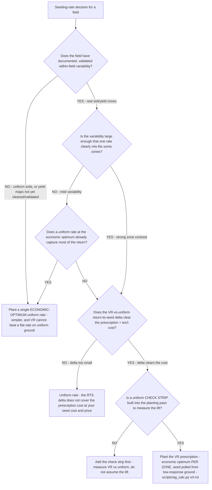

# Precision-ag decision tree — variable-rate vs. uniform seeding rate

**Last reviewed:** 2026-06-05 · **Confidence:** medium (OSU/Illinois/Iowa State seeding-rate trial framing + return-to-seed methodology, web-verified this date). Return-to-seed figures, EOSR yield bands, seed cost, and corn price are region-, hybrid-, and year-dependent — they carry inline `[verify-at-use]` / `[ESTIMATE]` markers and must be validated against the operation's own seed cost, cash bid, and a measured check strip before any deliverable (CLAUDE.md §3 #8).

> Canonical decision tree for the `crop-agronomist` (the agronomy) with an economics assist from `farm-operations-analyst` (the return-to-seed math). Traverse top-to-bottom before writing a VR seeding prescription — or before defaulting to a uniform rate. The decision is **not** "VR is better" — it is a field-variability + return-to-seed trade where a single well-chosen uniform rate is correct on uniform ground and VR pays only when validated variability and the RTS math justify it. This is decision-support for the operator, never a binding application rate (CLAUDE.md §2).

---

## When this applies

A grower with a VR-capable planter is deciding whether to plant a field (or zones within it) at variable seeding rates or one uniform rate, and how to justify the prescription cost. Triggers: a seed-company VR prescription offer, a planter-control upgrade, or a margin review on the seed line.

## The tree



## Rationale per leaf

- **Uniform economic-optimum rate (uniform ground)** — on uniform soils a single, well-justified economic-optimum rate is correct and simpler; VR cannot beat a flat rate where there is no variability to exploit. Also the right call when yield maps aren't yet cleaned/validated — VR on phantom zones is worse than a good flat rate.
- **Uniform when mild variability is captured at the optimum** — if a flat economic-optimum rate already captures most of the return, the VR prescription cost isn't justified by a marginal lift.
- **Uniform when the RTS delta is too small** — VR pays only when the return-to-seed delta clears the prescription + technology cost; a small delta on a small contrast doesn't.
- **Add the check strip first** — a VR map with no uniform check strip means the lift is forever assumed. Build the measurement in before trusting the prescription.
- **Plant the VR prescription** — when variability is validated, the contrast is strong, and the RTS delta clears the cost: plant VR at the **economic optimum per zone**, pulling seed from low-response (droughty/sand) ground where the last unit of population doesn't pay, not piling seed into the good ground (§3 #1, #2).

## The economic test (return-to-seed, the load-bearing arithmetic)

VR is justified for a field when, at the operation's seed cost and price:

```
RTS(rate)        = yield(rate) x price - seed cost(rate)
VR pays on cost  if  RTS(VR) - RTS(uniform) > prescription + tech cost
breakeven lift   = (prescription cost + (VR seed cost - uniform seed cost)) / price
```

Extension trials put the economically-optimum-seeding-rate (EOSR) yield in a wide band — roughly **117–271 bu/acre, avg ~205 bu/acre**, with **return-to-seed averaging ~$674/acre (range ~$360–$900/acre)** [verify-at-use, OSU/Illinois trial range] — and the *spread itself* is the case for VR: a single rate can't sit at the optimum across that much variability. VR seeding yield deltas are commonly modest (**~3–10 bu/acre** vs flat) and precision-planting ROI **~8–15%** [verify-at-use], so the prescription cost must be small relative to the delta. [`../scripts/ag_calc.py`](../scripts/ag_calc.py) `vrt-roi` computes the RTS delta net of prescription cost and the breakeven yield lift VR must clear.

## Gotchas

- **VR is an economic-optimum tool, not a yield-maximizer** — its return comes from *removing* seed where it doesn't pay as much as from adding it where it does (§3 #1).
- **Validate zones before the prescription** — clean yield maps before delineating zones; see [`yield-map-cleaning-precedes-zone-delineation`](../best-practices/yield-map-cleaning-precedes-zone-delineation.md) and [`variable-rate-application-requires-zone-map-validation-before-planting`](../best-practices/variable-rate-application-requires-zone-map-validation-before-planting.md).
- **No check strip = no learning** — without a uniform control in the pass, the realized VR ROI is an assumption forever. See the [`../scenarios/2026-06-05-vrt-seeding-rate-roi.md`](../scenarios/2026-06-05-vrt-seeding-rate-roi.md) scenario.
- **Seed-company prescription ≠ economic optimum** — a catalog prescription may target yield, not the operation's economic optimum; re-check it against the RTS math.

## Escalation & guardrails

- The capital/equipment ROI of the VR controller itself → the [`ag-adopt-precision-tech-roi-decision-tree.md`](ag-adopt-precision-tech-roi-decision-tree.md) (this tree assumes the planter is already VR-capable).
- A financing/lease decision → [`farm-operations-analyst`](../agents/farm-operations-analyst.md).
- Every figure entering a deliverable carries a source URL + retrieval date or an `[unverified — training knowledge]` / `[ESTIMATE]` mark (CLAUDE.md §3 #8).

## Sources (retrieved 2026-06-05)

- Ohioline (OSU Extension) — _Estimated Return-to-Seed of Variable vs. Uniform Corn Seeding Rates_ (AGF-520): https://ohioline.osu.edu/factsheet/agf-520
- farmdoc (U. of Illinois) — _Variable vs. Uniform Seeding Rates for Corn_: https://farmdoc.illinois.edu/field-crop-production/uncategorized/variable-vs-uniform-seeding-rates-for-corn.html
- Iowa State Integrated Crop Management — _Corn seeding rates and variable-rate seeding_: https://crops.extension.iastate.edu/encyclopedia/corn-seeding-rates-and-variable-rate-seeding
