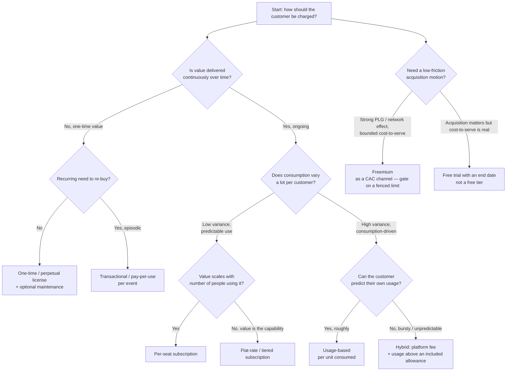
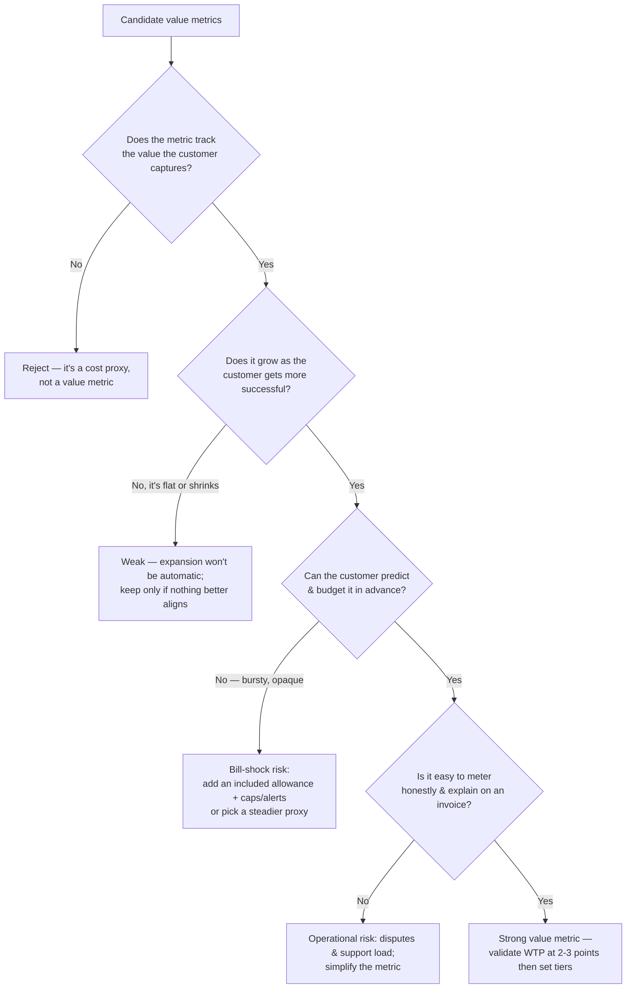
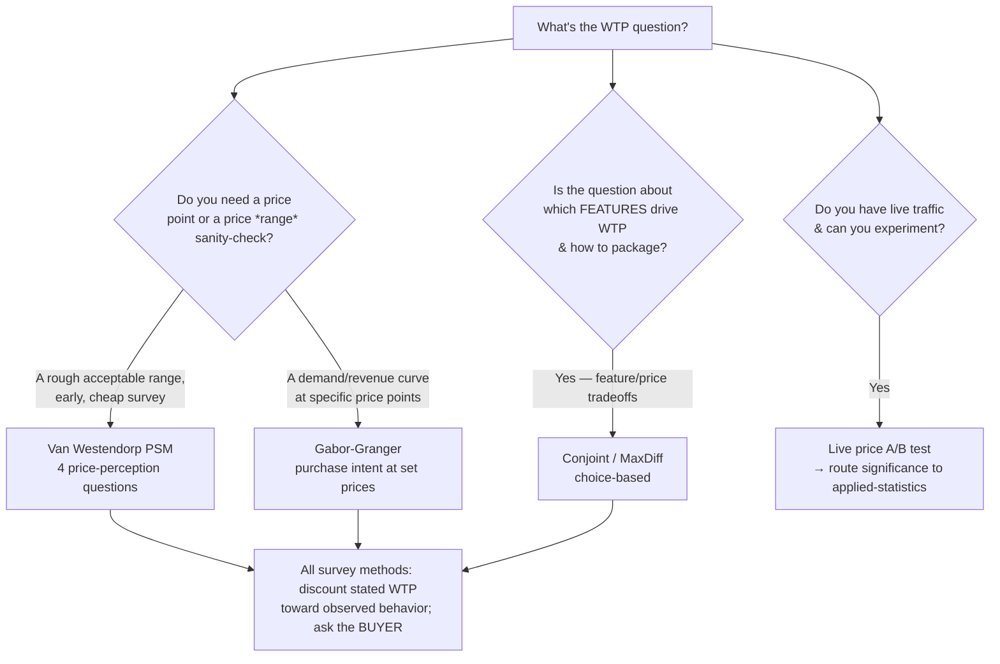

# Pricing decision trees

Three Mermaid decision trees the agents traverse: **pricing-model selection**,
**value-metric selection**, and **willingness-to-pay-method selection**. Traverse
top-to-bottom; pick the smaller-commitment leaf when two fit; always name the
runner-up and why it lost.

---

## §1 — Pricing-model selection

The model is *how* the customer is charged. Decide it after the value metric is at
least sketched (§2), because the metric constrains the viable models.

**Reading notes**
- **Per-seat** is the default for collaboration/productivity tools — but it caps at
  seat count and can *penalize* adoption (teams ration logins). Watch for that.
- **Usage-based** aligns price with value beautifully but creates **bill-shock risk**
  and unpredictable revenue. The hybrid (platform fee + included allowance + overage)
  is the most common 2026 answer because it gives the vendor a revenue floor and the
  customer a predictable base.
- **Freemium is a model decision only with a measured conversion path and a bounded
  cost-to-serve.** Absent both, prefer a time-boxed trial (the H2 leaf).
- AI/LLM-feature products skew toward **usage or hybrid** because the marginal cost is
  real and per-seat under-monetizes heavy users — see [`pricing-2026-reference.md`](pricing-2026-reference.md).

---

## §2 — Value-metric selection

The value metric is *what you charge per* — the single highest-leverage pricing
decision. A good metric satisfies all three of: **value-aligned**, **expands as the
customer succeeds**, and **predictable enough to budget**.

**Reading notes**
- The three tests trade off: the most value-aligned metric (e.g. "revenue
  influenced") is often the *least* predictable. Resolve the tension toward
  **predictability for the base + alignment for expansion** (a steady metric for the
  platform fee, a value-aligned one for overage/expansion).
- A metric the customer *can game down* (e.g. charging per "active user" they can
  deactivate) leaks revenue. Prefer a metric tied to value they won't suppress.
- **Test the metric against the failure question:** "if this product becomes 10×
  more valuable, does our revenue grow with it?" If no, the metric caps the company.

---

## §3 — Willingness-to-pay (WTP) method selection

Choose the research method by **what decision it serves** and **what data you can get**.

**Reading notes**
- **Van Westendorp** returns an *acceptable price range* and a sense of "too cheap /
  too expensive" — a starting band and sanity check, **not** a precise price. Cheap
  and fast; the entry point when you have nothing.
- **Gabor-Granger** gives a demand and revenue curve at the price points you test —
  better for *picking a number* once you have a band.
- **Conjoint/MaxDiff** is the tool when the question is *packaging* — which features
  belong in which tier and what each is worth. Heavier to run.
- **A live A/B test** beats every survey when you can run one — observed behavior >
  stated intent. Hand the *significance* read to `applied-statistics`; this plugin
  owns *which metric to read*.
- **All survey methods share two guards:** (1) stated WTP overstates real WTP —
  discount it toward any behavioral data you have; (2) in B2B, **survey the buyer**
  (budget holder), not only the user.
