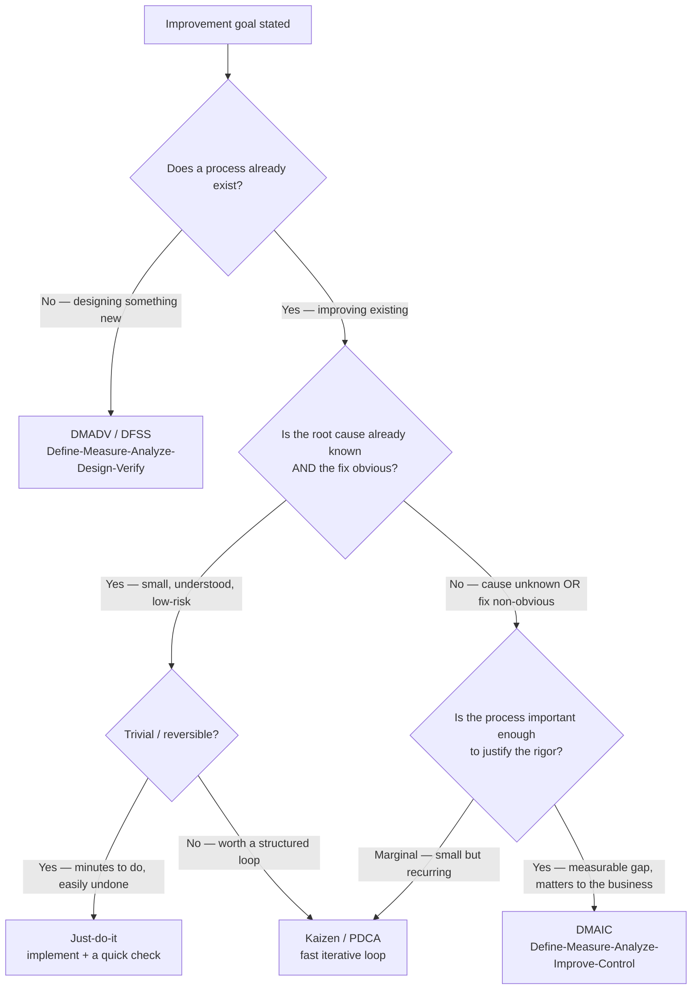
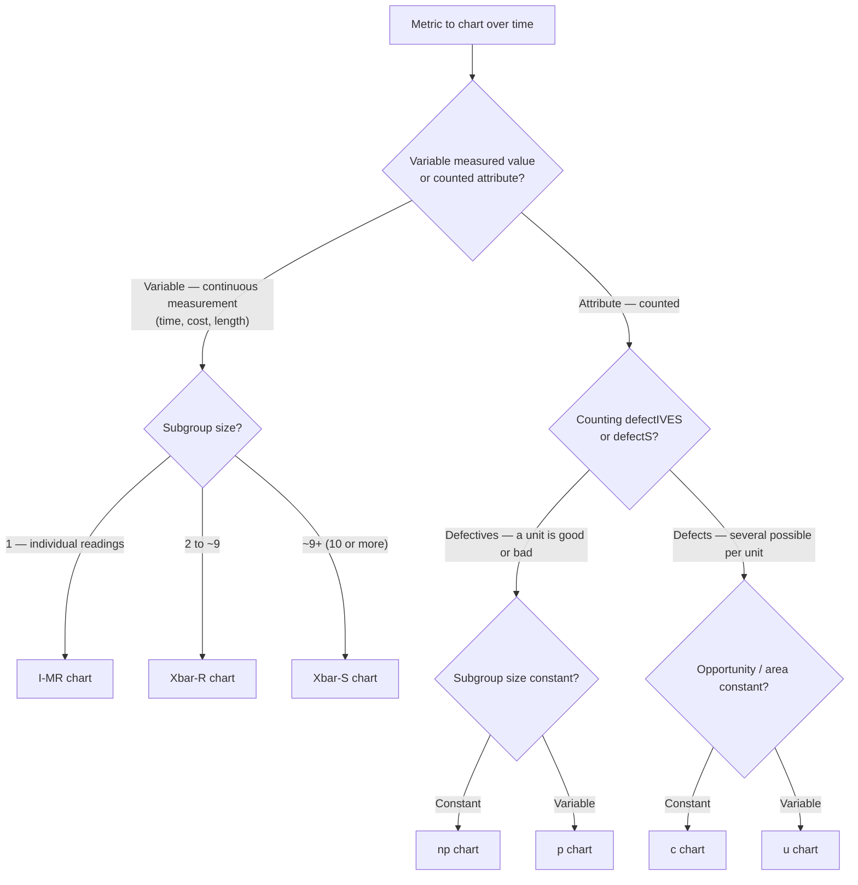
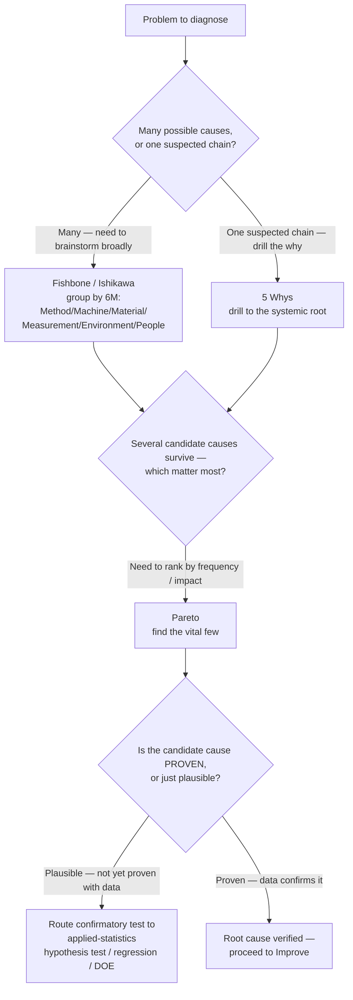
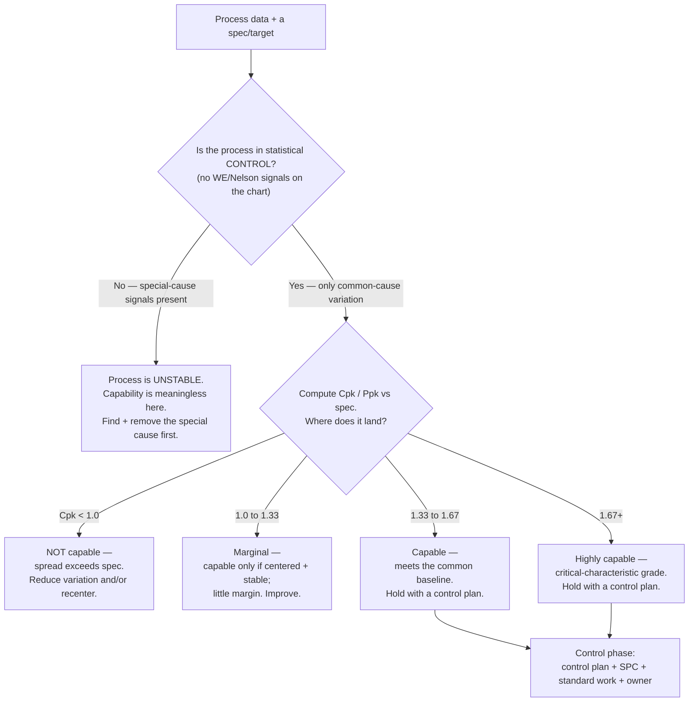
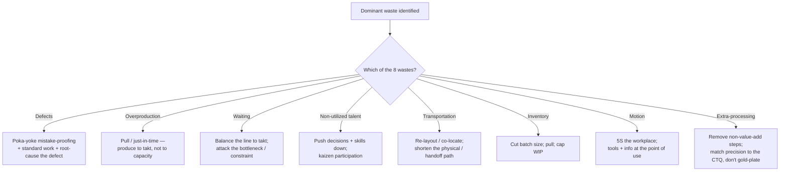
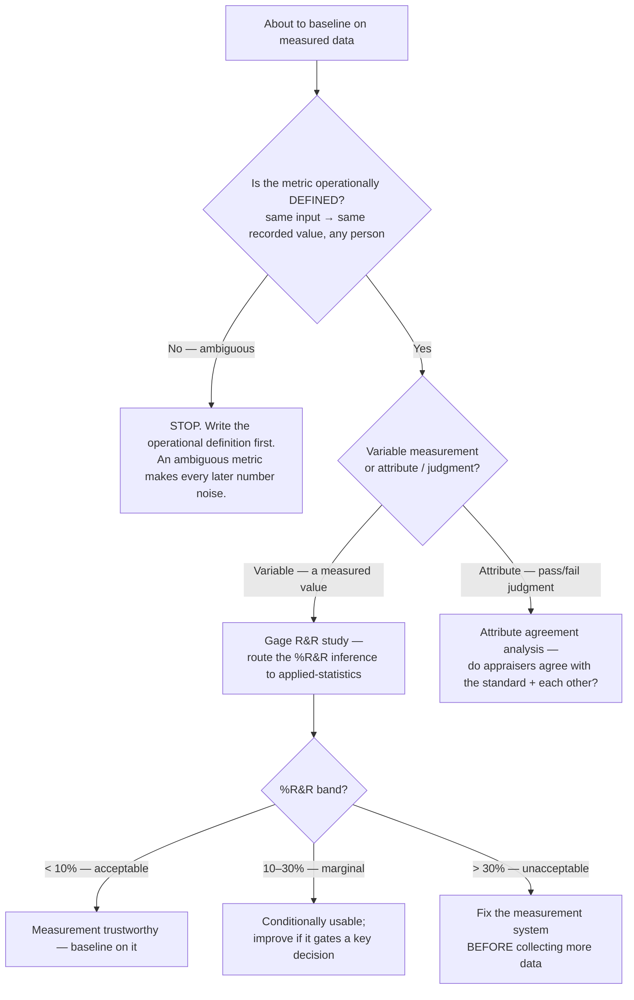
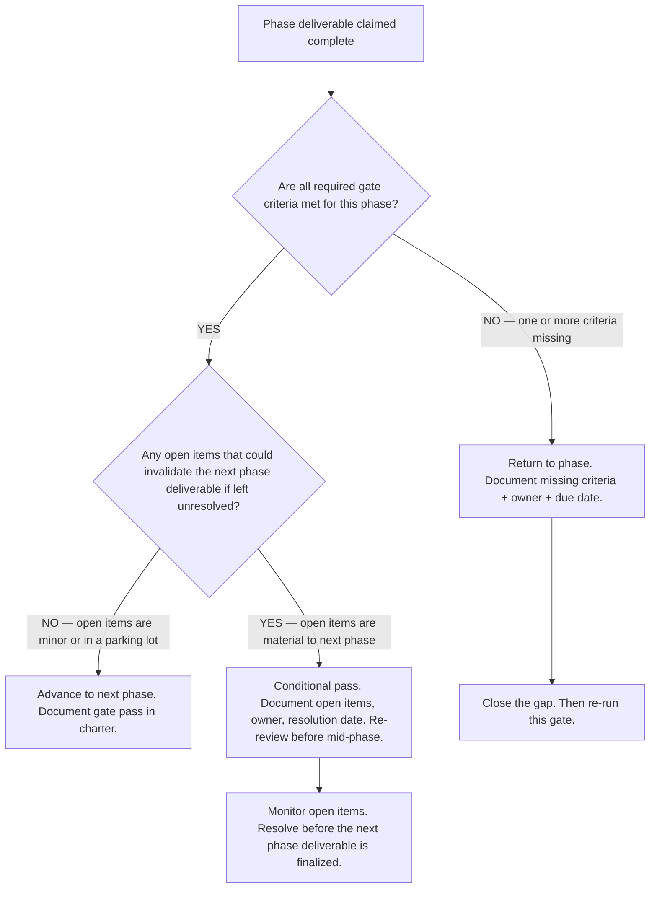
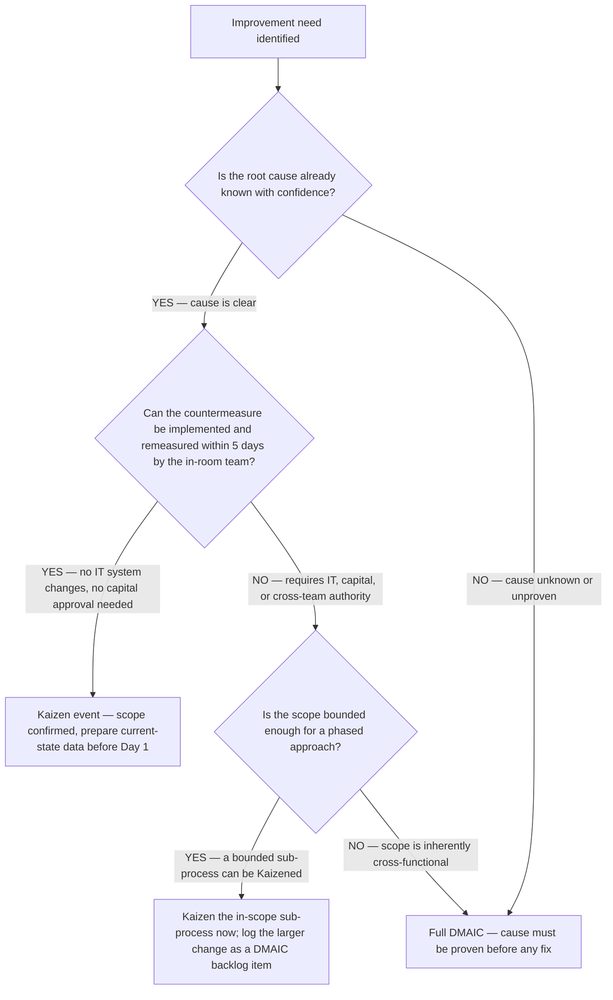
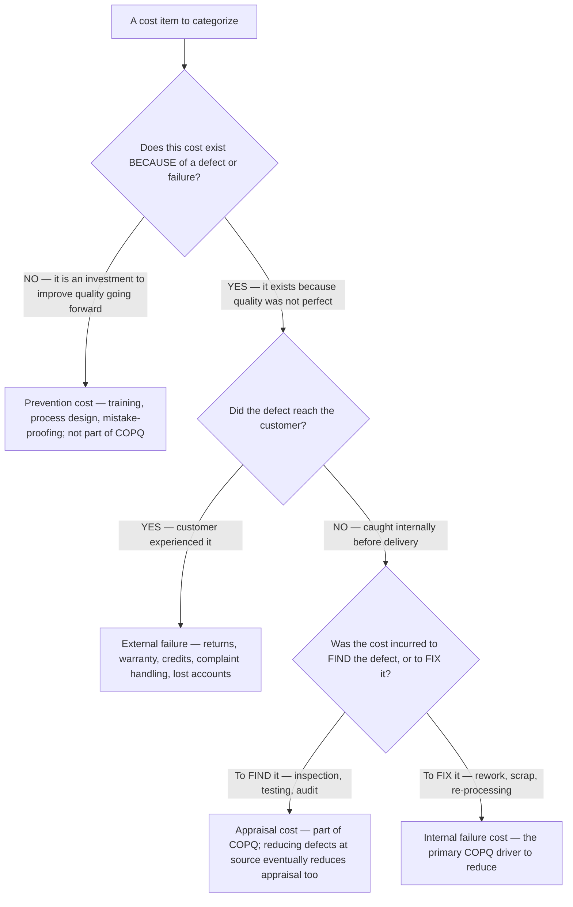

# Process-improvement decision trees

> Canonical decision trees for the `process-improvement` craft — which improvement **methodology**, which **control chart**, which **root-cause tool**, the **capable-vs-in-control** triage, which **Lean countermeasure** for a waste, and the **measurement-trust (MSA / Gage R&R)** gate. The agents traverse the matching tree **top-to-bottom before selecting a method** — they do not keyword-match on the user's phrasing (CLAUDE.md §5, the Capability Grounding Protocol). Format follows [`../../docs/best-practices/decision-trees-in-knowledge-files.md`](../../../docs/best-practices/decision-trees-in-knowledge-files.md).

These trees implement house opinions #2 (DMAIC backbone), #3 (Lean + Six Sigma complementary), #5 (control plan), and #6 (root cause before fix) from [`../CLAUDE.md`](../CLAUDE.md). Reference facts behind the leaves live in [`dmaic-and-lean-toolkit.md`](dmaic-and-lean-toolkit.md) and [`six-sigma-statistics-and-spc.md`](six-sigma-statistics-and-spc.md). Volatile/threshold facts carry inline markers per the Capability Grounding Protocol.

---

## Decision Tree: Which improvement methodology?

**When this applies:** Someone says "fix this process" / "improve this" and you must choose the *vehicle* — DMAIC, DMADV, Kaizen/PDCA, or a just-do-it — before doing any work. The observable trigger is a stated improvement goal whose *shape* (existing vs new process; cause known vs unknown; effort warranted) can be named.

**Last verified:** 2026-06-03 against the DMAIC/DMADV/PDCA comparison in [`dmaic-and-lean-toolkit.md`](dmaic-and-lean-toolkit.md) §2 (sources cited there).

**Rationale per leaf:**
- *DMADV / DFSS* — no existing process to measure-and-improve; you're designing to a target from the start ([`dmaic-and-lean-toolkit.md`](dmaic-and-lean-toolkit.md) §2).
- *DMAIC* — the default for an existing process with an unknown cause or a non-obvious fix, where the rigor pays off; the full statistical toolkit per phase.
- *Kaizen / PDCA* — a small, understood problem worth a fast structured loop, not a multi-week project.
- *Just-do-it* — trivial + reversible: fixing it costs less than analyzing it. Still confirm the fix held.

**Tradeoffs summary:**

| Leaf | Ceremony / cost | Best for | Fails when |
|---|---|---|---|
| DMADV | Highest | New design; incapable legacy process | Used to "improve" a fixable existing process (overkill) |
| DMAIC | High | Existing process, unknown cause | Used on a trivial fix (analysis paralysis) |
| Kaizen / PDCA | Low | Small, understood, recurring | Used where the cause is genuinely unknown (you'll guess) |
| Just-do-it | Minimal | Trivial + reversible | Used on an irreversible / high-blast change |

---

## Decision Tree: Which control chart?

**When this applies:** You're in the Measure or Control phase and need to chart a metric over time. The observable trigger is a metric + its data type (measured vs counted) and how it's grouped.

**Last verified:** 2026-06-03 against the control-chart selection guidance in [`six-sigma-statistics-and-spc.md`](six-sigma-statistics-and-spc.md) §3 (SPC for Excel; Six Sigma Study Guide; Minitab).

**Rationale per leaf:**
- *I-MR* — one reading per time point (long cycle time, or no natural subgroup); the moving range estimates short-term spread.
- *Xbar-R* — small subgroups; the **range** estimates within-subgroup spread well at n ≤ ~9.
- *Xbar-S* — larger subgroups; the **standard deviation (S)** estimates spread better than the range once n ≥ ~10.
- *p / np* — **defectives** (a unit passes or fails): np when subgroup size is constant (plot counts), p when it varies (plot proportion).
- *c / u* — **defects** (a unit can carry several flaws): c when the inspection area/opportunity is constant (plot counts), u when it varies (plot defects-per-unit).

**Reminder:** control limits are computed from the data (±3σ), **not** the customer spec limits. A chart proves *stability*, capability indices (Cpk/Ppk) prove *meeting spec* — different questions ([`six-sigma-statistics-and-spc.md`](six-sigma-statistics-and-spc.md) §2-3).

---

## Decision Tree: Which root-cause tool?

**When this applies:** You're in Analyze and need to drive to a *proven* cause. The observable trigger is the shape of the problem (many candidate causes vs a single deep chain vs needing confirmation).

**Last verified:** 2026-06-03 against [`dmaic-and-lean-toolkit.md`](dmaic-and-lean-toolkit.md) §1 (Analyze). The fishbone→5-Whys→Pareto→hypothesis-test sequence is long-established Lean Six Sigma practice; the confirmatory-test handoff is the CLAUDE.md #4 seam.

**Rationale per leaf:**
- *Fishbone (6M)* — opens the cause space broadly when many factors could be at play; a *hypothesis generator*, not proof.
- *5 Whys* — drills a single suspected chain to the systemic (not symptomatic) root.
- *Pareto* — ranks the surviving candidates so the team targets the vital few (≈80/20).
- *Route to applied-statistics* — **the gate before any fix** (CLAUDE.md #6): a plausible cause is not a proven cause. The confirmatory inference is `applied-statistics`' lane ([`six-sigma-statistics-and-spc.md`](six-sigma-statistics-and-spc.md) §6).

> **Anti-pattern this tree prevents: solution-jumping.** Never exit to *Improve* from a fishbone or a 5-Whys alone — pass through the proof gate first.

---

## Decision Tree: Is this process capable / in control? (triage)

**When this applies:** You have process data and are asked "how good is this process?" / "is it meeting spec?". The observable trigger is data + a spec/target, and the need to decide *control first, capability second*.

**Last verified:** 2026-06-03 against [`six-sigma-statistics-and-spc.md`](six-sigma-statistics-and-spc.md) §2-4. Thresholds (Cpk ≥ 1.33 capable) cited there.

**Rationale per leaf:**
- *Control before capability* — capability indices assume a stable process; computing Cpk on an out-of-control process gives a meaningless number (CLAUDE.md anti-pattern). The WE/Nelson rules ([`six-sigma-statistics-and-spc.md`](six-sigma-statistics-and-spc.md) §4) decide "in control?".
- *Cpk bands* — `< 1.0` not capable; `1.0–1.33` marginal; `≥ 1.33` capable (general/automotive baseline, ~63 PPM); `≥ 1.67` critical-characteristic grade (~0.6 PPM) — verified 2026-06-03.
- *Always exit to a control plan* — a capable process still regresses without the Control phase (CLAUDE.md #5).

> **Reminder:** "in control" (stable, predictable) and "capable" (meets spec) are **independent**. A process can be perfectly stable *and* consistently out-of-spec (in control, not capable), or meet spec on average while wildly unstable (capable-looking, not in control — and not trustworthy). Always establish control first.

---

## Decision Tree: Which Lean countermeasure for this waste?

**When this applies:** a Lean waste analysis (the `lean-waste-analysis` skill) found a *dominant* waste among the 8 (DOWNTIME) and you need the standard countermeasure family to attack it. The observable trigger is a named waste with the most non-value-add time/cost attached.

**Last verified:** 2026-06-03 against the 8-wastes (DOWNTIME) overlay in [`dmaic-and-lean-toolkit.md`](dmaic-and-lean-toolkit.md) §3 (Lean Enterprise Institute; MoreSteam). The countermeasure families are long-established Lean practice.

**Rationale per leaf:** each waste has a *characteristic* countermeasure family — but confirm the waste is genuinely the constraint first (a countermeasure on a non-bottleneck waste doesn't speed the whole process; see the best-practice on optimizing the constraint). Defects route back through the root-cause tree before mistake-proofing.

> **Pairs with the constraint rule:** removing a waste that isn't on the critical path/bottleneck improves a sub-process, not the system. Find the constraint (the *Waiting* leaf) before investing elsewhere.

---

## Decision Tree: Can I trust this measurement? (MSA / Gage R&R triage)

**When this applies:** you are about to baseline (or have baselined) on measured data and must confirm the *measurement system itself* isn't the source of the variation you're chasing. The observable trigger is "we have numbers" — **before** you trust them. This is the gate that protects house opinion #1 (measure before you change) from being built on sand.

**Last verified:** 2026-06-03 against the MSA / Gage R&R section in [`six-sigma-statistics-and-spc.md`](six-sigma-statistics-and-spc.md) §5. The %R&R acceptance bands are the standard AIAG convention `[unverified — training knowledge; confirm before quoting a client]`; the inference itself routes to `applied-statistics`.

**Rationale per leaf:**

- *Operational definition first* — if two people measuring the same thing record different values, the spread you see is measurement noise masquerading as process variation. No study fixes an undefined metric.
- *Gage R&R vs attribute agreement* — variable data gets a Gage R&R (repeatability + reproducibility); pass/fail judgment data gets an attribute agreement analysis. Both ask: is the gauge the problem?
- *Route the inference out* — computing and defending the %R&R is `applied-statistics`' lane (house opinion #5); this tree decides *that you need it* and *what to do with the band*.

> **Why this tree exists:** a 30%+ Gage R&R means up to a third of your "process variation" is the ruler, not the process. Baselining and "improving" on top of an untrustworthy gauge burns the whole DMAIC. Trust the measurement before you trust the data.

---

## Decision Tree: DMAIC phase gate — can we proceed to the next phase?

**When this applies:** A DMAIC tollgate review is in progress and the team must decide whether to advance, return, or conditionally pass. Observable trigger: end of a DMAIC phase; a sponsor or project manager asking "are we ready to move on?"; a phase deliverable is claimed complete.

**Last verified:** 2026-06-05 against the DMAIC phase-gate criteria in [`../best-practices/dmaic-phase-gates-are-not-optional.md`](../best-practices/dmaic-phase-gates-are-not-optional.md) and [`dmaic-and-lean-toolkit.md`](dmaic-and-lean-toolkit.md).

**Rationale per leaf:**
- *Advance* — all criteria met and no material open items; the evidence chain supports the next phase.
- *Conditional pass* — the remaining open items are bounded, owned, and do not invalidate the work in progress; the phase can proceed with active monitoring.
- *Return* — a missing gate criterion means the current phase cannot produce a reliable input for the next; returning now is cheaper than correcting a downstream deliverable built on sand.

**Tradeoffs summary:**

| Decision | Risk | Cost of error | Use when |
|---|---|---|---|
| Advance | Low | — | Gate fully met, no material open items |
| Conditional pass | Medium | Extra re-review step | Minor open items, bounded and owned |
| Return | Delay cost only | Avoids larger rework | Gate criterion missing |

---

## Decision Tree: Kaizen event or full DMAIC?

**When this applies:** An improvement need has been identified and the team must decide the vehicle. Observable trigger: a complaint, a missed metric, or a manager saying "we need to fix this" — before any project work begins.

**Last verified:** 2026-06-05 against [`../best-practices/kaizen-event-scope-to-what-the-team-can-own.md`](../best-practices/kaizen-event-scope-to-what-the-team-can-own.md) and the methodology-selection tree above.

**Rationale per leaf:**
- *Full DMAIC* — cause is unknown or unproven; a Kaizen on an unproven cause is a guess with a team and a week.
- *Kaizen event* — cause known, team authority is sufficient, change can be implemented and remeasured in the event window; the fast path is correct.
- *Hybrid* — a bounded slice qualifies for Kaizen but the full problem is larger; implement the quick win and log the systemic issue for a proper DMAIC.

**Tradeoffs summary:**

| Vehicle | Best for | Fails when | Typical duration |
|---|---|---|---|
| Kaizen event | Known cause, in-room team authority, remeasurable in days | Cause unknown; IT or capital required | 3–5 days |
| Hybrid | Mixed scope — bounded quick win + systemic backlog | Team conflates the Kaizen and the DMAIC | 3–5 days + follow-on project |
| Full DMAIC | Unknown cause; cross-functional; high-blast improvement | Used on trivial or already-known problems | 4–6 months |

---

## Decision Tree: Which COPQ cost category does this cost belong to?

**When this applies:** Building the COPQ (Cost of Poor Quality) case in the Define phase and categorizing each identified cost. Observable trigger: a list of cost items associated with a process problem, and the need to map each to the internal failure / external failure / appraisal / prevention framework.

**Last verified:** 2026-06-05 against the COPQ framework in [`../best-practices/cost-of-poor-quality-quantifies-the-burning-platform.md`](../best-practices/cost-of-poor-quality-quantifies-the-burning-platform.md) and ASQ Cost of Quality model.

**Rationale per leaf:**
- *Prevention* — investment that reduces future defects; not a failure cost; excluded from COPQ total to avoid double-counting the cure.
- *External failure* — the highest-unit-cost category; customer-experienced failures carry remediation cost plus reputation and retention impact.
- *Appraisal* — real cost of inspection; declining it without first reducing defect rates causes escapes; falling appraisal spend as defects drop is a sign of genuine improvement.
- *Internal failure* — rework and scrap are the most directly reducible COPQ; reducing the defect rate at source cuts both internal failure and eventually appraisal costs.

**Tradeoffs summary:**

| Category | In COPQ total? | Reduced by | Watch for |
|---|---|---|---|
| Internal failure | YES | Reduce defect rate at source | Hidden rework that isn't tracked |
| External failure | YES | Reduce escapes + defect rate | Iceberg — visible complaints undercount true impact |
| Appraisal | YES | Reduce defects (then reduce inspection) | Don't cut inspection before defects are under control |
| Prevention | NO | — invest more | Mislabeling inspection as prevention |

---

## Sources

The reference facts behind these trees — DMAIC/DMADV/PDCA, the 8 wastes, control-chart selection, WE/Nelson rules, Cp/Cpk/Pp/Ppk thresholds — are cited with retrieval dates in [`dmaic-and-lean-toolkit.md`](dmaic-and-lean-toolkit.md) and [`six-sigma-statistics-and-spc.md`](six-sigma-statistics-and-spc.md). All retrieved 2026-06-03. New trees added 2026-06-05.
