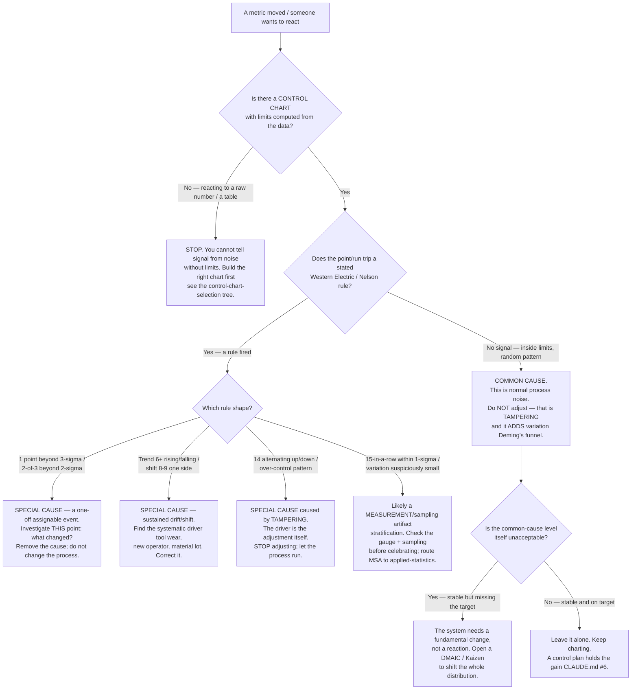
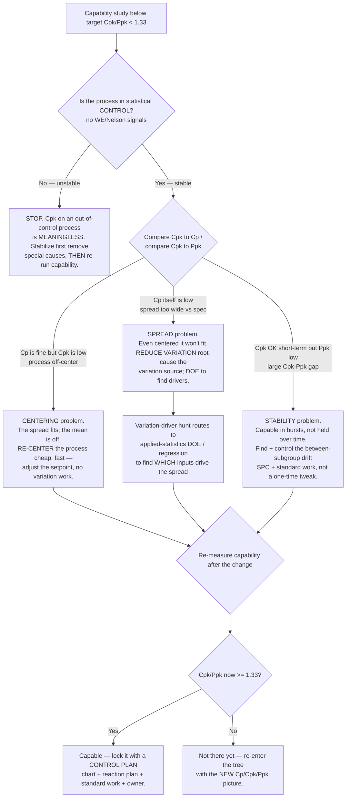

# SPC response decision trees

> Two **response-time** decision trees that complement the *selection* trees in [`process-improvement-decision-trees.md`](process-improvement-decision-trees.md). Those trees pick a method ("which control chart?", "which root-cause tool?"); these decide **how to react to what the chart shows** — the moment where most process-management damage is actually done. Tree 1: **common-cause vs special-cause response** (the anti-tampering gate). Tree 2: **capable-but-not-fixed** — what to do when a capability study comes back below threshold. The agents traverse the matching tree **top-to-bottom before recommending a reaction** (CLAUDE.md §5, Capability Grounding Protocol); they do not keyword-match "the number moved" to "investigate". Format follows [`../../docs/best-practices/decision-trees-in-knowledge-files.md`](../../../docs/best-practices/decision-trees-in-knowledge-files.md).

These trees implement house opinions #1 (measure before you change), #6 (control plan / sustain), and #7 (quantify in the same units), and the best-practices [`separate-common-cause-from-special-cause.md`](../best-practices/separate-common-cause-from-special-cause.md) and [`cpk-and-ppk-answer-different-questions.md`](../best-practices/cpk-and-ppk-answer-different-questions.md). Reference facts live in [`six-sigma-statistics-and-spc.md`](six-sigma-statistics-and-spc.md). Volatile/threshold facts carry inline retrieval markers.

---

## Decision Tree: Common cause or special cause — how do I respond? (the anti-tampering gate)

**When this applies:** a metric moved, a week looks "bad", a control chart has a new point, or a manager wants to react. The observable trigger is **a request to act on a single observation or a short-run movement**. This is the most damaging decision in day-to-day process management, because the default human reaction — adjust in response to every dip — is precisely the error.

**Last verified:** 2026-06-05 against the Western Electric / Nelson rules in [`six-sigma-statistics-and-spc.md`](six-sigma-statistics-and-spc.md) §4 and Deming's funnel-experiment account of tampering (sources at the foot of this file).

**Rationale per leaf:**

- *Build a chart first* — without ±3σ limits computed from the data you literally cannot distinguish signal from noise; reacting to a raw number is guessing. (The chart-selection tree picks the right chart by data type.)
- *Common cause → don't adjust* — Deming: most variation (often cited as ~94%+ of process problems) is common-cause, inherent to the system `[verify-at-use — the exact figure varies by source; the *principle* that the large majority is common-cause is Deming's, not the precise percent]`. Adjusting in response to common-cause noise is **tampering** and provably *increases* variation (the funnel experiment).
- *Special cause (one-off)* — a single assignable event (a 3σ point, a 2-of-3): investigate *that occurrence*, remove the cause; do not re-tune the whole process.
- *Special cause (drift/shift)* — a trend or sustained shift points at a systematic driver (tool wear, a new lot, a process change). Correct the driver.
- *Tampering pattern* — a 14-point alternating sawtooth is the funnel-experiment signature of over-control; the cause is the operator's own adjustments. The fix is to **stop adjusting**.
- *Stratification* — variation suspiciously small (15 within 1σ) is usually a measurement/sampling artifact, not a genuinely superb process; check the gauge (MSA) before trusting it.
- *Stable-but-off-target* → a system-level change (a project), because no amount of reacting to individual points will move a stable distribution.

**Tradeoffs summary:**

| Response | When it's right | The error if you get it wrong |
|---|---|---|
| Leave it alone (no action) | In control + on target | Missing a genuine special cause (under-reaction) |
| Investigate this point | A special-cause signal fired | Tampering — chasing noise as if it were signal |
| Change the system (project) | In control but off target | Reacting to individual points forever, never fixing the system |
| Stop adjusting | An over-control / sawtooth pattern | Adding more variation by "correcting" harder |

> **The one-line rule this tree enforces:** *react to a control chart's SIGNALS, never to its individual points.* Tampering — treating common-cause variation as special — is, per Deming, the most common and costly process-management mistake.

---

## Decision Tree: Capability study came back low — what now?

**When this applies:** you ran a capability study and Cpk/Ppk landed below the target (typically < 1.33). The observable trigger is **a capability index plus its spec limits**, and the question "what do we actually change?". The wrong move is to "tighten the process" generically; the right move depends on *why* the index is low — spread, centering, or instability — which are different fixes.

**Last verified:** 2026-06-05 against the Cp/Cpk/Pp/Ppk formulas + thresholds in [`six-sigma-statistics-and-spc.md`](six-sigma-statistics-and-spc.md) §2 and [`../best-practices/cpk-and-ppk-answer-different-questions.md`](../best-practices/cpk-and-ppk-answer-different-questions.md). Threshold Cpk ≥ 1.33 = capable (~63 PPM); ≥ 1.67 critical (~0.6 PPM).

**Rationale per leaf:**

- *Stabilize first* — capability indices assume a stable process; a Cpk computed on an out-of-control process is a meaningless number (the §2 house rule). Always confirm control before acting on capability.
- *Centering problem (Cp good, Cpk low)* — the spread *fits* the spec but the mean is off-center. This is the **cheapest** fix: move the setpoint, no variation-reduction work needed. Always check this before the expensive path.
- *Spread problem (Cp low)* — even perfectly centered the distribution is wider than the spec; you must **reduce variation**, which means finding what drives it. Identifying *which inputs* drive the spread is a DOE/regression question → route to `applied-statistics` (CLAUDE.md §8).
- *Stability problem (large Cpk−Ppk gap)* — short-term capability is fine but isn't *held* long-term; the process drifts between subgroups. The fix is ongoing **control** (SPC + standard work), not a single adjustment.
- *Always exit through a control plan* — a now-capable process still regresses without the Control phase (CLAUDE.md #6).

**Tradeoffs summary:**

| Diagnosis | Signature | Fix | Cost |
|---|---|---|---|
| Off-center | Cp ≫ Cpk | Re-center the setpoint | Low — adjust the mean |
| Too much spread | Cp itself < 1.33 | Reduce variation (find drivers, DOE) | High — root-cause + experiment |
| Drifting | Cpk ≫ Ppk | Control the long-term drift (SPC, standard work) | Medium — sustained discipline |
| Unstable | WE/Nelson signals present | Stabilize (remove special causes) FIRST | Must precede any capability work |

> **The distinction this tree protects:** "improve capability" is not one action. A centering miss is a cheap setpoint change; a spread problem is a variation-reduction project; a drift problem is a control problem. Diagnose *which* before spending — and never compute capability on an unstable process.

---

## Sources

- Western Electric / Nelson out-of-control rules — see the cited sources in [`six-sigma-statistics-and-spc.md`](six-sigma-statistics-and-spc.md) §4 ([Wikipedia: Western Electric rules](https://en.wikipedia.org/wiki/Western_Electric_rules); [QualityGurus: Nelson & Western Electric Rules](https://www.qualitygurus.com/nelson-rules-and-western-electric-rules-for-control-charts/)) — retrieved 2026-06-03.
- Tampering / common-vs-special-cause / the funnel experiment — [The W. Edwards Deming Institute: The Funnel Experiment](https://deming.org/explore/the-funnel-experiment/); [SPC for Excel: Over-controlling a Process — The Funnel Experiment](https://www.spcforexcel.com/knowledge/variation/overcontrolling-process-funnel-experiment/); [Profound: Tampering](https://www.profound-deming.com/blog-1/tampering) — retrieved 2026-06-05. The "most variation is common-cause" proportion is Deming's qualitative principle; the exact percentage is `[verify-at-use]` (sources cite figures from ~85% to ~97%).
- Cp/Cpk/Pp/Ppk formulas + thresholds — see the cited sources in [`six-sigma-statistics-and-spc.md`](six-sigma-statistics-and-spc.md) §2 ([Six Sigma Study Guide: Pp/Ppk/Cp/Cpk](https://sixsigmastudyguide.com/process-capability-pp-ppk-cp-cpk/)) — retrieved 2026-06-03, re-confirmed 2026-06-05.
