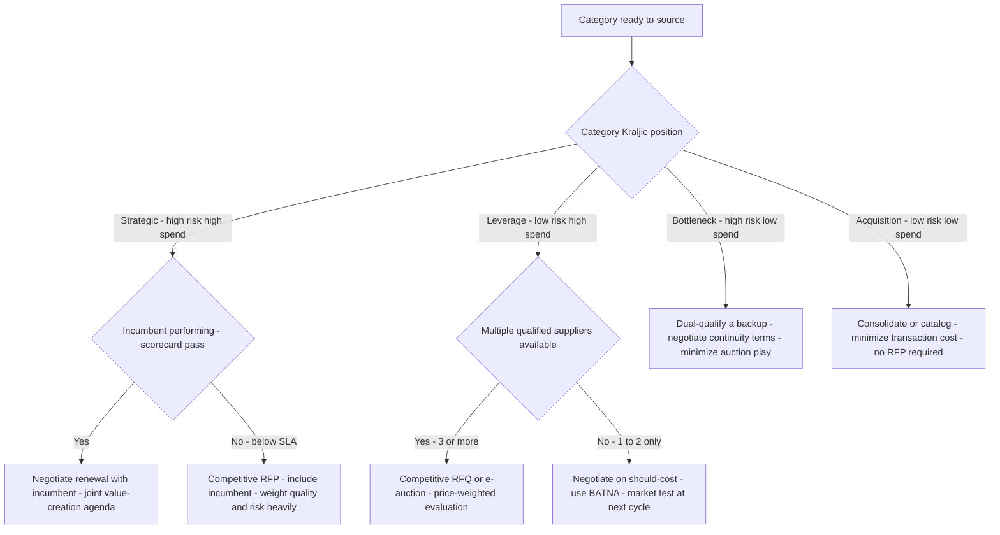
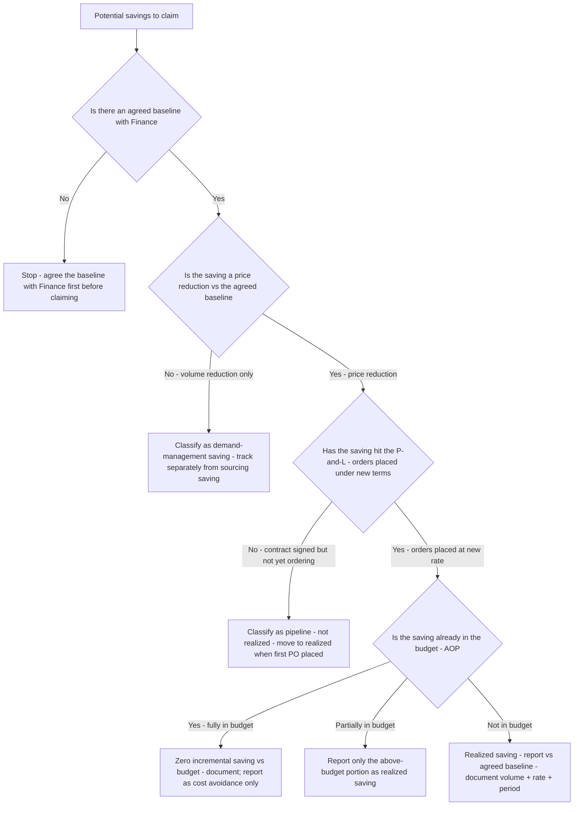
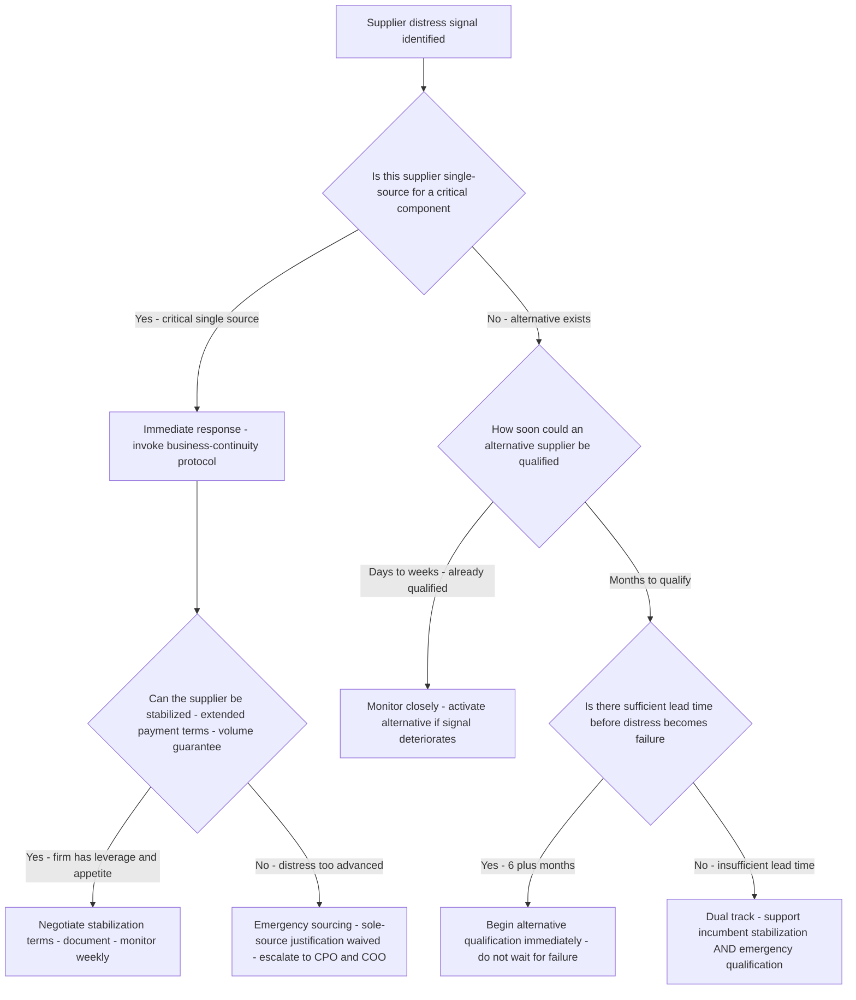

# Procurement decision trees

Which analysis for which question — traverse top-to-bottom before picking a method.

## Decision Tree: Where can we save?

1) Build the spend cube (§3 #5). 2) Segment categories (Kraljic) (§3 #1). 3) For each: sourcing (TCO/should-cost), demand, or risk play. 4) Track to a finance baseline (§3 #3).

## Decision Tree: How should I source this?

1) Place on the Kraljic matrix (§3 #1). 2) Match the play. 3) Run on TCO, not price (§3 #2).

## Decision Tree: Are our savings real?

1) Set a finance baseline (§3 #3). 2) Measure realized vs negotiated. 3) Locate leakage and reconcile to the P&L.

## How to read these trees

Traverse top-to-bottom and stop at the first matching branch — the order encodes the cheap-checks-before-expensive-checks discipline (§3). Each leaf names a skill, a specialist, or a house-opinion to apply. Never skip a higher branch because a lower one looks more interesting; a denominator, seasonal, or definitional artifact masquerades as a finding more often than not.

## Decision Tree: Which skill for which task

- **Segment the spend (Kraljic)** → use when: Place a category on the supply-risk × spend matrix and match the sourcing play before sourcing, so you don't auction a strategic single-source. ([`../skills/segment-the-spend/SKILL.md`](../skills/segment-the-spend/SKILL.md))
- **Source on total cost of ownership** → use when: Run a sourcing decision on TCO — freight, quality, switching, inventory, lifecycle — not unit price, so a price 'savings' doesn't raise total cost. ([`../skills/source-on-tco/SKILL.md`](../skills/source-on-tco/SKILL.md))
- **Manage supplier risk as a portfolio** → use when: Assess supplier and concentration risk across the base and mitigate single-source exposure, instead of a one-time checkbox. ([`../skills/manage-supplier-risk/SKILL.md`](../skills/manage-supplier-risk/SKILL.md))
- **Build the spend cube** → use when: Build and classify the spend cube by category, supplier, and business unit, surfacing tail spend, so strategy rests on visibility. ([`../skills/build-the-spend-cube/SKILL.md`](../skills/build-the-spend-cube/SKILL.md))
- **Validate realized savings** → use when: Measure realized savings against a finance-recognized baseline and locate leakage, so negotiated savings aren't mistaken for P&L impact. ([`../skills/validate-realized-savings/SKILL.md`](../skills/validate-realized-savings/SKILL.md))

## Decision Tree: Which specialist owns this

- **The engagement** → [`sourcing-lead`](../agents/sourcing-lead.md)
- **Sourcing** → [`category-strategist`](../agents/category-strategist.md)
- **Risk** → [`supplier-risk-specialist`](../agents/supplier-risk-specialist.md)
- **The numbers** → [`spend-analytics-analyst`](../agents/spend-analytics-analyst.md)

When two leaves apply, route to the **lead** first to scope and sequence — overlapping symptoms usually mean two drivers at once, and the lead keeps the analysis from collapsing into a single-cause story.

## Decision Tree: Which house-opinion gates the call

Before picking any method, check whether one of the standing biases (§3) already decides the framing:

1. Segment the spend before you source it — if this is in question, apply §3 #1 before any method.
2. Source on total cost of ownership, not unit price — if this is in question, apply §3 #2 before any method.
3. Realized savings ≠ negotiated savings — track to the P&L — if this is in question, apply §3 #3 before any method.
4. Supplier risk is a portfolio, not a checkbox — if this is in question, apply §3 #4 before any method.
5. Spend visibility comes before strategy — if this is in question, apply §3 #5 before any method.
6. Should-cost beats benchmarking for leverage — if this is in question, apply §3 #6 before any method.
7. Demand management often beats price negotiation — if this is in question, apply §3 #7 before any method.
8. Cite the source and date for every benchmark and index — if this is in question, apply §3 #8 before any method.

## Escalation & guardrails

- Anything touching client PII / regulated records → stop and route to `ravenclaude-core` `security-reviewer`.
- Any external figure entering a deliverable → carry a source URL + retrieval date, or mark it `[unverified — training knowledge]` / `[ESTIMATE]` (§3, final house opinion).
- A recommendation ships only with an owner, a date, and an expected metric movement.
## Sourcing note

Figures in this file are from the author's domain knowledge and are marked `[unverified — training knowledge]` or `[ESTIMATE]` at point of use. Validate against a primary source before putting any figure in a client deliverable (§3 cite-or-mark rule).

---

## Decision Tree: Sourcing — Which sourcing play for this category

**When this applies:** A category is ready to be sourced and the analyst must choose between a competitive RFx, a sole-source negotiation, a negotiated renewal, or a market-test. The decision depends on the Kraljic position, the supply-market structure, and the switching-cost profile.

**Last verified:** 2026-06-05 against Kraljic matrix methodology and standard strategic sourcing practice.

**Rationale per leaf:**
- *Partner - negotiate renewal* — strategic suppliers provide unique value; a competitive event risks disrupting the relationship without a better outcome; negotiation with joint value creation retains the partnership while extracting gains.
- *Competitive RFP with risk weight* — when a strategic supplier is underperforming, a competitive event is justified but must be weighted for quality and risk, not purely price.
- *Competitive RFQ/e-auction* — leverage categories are the natural home for competitive events; multiple capable suppliers exist and price is the primary differentiator.
- *Negotiate on should-cost* — when leverage is limited to 1–2 suppliers, a should-cost-anchored negotiation extracts more value than an auction that both suppliers know is not credible.
- *Secure / dual-qualify* — bottleneck categories are supply-risk problems, not price problems; the play is continuity assurance, not cost reduction.
- *Simplify / catalog* — acquisition categories should not consume strategic sourcing effort; the TCO gain comes from reducing transaction cost and administrative overhead.

**Tradeoffs summary:**

| Sourcing play | Best for | Risk | Time investment |
|---|---|---|---|
| Competitive RFx | Leverage categories - multiple suppliers | Relationship damage if misapplied to strategic | Medium-high |
| Negotiate renewal | Strategic - performing incumbent | Foregoes market test | Low-medium |
| Should-cost negotiation | Any - limited competition | Requires credible internal data | Medium |
| Dual-qualify | Bottleneck | Investment in qualification | High upfront |
| Consolidate/catalog | Acquisition/tail | Stakeholder adoption risk | Medium |

---

## Decision Tree: Savings measurement — Is this a valid realized saving

**When this applies:** A procurement team has completed a sourcing event and is calculating the savings to report to finance and to the CPO scorecard. The question is whether the saving is real, recognized, and attributable to procurement action — or whether it is an inflation of the true benefit.

**Last verified:** 2026-06-05 against standard procurement savings-classification methodology.

**Rationale per leaf:**
- *Agree baseline first* — without an agreed baseline, the saving is a claim, not a measurement; finance will not recognize it.
- *Demand management* — volume-driven savings are real but have different ownership (the business unit reduced demand) and should not inflate the procurement team's sourcing-savings number.
- *Pipeline* — a negotiated rate not yet used in orders has not changed cash flows; classify as pipeline to avoid double-counting in the same period it is later realized.
- *Budget offset* — if the budget already assumed the new rate, claiming it again as a saving is double-counting; only the above-budget portion is incremental.
- *Realized saving* — all conditions met; document the baseline, rate, volume, and period; report to the procurement scorecard.

**Tradeoffs summary:**

| Saving type | Recognized by Finance | Report as | Owner |
|---|---|---|---|
| Price reduction - not in budget | Yes | Realized sourcing saving | Procurement |
| Price reduction - in budget | No - already planned | Cost avoidance | Procurement |
| Demand reduction | Yes - but separate | Demand-management saving | Business unit + Procurement |
| Pipeline - not yet ordered | Not yet | Pipeline / committed | Procurement |

---

## Decision Tree: Supplier risk — How to respond to a supplier financial distress signal

**When this applies:** The supplier-risk-specialist or sourcing-lead has identified a signal of financial distress in a key supplier — a credit-rating downgrade, a news report of restructuring, a late invoice pattern, a missed delivery, or a direct conversation suggesting cash-flow strain. The team must decide how urgently to respond and what actions to take.

**Last verified:** 2026-06-05 against standard supplier-risk and supply-continuity management practice.

**Rationale per leaf:**
- *Immediate response* — a critical single-source supplier in distress is an existential supply-continuity risk; the response must be immediate and escalated beyond procurement.
- *Monitor / activate alternative* — when an alternative is already qualified, the risk is managed; maintain a higher monitoring cadence and define the activation trigger explicitly.
- *Qualify now* — 6+ months of lead time is exactly the window needed to qualify an alternative; waiting costs lead time and increases the probability of an inventory-depleting gap.
- *Dual track* — when lead time is insufficient, support the incumbent while simultaneously running an emergency qualification; choosing only one track is too risky.
- *Stabilization terms* — extended payment terms, volume guarantees, or prepayment can bridge a temporary cash-flow strain; document the terms and add them to the contract.
- *Emergency sourcing* — when distress is advanced and stabilization is not feasible, speed beats normal governance; document the emergency justification and escalate.

**Tradeoffs summary:**

| Scenario | Response | Lead time needed | Escalation level |
|---|---|---|---|
| Critical single-source - early signal | Immediate dual track | 3 to 12 months | CPO + COO |
| Non-critical - alternative qualified | Monitor and watch | Days to weeks | Category manager |
| Non-critical - qualification needed | Begin qualification | 1 to 6 months | Sourcing lead |
| Advanced distress - critical | Emergency sourcing | As short as possible | CPO + COO + CEO |
