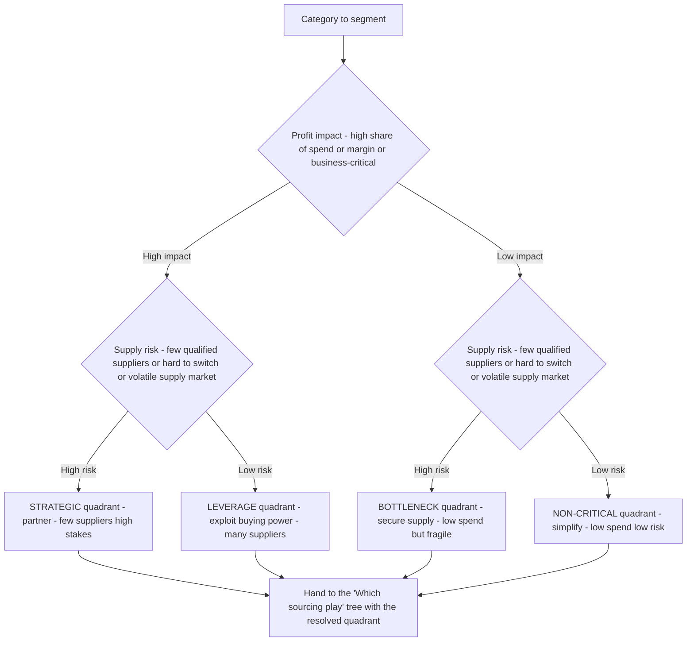

# Kraljic category-positioning decision tree

> **Mermaid** decision tree — **where on the Kraljic matrix does this category sit?** This complements the existing [`procurement-decision-trees.md`](procurement-decision-trees.md) "Which sourcing play for this category" tree (PR #315): that tree assumes the Kraljic position is already known and picks the *play*; this tree is the step *before* it — how to **place** a category on the supply-risk x profit-impact matrix in the first place, which is the precondition the existing tree depends on (§3 #1).
>
> **Audience:** `category-strategist` (primary), `sourcing-lead` (scoping), `spend-analytics-analyst` (the spend axis).
>
> **Last verified:** 2026-06-05 against Kraljic (1983) methodology and current category-management practice (CIPS, Art of Procurement, Planergy, 2025).

## Decision Tree: Sourcing — Where does this category sit on the Kraljic matrix

**When this applies:** A category is being segmented before a sourcing strategy is chosen. The analyst must resolve two axes — **profit impact** (the spend / margin / business-criticality the category represents) and **supply risk** (scarcity of qualified suppliers, switching difficulty, supply-market volatility, geographic/geopolitical concentration) — to land the category in one of four quadrants. The quadrant then selects the play (hand off to the "Which sourcing play" tree).

**How to score each axis (resolve the condition nodes against data, not gut feel — §3 #5):**

- **Profit impact = HIGH** if the category is a top-decile share of addressable spend, OR a material share of cost of goods / margin, OR business-critical (a line-down or stockout materially hurts revenue). Read it off the spend cube, not memory.
- **Supply risk = HIGH** if any of: fewer than ~3 qualified suppliers, long qualification/switching lead time, an engineered/spec-locked or single-source item, a volatile or concentrated supply market (one region / one feedstock), or a regulated/scarce input. A single high signal is enough to flag high risk — risk is a max, not an average.

**Rationale per leaf:**
- *Strategic* — high impact + high risk: the category both matters to the P&L and is hard to re-source. The play is **partnership / joint value creation + continuity assurance**, not a price auction (an auction here destroys the relationship that de-risks supply).
- *Leverage* — high impact + low risk: real money, many capable suppliers. This is the quadrant where **competitive RFx / e-auction** earns the most; buying power is the lever.
- *Bottleneck* — low impact + high risk: small spend, but a stockout hurts. The play is **secure continuity** (dual-qualify, safety stock, longer-term agreement), explicitly NOT cost reduction — the risk, not the price, is the problem.
- *Non-critical (acquisition)* — low impact + low risk: tail spend. The play is **simplify** — catalog, consolidate suppliers, cut transaction cost; do not spend strategic-sourcing effort here (the TCO win is administrative, not unit price).

**Tradeoffs summary:**

| Quadrant | Profit impact | Supply risk | Primary play | What kills value here |
|---|---|---|---|---|
| Strategic | High | High | Partner / co-develop / secure | Auctioning a relationship-dependent supply |
| Leverage | High | Low | Competitive RFx / e-auction | Treating it as strategic and under-competing |
| Bottleneck | Low | High | Secure continuity / dual-source | Chasing price instead of de-risking supply |
| Non-critical | Low | Low | Simplify / catalog / consolidate | Over-investing scarce sourcing effort |

## Escalation & guardrails

- The quadrant placement is a **starting hypothesis**, not a verdict — a category can move (a leverage item with one supplier exiting the market becomes strategic). Re-segment on a cycle, not only when pain arrives (best-practice: `category-strategy-is-refreshed-on-a-cycle-not-when-pain-arrives.md`).
- Any external benchmark or supply-market figure entering the placement carries a source URL + retrieval date, or `[unverified — training knowledge]` / `[ESTIMATE]` (§3 final house opinion).
- Once placed, hand off to the **"Which sourcing play for this category"** tree in [`procurement-decision-trees.md`](procurement-decision-trees.md) — this tree resolves the *axes*; that tree resolves the *play*.

## Sourcing note

The Kraljic matrix (two axes, four quadrants) and the per-quadrant plays are well-established procurement canon (Kraljic, *HBR*, 1983; CIPS; current category-management references). Quadrant *thresholds* (what counts as "high" impact or "high" risk) are organization-specific — treat any specific cutoff as `[ESTIMATE]` and calibrate against the client's spend cube and supply-market data before putting a placement in a deliverable (§3 cite-or-mark rule).

**Sources (retrieved 2026-06-05):** Kraljic matrix axes & quadrants — https://www.cips.org/intelligence-hub/supplier-relationship-management/kraljic-matrix ; https://artofprocurement.com/blog/learn-the-kraljic-matrix ; https://planergy.com/blog/kraljic-matrix/ ; origin — https://en.wikipedia.org/wiki/Kraljic_matrix (Peter Kraljic, *Harvard Business Review*, 1983).
