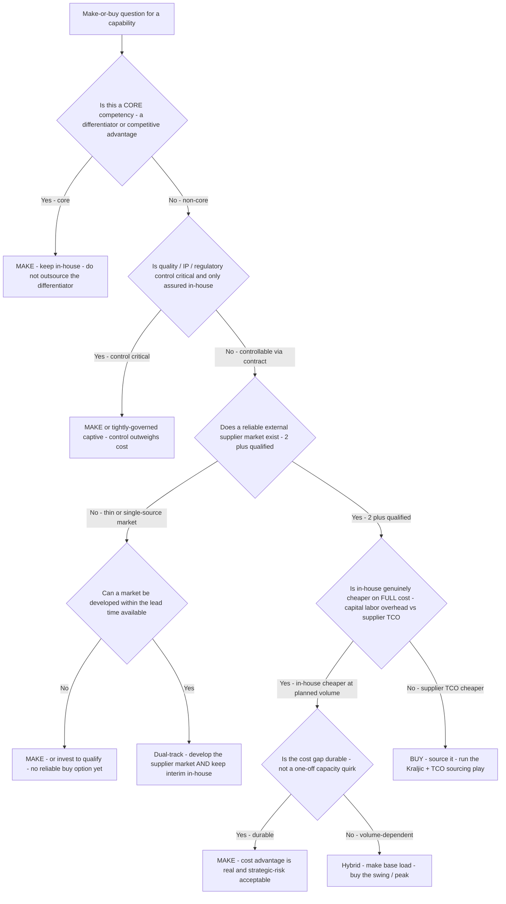

# Make-vs-buy decision tree

> **Mermaid** decision tree — **should this capability be made in-house or bought from the market?** This complements the PR #315 trees (which all assume "buy" and choose the sourcing play / validate savings / respond to supplier risk) by sitting one level *up*: the make-vs-buy fork that decides whether a sourcing event is even the right move, or whether the right answer is insource / keep in-house.
>
> **Audience:** `category-strategist` (primary), `sourcing-lead` (framing), `supplier-risk-specialist` (the outsourcing-risk leaf).
>
> **Last verified:** 2026-06-05 against standard make-or-buy / insource-vs-outsource frameworks (Corporate Finance Institute, supply-chain make-vs-buy practice, 2026).

## Decision Tree: Sourcing — Make in-house vs buy from the market

**When this applies:** A component, service, or capability could be produced internally or procured externally, and procurement must give a defensible recommendation. The decision is **not** a pure cost comparison — strategy (core competency), control (quality / IP / regulation), supply-market reality, and reversibility gate the cost arithmetic. Cost is necessary but not sufficient.

**How to resolve the condition nodes (the order encodes strategy-before-cost — §3 #2, #6):**

- **Core competency first.** A differentiator stays in-house even if a supplier is cheaper — outsourcing the thing that wins you customers is a strategic error a spreadsheet won't show.
- **Control second.** Where quality, IP protection, or regulatory compliance is only assured under direct control, that gates the cost comparison.
- **Market reality third.** "Buy" presumes a reliable supplier market (2+ qualified). A thin/single-source market is a `MAKE`-or-`develop-the-market` signal, not a buy (and routes to the bottleneck/strategic supply-risk plays).
- **Full-cost comparison last** — and on **TCO**, not unit/standard cost: in-house full cost = capital + labor + overhead + hidden costs; supplier cost = the full TCO stack (use `scripts/sourcing_calc.py tco`), not the quoted price (§3 #2). A cost gap that only exists at one volume point is a **hybrid** (make base load, buy the swing), not a clean make.

**Rationale per leaf:**
- *Make — core / control / no-market* — keep or build in-house when the capability differentiates, when control is non-negotiable, or when no reliable buy option exists.
- *Develop the market / dual-track* — when a market *could* exist but doesn't yet, invest to qualify suppliers while keeping interim production; don't outsource into a market you haven't built.
- *Buy* — non-core, controllable by contract, a real supplier market exists, and supplier TCO beats full in-house cost. Hand off to the Kraljic-positioning tree, then the sourcing-play tree.
- *Hybrid (make base / buy swing)* — when in-house wins only at base volume, make the steady load and buy the peak; captures the cost edge without the capacity risk of making 100%.

**Tradeoffs summary:**

| Decision | Best when | Key risk | Reversibility |
|---|---|---|---|
| Make (core / control) | Differentiator, or control critical | Capital tied up; capacity rigidity | Low — sunk capital/skills |
| Make (no market) | No reliable supplier exists | Funding a capability the market may later undercut | Medium |
| Buy | Non-core, market exists, supplier TCO lower | Supply-risk / leakage post-award | High |
| Hybrid (base/swing) | Cost edge is volume-dependent | Coordination + dual-overhead complexity | Medium |
| Develop market | Market could exist within lead time | Qualification cost + lead-time exposure | Medium |

## Escalation & guardrails

- A make-vs-buy recommendation is **reversibility-weighted** — a "make" sinks capital and skills that are slow to unwind, so treat an irreversible make with the same care as a high-blast action; surface the reversibility explicitly.
- The cost comparison must be on **TCO**, not standard/unit cost — an in-house "saving" that ignores overhead absorption or a buy "saving" that ignores switching/quality cost is a misread (§3 #2). Use `scripts/sourcing_calc.py tco` for the buy side.
- Outsourcing-risk (concentration, single-source, continuity) on a "buy" leaf routes to `supplier-risk-specialist` and the supplier-distress tree in [`procurement-decision-trees.md`](procurement-decision-trees.md).

## Sourcing note

The make-or-buy framework (core-competency + control + market + full-cost, with a portfolio/hybrid outcome) is standard procurement and corporate-finance practice. The specific cost cutoffs and what counts as "core" are organization-specific — treat any threshold as `[ESTIMATE]` and validate against the client's strategy, cost data, and supply-market reality before a deliverable (§3 cite-or-mark rule).

**Sources (retrieved 2026-06-05):** make-or-buy overview, triggers, core-competency framing — https://corporatefinanceinstitute.com/resources/management/make-or-buy-decision/ ; full-cost + risk criteria + portfolio/hybrid outcome — https://supplychainmath.com/en/make-vs-buy-framework.html ; https://umbrex.com/resources/frameworks/strategy-frameworks/make-buy-decision-framework/ . TCO components for the cost leg — https://www.cips.org/intelligence-hub/finance/total-cost-of-ownership .
