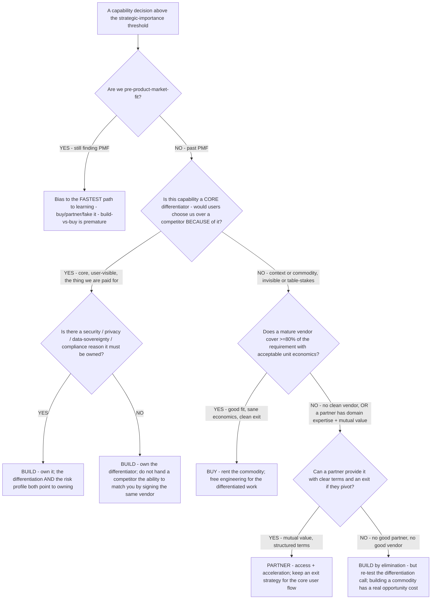

# Build vs. buy vs. partner decision tree — own a capability, rent it, or share it

**Last reviewed:** 2026-06-05 · **Confidence:** medium (framework sources web-verified this date; the *differentiation call* for a specific capability is `[verify-at-use]` judgment, not a formula). The core/context/commodity lens is widely used in product strategy; its sharpest articulation traces to **Geoffrey Moore** (core-vs-context, *Living on the Fault Line*) `[unverified — attribution from training knowledge, not re-confirmed this session]`. The decision *logic* below is grounded in the cited current sources.

> Canonical decision tree for the [`product-strategist`](../agents/product-strategist.md) (the differentiation + capability-strategy call), with a metrics assist from [`product-metrics-analyst`](../agents/product-metrics-analyst.md) for sizing the opportunity cost. Traverse top-to-bottom **before** an engineering team frames this as a feasibility/cost question. The house discipline (see [`../best-practices/build-buy-partner-decision-is-strategic-not-just-technical.md`](../best-practices/build-buy-partner-decision-is-strategic-not-just-technical.md)): the question is **not** "can we build this?" — it is "does *owning* this capability give us a durable advantage over buying or partnering for it?" This is decision-support for the product/strategy owner, not an engineering verdict.

---

## When this applies

A capability decision is on the table above some strategic-importance threshold: a payments stack, a recommendation engine, an auth system, a data pipeline, an AI feature, an integration. Common triggers: an engineering team proposing to build, a vendor pitch, a partnership offer, or a roadmap review that surfaces a capability gap.

## The tree

## Rationale per leaf

- **Pre-PMF → fastest path to learning** — before product-market fit, the build-vs-buy-vs-partner framework is premature; the right bias is the cheapest, fastest way to *learn whether the capability matters at all*. Don't build infrastructure for a product you haven't validated.
- **Build the core differentiator** — if owning the capability is *why users pick you* (the recommendation engine, the routing logic, the real-time collaboration), build it. Buying or partnering for a core differentiator hands a competitor the ability to match you overnight by signing the same vendor. When a security/privacy/data-sovereignty/compliance reason *also* applies, that reinforces owning it (the edge case where even a "commodity" capability should be built).
- **Buy the commodity** — if the capability is *not* a differentiator (it's context or commodity — payments, email delivery, maps, storage, auth) and a mature vendor covers ≥80% of the requirement with sane unit economics at current *and* 3× volume, buy it. Building commodity infrastructure burns engineering time that has a measurable opportunity cost against the differentiated work. Check data portability and exit cost before signing.
- **Partner for access/acceleration** — partner when a third party has domain expertise you lack, the integration creates *mutual* value, and the relationship can be structured with clear terms. The guardrail: keep an exit strategy if the partner sits in a core user flow and might pivot.
- **Build by elimination** — no clean vendor and no good partner can leave building as the only path; if so, re-run the differentiation test honestly first ("we can build a better one" ≠ "we should build one"), and accept the opportunity cost with eyes open.

## The core/context/commodity filter (the load-bearing classification)

| Class | Definition | Default disposition |
|---|---|---|
| **Core** | A source of competitive differentiation customers pay you for | **Build** (own it) |
| **Context** | Important to operate but invisible to customers | **Buy / Partner** (don't waste engineering) |
| **Commodity** | Table-stakes infrastructure anyone can provide | **Buy** (cheapest reliable option) |

The 10-second filter: *would a customer ever choose us over a competitor specifically because of this capability?* Yes → core (lean build). No → context/commodity (lean buy/partner).

## Gotchas

- **"Engineers prefer to build it" is not a differentiation test** — the strongest pull toward an uneconomic build is team preference; the differentiation test must override it.
- **Revisit on vendor term changes** — a buy/partner call is only valid while the economics that justified it hold; a material pricing or terms change re-opens the decision.
- **Partnering in the core flow is the riskiest cell** — a partner in a critical-path user flow is both a single point of failure and a competitive exposure; require an exit strategy before committing.
- **Size the opportunity cost, don't assert it** — "engineering is too valuable to spend on this" needs the number; use [`../scripts/pm_calc.py`](../scripts/pm_calc.py) `opportunity` to size what the freed engineering could build instead.

## Escalation & guardrails

- The differentiation / competitive-strategy framing → [`product-strategist`](../agents/product-strategist.md) (owns this decision).
- Sizing the opportunity cost / the bought-vs-built ROI → [`product-metrics-analyst`](../agents/product-metrics-analyst.md) + `pm_calc.py opportunity`.
- Security/privacy/compliance assessment for an own-vs-share call → escalate to `ravenclaude-core/security-reviewer` (CLAUDE.md inheritance).
- The build/buy/partner call is a **strategic bet** — it belongs on the roadmap with explicit confidence and rationale ([`../best-practices/roadmap-in-bets-with-confidence.md`](../best-practices/roadmap-in-bets-with-confidence.md)).
- Every external figure (vendor pricing, market size) carries a source + date or an `[unverified]` mark (cross-plugin claim-grounding rule).

## Sources (retrieved 2026-06-05)

- ideaplan — *Build vs Buy vs Partner: The Product Leader's Decision* (build for differentiation / buy for proven capability / partner for access): https://www.ideaplan.io/compare/build-vs-buy-vs-partner
- Clear Function — *Build vs Buy vs Partner: A Decision Framework for Platform Teams* (core/context/commodity 10-second filter): https://www.clearfunction.com/insights/build-vs-buy-vs-partner-decision-framework
- Engenia — *Build vs Buy vs Partner — The 2026 Decision Framework*: https://www.engeniatech.com/blog/build-vs-buy-vs-partner-the-2026-decision-framework/

The core-vs-context lens is attributed to **Geoffrey Moore** `[unverified — training-knowledge attribution, not re-confirmed this session]`; the decision logic and the ≥80%-fit / 3×-volume / exit-cost heuristics are from the cited current sources and are `[verify-at-use]` against the specific capability and vendor market.
