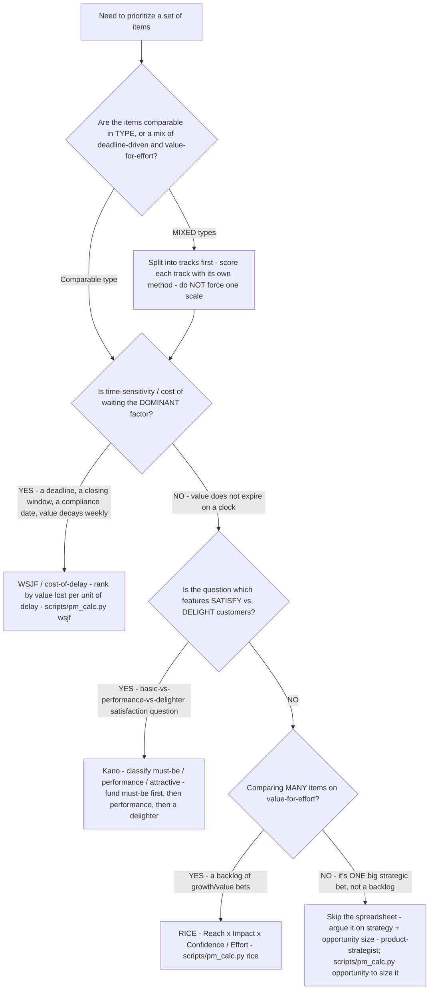

# Prioritization-method selection decision tree — RICE vs. WSJF vs. Kano vs. argue-it

**Last reviewed:** 2026-06-05 · **Confidence:** medium (published framework sources web-verified this date; the *application* of any framework to a specific backlog is `[verify-at-use]` and must be calibrated to the team's data). Framework formulas and scales are the canonical published ones (Intercom RICE, SAFe WSJF, Kano) — cited below; the framework *attributions* are confirmed, the *fit to your backlog* is not.

> Canonical decision tree for the [`product-metrics-analyst`](../agents/product-metrics-analyst.md) (prioritization) with a strategy assist from [`product-strategist`](../agents/product-strategist.md) for the one-big-bet leaf. Traverse top-to-bottom **before** opening a scoring spreadsheet. The load-bearing house opinion (CLAUDE.md §2 #3): the framework's value is **making the trade-off explicit and arguable**, not the decimal — so the first question is *which method fits this decision*, not *what's the score*. The wrong method launders a bad ranking with false rigor; the classic failure is forcing a deadline-driven item through RICE, where it scores low and gets buried (see [`../scenarios/2026-06-05-roadmap-thrash-no-prioritization-rigor.md`](../scenarios/2026-06-05-roadmap-thrash-no-prioritization-rigor.md)).

---

## When this applies

A backlog, a quarter's candidate work, or a set of competing bets needs ranking, and someone has reached for "let's just use RICE" (or has no method at all and is ranking by the loudest voice). Use this before scoring to pick the method that fits the *kind* of decision being made.

## The tree

## Rationale per leaf

- **Split mixed types first** — a handful of *time-critical* items (a contractual deadline, a compliance date) and a larger pile of *value-for-effort* growth bets are not comparable on one scale; forcing them together is what makes a single-method ranking feel arbitrary and discredits the whole exercise. Pull the non-negotiables (contractual/compliance commitments) out into a separate forced-items list entirely so they don't pollute the scored ranking, then method-match each remaining track.
- **WSJF when time-sensitivity dominates** — `WSJF = Cost of Delay / Job Size`, where `Cost of Delay = Business Value + Time Criticality + Risk Reduction/Opportunity Enablement` (the three published CoD inputs), each scored on the modified-Fibonacci scale `1-2-3-5-8-13-20`. WSJF models urgency that RICE doesn't; it stops deadline-driven items being buried by a value-for-effort score. Rooted in Don Reinertsen's cost-of-delay / queueing-theory work, codified by SAFe. `[verify-at-use]` on the relative scores — they are calibrated against *each other* in one sitting, not absolute.
- **Kano when the question is satisfaction shape** — Kano (Noriaki Kano, ~1984) classifies a feature as **must-be** (basic; its absence dissatisfies, its presence earns no credit), **performance / one-dimensional** (more is better — satisfaction scales with how well it's done), or **attractive / delighter** (unexpected; its presence delights, its absence isn't missed). Use it to sequence: fund the must-be table-stakes first, then the performance features, then *one* delighter — not to rank a flat backlog by value-for-effort (that's RICE's job).
- **RICE for a backlog of value-for-effort bets** — `(Reach x Impact x Confidence) / Effort`, Intercom's published model. Impact takes the `3/2/1/0.5/0.25` (massive/high/medium/low/minimal) scale; Confidence the `100/80/50%` scale. It is the workhorse for "many comparable items, which order?" — and its value is the *argument over the inputs*, not the decimal. A `>2x` disagreement on any one factor (reach, especially) is a "go instrument it" signal, not a negotiation.
- **Argue the one big bet** — a single strategic bet (enter a new segment, a platform rewrite, a build-vs-buy-vs-partner call) is *not* a backlog; a one-row spreadsheet adds false precision. Argue it on strategy fit + opportunity size (size it bottoms-up with [`../scripts/pm_calc.py`](../scripts/pm_calc.py) `opportunity`), and route the strategy framing to [`product-strategist`](../agents/product-strategist.md). For build-vs-buy-vs-partner specifically, traverse [`build-vs-buy-vs-partner-decision-tree.md`](build-vs-buy-vs-partner-decision-tree.md).

## Method comparison (the load-bearing trade-offs)

| Method | Best when | Formula / shape | The failure it prevents | The failure it INVITES if misapplied |
|---|---|---|---|---|
| **WSJF** | Time-sensitivity / cost of waiting dominates | CoD (BV + TC + RR/OE) ÷ Job Size, Fibonacci inputs | Deadline-driven items buried by a value score | Over-weighting urgency on a backlog where nothing actually expires |
| **Kano** | Sorting satisfy-vs-delight; what to fund in what order | Survey-classified must-be / performance / attractive | Spending the delighter budget before table-stakes exist | Treating it as a value-for-effort ranker (it isn't) |
| **RICE** | Many comparable value-for-effort items | (Reach × Impact × Confidence) ÷ Effort | The loudest-voice (HiPPO) ranking | False precision; burying an urgent item with a low reach-driven score |
| **Argue it** | One big strategic bet, not a backlog | Strategy fit + opportunity size, written | A spreadsheet laundering a strategy call as a number | Skipping a framework on something that *was* a comparable backlog |

## Gotchas

- **The point is the argument, not the number** — if a score is being used to *end* a debate rather than *focus* it on the most-divergent input, the framework is being misused (CLAUDE.md §2 #3).
- **RICE's Reach is the silent fudge factor** — it's the input most often guessed and most often wrong; calibrate it to instrumented data, and treat a large reach disagreement as the thing to go measure.
- **Don't re-run the method every escalation** — the value of a published, assumptions-attached ranking is that the *next* escalation has to argue against the evidence, not just escalate louder. Re-scoring on demand re-opens the thrash the method was meant to close.
- **Confidence is not optional** — a high RICE score built on `50%` confidence is a flag to de-risk (test the riskiest assumption), not a green light to build.

## Escalation & guardrails

- The strategy framing of a one-big-bet leaf → [`product-strategist`](../agents/product-strategist.md).
- Whether a metric movement used as an input is statistically real (power/MDE) → `applied-statistics` (CLAUDE.md §3 seam).
- Delivery sequencing of an approved, ranked backlog (schedule, capacity, RAID) → `project-management` (the how/when; we own the what/why — CLAUDE.md §3 seam).
- Every framework figure entering a deliverable carries the published-source citation **and** a `[verify-at-use]` on its application to the specific backlog (cross-plugin claim-grounding rule).

## Sources (retrieved 2026-06-05)

- Intercom — *RICE: Simple prioritization for product managers* (formula + impact/confidence scales): https://www.intercom.com/blog/rice-simple-prioritization-for-product-managers/
- Scaled Agile Framework — *WSJF* (Cost of Delay ÷ Job Size; the three CoD inputs; Reinertsen provenance): https://framework.scaledagile.com/wsjf
- ProductPlan — *Weighted Shortest Job First* glossary: https://www.productplan.com/glossary/weighted-shortest-job-first
- ProductPlan — *Kano Model* glossary (must-be / performance / attractive): https://www.productplan.com/glossary/kano-model
- Product School — *The Kano Model* (Noriaki Kano ~1984; the five categories): https://productschool.com/blog/product-fundamentals/kano-model

Framework figures (RICE impact 3/2/1/0.5/0.25 and confidence 100/80/50%; WSJF Fibonacci 1-2-3-5-8-13-20; Kano's category definitions) are the published scales above — treat the *application* to a specific backlog as `[verify-at-use]` and calibrate to the team's data.
