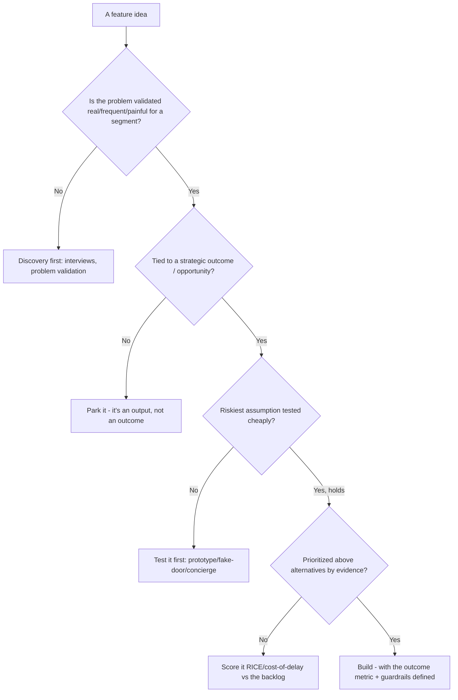
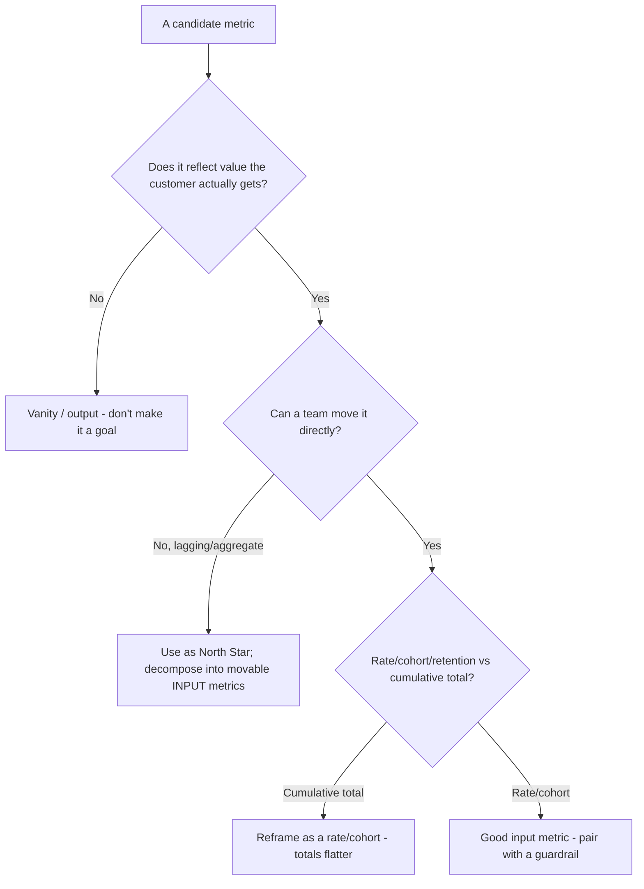
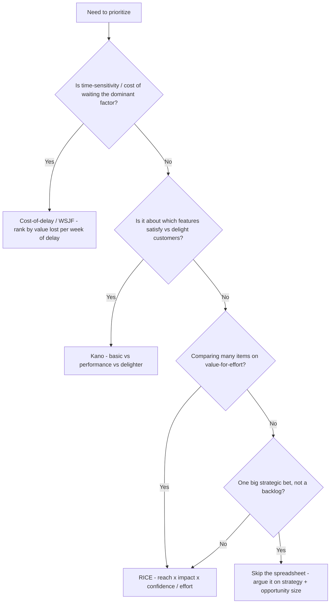
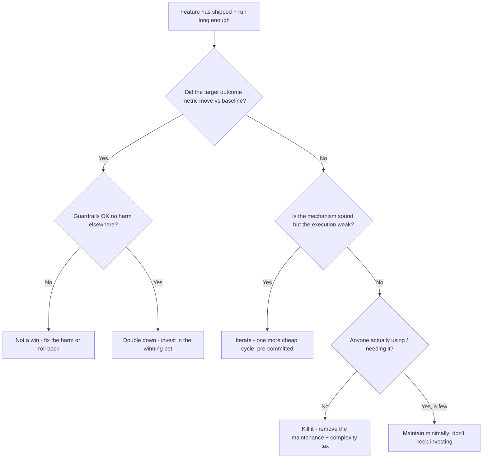
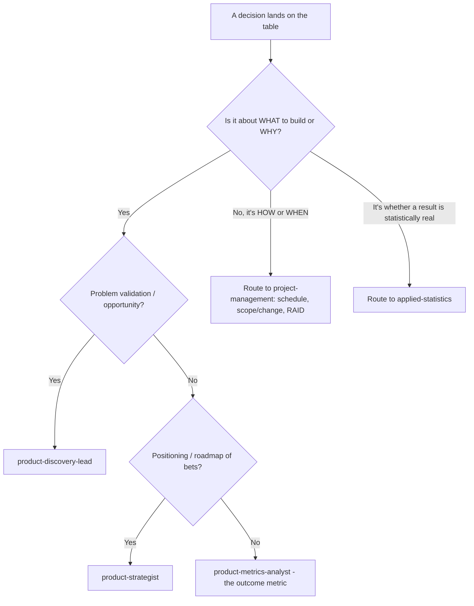
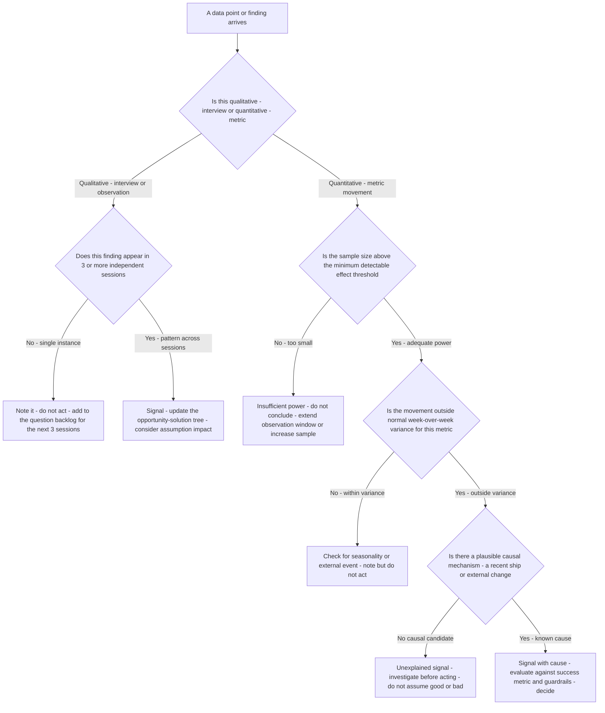
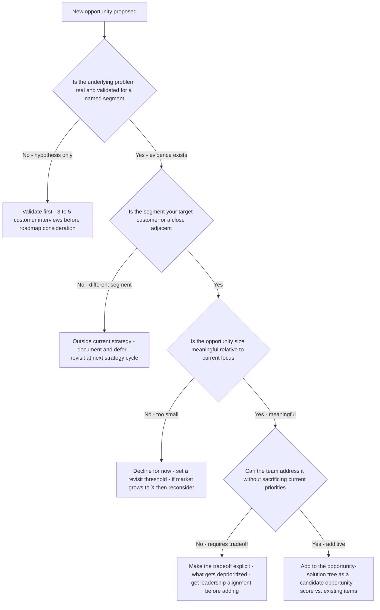
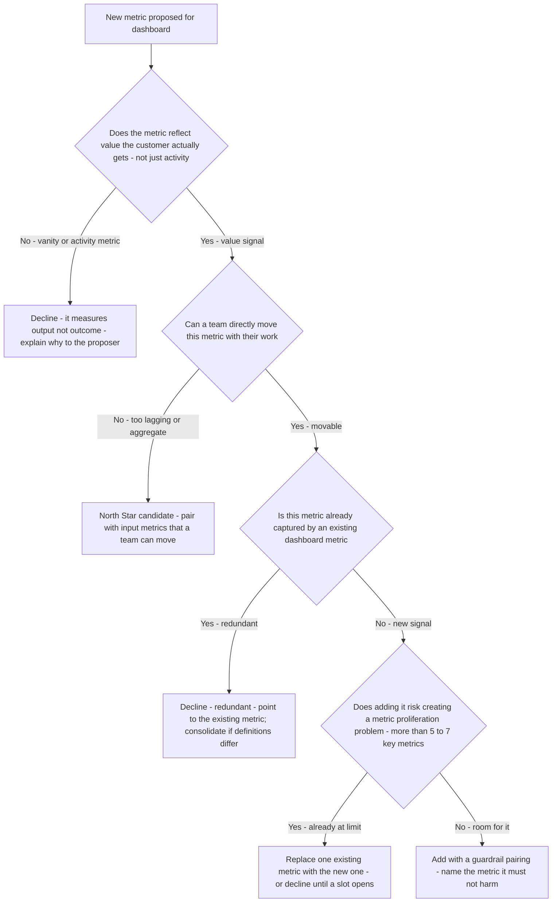

# Product Management — Decision Trees

_Decision trees + a dated capability map. Capability rows are `[verify-at-build]` — re-check against the vendor before quoting. Last reviewed: 2026-06-04._

Traverse before committing to build or ranking a backlog.

## Decision Tree: Should we build this?

Validate the problem and the riskiest assumption before committing engineering.

_Delivery scheduling of an approved build routes to project-management._

## Decision Tree: Is this metric worth tracking as a goal?

Prefer actionable, movable metrics that capture real value; drop vanity.

## Decision Tree: Which prioritization method?

The framework should fit the decision; the wrong one launders a bad ranking with false rigor.

_The point is making reach/impact/confidence/effort explicit and arguable, not the decimal places._

## Decision Tree: Ship more, iterate, or kill it?

After a bet ships, the outcome decides — not sunk cost or who championed it.

_A feature that changed nothing is a learning to act on, not a success to defend._

## Decision Tree: Is this a product call or a project call?

Keep the what/why here; route how/when to project-management. The litmus is the question being asked.

_Conflating what/why with how/when turns the roadmap into a dated Gantt and loses the outcome context._

## Capability map (dated — verify at build)

| Concept | 2026 state `[verify-at-build]` | Notes |
|---|---|---|
| Continuous discovery (Torres) | established | Weekly touchpoints, OST |
| Jobs-to-be-Done | established | Interview the 'job' |
| RICE / cost-of-delay | established | Transparent prioritization |
| North Star framework | established | Value + input metrics |
| Opportunity-solution tree | established | Outcome->opp->solution->experiment |
| Outcomes over outputs | mainstream | Judge the metric, not the ship |

## Decision Tree: Discovery — Is this finding signal or noise?

**When this applies:** The product-discovery-lead or product-metrics-analyst has a data point, user quote, or metric movement and must decide whether it warrants acting on — changing a prioritization decision, pivoting an assumption, or launching an investigation — versus noting it as one data point that may not generalize.

**Last verified:** 2026-06-05 against continuous discovery practice and standard statistical-literacy principles for product teams.

**Rationale per leaf:**
- *Single qualitative instance* — one customer's experience is an anecdote; three independent instances are a pattern; the distinction is whether the finding changes a decision or updates a backlog.
- *Multi-session pattern* — three or more independent sessions surfacing the same theme is strong qualitative signal; update the opportunity tree and check whether any open assumptions are affected.
- *Insufficient power* — a metric movement on a small sample is statistically uninterpretable; extending the window or increasing the sample is cheaper than making a wrong decision.
- *Within variance* — normal week-over-week variance is expected in most metrics; acting on noise creates churn in the roadmap without improving outcomes.
- *Unexplained signal outside variance* — an unexplained metric movement is a question, not an answer; investigate before attributing to a feature ship.
- *Signal with cause* — a metric movement with a plausible causal mechanism is interpretable; evaluate against the pre-committed success metric and guardrails.

**Tradeoffs summary:**

| Finding type | Action | Threshold |
|---|---|---|
| Single qualitative | Note and re-test | 3 independent sessions before acting |
| Qualitative pattern | Update OST and assumptions | 3 or more independent sessions |
| Metric - underpowered | Extend observation | Reach MDE threshold first |
| Metric - in variance | Note only | Within normal range |
| Metric - outside variance - causal | Act and evaluate | Against pre-committed metric and guardrail |
| Metric - outside variance - no cause | Investigate | Before acting |

---

## Decision Tree: Strategy — Is this a new opportunity worth pursuing

**When this applies:** A new market opportunity, customer segment, or product area has been proposed for the roadmap. The product-strategist must decide whether to investigate further, add it to the opportunity-solution tree, or decline it so the team can stay focused.

**Last verified:** 2026-06-05 against standard product opportunity assessment practice.

**Rationale per leaf:**
- *Validate first* — an unvalidated opportunity is a hypothesis; adding it to the roadmap before validation risks investing in a problem that doesn't exist.
- *Outside strategy* — adjacent-segment opportunities are real but dilute focus; the right response is documentation and deferral, not rejection, so they can be revisited at the strategy cycle.
- *Too small* — opportunity size relative to current focus matters; a real but small problem does not warrant a strategy shift; set a threshold for reconsideration.
- *Explicit tradeoff* — if the opportunity requires displacing current priorities, the tradeoff must be made explicit and aligned before the roadmap is changed; invisible tradeoffs are how roadmaps expand without strategy.
- *Add to OST* — a validated, on-strategy, adequately-sized, additive opportunity is a legitimate candidate for the opportunity-solution tree; score it against existing items rather than auto-prioritizing.

**Tradeoffs summary:**

| Opportunity type | Action | Key question |
|---|---|---|
| Unvalidated | Validate with 3 to 5 interviews | Is the problem real? |
| Off-strategy | Defer to strategy cycle | Does it warrant a strategy pivot? |
| Too small | Decline with threshold | When would it become worth addressing? |
| On-strategy - requires tradeoff | Make tradeoff explicit | What gets dropped? |
| On-strategy - additive | Add to OST and score | Does it rank above what is already there? |

---

## Decision Tree: Metrics — Is this metric worth adding to the dashboard

**When this applies:** A stakeholder, analyst, or engineer proposes adding a new metric to the product dashboard or OKR framework. The product-metrics-analyst must decide whether to add it, replace something with it, or decline.

**Last verified:** 2026-06-05 against North Star metric framework and standard product analytics practice.

**Rationale per leaf:**
- *Vanity/activity metric decline* — metrics that count activity (page views, API calls, feature opens) measure the team being busy, not the customer getting value; the explanation to the proposer is part of the discipline.
- *North Star candidate* — aggregate or lagging metrics that capture real value but cannot be directly moved belong at the top of the hierarchy; they need input-metric decomposition to be actionable.
- *Redundant* — if the metric is already tracked under a different name or definition, the right action is consolidation, not addition; definitional drift between similar metrics is a data-quality risk.
- *Metric proliferation* — a dashboard with 15 metrics is a dashboard nobody reads; the limit of 5–7 key metrics is a forcing function for prioritization.
- *Add with guardrail* — every new metric should be paired with a metric it must not harm; this prevents local optimization that degrades a different part of the system.

**Tradeoffs summary:**

| Metric type | Decision | Action |
|---|---|---|
| Vanity or activity | Decline | Explain the vanity/outcome distinction |
| Aggregate / lagging | North Star candidate | Decompose into input metrics |
| Redundant | Decline | Consolidate definitions |
| New signal - at limit | Replace or decline | Make the explicit tradeoff |
| New signal - room available | Add | Pair with a guardrail metric |
