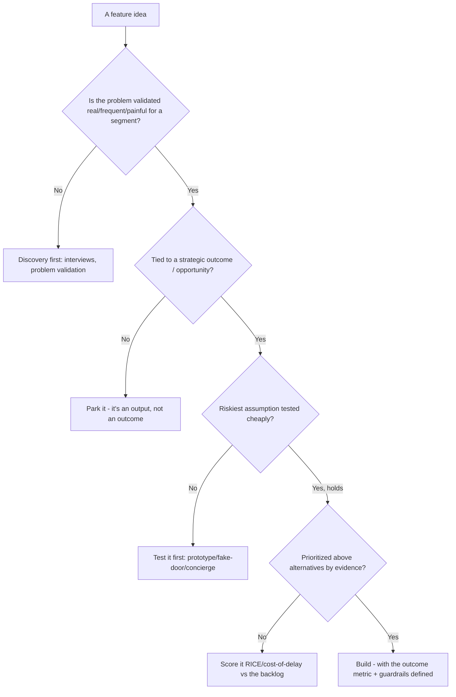
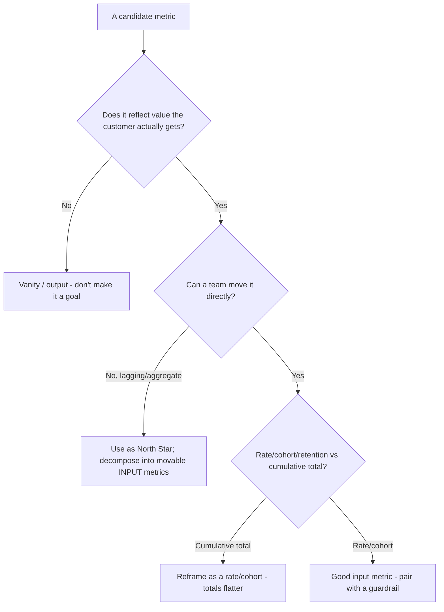

# Product Management — Decision Trees

_Decision trees + a dated capability map. Capability rows are `[verify-at-build]` — re-check against the vendor before quoting. Last reviewed: 2026-06-04._

Traverse before committing to build or ranking a backlog.

## Decision Tree: Should we build this?

Validate the problem and the riskiest assumption before committing engineering.

_Delivery scheduling of an approved build routes to project-management._

## Decision Tree: Is this metric worth tracking as a goal?

Prefer actionable, movable metrics that capture real value; drop vanity.

## Capability map (dated — verify at build)

| Concept | 2026 state `[verify-at-build]` | Notes |
|---|---|---|
| Continuous discovery (Torres) | established | Weekly touchpoints, OST |
| Jobs-to-be-Done | established | Interview the 'job' |
| RICE / cost-of-delay | established | Transparent prioritization |
| North Star framework | established | Value + input metrics |
| Opportunity-solution tree | established | Outcome->opp->solution->experiment |
| Outcomes over outputs | mainstream | Judge the metric, not the ship |
