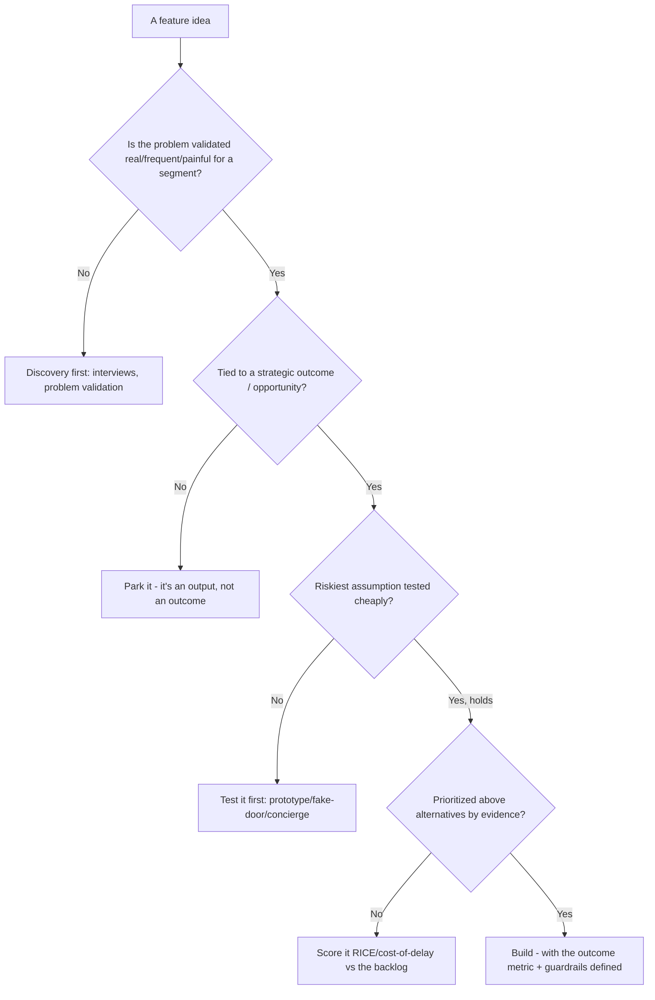
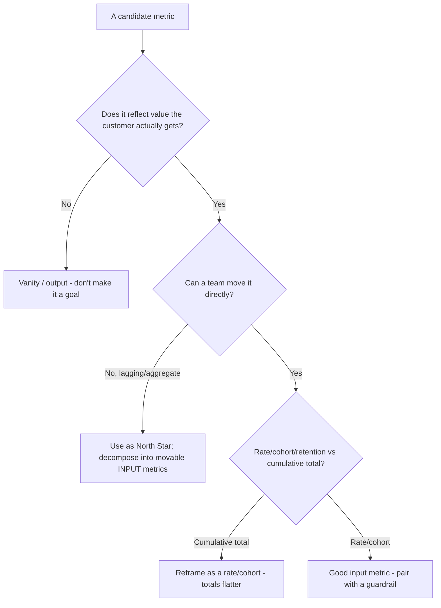
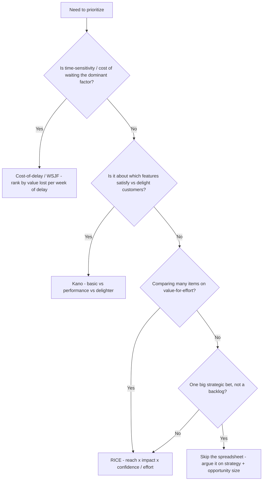
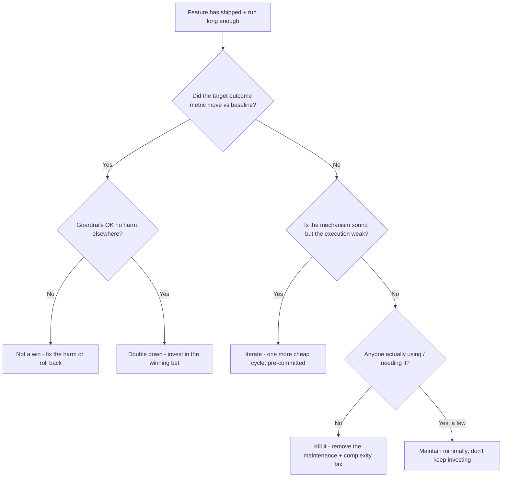
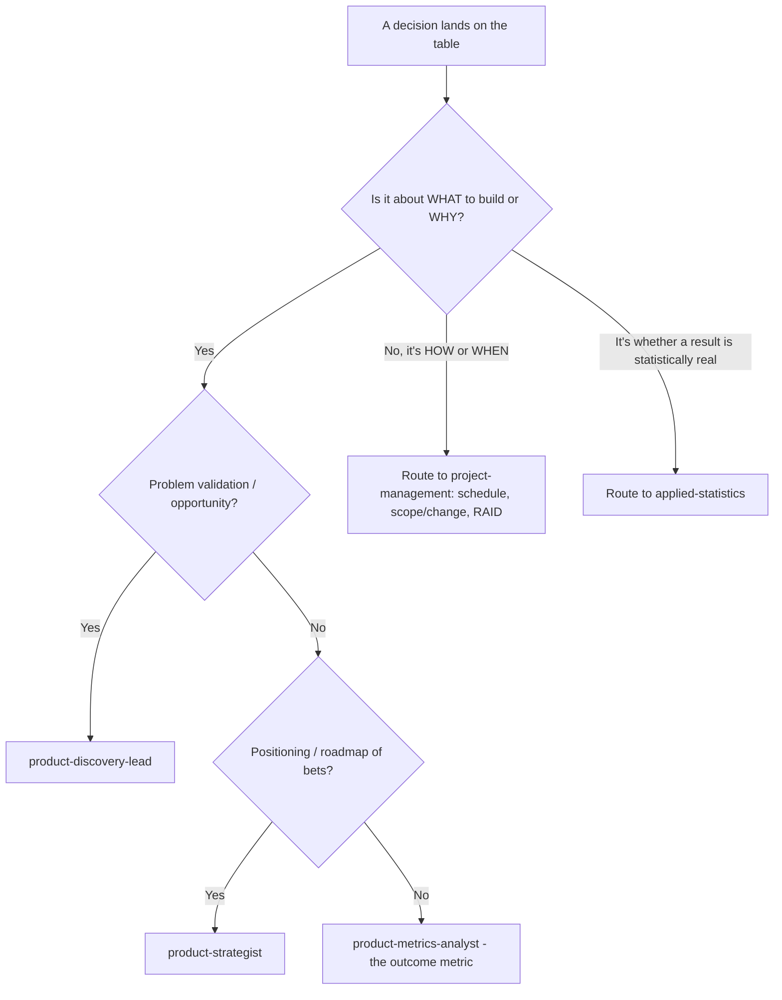

# Product Management — Decision Trees

_Decision trees + a dated capability map. Capability rows are `[verify-at-build]` — re-check against the vendor before quoting. Last reviewed: 2026-06-04._

Traverse before committing to build or ranking a backlog.

## Decision Tree: Should we build this?

Validate the problem and the riskiest assumption before committing engineering.

_Delivery scheduling of an approved build routes to project-management._

## Decision Tree: Is this metric worth tracking as a goal?

Prefer actionable, movable metrics that capture real value; drop vanity.

## Decision Tree: Which prioritization method?

The framework should fit the decision; the wrong one launders a bad ranking with false rigor.

_The point is making reach/impact/confidence/effort explicit and arguable, not the decimal places._

## Decision Tree: Ship more, iterate, or kill it?

After a bet ships, the outcome decides — not sunk cost or who championed it.

_A feature that changed nothing is a learning to act on, not a success to defend._

## Decision Tree: Is this a product call or a project call?

Keep the what/why here; route how/when to project-management. The litmus is the question being asked.

_Conflating what/why with how/when turns the roadmap into a dated Gantt and loses the outcome context._

## Capability map (dated — verify at build)

| Concept | 2026 state `[verify-at-build]` | Notes |
|---|---|---|
| Continuous discovery (Torres) | established | Weekly touchpoints, OST |
| Jobs-to-be-Done | established | Interview the 'job' |
| RICE / cost-of-delay | established | Transparent prioritization |
| North Star framework | established | Value + input metrics |
| Opportunity-solution tree | established | Outcome->opp->solution->experiment |
| Outcomes over outputs | mainstream | Judge the metric, not the ship |
