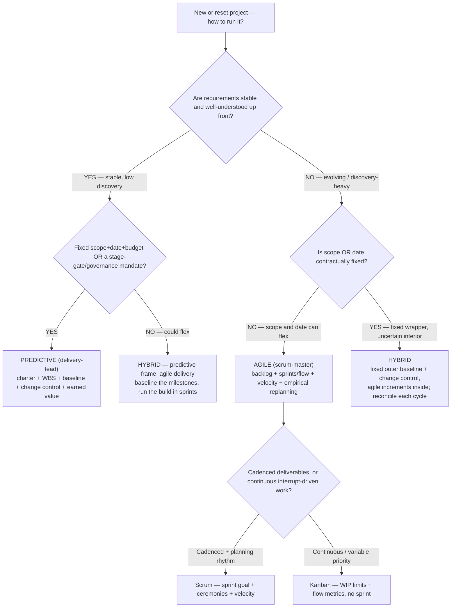

# Project-management decision trees

> **Last reviewed:** 2026-06-01. Canonical `## Decision Tree:` sections for the `project-management` plugin, in the marketplace format ([`../../../docs/best-practices/decision-trees-in-knowledge-files.md`](../../../docs/best-practices/decision-trees-in-knowledge-files.md)): an observable **When this applies**, a **Last verified** date, a Mermaid flowchart, per-leaf rationale, and a tradeoffs table.
>
> **Decision-tree traversal (priors).** When the situation matches a tree's entry condition, traverse the graph top-to-bottom **before** picking a delivery approach — do NOT pattern-match on "we're an agile shop" or "the client wants a Gantt." The first branch that resolves cleanly is the leaf to apply.

---

## Decision Tree: Delivery approach — predictive, agile, or hybrid?

**When this applies:** a project is starting (or being reset) and the question is _how to run it_ — a predictive plan-of-record (delivery-lead), an empirical sprint/flow cadence (scrum-master), or a hybrid that does both at different altitudes. Observable inputs: how stable the **requirements** are, how fixed the **scope/date/budget** are by contract or mandate, whether the work is **discovery-heavy** vs well-understood, and whether a **governance/stage-gate** obligation exists. The failure this prevents: forcing a Gantt onto genuinely exploratory work, or running pure open-ended sprints under a fixed-scope-fixed-date contract.

**Last verified:** 2026-06-01 against PMBOK 7 (development-approach + tailoring) and the Scrum Guide as domain-standard framings. Method definitions are standard framings, not engagement advice — confirm against the engagement's actual contract/governance before committing.

**Rationale per leaf:**

- _PREDICTIVE_ — stable requirements **and** a fixed scope/date/budget or a stage-gate mandate is the predictive sweet spot: a baseline you can measure change and earned value against. Owned by `delivery-lead`.
- _HYBRID (predictive frame, agile delivery)_ — stable-enough requirements but flexibility on the how: baseline the milestones for governance, but build in sprints so the team keeps empirical feedback. The most common real-world shape.
- _AGILE_ — evolving/discovery-heavy requirements with scope/date that can flex: commit to a backlog and replan empirically each cycle. Owned by `scrum-master`. Forcing a frozen baseline here manufactures false precision.
- _HYBRID (fixed wrapper, uncertain interior)_ — the hard case: a contract fixes scope or date but the interior is genuinely uncertain. Hold a predictive outer baseline + change control, run agile increments inside, and **reconcile every cycle** (burn-up vs baseline) so the fixed commitment and the empirical reality stay honest. Both leads collaborate.
- _SCRUM vs KANBAN_ — within agile, the work shape decides: cadenced deliverables with a planning rhythm → Scrum (sprint goal + ceremonies); continuous, interrupt-driven, variable-priority work (support, ops) → Kanban with WIP limits and flow metrics. Don't impose sprints on a queue.

**Tradeoffs summary:**

| Approach | Best when | Plan artifact | Change handling | Primary owner |
|---|---|---|---|---|
| Predictive | stable reqs + fixed scope/date or stage-gate | charter + WBS + baseline | integrated change control vs baseline | `delivery-lead` |
| Hybrid (predictive frame) | stable reqs, flexible delivery | milestone baseline + sprint plan | change control at milestone level | `delivery-lead` + `scrum-master` |
| Hybrid (fixed wrapper) | fixed contract, uncertain interior | outer baseline + inner backlog | reconcile burn-up vs baseline each cycle | both leads |
| Agile — Scrum | evolving reqs, cadenced deliverables | product + sprint backlog | re-prioritize each sprint | `scrum-master` |
| Agile — Kanban | continuous, interrupt-driven flow | flow policy + WIP limits | continuous re-prioritization | `scrum-master` |

Whichever leaf wins, RAID discipline applies throughout (`risk-and-raid-analyst`) and the cadence/format of stakeholder reporting follows from it (`stakeholder-comms-lead`). The lightweight RAID/status hygiene for the repo itself stays with [`../../ravenclaude-core/agents/project-manager.md`](../../ravenclaude-core/agents/project-manager.md); this tree picks the *delivery approach* the specialists then run.

## See also

- [`../best-practices/`](../best-practices/) — the named rules the leaves implement (single-owner, baseline-before-change, scored-RAID, narrative-first reporting).
- [`../../ravenclaude-core/agents/project-manager.md`](../../ravenclaude-core/agents/project-manager.md) — the domain-neutral PM hygiene agent this plugin extends.
- [`../../../docs/best-practices/decision-trees-in-knowledge-files.md`](../../../docs/best-practices/decision-trees-in-knowledge-files.md) — the format this tree follows.

## Refresh triggers

- A change in PMBOK / Scrum Guide guidance these framings cite → re-verify + re-date.
- A new specialist agent or skill that adds a delivery sub-method (would add a leaf).
- `Last verified:` older than 90 days (the marketplace anti-staleness backstop).
