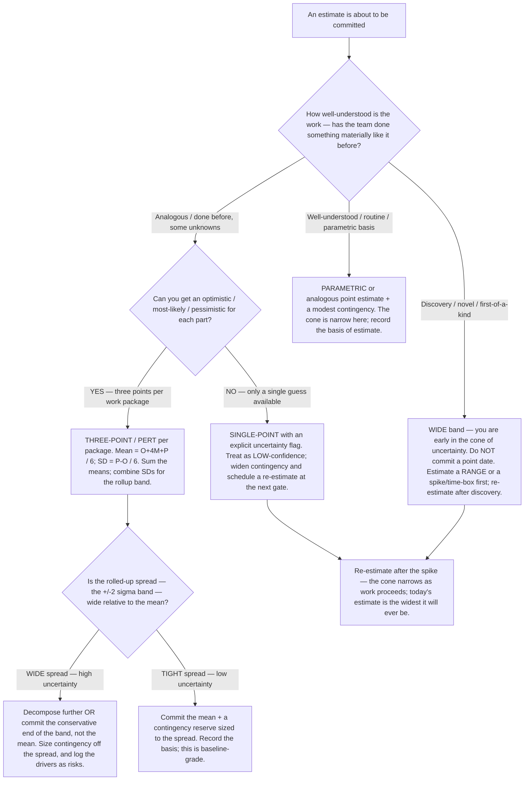

# Estimating decision tree — how confident is this estimate, and how much contingency does it need?

**Last reviewed:** 2026-06-05 · **Confidence:** medium (PERT/three-point + cone-of-uncertainty are long-established estimation framings, web-verified this date; the threshold numbers below are conventions, not laws — they carry inline `[verify-at-use]` markers). The PERT mean and standard-deviation formulas are standard and stable; the contingency percentages are illustrative and must be calibrated to the engagement's risk tolerance and historical estimate accuracy before any commitment.

> Canonical decision tree for the [`delivery-lead`](../agents/delivery-lead.md) (predictive estimates with a basis) with a quantification assist from [`risk-and-raid-analyst`](../agents/risk-and-raid-analyst.md). Traverse top-to-bottom **before** committing a date or a number to a baseline or a stakeholder. The point is not "produce a single number" — it is to expose *how much you don't know* and convert that into a contingency reserve or a committed range, so a false-precision point estimate never becomes a baseline. This complements the existing delivery-approach and change-request trees in [`pm-decision-trees.md`](pm-decision-trees.md); it sits one level earlier, at the moment the estimate is formed.

---

## When this applies

An estimate is being produced for a work package, a milestone, a release, or a whole project, and it is about to be *committed* — written into a baseline, quoted to a sponsor, or loaded into a sprint plan. Observable triggers: "how long will this take?", "give me a number for the SOW", "what date can I promise the steering committee?", a single most-likely figure offered with no range, or a request to "just add 20% buffer" with no basis. The failure this prevents: committing a single most-likely number as if it were certain, then having no defensible contingency when the work lands in the upper tail.

## The tree

## Rationale per leaf

- **WIDE band (discovery / novel)** — at the start of genuinely novel work you are at the fat end of the *cone of uncertainty*: estimates are least reliable precisely when they are most demanded. Committing a point date here manufactures false precision. The honest move is a range, or a time-boxed spike that *buys* certainty before any baseline date is promised. This is the same signal the delivery-approach tree reads when it routes discovery-heavy work to agile/empirical replanning.
- **THREE-POINT / PERT** — when each part has an optimistic (O), most-likely (M), and pessimistic (P), the **PERT mean = (O + 4M + P) / 6** weights the most-likely four-fold while still pulling toward a skewed tail, and the **standard deviation = (P − O) / 6** quantifies the spread. Summing means and combining standard deviations across packages gives a rolled-up estimate *with a band*, not a bare number. `scripts/evm_calc.py pert` does this arithmetic.
- **WIDE rolled-up spread** — a large ±2σ band relative to the mean is a signal that the work is under-decomposed or carries real unknowns. The response is to **decompose further** (smaller packages have tighter bands) **or commit the conservative end of the band**, not the mean — and to log the spread's drivers as risks for `risk-and-raid-analyst` to quantify. A ±2σ spread wider than roughly **±25–35%** of the mean is a common "decompose or range it" trigger `[verify-at-use — calibrate to your historical accuracy]`.
- **TIGHT spread** — a narrow band on understood work is baseline-grade: commit the mean plus a contingency reserve sized to the spread, and record the *basis of estimate* so change control later has something to measure against.
- **PARAMETRIC / SINGLE-POINT** — routine work with a parametric or analogous basis carries a narrow cone and needs only a modest contingency. A lone single-point guess is the weakest input: flag it low-confidence, widen the reserve, and **schedule a re-estimate at the next gate** — the cone narrows as the work proceeds, so the estimate is never more wrong than it is today.

## The contingency principle (the load-bearing idea)

Contingency is **derived from the spread, not invented as a flat percentage.** A wide standard deviation is a quantified argument for a larger reserve (or a decomposition, or a committed range); a tight one justifies a smaller reserve. "Add 20%" with no basis is exactly the anti-pattern this tree replaces — the reserve should trace to the estimate's own uncertainty.

| Confidence signal | Estimate form | Contingency posture |
|---|---|---|
| Discovery / novel | Range or spike; no point date yet | Re-estimate after discovery; don't baseline a point |
| Wide ±2σ on three-point | Conservative end of band, or decompose | Reserve sized to the spread; log drivers as risks |
| Tight ±2σ on three-point | Mean + reserve | Reserve sized to the (small) spread |
| Parametric / analogous | Point + modest reserve | Modest, with recorded basis |
| Lone single-point guess | Point + uncertainty flag | Wider reserve; re-estimate at next gate |

## See also

- [`pm-decision-trees.md`](pm-decision-trees.md) — the delivery-approach, change-request, status-RAG, sprint-injection, risk-response, escalation, and phase-gate trees this one feeds (a committed estimate is what change control later measures against).
- [`pm-recover-vs-escalate-slip-decision-tree.md`](pm-recover-vs-escalate-slip-decision-tree.md) — what to do when actuals breach the band this tree sized.
- [`../best-practices/`](../best-practices/) — `commitments-have-one-owner-and-one-date`, `risks-need-quantification-not-just-color`, `velocity-is-descriptive-not-a-target`.
- [`../scripts/evm_calc.py`](../scripts/evm_calc.py) — `pert` (estimate band) and `forecast` (agile throughput range).
- [`../../../docs/best-practices/decision-trees-in-knowledge-files.md`](../../../docs/best-practices/decision-trees-in-knowledge-files.md) — the format this tree follows.

## Refresh triggers

- A change in the cited estimation framings (PERT, cone of uncertainty) → re-verify + re-date.
- The engagement accumulates enough actuals to calibrate the illustrative contingency thresholds → replace the `[verify-at-use]` figures with the engagement's own accuracy history.
- `Last reviewed:` older than 90 days (the marketplace anti-staleness backstop).
